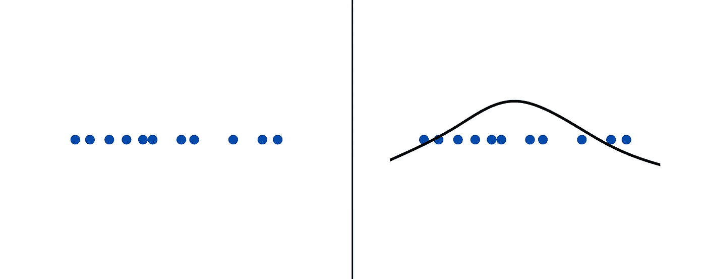
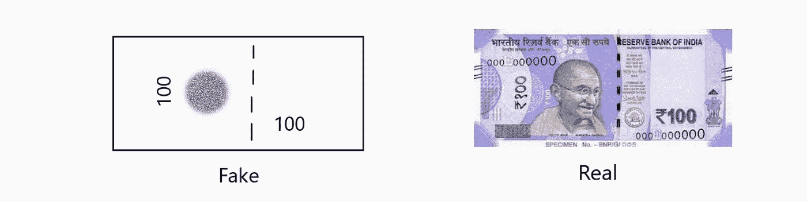
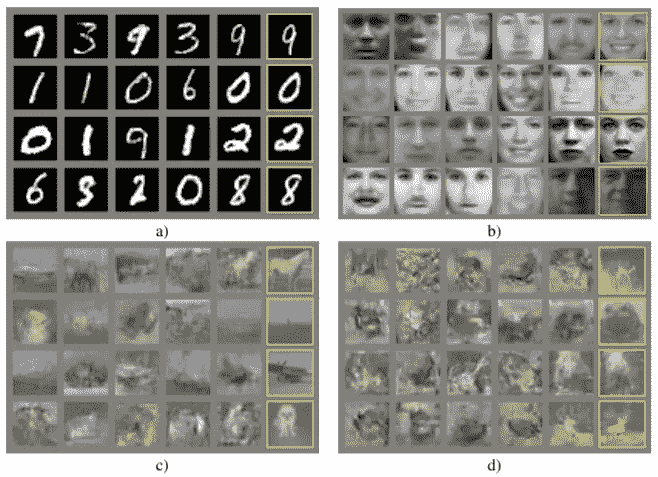
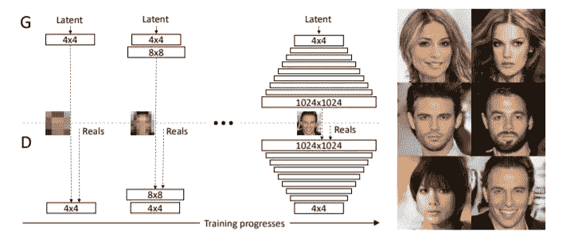
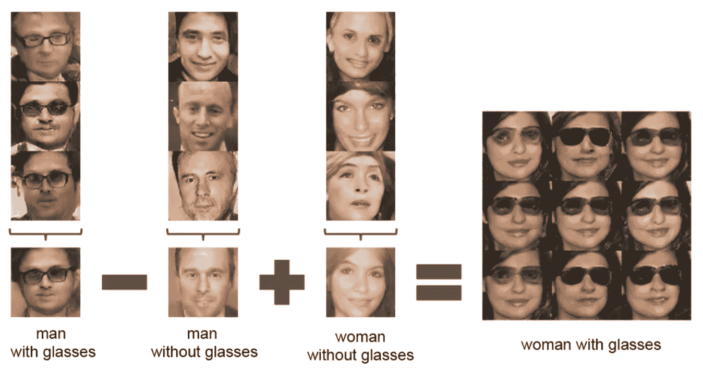
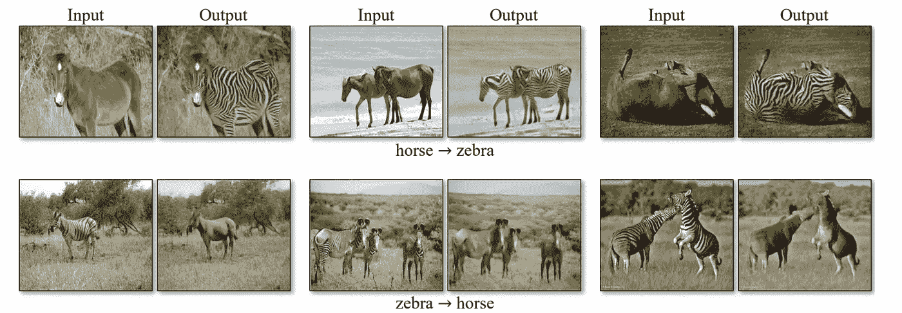
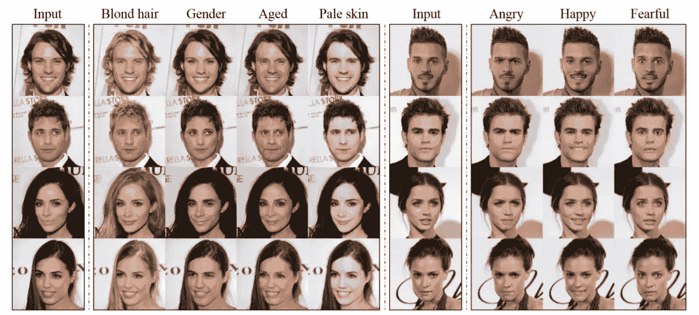
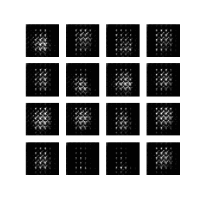
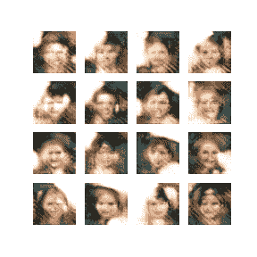
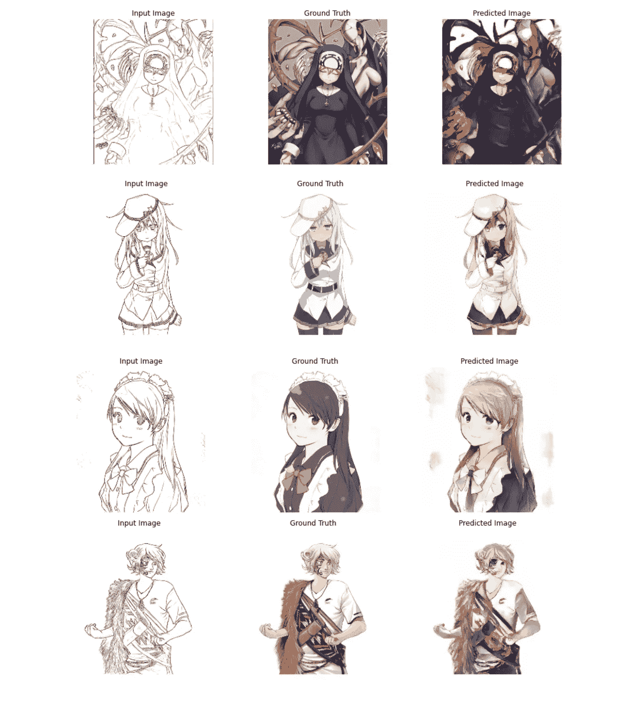

# 生成性对抗网络

> 原文：<https://towardsdatascience.com/generative-adversarial-networks-gans-8fc303ad5fa1?source=collection_archive---------50----------------------->

## GANs 系列

# 1 —以更简单的方式理解 GANs

## 在谈到甘斯时，脸书首席人工智能科学家、ACM 图灵奖获得者扬·勒村(Yann LeCun)曾公开引用说，对抗性训练是，

> “过去 10 年中最有趣的想法”

gan 是 ML 领域中相对较新的发明。它是由伊恩·古德菲勒等人在 2014 年通过这篇令人惊叹的[研究论文](https://arxiv.org/abs/1406.2661)介绍的。

## 那么，甘斯到底有什么了不起的？

与 Raj 在 [Unsplash](https://unsplash.com?utm_source=medium&utm_medium=referral) 的[公路旅行照片](https://unsplash.com/@roadtripwithraj?utm_source=medium&utm_medium=referral)

我们先来单独看一下术语— `Generative Adversarial Network`
生成性是什么意思？

深度学习可以分为两种类型的模型目标，它们是

*   **判别模型**
    这些模型用于从给定的输入数据中映射出一个可能的输出。在这个领域中，你能想到的最常见的例子是分类器。他们的目标是简单地识别一类输入数据，如“垃圾邮件或非垃圾邮件”，或者像手写字符识别等。
    这些模型捕捉条件概率 P(y|x)，即‘给定 x 的 y 的概率’。
*   **生成模型**
    这些模型用于寻找数据集的概率分布，并生成类似结构的数据。
    生成模型主要是为了从给定的数据概率分布中找到**密度函数**。如下图所示，这些点表示数据在一维轴上的分布，该轴由右侧图像中的高斯密度拟合。

**密度估计** —作者从 [NIPS 2016 教程复制的图像:生成对抗网络](https://arxiv.org/abs/1701.00160)

GANs 并不专注于精确地找到这个密度函数，而是观察给定的数据集，并在两个互为**对手**的模型的帮助下，生成符合给定数据样本中潜在结构的新样本。因此得名—

# *GANs 的工作*

*GANs 由两种模型组成，即:*

*   ***生成器**
    其功能是获取输入噪声向量(z)并将其映射到一个图像，该图像有望类似于训练数据集中的图像。*
*   ***鉴别器**
    鉴别器模型的主要目的是找出哪个图像来自实际训练数据集，哪个是生成器模型的输出。*

**

*由发生器和鉴别器模型组成的 GANs 的基本结构(图片由作者提供)*

*你可以把生成器模型想象成伪币制造者，他们想要生成假币并愚弄所有人相信它是真的，而鉴别器模型是警察，他们想要识别假币并抓住伪币制造者。*

*开始时，伪造者制造出完全不像真货币的随机货币。在被警察抓住后，他们从错误中吸取教训(在我们的案例中，模型丢失了),并创造出比以前更好的新货币。*

**

***假币与真币不相似的例子**(图片由作者提供)*

*这样，警察就能更好地辨别假币和真币，同时，伪造者也能更好地制造看起来和真币相似的货币。*

**

***造假者在制造假币方面训练有素的时间点**(图片由作者提供)*

*这是两个模型之间的最小-最大 2 人游戏，其中发电机模型试图最小化其损耗，最大化鉴别器损耗。
因此，生成器模型将输入向量(z)映射到与训练数据集中的数据相似的输出。*

*最后，当鉴频器不再能识别假输出时，它的准确度约为 50%。这意味着它现在是在进行随机猜测，以区分假数据和真实数据。这就是所谓的纳什均衡点。*

> *注意:在实践中，很难达到这个平衡点，因此会产生一些问题。其中之一是**模式崩溃问题**，发生器在训练的早期阶段产生一个非常好的输出，然后更频繁地使用它，因为鉴别器还不能将其归类为假的。结果，生成器仅学习输出其中具有很少多样性的数据。有各种方法可以克服这一点，例如使用不同的损失函数，如 [**Wasserstein 损失**](https://arxiv.org/abs/1701.07875) **。***

# *甘斯能做什么？*

*GANs 的主要目标是从给定的数据集生成新的样本。自从 GANs 发明以来，他们已经发展到可以用更好的结果和更多的特性来完成这个任务。*

**

*Ian J. Goodfellow 等人 2014 年，[生成对抗网络](https://arxiv.org/abs/1406.2661)*

*上图显示的是 Ian Goodfellow 等人在 2014 年发表的第一篇 GANs 论文的输出结果。集合 a)包含在手写数字的 MNIST 数据集上生成的输出，集合 b)示出了 Toronto Face 数据集的结果，集合 c)具有来自 CIFAR-10 数据集上的全连接模型的输出，集合 d)包含由 CIFAR-10 数据集上的卷积鉴别器和“去卷积”生成器模型生成的输出。*

***Progressive GAN** 于 2017 年推出，作者表明，通过在开始时训练生成器输出低分辨率图像，并随着训练的进行提高分辨率，可以显著提高生成图像的质量。通过这种方式，他们能够从 CelebA HQ 数据集上训练的生成器中生成 1024x1024 分辨率的高质量人脸图像。*

**

*Tero Karras，Timo Aila，Samuli Laine，Jaakko Lehtinen 2017，[为提高质量、稳定性和变化性而逐步种植 GANs】](https://arxiv.org/abs/1710.10196)*

*关于**DC GAN**的论文是最重要的研究之一，它表明在 GAN 模型中使用深度卷积有助于产生更好的结果。他们没有使用任何有助于提高效率的完全连接和池化层。*

*本文中有趣的一点是**向量空间算法**，它显示输出结果可以根据简单的算术等式进行更改，如下图所示。*

**

*亚历克·拉德福德等 2015，[深度卷积生成对抗网络的无监督表示学习](https://arxiv.org/abs/1511.06434)*

***Cycle-gan**能够将输入类映射到期望的输出集。训练是在两组数据上进行的，不需要其他标签。该模型学习将一组图像转换成另一组图像。*

*在下面的图像中，你可以看到马的图像是如何转换成斑马的图像的。这里值得注意的一点是，该模型了解到，相对于斑马，马主要与更绿的草原相关联。因此，该模型的结果是，斑马的输出背景较暗。当我们试图将斑马图像转换为马时，这也会产生更绿的马。*

**

*朱俊彦，朴泰星，菲利普·伊索拉，阿列克谢·埃夫罗斯 2017，[使用循环一致对抗网络的不成对图像到图像翻译](https://arxiv.org/abs/1703.10593)*

*最后，最有趣的 GAN 变体之一是 **StarGAN。**它获取面部的输入图像，然后将其映射到相应的提升面部特征。*

*例如，你可以输入一张脸并将其转换成相反的性别，使其更年轻或更老，改变其肤色，等等。*

*下图的右侧显示了如何使用 StarGAN 来改变任何输入人脸的面部表情。*

**

*Yunjey Choi 等人 2017， [StarGAN:用于多领域图像到图像翻译的统一生成对抗网络](https://arxiv.org/abs/1711.09020)*

# *结论*

*所以，你已经看到甘有多强大，他们能做什么。关于 GANs 最令人惊奇的事情是，它是一个相当复杂的目标的非常简单的实现。*

*如果你对卷积神经网络的工作原理和反向传播有一个基本的了解，那么你可以马上开始研究 GANs。这篇文章是为了介绍生成性对抗网络背后的基本工作，以及它的变化如何有助于产生不同的和更好的结果。*

****在以后的帖子中，我会分享如何从头开始构建 GAN 并从中产生美妙的结果。我已经构建了一个 DCGAN 来从 CelebA 数据集生成新的面孔，以及一个条件 GAN 来学习获取一个动画的黑白草图并将其转换为彩色输出，如下所示。****

***

在数据集上训练 DCGAN 模型，显示左边的 **MNIST 和右边的**西里巴**(图片由作者提供)*** **

***左栏为之前未见过的黑白草图测试图像，右栏为模型预测的彩色输出图像，但不知道真实情况**(图片由作者提供)*