# 生成对抗网络 GANs:初学者指南

> 原文：<https://towardsdatascience.com/generative-adversarial-networks-gans-a-beginners-guide-f37c9f3b7817?source=collection_archive---------14----------------------->

## 关于 GAN 模型如何与 Python 中的示例一起工作的演练。

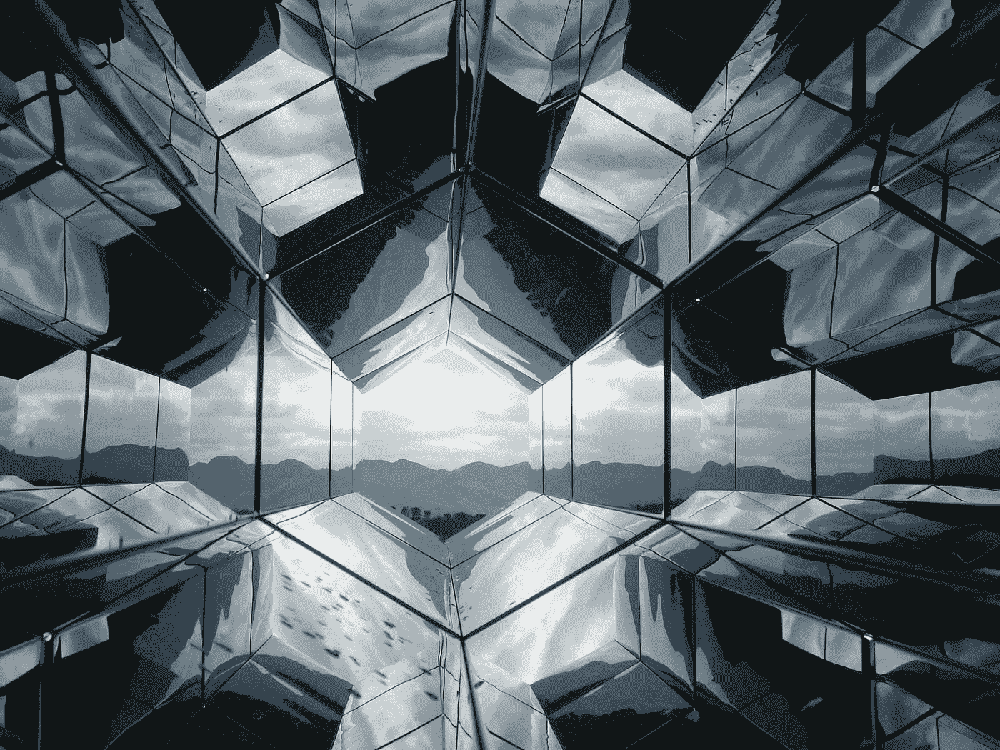

由 [Unsplash](https://unsplash.com/s/photos/future?utm_source=unsplash&utm_medium=referral&utm_content=creditCopyText) 上的 [drmakete 实验室](https://unsplash.com/@drmakete?utm_source=unsplash&utm_medium=referral&utm_content=creditCopyText)拍摄的照片

T 机器学习的假设例子是围绕拥有一台能够思考并模仿通过某种程度智能测试的机器来设想的。虽然这是最终目标，但我们还没有达到，我们还有很长的路要走。在过去的几年中，已经开发了许多模型来在无人监督的模式下学习，试图与另一台计算机或人类进行竞争，以执行某项任务。这篇文章阐明了生成性对抗网络(GANs)的使用，以及如何在当今世界使用它们。

# I. GANs 和机器学习

机器学习已经显示出一些识别数据分布、图像和事件序列等模式的能力，以解决分类和回归问题。Ian Goodfellow 等人在 2014 年[1]发表了一篇文章，使用两个独立的神经网络来生成与真实数据具有相似属性的合成数据。这项工作使研究界对生成逼真的图像、视频和通用合成结构数据更感兴趣。

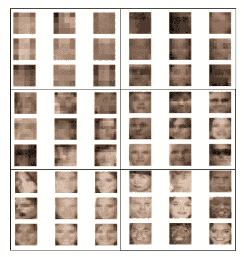

图 1:渐进学习 GAN 模型生成人工人脸的例子。

gan 是无监督的深度学习技术。通常使用两个神经网络来实现:生成器和鉴别器。这两种模式以一种游戏设定的形式相互竞争。GAN 模型将在真实数据和由发生器产生的数据上被训练。鉴别器的工作是从真实数据中确定假数据。生成器是一个学习模型，因此最初，它可能会产生低噪声数据，甚至是完全噪声数据，这些数据不能反映真实数据的真实分布或属性。

生成器模型的主要目标是生成能够成功通过鉴别器的人工数据。该模型开始获取一些噪声，通常是高斯噪声，并产生一个格式化为像素矢量的图像。生成器必须学会如何欺骗鉴别器并赢得肯定的分类(生成的图像被分类为真实的)。每当这些生成的图像中的任何一个被成功检测为“假”时，就计算生成步骤的损失。鉴别者必须学会如何逐步识别那些假图像。每当模型不能识别假图像时，负损失被给予鉴别器。关键概念是同时训练发生器和鉴别器。

## 生成手写数字的示例:

研究社区有许多有趣的数据集来衡量 GAN 模型的准确性。在本文中，我们将详细使用其中的一些数据集，从 MNIST 开始。MNIST 是解释广泛用于图像处理的生成模型理论的最重要的例子之一。来自 MNIST 数据集的样本如图 2 所示。

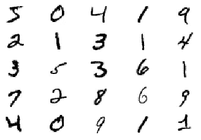

图 2:来自 MNIST 数据集的手写数字图像样本。

为了生成人工手写图像，我们需要实现两个模型:一个用于生成假图像，另一个用于区分假图像和真图像。图 3 显示了训练 GAN 模型的总体流程。

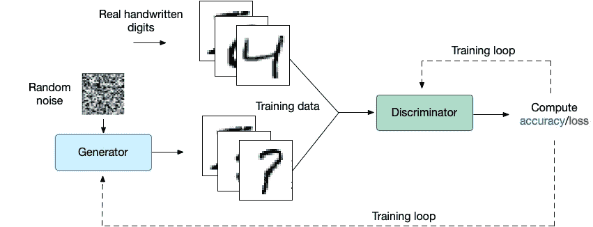

图 GAN 学习框架，它同时训练了生成器和鉴别器。

在构建鉴别器和生成器时，有许多架构需要考虑。我们可以建立一个深度神经网络或卷积神经网络(CNN)和其他一些选项。我们将很快检查 GAN 模型的类型，但是首先，让我们现在选择 CNN。

*这个例子的源代码在我的* [*Github*](https://github.com/malhamid/GAN_MNIST) *上有。*

鉴别器模型架构从接收图像(28 x 28 x 1)开始，并将其通过两个卷积层，每个卷积层中有 64 个滤波器。或者，我们可以使用 128 个过滤器，这代表了每层中隐藏节点的数量。我们可以通过使用具有 64、128 和 256 个隐藏节点的三层来使神经网络架构更密集。为了简化 GAN 网络的工作方式，我们将在本教程中使用简单架构，它仍然具有很高的精度。图 4 显示了鉴频器的整体架构。

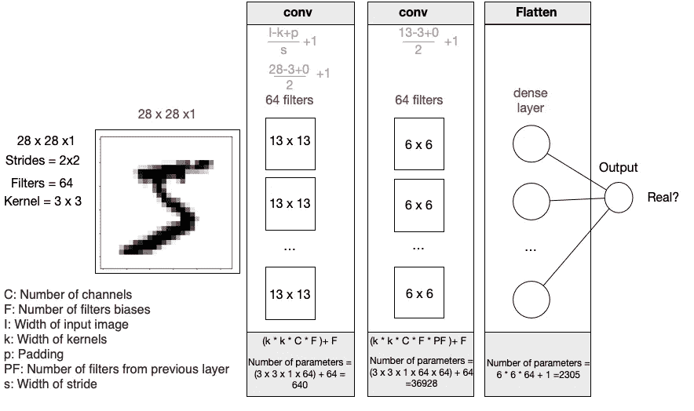

图 4:鉴别器模型的架构显示了层的数量和每个层中的参数。

生成器模型学习如何生成逼真的图像，但需要从潜在空间中的一些随机点开始。如果将图 5 中的生成器架构与图 4 中的鉴别器架构进行比较，您会发现它们看起来几乎相同。重要的是要知道，在构建发电机网络时，没有必要翻转 discrinmiator。生成器的架构可以有不同数量的层、过滤器和更高的整体复杂性。

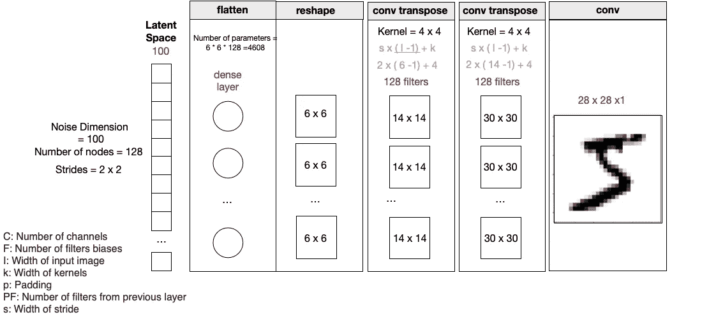

图 5:显示每一层的生成器模型的架构。

鉴别器和发生器的另一个主要区别是激活函数的使用。discrminator 在输出层中使用 s 形。这是一个布尔分类问题，这将确保输出不是 0 就是 1。另一方面，生成器没有损失函数或任何要使用的优化算法。它使用转置卷积层从潜在空间对低分辨率密集层进行上采样，以构建更高分辨率的图像。构建生成器模型的技巧是我们不需要编译它。GAN 模型现在将结合完整的框架，该框架结合了生成器、鉴别器和编译模型。我们将在下一节详细讨论这些方面。

```
def building_gan(generator, discriminator):
    GAN = Sequential()
    discriminator.trainable = False
    # Adding the generator and the discriminator
    GAN.add(generator)
    GAN.add(discriminator)
    # Optimization function
    opt = tf.keras.optimizers.Adam(lr=2e-4, beta_1=0.5)
    # Compile the model 
    GAN.compile(loss='binary_crossentropy', optimizer=opt)
    return GAN
```

下一个动画显示了在训练过程中，发生器在每组时期的改进情况:

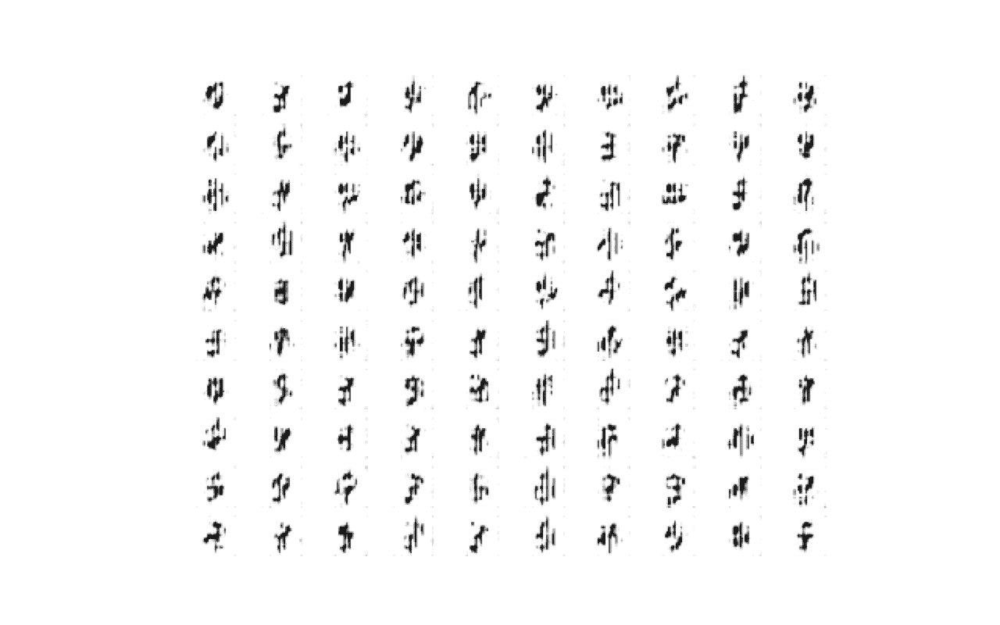

图 5:显示使用 GAN 模型生成的数字的渐进质量的动画图像。

# GAN 的能力和挑战

(假可训练)

## (1)评估

其中一个关键问题是生成的数据(无论是图像、文本还是歌曲)的质量，以及这些生成的文章的多样性。鉴别器帮助我们检查生成的数据是真是假。然而，从鉴别器的角度来看，生成的样本可能看起来很真实，但是对于人眼来说可能太明显而不会注意到。因此，我们需要与主观评价相关的评价指标。研究这个问题的一种方法是分析真实数据和生成数据之间的分布特性。

两个评估指标可以从统计上帮助测量生成数据的质量:Inception Score [3]和 Frechet Inception [4]。这两种客观指标都被研究团体广泛采用，尤其是用于测量生成图像的质量。由于本教程是一个介绍，我们不会详细介绍这些指标是如何工作的。

## (2)损失函数

正如我们之前所讨论的，GAN 模型具有同时训练发生器和鉴别器的独特属性。这需要损失函数来平衡一侧(鉴别器)的训练，同时也改善另一侧(发生器)的训练。当构建鉴别器模型时，我们像任何其他神经网络架构一样明确定义损失函数。

```
*# Defining the discriminator model* 
**def** building_discriminator():
    *# The image dimensions provided as inputs*
    image_shape = (28, 28, 1)
    disModel = Sequential()
    disModel.add(Conv2D(64, 3, strides=2, input_shape=image_shape))
    disModel.add(LeakyReLU())
    disModel.add(Dropout(0.4))
    *# Second layer*
    disModel.add(Conv2D(64, 3, strides=2))
    disModel.add(LeakyReLU()) 
    disModel.add(Dropout(0.4))
    *# Flatten the output*
    disModel.add(Flatten()) 
    disModel.add(Dense(1, activation='sigmoid'))
    *# Optimization function*
    opt = tf.keras.optimizers.Adam(lr=2e-4, beta_1=0.5)
    *# Compile the model*
    disModel.compile(loss='binary_crossentropy', optimizer=opt, metrics = ['accuracy'])
    **return** disModel
```

另一方面，发电机模型没有明确定义损失函数。它基于鉴别器和根据其损失函数更新的发生器的训练。

```
*# Defining the generator model* 
**def** building_generator(noise_dim):
    genModel = Sequential()
    genModel.add(Dense(128 * 6 * 6, input_dim=noise_dim))
    genModel.add(LeakyReLU())
    genModel.add(Reshape((6,6,128)))
    *# Second layer*
    genModel.add(Conv2DTranspose(128, (4,4), strides=(2,2)))
    genModel.add(LeakyReLU())
    *# Third layer*
    genModel.add(Conv2DTranspose(128, (4,4), strides=(2,2)))
    genModel.add(LeakyReLU())
    genModel.add(Conv2D(1, (3,3), activation='sigmoid'))
    **return** genModel
```

选择损失函数的选项很少，例如:

*   最小二乘法。
*   瓦瑟斯坦损失函数。

## (3)收敛性的确定

与 GAN 模型相关的关键问题之一是确定模型何时收敛。鉴别者和产生者之间的竞争使得游戏很难达到最后的赢家。这两种模型都希望最大化它们的增益并最小化它们的损耗。在我们的情况下，我们希望两个模型都达到这样的程度，即它们几乎可以完全猜测图像是假还是真，以及生成的图像是否会成功通过鉴别器。50-50 的机会是从博弈论中继承的完美的理想案例，其中两种模型都很难被赢得。

众所周知，GAN 模型存在收敛速度慢的问题。与其他无监督模型类似，真实标签的缺乏增加了确定训练何时可以停止的挑战。我们需要确保培训时间和产品质量之间的平衡。几个因素有助于减慢或加快训练过程，例如输入的归一化、批量归一化、梯度惩罚以及在训练 GAN 模型之前很好地训练鉴别器。

## (4)产生的图像尺寸

众所周知，GAN 模型在生成图像的尺寸方面能力有限。我们在 MNIST 的例子中看到的图像尺寸只有 28 x 28 像素。这些是在实际应用中使用的非常小的图像。如果我们想要生成更大的图像，比如说 1024 x 1024，我们将需要一个更具可伸缩性的模型。研究团体一直对提高 GAN 能力感兴趣。例如，在 2017 年，T Karras 等人提出了一种称为渐进生长 GANs 的新模型来解决这种问题[2]。

# GAN 模型的类型

前几节中介绍的一些挑战使得研究界扩展了 GAN 模型的思想，以解决上述一个或多个问题。本节涵盖一些流行的扩展和优化的 GAN 架构，以扩展原有的 GAN 功能。

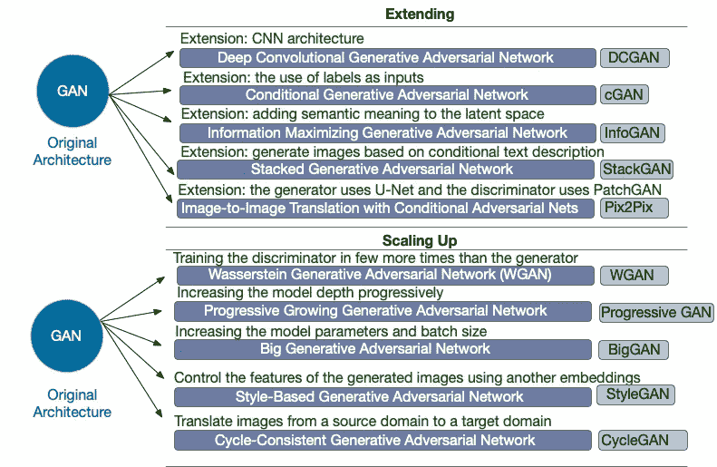

图 6:GAN 模型架构和扩展类型的概述。

**深度卷积 GAN (DCGAN):** 这是一种扩展，用拉德福德等人提出的 CNN 架构取代前馈神经网络【5】。使用 CNN 架构和通过滤波器学习的想法提高了 GAN 模型的准确性。

**wasser stein GAN(WGAN):**WGAN 是由 M. Arjovsky 等人设计的【6】。WGAN 侧重于定义生成分布和真实分布之间的距离，这决定了模型的收敛性。他们建议使用推土机(EM)距离来有效地近似这些分布之间的差异。

**Progressive GAN:**Progressive GAN 由 T. Karras 等人[7]设计，并在 ICLR 会议上提出。这项工作对生成器和鉴别器从较低分辨率到较高分辨率层的渐进增长做出了很大贡献。该技术要求在计算小批量标准偏差时减少小批量的大小。ProgressiveGan 还使用均衡学习率和逐像素特征归一化。

研究从以前的类型发展到引入**半监督**学习模型。该模型可以转化为多类分类器，而不是让鉴别器对给定的图像进行真伪分类。例如，在 MNIST，我们有十个代表十个手写数字的类。鉴别器将有十加一个类，其中附加的类表示要分类的假图像。在这种情况下，鉴别器不仅从真实图像中学习伪像，而且将每个真实图像分类到其对应的类别。这将利用两种损失(Softmax 和 Sigmoid)拉伸目标函数，以使鉴别器更有效地对图像进行正确分类(见图 7)。我们列表中的其余类型(cGAN、CycleGAN)引入了类似的新目标。

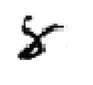

图 7:一个生成的合成图像可能被归类为真实的，但是另一个数字分类器会把它归类为数字 8 吗？

**条件 GAN (cGAN):** cGAN 于 2014 年由 M. Mehdi 和 S. Osindero 发表[8]。它支持每个图像都有标签的想法，生成器学习如何为每个标签生成逼真的图像。鉴别者学会辨别假图像，同时确保它们带有正确的标签。如果我们在图 3 的学习框架上应用 cGAN，将需要进行以下更改:

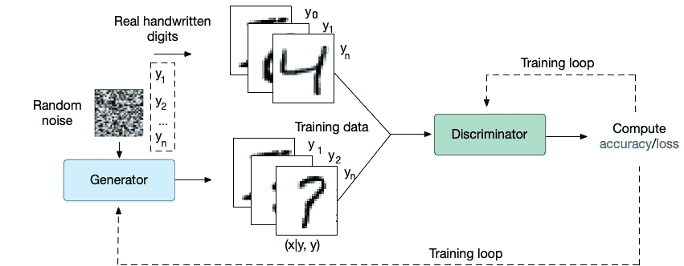

图 8:基于条件 GAN 的学习框架，显示了潜在空间和用于生成图像的随机选择的标签。

**pix 2 pix:**pix 2 pix 模型通过考虑图像到另一组图像的转换，应用了条件 GAN 模型概念的特殊情况。P. Isola 等人[9]在 2017 年提出了这个想法。标签和产生的输出是成对图像的集合。就像翻译一部分文本内容一样，我们可以将一个图像翻译成另一个具有特定属性的图像(参见图 9)。后来，研究界提出了一种更有效的方法，如我们将在接下来讨论的 Cycle GAN。

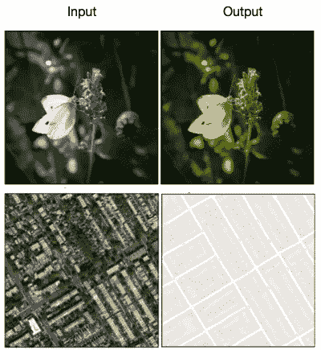

图 9:展示图像到图像转换能力的示例。这些图片摘自于[9]中发表的原始论文。

**Cycle GAN:**Cycle GAN 的独特思想是使用多个生成器和鉴别器，而不是一对一的架构。Pix2pix 让模型从一对图像中学习。这个条件后来被 J-Y. Zhu 等人[10]放宽了。他们想法的新颖之处在于创造了一个循环，在这个循环中，产生的翻译被再次循环以产生原始图像。如果在翻译过程中有任何损失，差异就是我们需要优化的。可以使用两个生成器和鉴别器将输入翻译到“域 A”，然后翻译到“域 B”。这种结构化在本文中被称为前后一致性(反向翻译和再硅化)。两个鉴别器检查两个域的生成输出。这个概念非常类似于**自动编码器的基本思想。**

> **自动编码器**由编码器和解码器两部分组成。这些模型超出了本文的范围，因为它们代表了使用单一模型的独立类别的学习者。自动编码器以压缩编码格式构建输入。然后，解码器从生成的压缩形式中重建输入。

# 渐进式氮化镓:

我们已经讨论了如何使用来自 MNIST 数据集的非常小的图像来构建 GAN 模型。图像大小仅为 128 x 128 像素。如前所述，渐进式 GAN 模型可以从低分辨率层增长到高分辨率层，从而可以扩大模型输出。我们将在下面的例子中看到如何从 64 x 64 像素生成 1024 x 1024 像素。

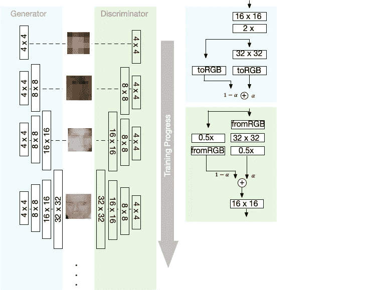

图 10:显示渐进 GAN 如何逐渐添加新层以达到目标分辨率的示意图。

该模型基于两个主要概念设计:淡入和微调。该模型从简单的 4 x 4 分辨率发展到更高的分辨率。它提供了在训练每一层之后增长的能力，并且我们将能够在我们逐步训练时监控输出(如图 10 所示)。alpha 参数被缩放为 0 到 1 之间的值。它决定了我们是应该使用先前训练的层还是放大。鉴别器

# 结论和进一步阅读

这篇文章简要介绍了 GAN 模型有多神奇。我们刚刚对 GAN 模型的工作原理有了一些基本的了解。我稍后将在单独的线程中扩展一些相关的主题。然而，如果你想了解更多，我推荐两个地方:

*   由 Jakub Langr 和 Vladimir Bok 撰写的“GANs in Action”是一本很好的书，讲述了如何构建 GAN 模型，并详细介绍了本博客中介绍的各个方面。
*   [“The-gan-zoo”](https://github.com/hindupuravinash/the-gan-zoo)是一个 Github 知识库，它跟踪该领域最近发表的所有研究文章。你可以从这个回购访问你感兴趣的文件，并导航到其他有趣的工作列表。

# 参考

[1]古德费勒，伊恩，等。“生成性对抗性网络。”*神经信息处理系统的进展*。2014.

[2] Karras，Tero 等，“为提高质量、稳定性和变化性而逐步种植甘蔗” *arXiv 预印本 arXiv:1710.10196。* 2017 年。

[3]萨利曼斯，蒂姆，等，“训练甘斯的改进技术”*神经信息处理系统的进展*。2016.

[4] Heusel，Martin 等人，“通过双时标更新规则训练的 Gans 收敛到局部纳什均衡。”*神经信息处理系统的进展*。2017.

[5]拉德福德，亚历克，卢克·梅斯，和苏密特·钦塔拉。"深度卷积生成对抗网络的无监督表示学习." *arXiv 预印本 arXiv:1511.06434* (2015)。

[6] Arjovsky、Martin、Soumith Chintala 和 Léon Bottou。"瓦瑟斯坦·甘" *arXiv 预印本 arXiv:1701.07875* (2017)。

[7] Karras，Tero 等，“为提高质量、稳定性和变化性而逐步种植甘蔗” *arXiv 预印本 arXiv:1710.10196* (2017)。

[8]米尔扎、迈赫迪和西蒙·奥辛德罗。"条件生成对抗网络." *arXiv 预印本 arXiv:1411.1784* (2014)。

[9] Isola，Phillip，等，“用条件对抗网络进行图像到图像的翻译”*IEEE 计算机视觉和模式识别会议论文集*。2017.

[10]朱，严军，等.“利用循环一致对抗网络进行不成对的映象对映象翻译”IEEE 计算机视觉国际会议论文集。2017.