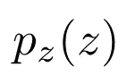
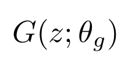
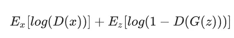
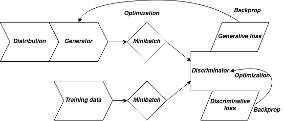

# 生成性对抗网络——难吗？不是。

> 原文：<https://towardsdatascience.com/generative-adversarial-networks-hard-not-eea78c1d3c95?source=collection_archive---------55----------------------->

## GAN 工作流程简介。

米凯拉·帕兰特在 [Unsplash](https://unsplash.com?utm_source=medium&utm_medium=referral) 上的照片

自 2014 年问世以来，生成性对抗网络(俗称 GAN)已被广泛纳入众多研究工作。但是是什么让甘有如此神奇的魔力呢？

事实上，有很多教程都在教授如何实现 GAN *代码*——但是没有足够简单地解释 GAN。在本教程中，我将介绍 GANs 背后的数学知识，并尝试涵盖最初的 GAN 论文中的大部分基础知识。您可能已经猜到这不是一个逐行代码的教程。

## 那么什么是甘呢？

> 一个**生成对抗网络**包含的不是一个单一的网络，而是一组至少两个总是相互“交战”的网络。一个网络被称为发电机，另一个是鉴别器。顾名思义，生成器生成由鉴别器评估的数据。两个网络之间的对抗部分或“战争”是，生成器反复尝试欺骗鉴别器，而鉴别器则被确定不在生成器的伪装下。

发电机所做的是我们的神经网络长期以来一直在做的事情。生成器试图*估计*数据分布，并基于该估计生成数据。一般而言，神经网络通常用于基于一些参数来估计函数。是什么使生成器不同于传统的神经网络？*魔法*在哪里？—发电机以*噪音*作为输入工作！一台机器可以从噪音中生成人的笔迹，这一事实让甘斯变得神奇。

由于我们的发电机网络以噪声作为输入，我们必须首先定义输入噪声变量的*优先*。让我们把先验表述为—

先验噪声分布

> 在[贝叶斯](https://en.wikipedia.org/wiki/Bayesian_probability) [统计推断](https://en.wikipedia.org/wiki/Statistical_inference)中，一个不确定量的**先验概率分布**，通常简称为**先验**是[概率分布](https://en.wikipedia.org/wiki/Probability_distribution)，它将表达一个人对这个量的信念**在**之前，一些证据被考虑到了——[https://en.wikipedia.org/wiki/Prior_probability](https://en.wikipedia.org/wiki/Prior_probability)

如果我们用 G 表示发电机网络，我们可以说 G 将噪声变量映射到数据空间，如下所示

发电机网络

简单地说，生成器 G 获取随机噪声，并尝试重建真实数据。假设我们将发生器给出的数据定义为 *p* 的输出。需要注意的是，我们没有优化*p*——我们优化了*θ*，这样我们就可以得到*p*的正确估计。现在，我们并不期望生成器自己训练并给出真实数据，对吗？我们需要某种东西来检查生成器，如果它不能从噪声中生成真正的数据，就对它进行某种“惩罚”。

这个“惩罚者”就是鉴别者。鉴别器(D)是其最基本的形式，是一个分类器，用于对其输入进行真假分类。因此，鉴别器输出单个标量。 *D(x)* 表示 *x* 来自真实数据而非生成器 g 的概率。由于我们已经定义了生成器和鉴别器模型以及它们如何工作，我们现在将讨论成本函数或损失函数。

# 损失函数

可以说，GAN 最重要的部分之一是损耗函数及其设计。在介绍 GAN 的论文中定义的损失函数是—

损失函数

这是一个“最小-最大”损失函数，我们训练鉴别器以最大化该损失函数，同时训练发生器以最小化该损失函数的最后一项。不同类型的 gan 还有其他损失函数。其中一些损失函数是对这个的修改。一个 GAN 甚至可以有多个损耗函数，一个用于发生器，一个用于鉴频器

# 培养

现在我们已经完成了损失函数，我们应该如何处理训练呢？我们先训练哪个网络？对于每个历元，首先计算鉴别器的梯度，并且首先更新其权重。然后，我们训练发电机。

训练算法(步骤)—

1.  首先，我们从我们之前定义的噪声中采样一个小批量的 m 个噪声样本
2.  然后，我们从数据生成分布(训练集)中抽取少量的 m 个样本
3.  我们使用 SGD 根据计算的梯度更新鉴别器的权重。SGD 代表随机梯度下降。更多信息—[https://medium . com/@ hmrishavbandyopadhyay/neural-network-optimizer-hard-not-2-7ecc 677892 cc](https://medium.com/@hmrishavbandyopadhyay/neural-network-optimizers-hard-not-2-7ecc677892cc)
4.  然后，我们再次从噪声先验中采样小批量的 m 个噪声样本
5.  我们使用计算的梯度和应用 SGD 来更新生成器的权重。

训练算法

因此，我们现在已经成功地训练了一个非常原始和简单的 GAN 网络。然而，这只是对 2014 年推出的 GAN 论文的解释。从那时起，已经产生了数百种类型的 GAN，并且每一种都有它们自己的损失函数和它们自己的训练算法。

实现 GANs 可能会变得非常有趣。如果你有任何疑问，请在评论中告诉我——乐意效劳；)

查看我的博客以获得更快的更新，并订阅优质内容:D

 [## 卷积博客

### 克罗伊斯，吕底亚(小亚细亚)的国王，曾经问特尔斐的神谕，他是否应该对波斯开战…

www.theconvolvedblog.vision](https://www.theconvolvedblog.vision) 

*Hmrishav Bandyopadhyay 是印度 Jadavpur 大学电子与电信系的二年级学生。他的兴趣在于深度学习、计算机视觉和图像处理。可以通过以下方式联系到他:hmrishavbandyopadhyay@gmail.com | |*[*https://hmrishavbandy . github . io*](https://hmrishavbandy.github.io)