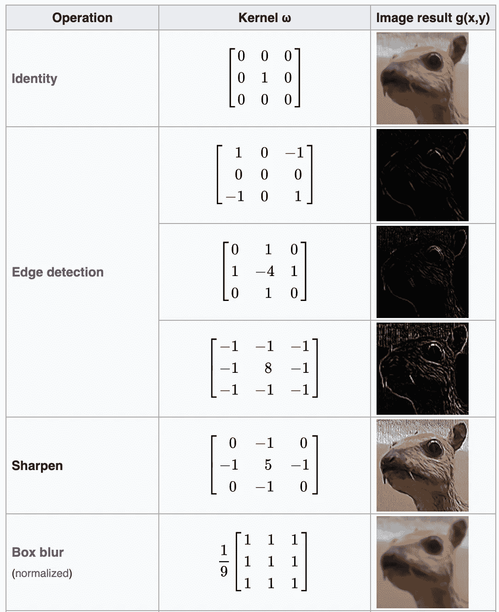

# Python 中的生成对抗网络

> 原文：<https://towardsdatascience.com/generative-adversarial-networks-in-python-73d3972823d3?source=collection_archive---------17----------------------->

## Python 中的 GANs 简介


[来源](https://www.pexels.com/photo/battle-board-game-castle-challenge-277124/)

生成对抗网络(GANs)是一组用于产生合成数据的深度神经网络模型。该方法由伊恩·古德费勒于 2014 年开发，并在论文[生成对抗网络](https://arxiv.org/pdf/1406.2661.pdf)中进行了概述。GAN 的目标是训练鉴别器能够区分真实和虚假数据，同时训练生成器产生可以可靠地欺骗鉴别器的数据的合成实例。

GANs 的一个流行应用是在“GANgogh”项目中，在这个项目中，经过 wikiart.org 绘画训练的 GANs 生成合成画。独立研究人员 Kenny Jones 和 Derrick Bonafilia 能够生成合成的宗教、风景、花卉和肖像图像，表现令人印象深刻。文章[甘戈:用甘斯来创造艺术](/gangogh-creating-art-with-gans-8d087d8f74a1)详细介绍了这种方法。在本帖中，我们将介绍用 python 构建基本 GAN 的过程，我们将使用它来生成手写数字的合成图像。这篇文章中使用的大部分代码可以在 GANs Tensorflow 教程页面上找到，可以在[这里](https://www.tensorflow.org/tutorials/generative/dcgan)找到。

我们开始吧！

现在，让我们导入必要的包。让我们从导入‘matplotlib’，‘tensor flow . keras’层和‘tensor flow’库开始。让我们也定义一个变量，我们可以使用它来存储和清除我们的会话:

```
import matplotlib.pyplot as plt
from tensorflow.keras import layers
import tensorflow as tf
from tensorflow.python.keras import backend as K
K.clear_session()
config = tf.ConfigProto()
config.gpu_options.allow_growth = True
```

接下来，让我们加载“MNIST”数据集，它在“张量流”库中可用。数据包含手写数字的图像和对应于数字的标签:

```
(train_images, train_labels), (test_images, test_labels) = tf.keras.datasets.mnist.load_data()
```

让我们来看看训练数据中的第一幅图像:

```
plt.imshow(train_images[0], cmap='gray')
```


我们可以看到这是手写的‘5’。接下来，让我们重塑数据，将图像像素转换为浮点值，并将像素值归一化为-1 到 1 之间的值:

```
train_images = train_images.reshape(train_images.shape[0], 28, 28, 1).astype('float32')
train_images = (train_images - 127.5) / 127.5
```

现在让我们定义我们的发电机模型:

```
def generator_model():
    model = tf.keras.Sequential()
    model.add(layers.Dense(7*7*256, use_bias=False, input_shape=(100,)))
    model.add(layers.BatchNormalization())
    model.add(layers.LeakyReLU()) model.add(layers.Reshape((7, 7, 256)))
    assert model.output_shape == (None, 7, 7, 256) # Note: None is the batch size model.add(layers.Conv2DTranspose(128, (5, 5), strides=(1, 1), padding='same', use_bias=False))
    assert model.output_shape == (None, 7, 7, 128)
    model.add(layers.BatchNormalization())
    model.add(layers.LeakyReLU()) model.add(layers.Conv2DTranspose(64, (5, 5), strides=(2, 2), padding='same', use_bias=False))
    assert model.output_shape == (None, 14, 14, 64)
    model.add(layers.BatchNormalization())
    model.add(layers.LeakyReLU()) model.add(layers.Conv2DTranspose(1, (5, 5), strides=(2, 2), padding='same', use_bias=False, activation='tanh'))
    assert model.output_shape == (None, 28, 28, 1) return model
```

我们首先初始化一个顺序模型对象。然后我们添加第一层，这是一个普通的密集神经网络层。还有一系列转置卷积层，是带填充的卷积层。对于那些不熟悉的，卷积层学习矩阵(核心)的权利，然后结合起来，形成过滤器用于特征提取。通过学习滤波器权重，卷积层学习表示关于图像的高级信息的卷积特征。通过学习的过滤器，这些层可以执行像边缘检测、图像锐化和图像模糊这样的操作。这些是计算机视觉中核心矩阵的一些例子:



[来源](https://en.wikipedia.org/wiki/Kernel_(image_processing))

如果你有兴趣，可以在这里了解更多关于卷积神经网络[的知识。还有一系列泄漏的“ReLu”层:](/a-comprehensive-guide-to-convolutional-neural-networks-the-eli5-way-3bd2b1164a53)


这些是经过修改的“ReLu”激活，通过增加“ReLu”功能的范围，有助于缓解神经元死亡问题。还有批量归一化图层，用于固定各图层输入的均值和方差。这有助于提高神经网络的速度、性能和稳定性。

发生器和鉴别器网络以类似于普通神经网络的方式被训练。即，随机初始化权重，评估损失函数及其相对于权重的梯度，并且通过反向传播迭代更新权重。

训练过程将帮助生成器模型从噪声中产生看起来真实的图像，并且鉴别器在检测看起来真实的假图像方面做得更好。让我们看一个生成器模型的输入示例。首先，让我们定义我们的生成器并初始化一些噪声“像素”数据:

```
generator = generator_model()
noise = tf.random.normal([1, 100])
```

接下来，让我们将噪声数据传入“generator_model”函数，并使用“matplotlib”绘制图像:

```
your_session = K.get_session()
generated_image = generator(noise, training=False)
array = generated_image[0, :, :, 0].eval(session=your_session)
plt.imshow(array, cmap='gray')
```


我们看到这只是一个嘈杂的黑白图像。我们的目标是让我们的生成器学习如何通过对这些嘈杂的数据进行迭代训练来生成看起来真实的数字图像，就像我们之前绘制的图像一样。经过充分的训练，我们的生成器应该能够从如上所示的噪声输入中生成真实的手写数字。

现在让我们定义我们的鉴别器函数。这将是一个用于分类的普通卷积神经网络:

```
def discriminator_model():
    model = tf.keras.Sequential()
    model.add(layers.Conv2D(64, (5, 5), strides=(2, 2), padding='same',
                                     input_shape=[28, 28, 1]))
    model.add(layers.LeakyReLU())
    model.add(layers.Dropout(0.3)) model.add(layers.Conv2D(128, (5, 5), strides=(2, 2), padding='same'))
    model.add(layers.LeakyReLU())
    model.add(layers.Dropout(0.3)) model.add(layers.Flatten())
    model.add(layers.Dense(1)) return model
```

接下来，让我们定义损失函数和鉴别器对象:

```
discriminator = discriminator_model()
cross_entropy = tf.keras.losses.BinaryCrossentropy(from_logits=True)
```

接下来，我们定义特定于鉴别器的损失函数。该函数测量鉴别器区分真实图像和虚假图像的能力。它将鉴别器的二进制预测与真实图像和伪图像上的标签进行比较，其中“1”对应于真实图像，“0”对应于伪图像:

```
def discriminator_loss(real_output, fake_output):
    real_loss = cross_entropy(tf.ones_like(real_output), real_output)
    fake_loss = cross_entropy(tf.zeros_like(fake_output), fake_output)
    total_loss = real_loss + fake_loss
    return total_loss
```

发生器损耗函数衡量发生器欺骗鉴别器的能力:

```
def generator_loss(fake_output):
    return cross_entropy(tf.ones_like(fake_output), fake_output)
```

由于生成器和鉴别器是独立的神经网络，它们各自都有自己的优化器。我们将使用“Adam”优化器来训练我们的鉴别器和生成器:

```
generator_optimizer = tf.keras.optimizers.Adam(1e-4)
discriminator_optimizer = tf.keras.optimizers.Adam(1e-4)
```

接下来，让我们定义历元数(训练数据的完整遍数)、噪声数据的维度大小以及要生成的样本数:

```
EPOCHS = 50
noise_dim = 100
num_examples_to_generate = 16
```

然后，我们为训练循环定义我们的函数。“@tf.function”装饰器编译该函数。“train_step()”函数从随机噪声生成图像开始:

```
@tf.function
def train_step(images):
    noise = tf.random.normal([BATCH_SIZE, noise_dim])
    with tf.GradientTape() as gen_tape, tf.GradientTape() as disc_tape:
        generated_images = generator(noise, training=True) #random seed images
```

然后使用鉴别器对真实和伪造的图像进行分类:

```
@tf.function
def train_step(images):
      ...
          real_output = discriminator(images, training=True)
          fake_output = discriminator(generated_images, training=True)
```

然后，我们计算发生器和鉴频器损耗:

```
@tf.function
def train_step(images):
    ...gen_loss = generator_loss(fake_output)
        disc_loss = discriminator_loss(real_output, fake_output)
```

然后，我们计算损失函数的梯度:

```
@tf.function
def train_step(images):
    ...
    gradients_of_generator = gen_tape.gradient(gen_loss, generator.trainable_variables)
    gradients_of_discriminator = disc_tape.gradient(disc_loss, discriminator.trainable_variables)
```

然后，我们应用优化器来找到使损失最小化的权重，并更新生成器和鉴别器:

```
@tf.function
def train_step(images):
    ...
    generator_optimizer.apply_gradients(zip(gradients_of_generator,        generator.trainable_variables))
    discriminator_optimizer.apply_gradients(zip(gradients_of_discriminator, discriminator.trainable_variables))
```

接下来，我们定义一种方法，允许我们在训练完成后生成假图像，并保存它们:

```
def generate_and_save_images(model, epoch, test_input): predictions = model(test_input, training=False) fig = plt.figure(figsize=(4,4)) for i in range(predictions.shape[0]):
      plt.subplot(4, 4, i+1)
      plt.imshow(predictions[i, :, :, 0] * 127.5 + 127.5, cmap='gray')
      plt.axis('off') plt.savefig('image_at_epoch_{:04d}.png'.format(epoch))
  plt.show()
```

接下来，我们定义允许我们同时训练生成器和鉴别器的训练方法。接下来，让我们导入“时间”和“操作系统”模块。让我们也定义一个检查点对象，它将允许我们保存和恢复模型:

```
import time
import os
checkpoint_dir = './training_checkpoints'
checkpoint_prefix = os.path.join(checkpoint_dir, "ckpt")
checkpoint = tf.train.Checkpoint(generator_optimizer=generator_optimizer,                        discriminator_optimizer=discriminator_optimizer,
                                 generator=generator,
                                 discriminator=discriminator)
```

接下来，我们定义我们的函数，该函数从迭代历元数开始:

```
def train(dataset, epochs):
    for epoch in range(epochs):
```

在历元循环中，我们从每个训练步骤中生成图像:

```
def train(dataset, epochs):
        ...
        display.clear_output(wait=True)
        generate_and_save_images(generator,
                             epoch + 1,
                             seed)
        if (epoch + 1) % 5 == 0:
            checkpoint.save(file_prefix = checkpoint_prefix)print ('Time for epoch {} is {} sec'.format(epoch + 1, time.time()-start))
```

然后，我们从最后一个时期生成图像。让我们每隔 5 个时期保存我们的模型:

```
def train(dataset, epochs):
        ... display.clear_output(wait=True)
    generate_and_save_images(generator,
                           epochs,
                           seed)
```

最后，我们可以使用 epochs 参数对训练数据调用“train()”方法:

```
train(train_dataset, EPOCHS)
```

如果我们用两个时期运行我们的代码，我们应该得到假图像的如下输出:


我们看到输出噪声仍然很大。经过 50 个时期后，我们应该生成以下图(注意，这需要在 16 G 内存的 MacBook Pro 上运行几个小时):


正如我们所看到的，一些数字是可识别的，而另一些需要更多的训练来提高。可以推测，随着时代的增加，数字看起来会更可信。我就讲到这里，但是您可以随意使用数据并自己编码。还有许多其他数据集可以用来训练 GANs，包括[英特尔图像分类](https://www.kaggle.com/puneet6060/intel-image-classification)数据集、 [CIFAR](https://www.cs.toronto.edu/~kriz/cifar.html) 数据集和[猫&狗](https://www.kaggle.com/tongpython/cat-and-dog#dog.4010.jpg)数据集。其他有趣的应用包括深度假视频和深度假音频。

要开始在视频上训练 GAN，您可以查看论文 [*复杂数据集的对抗性视频生成*](https://arxiv.org/pdf/1907.06571.pdf) *。*在本文中，作者在 [UCF-101 动作识别数据集](https://www.crcv.ucf.edu/data/UCF101.php)上训练 GAN，该数据集包含来自 YouTube 的 101 个动作类别的视频。要开始在音频上训练 GAN，请查看论文[对抗性音频合成](https://arxiv.org/pdf/1802.04208.pdf)。在本文中，作者对 GAN 进行了第一个到第九个语音命令的训练，这些命令包含鼓的声音、鸟的叫声等等。

# 结论

总之，在这篇文章中，我们讨论了生成对抗网络(GAN)以及如何用 python 实现它。我们发现 GANs 同时训练两个神经网络，一个用于数据生成，另一个用于数据识别。鉴别器和生成器的层最显著地分别包含转置卷积和普通卷积层，它们学习图像的高级特征表示。我鼓励你尝试在一些其他有趣的数据上训练 GAN，比如我上面提到的语音或视频数据集。同样，这篇文章中使用的代码可以在 GANs Tensorflow 教程页面上找到，可以在这里找到。我希望你觉得这篇文章有用/有趣。这篇文章的代码也可以在 GitHub 上找到。感谢您的阅读！