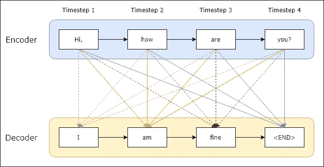
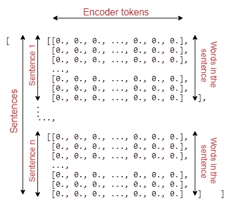
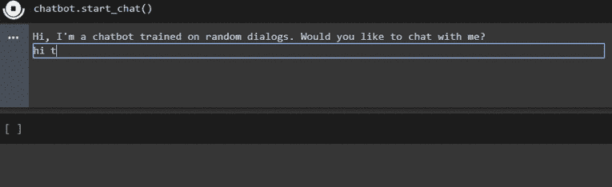

# 使用 seq2seq 模型的生成型聊天机器人！

> 原文：<https://towardsdatascience.com/generative-chatbots-using-the-seq2seq-model-d411c8738ab5?source=collection_archive---------4----------------------->

## 深度学习|自然语言处理

## 一个聊天机器人，产生一个响应，而不是从现有的选择！

> 聊天机器人是一种为用户提供真实对话体验的软件。有封闭域聊天机器人和开放域(生成型)聊天机器人。封闭域聊天机器人是一个用预定义文本进行响应的聊天机器人。顾名思义，生成型聊天机器人会生成响应。


在 [Unsplash](https://unsplash.com?utm_source=medium&utm_medium=referral) 上 [NeONBRAND](https://unsplash.com/@neonbrand?utm_source=medium&utm_medium=referral) 拍摄的照片

下面的文章展示了如何在机器学习分类器的帮助下创建封闭域聊天机器人。

[](/a-naive-bayes-approach-towards-creating-closed-domain-chatbots-f93e7ac33358) [## 创建封闭域聊天机器人的朴素贝叶斯方法！

### 有一种简单有效的方法来创建使用朴素贝叶斯分类器的封闭域聊天机器人。

towardsdatascience.com](/a-naive-bayes-approach-towards-creating-closed-domain-chatbots-f93e7ac33358) 

在上面的文章中，答案是固定的，机器学习帮助选择用户问题中给出的正确答案。但是在这里，我们不会从预定义的响应中进行选择，而是基于训练语料库生成响应。对于这种方法，我们将使用编码器-解码器(seq2seq)模型。

# seq2seq 创建创成式聊天机器人方法介绍

seq2seq 模型也称为编码器-解码器模型，使用长短期记忆 LSTM 从训练语料库中生成文本。seq2seq 模型在机器翻译应用中也很有用。seq2seq 或编码器-解码器模型用简单的话来说是做什么的？它预测用户输入中给定的单词，然后使用该单词出现的可能性来预测接下来的每个单词。在构建我们的生成式聊天机器人时，我们将使用这种方法来生成用户输入中给出的*文本*。



编码器-解码器模型

编码器输出最终状态向量(存储器),该向量成为解码器的初始状态。我们使用一种叫做 [*的方法，教师强制*](/what-is-teacher-forcing-3da6217fed1c) 来训练解码器，使其能够预测前面单词中给定的目标序列中的后续单词。如上所示，状态通过编码器传递到解码器的每一层。“嗨”、“怎么样”、“是”和“你”被称为输入标记，而“我”、“我”和“好”被称为目标标记。令牌“am”的可能性取决于前面的单词和编码器状态。我们正在添加'< END >'标记，让我们的解码器知道何时停止。你可以在这里了解更多关于 [seq2seq](https://blog.keras.io/a-ten-minute-introduction-to-sequence-to-sequence-learning-in-keras.html) 车型的信息。

让我们从头开始构建我们的生成性聊天机器人吧！我们要做的第一项任务是预处理我们的数据集。

# 预处理数据集

我们将要使用的数据集是从 [Kaggle](http://www.kaggle.com) 中收集的。你可以在下面找到。它包含人类的反应和机器人的反应。每个条目有 2363 个。

[](https://www.kaggle.com/eibriel/rdany-conversations) [## rDany 聊天

### 157 次聊天和 6300 多条信息与一个(假的)虚拟伙伴

www.kaggle.com](https://www.kaggle.com/eibriel/rdany-conversations) 

首先，我们必须在正则表达式的帮助下清理我们的语料库。然后，我们将需要像人类反应-机器人反应这样的配对，以便我们可以训练我们的 seq2seq 模型。我们将如下所示执行这些任务。

```
import re
import random
data_path = "human_text.txt"
data_path2 = "robot_text.txt"
# Defining lines as a list of each line
with open(data_path, 'r', encoding='utf-8') as f:
  lines = f.read().split('\n')with open(data_path2, 'r', encoding='utf-8') as f:
  lines2 = f.read().split('\n')lines = [re.sub(r"\[\w+\]",'hi',line) for line in lines]
lines = [" ".join(re.findall(r"\w+",line)) for line in lines]
lines2 = [re.sub(r"\[\w+\]",'',line) for line in lines2]
lines2 = [" ".join(re.findall(r"\w+",line)) for line in lines2]
# grouping lines by response pair
pairs = list(zip(lines,lines2))
#random.shuffle(pairs)
```

创建对子后，我们也可以在训练前洗牌。我们的对子现在看起来像这样:

```
[('hi', 'hi there how are you'), ('oh thanks i m fine this is an evening in my timezone', 'here is afternoon'),...]
```

这里，“hi”是输入序列，“hi there how are you”是目标序列。我们必须为输入序列和目标序列创建单独的列表，我们还需要为数据集中的唯一标记(输入标记和目标标记)创建列表。对于目标序列，我们将在序列的开头添加“<start>”，在序列的结尾添加“<end>”，以便我们的模型知道在哪里开始和结束*文本生成*。我们将这样做，如下所示。</end></start>

```
import numpy as npinput_docs = []
target_docs = []
input_tokens = set()
target_tokens = set()for line in pairs[:400]:
  input_doc, target_doc = line[0], line[1]
  # Appending each input sentence to input_docs
  input_docs.append(input_doc)
  # Splitting words from punctuation  
  target_doc = " ".join(re.findall(r"[\w']+|[^\s\w]", target_doc))
  # Redefine target_doc below and append it to target_docs
  target_doc = '<START> ' + target_doc + ' <END>'
  target_docs.append(target_doc)

  # Now we split up each sentence into words and add each unique word to our vocabulary set
  for token in re.findall(r"[\w']+|[^\s\w]", input_doc):
    if token not in input_tokens:
      input_tokens.add(token)
  for token in target_doc.split():
    if token not in target_tokens:
      target_tokens.add(token)input_tokens = sorted(list(input_tokens))
target_tokens = sorted(list(target_tokens))
num_encoder_tokens = len(input_tokens)
num_decoder_tokens = len(target_tokens)
```

*注意:为了简单起见，我们只取前 400 对，但结果是，我们会得到非常低的准确度。*

我们的数据集有唯一的输入标记和目标标记。现在，我们将创建一个输入特征字典，将输入标记存储为键-值对，单词是键，值是索引。类似地，对于目标标记，我们将创建一个目标特性字典。特征字典将帮助我们把我们的句子编码成一个热点向量。毕竟计算机只懂数字。为了对句子进行解码，我们需要创建逆向特征字典，将索引存储为键，将单词存储为值。

```
input_features_dict = dict(
    [(token, i) for i, token in enumerate(input_tokens)])
target_features_dict = dict(
    [(token, i) for i, token in enumerate(target_tokens)])reverse_input_features_dict = dict(
    (i, token) for token, i in input_features_dict.items())
reverse_target_features_dict = dict(
    (i, token) for token, i in target_features_dict.items())
```

# 培训设置

为了训练我们的 seq2seq 模型，我们将使用三个独热向量矩阵，编码器输入数据、解码器输入数据和解码器输出数据。我们对解码器使用两个矩阵的原因是 seq2seq 模型在训练*时使用的一种称为 [*教师强制*](/what-is-teacher-forcing-3da6217fed1c) 的方法。*这背后的想法是什么？我们有一个来自前一个[时间步](https://stackoverflow.com/questions/54235845/what-exactly-is-timestep-in-an-lstm-model)的输入令牌来帮助模型训练当前的目标令牌。让我们创建这些矩阵。

```
#Maximum length of sentences in input and target documents
max_encoder_seq_length = max([len(re.findall(r"[\w']+|[^\s\w]", input_doc)) for input_doc in input_docs])
max_decoder_seq_length = max([len(re.findall(r"[\w']+|[^\s\w]", target_doc)) for target_doc in target_docs])encoder_input_data = np.zeros(
    (len(input_docs), max_encoder_seq_length, num_encoder_tokens),
    dtype='float32')
decoder_input_data = np.zeros(
    (len(input_docs), max_decoder_seq_length, num_decoder_tokens),
    dtype='float32')
decoder_target_data = np.zeros(
    (len(input_docs), max_decoder_seq_length, num_decoder_tokens),
    dtype='float32')for line, (input_doc, target_doc) in enumerate(zip(input_docs, target_docs)):
    for timestep, token in enumerate(re.findall(r"[\w']+|[^\s\w]", input_doc)):
        #Assign 1\. for the current line, timestep, & word in encoder_input_data
        encoder_input_data[line, timestep, input_features_dict[token]] = 1.

    for timestep, token in enumerate(target_doc.split()):
        decoder_input_data[line, timestep, target_features_dict[token]] = 1.
        if timestep > 0:
            decoder_target_data[line, timestep - 1, target_features_dict[token]] = 1.
```

为了清楚地了解*编码器 _ 输入 _ 数据*的尺寸如何工作，请参见下图。*解码器 _ 输入 _ 数据*和*解码器 _ 目标 _ 数据*同样具有尺寸。



# 编码器-解码器训练设置

我们的编码器模型需要一个输入层和一个 LSTM 层，输入层定义了一个用于保存独热向量的矩阵，而层具有一些隐藏状态。解码器模型结构与编码器几乎相同，但这里我们将状态数据与解码器输入一起传入。

```
from tensorflow import keras
from keras.layers import Input, LSTM, Dense
from keras.models import Model#Dimensionality
dimensionality = 256#The batch size and number of epochs
batch_size = 10
epochs = 600#Encoder
encoder_inputs = Input(shape=(None, num_encoder_tokens))
encoder_lstm = LSTM(dimensionality, return_state=True)
encoder_outputs, state_hidden, state_cell = encoder_lstm(encoder_inputs)
encoder_states = [state_hidden, state_cell]#Decoder
decoder_inputs = Input(shape=(None, num_decoder_tokens))
decoder_lstm = LSTM(dimensionality, return_sequences=True, return_state=True)
decoder_outputs, decoder_state_hidden, decoder_state_cell = decoder_lstm(decoder_inputs, initial_state=encoder_states)
decoder_dense = Dense(num_decoder_tokens, activation='softmax')
decoder_outputs = decoder_dense(decoder_outputs)
```

您可以在这里了解更多关于如何编码编码器-解码器模型[的信息，因为对它的完整解释超出了本文的范围。](https://machinelearningmastery.com/develop-encoder-decoder-model-sequence-sequence-prediction-keras/)

# 建立和训练 seq2seq 模型

现在，我们将创建 seq2seq 模型，并使用编码器和解码器数据对其进行训练，如下所示。

```
#Model
training_model = Model([encoder_inputs, decoder_inputs], decoder_outputs)#Compiling
training_model.compile(optimizer='rmsprop', loss='categorical_crossentropy', metrics=['accuracy'], sample_weight_mode='temporal')#Training
training_model.fit([encoder_input_data, decoder_input_data], decoder_target_data, batch_size = batch_size, epochs = epochs, validation_split = 0.2)
training_model.save('training_model.h5')
```

这里，我们使用 *rmsprop* 作为优化器，使用*分类交叉熵*作为损失函数。我们称之为*。*fit()【方法】通过给定编码器和解码器的输入数据(X/input)和解码器的目标数据(Y/label)。训练结束后，我们得到的训练准确率在 20%左右。这种较低准确性的原因是我们只使用了 400 对数据集。如果在更大的数据集上训练，可以实现更高的准确性。

# 测试设置

现在，为了处理模型没有看到的输入，我们需要一个逐步解码的模型，而不是使用*教师强制*，因为我们创建的模型只有在目标序列已知的情况下才能工作*。*在生成型聊天机器人应用程序中，我们不知道对用户传入的输入会产生什么样的响应。为此，我们将不得不构建一个 seq2seq 模型。让我们首先用编码器输入和编码器输出状态构建一个编码器模型。我们将在之前训练好的模型的帮助下完成这项工作。

```
from keras.models import load_model
training_model = load_model('training_model.h5')encoder_inputs = training_model.input[0]
encoder_outputs, state_h_enc, state_c_enc = training_model.layers[2].output
encoder_states = [state_h_enc, state_c_enc]
encoder_model = Model(encoder_inputs, encoder_states)
```

接下来，我们将需要为解码器输入状态创建占位符，因为我们不知道我们需要解码什么或者我们将得到什么隐藏状态。

```
latent_dim = 256
decoder_state_input_hidden = Input(shape=(latent_dim,))
decoder_state_input_cell = Input(shape=(latent_dim,))
decoder_states_inputs = [decoder_state_input_hidden, decoder_state_input_cell]
```

现在，我们将借助之前培训的解码器 LSTM 和密集层来创建新的解码器状态和输出。

```
decoder_outputs, state_hidden, state_cell = decoder_lstm(decoder_inputs, initial_state=decoder_states_inputs)
decoder_states = [state_hidden, state_cell]
decoder_outputs = decoder_dense(decoder_outputs)
```

最后，我们有解码器输入层，来自编码器的最终状态，来自解码器密集层的解码器输出，以及解码器输出状态，它是网络从一个字到下一个字期间的存储器。我们现在可以将所有这些放在一起，并设置如下所示的解码器模型。

```
decoder_model = Model([decoder_inputs] + decoder_states_inputs, [decoder_outputs] + decoder_states)
```

# 测试我们的模型

最后，我们将创建一个函数，它接受我们的文本输入，并使用我们创建的编码器和解码器生成响应。在下面的函数中，我们传入表示文本句子的 NumPy 矩阵，并从中获取生成的响应。我为几乎每一行代码都添加了注释，以便您快速理解。下面的函数是这样的:1。)我们从编码器 2 中检索输出状态。)我们将输出状态传递给解码器(这是解码器的初始隐藏状态)，以逐字解码句子 3。)在解码每个字之后更新解码器的隐藏状态，以便我们可以使用先前解码的字来帮助解码新的字

一旦我们遇到我们在预处理任务中添加到目标序列的'<end>'标记，或者我们达到序列的最大长度，我们就会停止。</end>

```
def decode_response(test_input):
    #Getting the output states to pass into the decoder
    states_value = encoder_model.predict(test_input)
    #Generating empty target sequence of length 1
    target_seq = np.zeros((1, 1, num_decoder_tokens))
    #Setting the first token of target sequence with the start token
    target_seq[0, 0, target_features_dict['<START>']] = 1.

    #A variable to store our response word by word
    decoded_sentence = ''

    stop_condition = Falsewhile not stop_condition:
      #Predicting output tokens with probabilities and states
      output_tokens, hidden_state, cell_state = decoder_model.predict([target_seq] + states_value)#Choosing the one with highest probability
      sampled_token_index = np.argmax(output_tokens[0, -1, :])
      sampled_token = reverse_target_features_dict[sampled_token_index]
      decoded_sentence += " " + sampled_token#Stop if hit max length or found the stop token
      if (sampled_token == '<END>' or len(decoded_sentence) > max_decoder_seq_length):
        stop_condition = True#Update the target sequence
      target_seq = np.zeros((1, 1, num_decoder_tokens))
      target_seq[0, 0, sampled_token_index] = 1.
      #Update states
      states_value = [hidden_state, cell_state]return decoded_sentence
```

# 将所有这些放在一起——生成聊天机器人

让我们创建一个包含运行聊天机器人所需方法的类。

```
class ChatBot:
  negative_responses = ("no", "nope", "nah", "naw", "not a chance", "sorry")
  exit_commands = ("quit", "pause", "exit", "goodbye", "bye", "later", "stop")#Method to start the conversation
  def start_chat(self):
    user_response = input("Hi, I'm a chatbot trained on random dialogs. Would you like to chat with me?\n")

    if user_response in self.negative_responses:
      print("Ok, have a great day!")
      return
    self.chat(user_response)#Method to handle the conversation
  def chat(self, reply):
    while not self.make_exit(reply):
      reply = input(self.generate_response(reply)+"\n")

  #Method to convert user input into a matrix
  def string_to_matrix(self, user_input):
    tokens = re.findall(r"[\w']+|[^\s\w]", user_input)
    user_input_matrix = np.zeros(
      (1, max_encoder_seq_length, num_encoder_tokens),
      dtype='float32')
    for timestep, token in enumerate(tokens):
      if token in input_features_dict:
        user_input_matrix[0, timestep, input_features_dict[token]] = 1.
    return user_input_matrix

  #Method that will create a response using seq2seq model we built
  def generate_response(self, user_input):
    input_matrix = self.string_to_matrix(user_input)
    chatbot_response = decode_response(input_matrix)
    #Remove <START> and <END> tokens from chatbot_response
    chatbot_response = chatbot_response.replace("<START>",'')
    chatbot_response = chatbot_response.replace("<END>",'')
    return chatbot_response#Method to check for exit commands
  def make_exit(self, reply):
    for exit_command in self.exit_commands:
      if exit_command in reply:
        print("Ok, have a great day!")
        return True
    return False

chatbot = ChatBot()
```

在上面的代码中，所有方法都是不言自明的。下面是我们的生成式聊天机器人的最终输出！



与聊天机器人对话！

你可以在 GitHub 的[这里](https://github.com/jackfrost1411/Generative-chatbot)找到上面的所有代码，在 LinkedIn 的[这里](https://www.linkedin.com/in/dhruvilshah28/)找到我。

# 未来范围与限制

这里我们使用了一个非常小的数据集，得到了大约 20%的准确率。将来对于更大的数据集，该模型可能会提供更好的准确性。使用这种方法创建聊天机器人的局限性在于，我们需要一个非常大的数据集来为用户提供最佳响应，正如我们在上面的输出中可以看到的那样，由于数据集较小，聊天机器人在某些情况下不会给出正确的响应。

我们可以用上面显示的方法做的一个类似的任务是机器翻译。下面的文章展示了我们如何使用 seq2seq 模型来执行机器翻译。

[](/machine-translation-with-the-seq2seq-model-different-approaches-f078081aaa37) [## 基于 seq2seq 模型的机器翻译:不同的方法

### 使用 seq2seq 模型讨论两种不同的机器翻译方法。

towardsdatascience.com](/machine-translation-with-the-seq2seq-model-different-approaches-f078081aaa37) 

# 结论

当开放域架构使我们能够执行无限的*文本生成*时，封闭域架构侧重于从一组预定义的响应中选择响应。封闭域系统使用意图分类、实体识别和响应选择。但是对于一个开放领域的聊天机器人来说，意图分类更加困难，并且可能有大量的意图。开放域或生成模型不是选择完整的响应，而是逐字生成响应，允许新的语言组合。


由 [Lukas](https://unsplash.com/@hauntedeyes?utm_source=medium&utm_medium=referral) 在 [Unsplash](https://unsplash.com?utm_source=medium&utm_medium=referral) 拍摄的照片

在行业中，一些公司使用封闭域聊天机器人来确保用户总是从预定义的聊天机器人那里收到正确的响应。自然语言处理(NLP)领域正在开发和训练神经网络，以模拟人脑处理语言的方式。这种深度学习策略可以让计算机更有效地处理人类语言。