# 从零开始的生成分类算法

> 原文：<https://towardsdatascience.com/generative-classification-algorithms-from-scratch-d6bf0a81dcf7?source=collection_archive---------18----------------------->

## [机器从零开始学习](https://towardsdatascience.com/tagged/ml-from-scratch)

## 艾达、QDA 和朴素贝叶斯

二次判别分析决策边界。(图片由作者提供。[来源](https://dafriedman97.github.io/mlbook/content/c4/construction.html)。)

概率生成算法(如朴素贝叶斯、线性判别分析和二次判别分析)已经成为流行的分类工具。这些方法可以通过 [scikit-learn](https://scikit-learn.org/stable/modules/naive_bayes.html) 在 Python 中轻松实现，或者通过 [e1071](https://cran.r-project.org/web/packages/e1071/e1071.pdf) 在 R 中轻松实现。但是这些方法实际上是如何工作的呢？本文从零开始推导它们。

(注意本文改编自我的书[机器从零开始学习](https://dafriedman97.github.io/mlbook/content/introduction.html)中的一章，网上免费提供)。

# 符号和词汇

在本文中，我们将使用以下约定。

*   设 **v** [ *i* ]为向量 **v** 中的第 *i* 个条目。
*   *目标*是我们试图建模的变量。预测值是我们用来模拟目标的变量。
*   目标是一个标量，记为 *y.* 预测值组合成一个矢量，记为 ***x*** 。我们还假设 ***x*** 中的第一个条目是 1，对应截距项。
*   *P(****x****)*指的是*x*P(y = k)*指的是 *y* 等于 *k 的概率**

# *1.生成分类*

*大多数分类算法分为两类:判别分类器和生成分类器。判别分类器将目标变量 *y* 建模为预测变量 ***x*** 的直接函数。例如，逻辑回归使用以下模型，其中*是系数的长度-D 向量，而 ***x*** 是预测值的长度-D 向量:**

****

**逻辑回归模型**

**相反，生成分类器将预测器视为根据其类别生成的——即，它们将 **x** 视为 *y* 的函数，而不是相反。然后他们使用贝叶斯法则从*P(****x****| y = k)*到*P(y = k |****x****)*，如下所述。**

**创成式模型可以分为以下三个步骤。假设我们有一个分类任务，有 *K 个*无序类，用 *k = 1，2，…，K.* 表示**

1.  **估计目标属于任何给定类别的*先验*概率。即对于 *k = 1，2，…，K.* 估计 *P(y = k)***
2.  **在属于每个类别的目标上估计预测值*条件*的密度。即估计*p(****x****| y = k)*为 *k = 1，2，…，K.***
3.  **计算目标属于任何给定类别的后验概率。即通过贝叶斯法则计算出*P(y = k |****x****)*与*P(****x****| y = k)P(y = k)*。**

**然后，我们将一个观察结果分类为属于类别 *k* ，对于该类别，下面的表达式是最大的:**

****

**注意，我们不需要*p(****x****)*，它将是贝叶斯规则公式中的分母，因为它在所有类中都是相等的。**

# **2.模型结构**

**生成分类器模拟两种来源的随机性。首先，我们假设在𝐾可能的类之外，每个观察独立地属于𝑘类，其概率由向量**中的第 *k* 个条目给出。*即***𝝅****【k】*给出 *P(y = k)。****

*第二，我们假设*的一些分布以 *y.* 为条件。我们通常假设*x 来自于相同的*族*分布，而不管 *y，*如何，尽管它的参数取决于类。例如，我们可以假设***

**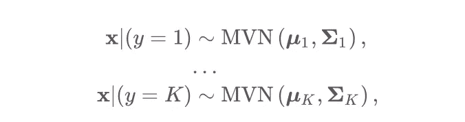**

**虽然我们不会假设 ***x*** 如果 *y = 1* 是分布 MVN 而是分布多元- *t* 否则*。*注意，然而，向量 ***x*** 中的各个变量可能遵循不同的分布。例如，我们可以假设*中的 *i* th 和 *j* th 变量分布如下***

**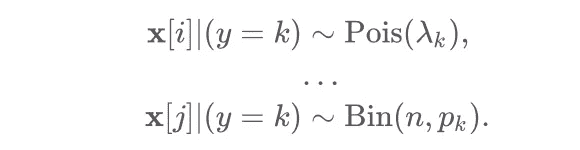**

**然后，机器学习任务是估计这些分布的参数——目标变量 *y* 的 ***𝝅*** 以及索引***x****| y = k*(在上述第一种情况下，****_ k**和**𝚺**) K. 一旦完成，我们就可以为每个类计算 *P(y = k)* 和*P(****x****| y = k)*。 然后通过贝叶斯法则，选择使 *P 最大化的类*k*(y = k |****x****)。***********

# *3.参数估计*

*现在让我们开始估计模型的参数。回想一下，我们计算*P(y = k |****x****)*用*

**

*为了计算这个概率，我们需要首先估计*(这告诉我们 *P(y = k)* )然后再估计分布*p(****x****| y = k)中的参数。这些被称为类别先验和数据似然性。***

**注意:由于我们将讨论跨观测值的数据，所以让 *y_n* 和***x****_ n*分别作为第 *n* 次观测值的目标和预测值。(下面的数学在原[本](https://dafriedman97.github.io/mlbook/content/c4/concept.html)中稍微整齐一点。)**

# **3.1 类别优先级**

**让我们从推导*的估计开始，类别先验。设 *I_nk* 为指示器，如果 *y_n = k* 则等于 1，否则等于 0。我们希望在给定数据的情况下找到一个表达式来表示 ***𝝅*** 的可能性。我们可以将第一次观察具有目标值的概率写为如下:***

**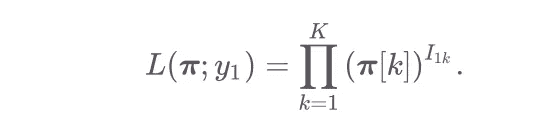**

**这相当于 ***𝝅*** 给定单个目标变量的可能性。要找出所有变量的可能性，我们只需使用乘积:**

**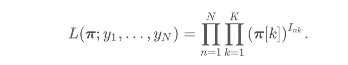**

**这给了我们类先验概率。为了估计 ***𝝅*** 通过的最大似然，我们先取对数。这给了**

**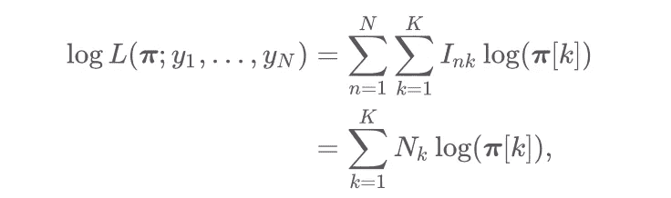**

**其中类别 *k* 中的观测值数量由下式给出**

****

**现在我们准备通过优化对数似然来寻找 ***𝝅*** 的 MLE。为此，我们需要使用拉格朗日函数，因为我们有一个约束条件，即*中的条目之和必须等于 1。这个优化问题的拉格朗日函数如下:***

***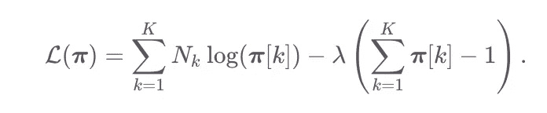***

***拉格朗日最优化。第一个表达式表示对数似然，第二个表示约束。***

***更多关于拉格朗日的内容可以在[原著](https://dafriedman97.github.io/mlbook/content/c4/concept.html#class-priors)中找到。接下来，我们对𝜆和*中的每一项进行拉格朗日导数:****

***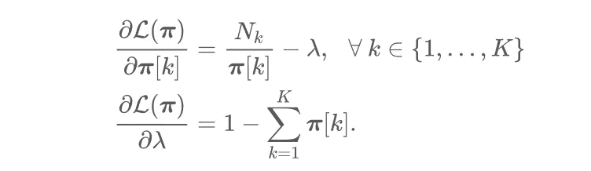***

***这个方程组给出了下面直观的解，即我们对 *P(y = k)* 的估计只是来自 *k.* 类的观察值的样本分数***

**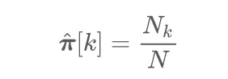**

# **3.2 数据可能性**

**下一步是对给定 *y* 的 ***x*** 的条件分布进行建模，以便我们可以估计这个分布的参数。这当然取决于我们选择用来建模 ***x*** 的分布族。下面详细介绍三种常见的方法。**

****3.2.1 线性判别分析****

**在 LDA 中，我们假设下面的分布为 ***x*****

****

**对于 *k = 1，2，…，k。*注意，每个类都有相同的协方差矩阵，但有唯一的均值向量。**

**让我们推导这种情况下的参数估计。首先，我们来求似然和对数似然。请注意，我们可以将所有观测值的联合似然性写成**

**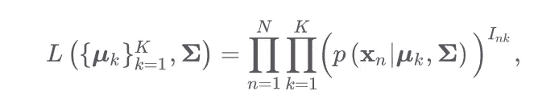**

**因为**

**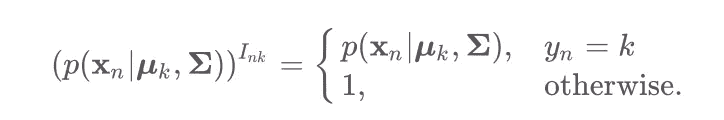**

**然后，我们插入多元正态 PDF(去掉乘法常数)并取对数:**

**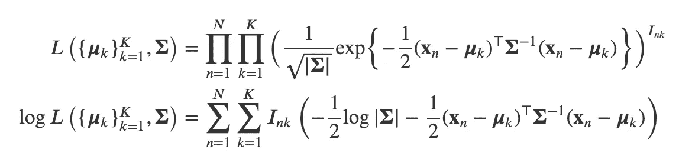**

**最后，我们有我们的数据可能性。现在我们通过最大化这个表达式来估计参数。**

**让我们从𝚺.开始首先，简化对数似然，使相对于 **𝚺** 的梯度更加明显。**

**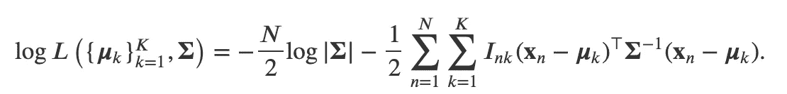**

**然后，我们求导。注意，这里使用了“数学笔记”[中介绍的矩阵导数(2)和(3)](https://dafriedman97.github.io/mlbook/content/c4/concept.html#data-likelihood)。**

**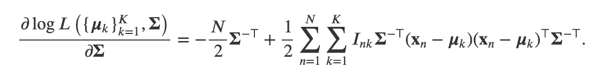**

**然后我们设置这个梯度等于 0，并求解 **𝚺.****

**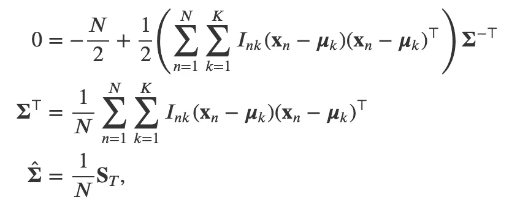**

**在哪里**

**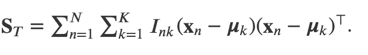**

**半路上！现在来估计**_ k*(第 *k* 类的均值向量)，让我们单独看一下每个类。设 *C_k* 是类 *k.* 中的一组观测值，只看涉及 ***𝝁*** *_k、*的项，我们得到***

**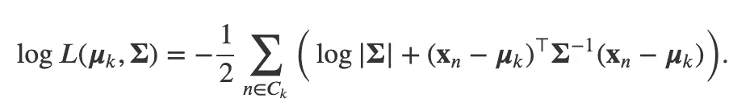**

**使用“数学笔记”[中的等式(4)在这里](https://dafriedman97.github.io/mlbook/content/c4/concept.html#data-likelihood)，我们得到梯度为**

**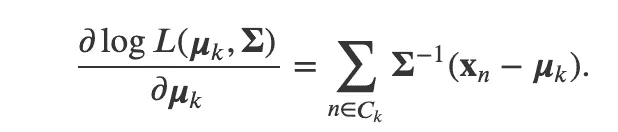**

**最后，我们将这个梯度设置为 0，并找到我们对平均向量的估计:**

**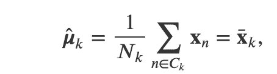**

**其中最后一项给出了类别 *k.* 中 ***x*** 的样本均值**

****3.2.2 二次判别分析(QDA)****

**QDA 看起来非常类似于 LDA，但是假设每个类都有自己的协方差矩阵。即，**

**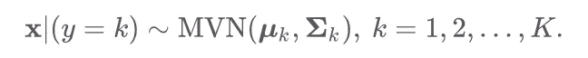**

**对数似然在 LDA 中是相同的，除了我们把 **𝚺** 与 **𝚺** *_k:***

**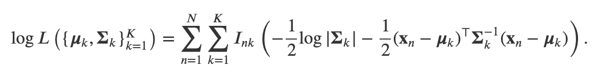**

**同样，让我们单独看看第 *k* 类的参数。类别 *k* 的对数似然由下式给出**

**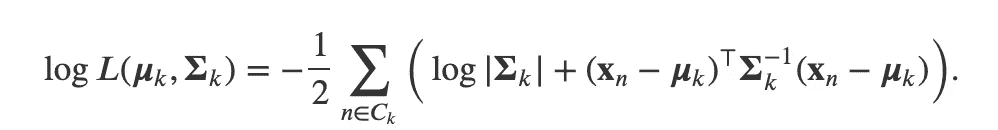**

**我们可以取这个对数似然相对于***【𝝁****_ k*的梯度，并将其设为 0，以求解我们对****【𝝁****_ k*的估计。然而，我们也可以注意到，LDA 方法的这个估计是成立的，因为这个表达式不依赖于协方差项(这是我们唯一改变的)。因此，我们再次得到***

****

**为了估计 **𝚺** *_k，*我们取类 *k.* 的对数似然的梯度**

**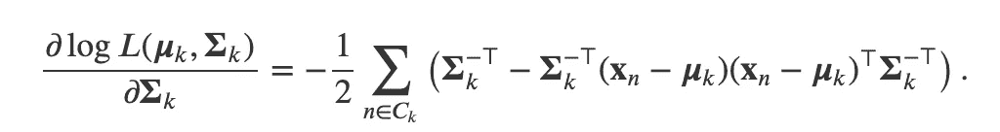**

**然后我们将它设为 0，得到我们的估计值:**

**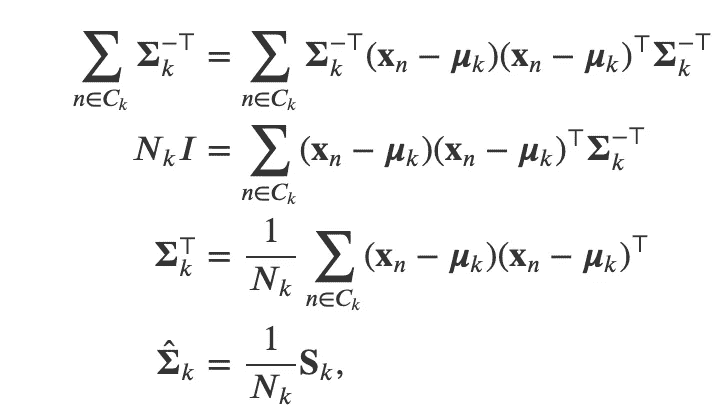**

**在哪里**

**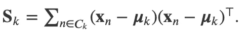**

**3.2.3 朴素贝叶斯**

**朴素贝叶斯假设 ***x*** 内的随机变量是*独立的*取决于观察的类别。即如果 ***x*** 是 D 维的，**

**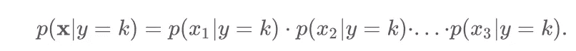**

**这使得计算*p(****x****| y = k)*变得非常容易——为了估计*p(****x****【j】| y)*除了 *j* th 之外，我们可以忽略 ***x*** 中的所有变量。**

**作为一个例子，假设 ***x*** 是二维的，我们使用下面的模型，其中为了简单起见，σ是已知的。**

**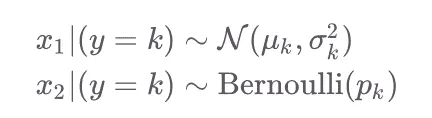**

**和以前一样，我们通过只查看每一类中的项来估计每一类中的参数。设 **θ** *_k = (μ_k，σ_k，p_k)* 包含类别 *k 的相关参数*类别 *k* 的可能性由下式给出:**

**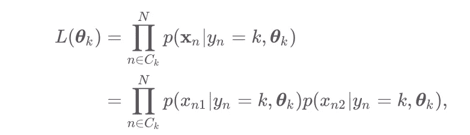**

**其中，由于 ***x*** 中的条目之间的假设独立性，两者相等。代入法向密度和伯努利密度分别为 *x_n1* 和 *x_n2，**，*我们得到**

**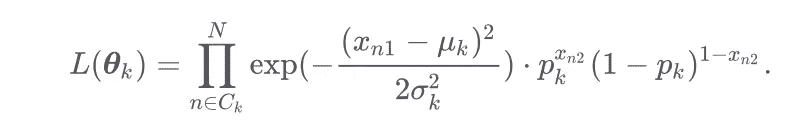**

**那么我们可以采用如下的对数似然**

**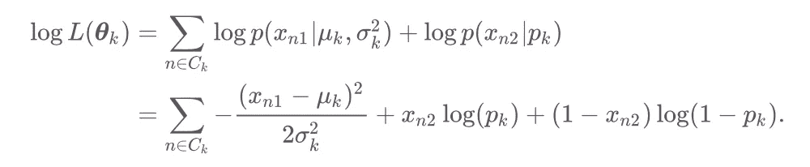**

**最后，我们准备寻找我们的估计。对 *p_k 求导，*我们得到**

**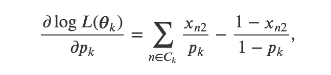**

**这将给我们一个合理的结果**

**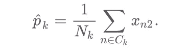**

**请注意，这只是 x_2 的平均值。同样的过程将给出 *μ_k* 和 *σ_k.* 的典型结果**

# **4.进行分类**

**不管我们对*p(****x****| y = k)*的建模选择如何，对新的观察值进行分类都很容易。考虑一个测试观察值***×x****_ 0*。对于 *k = 1，2，…，K* ，我们用贝叶斯法则计算**

**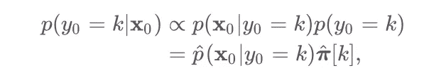**

**其中𝑝̂给出了以 *y_0 为条件的***x****_ 0*的估计密度。然后，我们预测最大化上述表达式的任何值 k。***

# *结论*

*LDA、QDA 和朴素贝叶斯等生成模型是最常用的分类方法。然而，他们的试衣过程的细节(尽管是艰苦的)经常被掩盖。这篇文章的目的是让这些细节清晰。*

*虽然为生成模型估计参数的低级细节可能相当复杂，但高级直觉相当简单。让我们用几个简单的步骤来回顾一下这种直觉。*

1.  *估计观测值来自任何给定类别的先验概率 *k.* 在数学中，估计 *p(y = k)* 的每个值 *k.**
2.  *估计预测值的密度*条件*对观测值的分类。即估计 *k.* 的每个值的*p(****x****| y = k)**
3.  *使用贝叶斯规则获得一个观察值来自任何给定其预测值的类*的概率(达到一个比例常数):*p(y = k |****x****)。***
4.  *选择哪个值 *k* 最大化第三步中的概率(称之为 *k*)* 估计 *y = k*。**

*就是这样！要想从头看到更多像这样的衍生，请查看我的免费在线书籍[！我保证他们大部分数学都比较差。](https://dafriedman97.github.io/mlbook)*