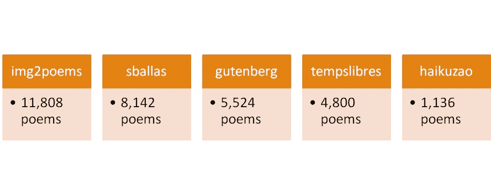

# LSTM 的生成诗

> 原文：<https://towardsdatascience.com/generative-poetry-with-lstm-2ef7b63d35af?source=collection_archive---------49----------------------->

## 在我的 Metis 数据科学训练营的最后一个项目中，我使用 LSTM 模型构建了一个诗歌生成器。

照片由[Á·阿尔瓦罗·塞拉诺](https://unsplash.com/@alvaroserrano?utm_source=unsplash&utm_medium=referral&utm_content=creditCopyText)在 [Unsplash](https://unsplash.com/s/photos/poetry?utm_source=unsplash&utm_medium=referral&utm_content=creditCopyText) 上拍摄

这是我 Metis 数据科学训练营的最后一个项目。我做的前四个项目如下:

*   [MTA 十字转门数据:我对数据科学项目的第一次体验](/mta-turstile-data-my-first-taste-of-a-data-science-project-493b03f1708a)
*   [MyAnimeList 用户评分:网络抓取和线性回归的乐趣](/myanimelist-user-scores-fun-with-web-scraping-and-linear-regression-9dd97900a82b)
*   [是拖网渔船捕鱼吗？模拟全球渔业观察数据集](/is-a-trawler-fishing-modelling-the-global-fishing-watch-dataset-d1ffb3e7624a)
*   [识别假新闻:骗子数据集及其局限性](/identifying-fake-news-the-liar-dataset-713eca8af6ac)

这一次，我的目标是**通过将诗歌语料库输入长短期记忆(LSTM)神经网络**来生成短诗。

## TL；博士:

*   检索到一个**三行诗的语料库**
*   用两种方法训练了一个 **LSTM 模型**:**清洗单词序列**；原始单词序列与斯坦福的**手套嵌入**配对
*   对干净的单词序列的训练产生了**不太有意义的诗歌**；手套嵌入训练产生了**更好的结果**，但是**不一致**
*   下一步将是尝试**附加种子**、**附加特征**、**不同的模型超参数**，以及**更大和/或改进的诗歌语料库**

# 一.背景

对于我的顶点，我想找到一种方法将我在机器学习方面的新兴技能与我现有的对诗歌的兴趣(阅读和写作；顺便说一下，我在 Instagram 上收集的俳句可以在这里找到。

 [## 我的 Instagram 账户中的一个俳句，搭配一张我拍的照片。

www.instagram.com/kunojilym](https://www.instagram.com/p/B16if6WHvZ8/?utm_source=ig_web_copy_link) 

生成性诗歌似乎是一个很好的起点。然而，除了吸引我的兴趣之外，这样的模型还可以有实际应用:

*   它可以作为进一步创作诗歌和创造性写作的动力
*   如果诗歌可以基于主题/图像生成，这可以在各种领域中具有更广泛的应用，例如在广告和营销中。

# 二。数据集

在这个项目中，我使用了杰里米·尼曼为他自己的生成诗帖子收集的三行诗数据集；在他的例子中，他专注于创作俳句(因此限制为 3 行)。

 [## 用深度学习生成俳句

### 使用神经网络生成俳句，同时强化 5–7–5 音节结构。

towardsdatascience.com](/generating-haiku-with-deep-learning-dbf5d18b4246) 

该数据集又是由如下各种其他数据集组合而成的。

总共 31，410 首诗

# 三。模型

我使用 Keras 构建了一个 LSTM 神经网络模型，该模型接受 15 个令牌的序列，并输出下一个令牌(或者更准确地说，下一个令牌的概率)。模型结构如下图所示。

我的 LSTM 模型

使用这个模型，我尝试了如下两种方法，训练了 200 个 epoches:

## a)用干净的单词进行单词标记化

使用这种方法，我首先通过小写字母和删除所有非字母数字字符来清理单词；我保留了停用词，因为它们在诗歌语境中可能有意义。

> 大写字母和标点符号也可以有诗意，虽然可以说没有那么多，所以我决定在这种方法中忽略它们。

然后我将每首诗处理成一系列 15 个记号的序列:

*   一首诗的第一个序列是用 14 个空格填充的第一个单词。
*   每个后续序列会将下一个单词推入序列，丢弃多余的令牌。例如，第二个序列是用 13 个空格填充的前两个单词。
*   特殊记号用于行尾和诗尾。

所有诗歌的结果序列被连接起来。下图说明了这一过程。

令牌是为了说明的目的

## b)利用手套嵌入的单词标记化

这种方法类似于第一种方法，有两个主要区别:

*   每个序列现在都与斯坦福手套的 300 维嵌入配对；正是这个 15 x 300 的向量，而不是 15 个标记的序列，被输入到 LSTM 中。下面举例说明。

令牌是为了说明的目的

*   单词标记未被清除；换句话说，所有的大写和标点符号都被保留。这是因为手套嵌入物能够容纳这种代币

# 四。结果呢

培训结果如下。

基于分类交叉熵损失，使用手套的第二种方法似乎产生更好的结果。但是真正的诗歌呢？

这是从第一个模型中挑选出来的:

从第一种方法中选择最佳结果

即使在“最好”的情况下，第一种方法产生的诗歌似乎也不太有意义。将其与第二种方法中的选择进行比较:

从第二种方法中选择最佳结果

这些结果更加连贯，甚至富有诗意。

然后，我组装了一个 Flask 应用程序，它调用第二个模型，并访问存储在 PostgreSQL 数据库中的嵌入内容来生成诗歌，如下面的视频所示。

“创作温度”与诗歌创作人在选择诗歌的下一个词时的“冒险”程度相关。温度为 0 意味着生成器每次都选择最“可能”的单词，而温度越高，生成器选择不太“可能”的单词的可能性越大。

# 动词 （verb 的缩写）观察

*   使用手套嵌入的第二种方法似乎比使用干净标记的第一种方法更经常地产生听起来自然的诗歌。也就是说，如视频所示，**甚至第二种方法也不是万无一失的**，平均来说，它似乎在超过 50%的时间里都不会产生“像样的”诗歌。
*   GloVe 方法产生了一个大小超过 1 GB 的模型**，相比之下，cleaned tokens 方法的大小仅为 81 MB。由于包含了 300 维的单词嵌入，T4 的特征数量增加了 300 倍，这并不奇怪。可以尝试更少的嵌入(例如 100 维)来观察结果是如何受到影响的。**
*   **两个模型都受到数据集词汇的限制。下一步可能是扩展这个词汇表，以包含斯坦福手套模型所包含的内容。**

# **不及物动词后续步骤**

**除了上述观察结果，该项目在未来还有其他几个可能的方向:**

*   **目前，该模型使用一个起始单词作为种子来生成诗歌的其余部分。我可以使用**附加种子**来提高相关性，例如情感、主题或图片。**
*   **我还可以使用诗歌的附加特征来提高模型输出的质量，例如音节或词性。**
*   **我可以**调整我的 LSTM 模型的超参数**，例如通过使用额外的层或节点，或者通过尝试不同的激活函数。**
*   **最后，我可以**将更多的诗歌**添加到我的数据集中，和/或**从数据集中移除低质量的诗歌**。最后一点是非常主观的，因为不同的人对什么是一首好诗有不同的看法。**

**谢谢你坚持到最后。我的其他项目的链接如下:**

** [## MTA 十字转门数据:我对数据科学项目的第一次体验

### 在 Metis 数据科学训练营的第一个项目中，我研究并分析了 MTA 十字转门 2 个月的数据。

towardsdatascience.com](/mta-turstile-data-my-first-taste-of-a-data-science-project-493b03f1708a)  [## MyAnimeList 用户评分:网络抓取和线性回归的乐趣

### 在我在 Metis 数据科学训练营的第二个项目中，我使用线性回归模型来预测动画在…

towardsdatascience.com](/myanimelist-user-scores-fun-with-web-scraping-and-linear-regression-9dd97900a82b)  [## 拖网渔船在捕鱼吗？模拟全球渔业观察数据集

### 在我在 Metis 数据科学训练营的第三个项目中，我根据以下特征来判断拖网渔船是否在捕鱼…

towardsdatascience.com](/is-a-trawler-fishing-modelling-the-global-fishing-watch-dataset-d1ffb3e7624a)  [## 识别假新闻:骗子数据集及其局限性

### 在我的第四个 Metis 数据科学训练营项目中，我应用分类和 NLP 技术来确定一个片段是否…

towardsdatascience.com](/identifying-fake-news-the-liar-dataset-713eca8af6ac) 

要关注我的数据科学之旅，您可以订阅我的博客或关注我的数据科学系列，链接如下。

 [## 我的数据科学之旅

### 经过几年的涉猎，我的数据科学之旅真正开始于 Metis 数据科学训练营。总共…

medium.com](https://medium.com/series/my-data-science-journey-c99fa6378209) 

下次再见了。**