# 生成性与鉴别性概率图形模型

> 原文：<https://towardsdatascience.com/generative-vs-2528de43a836?source=collection_archive---------9----------------------->

## 朴素贝叶斯和逻辑回归的比较

作者照片

生成模型和判别模型是广泛使用的机器学习模型。例如，逻辑回归、支持向量机和条件随机场是流行的判别模型；朴素贝叶斯、贝叶斯网络和隐马尔可夫模型是常用的生成模型。

概率图形模型(PGM)是一个丰富的框架，用于编码复杂域上的概率分布，如大量相互作用的随机变量的联合分布。

在本文中，我们将以朴素贝叶斯和逻辑回归为例，将生成模型和判别模型的图形结构作为 PGM 进行探索。我们还将讨论这些模型的相似之处和不同之处。

# 模型结构

假设我们正在解决一个分类问题，根据邮件中的单词来决定一封邮件是否是垃圾邮件。我们有一个联名款的标签 **Y=y** ，特点是 **X={x *1* ，x *2* ，…x *n* }** 。模型的联合分布可以表示为 **p(Y，X) = P(y，x *1* ，x *2* …x *n* )** 。我们的目标是估计垃圾邮件的概率: **P(Y=1|X)** 。生成模型和判别模型都可以解决这个问题，但方式不同。

让我们看看它们为什么以及如何不同！

为了得到条件概率 **P(Y|X)** ，生成模型从训练数据中估计先验 **P(Y)** 和似然 **P(X|Y)** ，并使用贝叶斯规则计算后验**P(Y | X)**

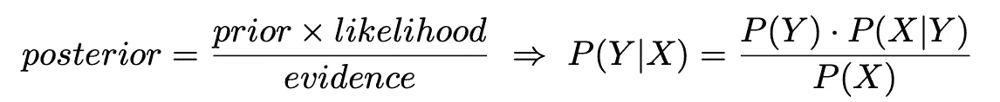

另一方面，判别模型直接假定 **P(Y|X)** 的函数形式，并且直接从训练数据估计 **P(Y|X)** 的参数。

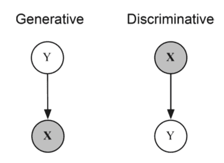

上图显示了生成模型和判别模型的结构差异。圆圈代表变量，线的方向表示我们可以推断的概率。在我们的垃圾邮件分类问题中，给定 X:电子邮件中的单词，Y 是未知的。我们看到判别模型图(右)中的箭头从 X 指向 Y，这表明我们可以直接从给定的 X 推断出 **P(Y|X)** ，然而，生成模型图(左)中的箭头指向相反的方向，这意味着我们需要首先从数据中推断出 **P(Y)** 和 **P(X|Y)** 的值，并使用它们来计算 **P(Y|X)** 。

# 数学推导

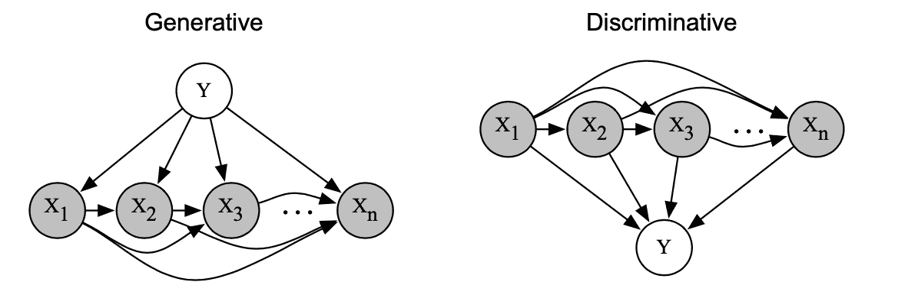

上图显示了扩展特征 X 时这两个模型的潜在概率分布。我们可以看到，每个特征 x *i* 依赖于前面所有的特征:{x *1* ，x *2* …x( *i-1)* }。这不会影响判别模型，因为它们只是将 X 视为给定的事实，并且它们需要估计的只是 P(Y|X ),但是这使得生成模型中的计算变得困难。

1.  **生成模型(朴素贝叶斯)**

后验概率可以写成:

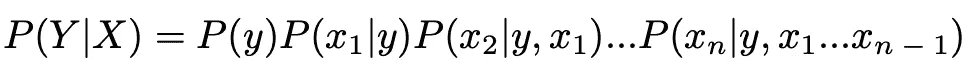

我们看到所有 X 的依赖性使得很难推断 P(X|Y ),因为我们需要将 x *i* 的概率限制在 Y 和{x *1* ，x *2* …x( *i-1)* }上。为了简化问题，我们假设所有的 X 是条件独立的:

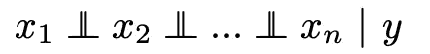

有了这个假设，现在我们可以将后验分布改写为:

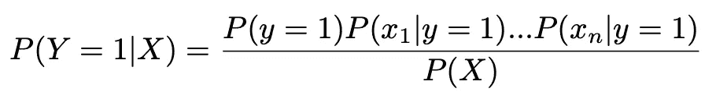

创成式模型的图形结构也发生了变化:

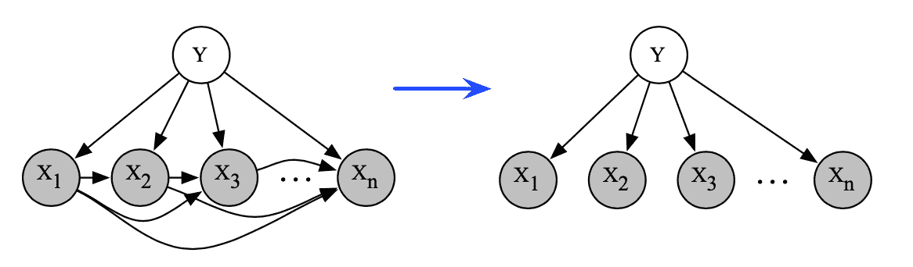

**2。判别模型(逻辑回归)**

如前所述，我们可以利用训练数据直接估计判别模型的后验概率:

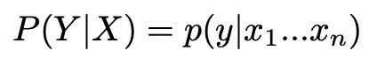

在逻辑回归中，我们将后验概率参数化为:

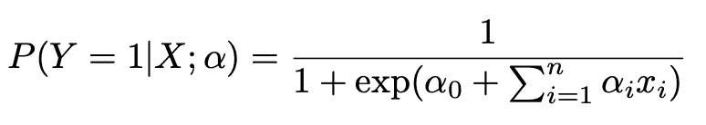

最大似然估计用于估计参数。

# 比较

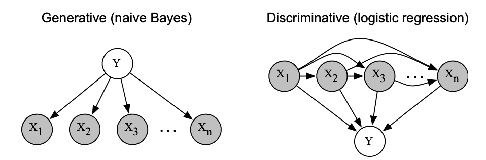

1.准确(性)

当不满足条件独立性的假设时，生成模型不如判别模型精确。比如在我们的垃圾邮件分类问题中，让 **x *1* =邮件数据中“银行”出现的次数**，邮件数据中 **x *2* =邮件中“账户”出现的次数**。不管是否垃圾，这两个词总是一起出现，即 x *1* = x *2。*在朴素贝叶斯中学习得到**p(x*1*| y)= p(x2 | y)**，对证据进行双重计数。逻辑回归没有这个问题，因为它可以设置α1=0 或α2=0。

2.缺失数据

生成模型可以处理缺失数据，而判别模型通常不能。在生成模型中，我们仍然可以通过忽略看不见的变量来估计后验概率:

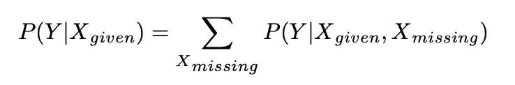

然而，判别模型通常需要观察所有的特征 X。

3.表演

与判别模型相比，生成模型需要较少的数据来训练。这是因为生成模型在做出更强的假设(条件独立性假设)时更有偏见。

4.应用

判别模型之所以“判别”，是因为它有用但只对判别 Y 的标签有用，所以只能解决分类问题。除了分类之外，生成模型还有更多应用，例如抽样、贝叶斯学习、映射推理。

# 结论

生成模型和判别模型都是我们用来解决机器学习问题的非常有用的模型。使用哪种模型取决于用例及数据。一般来说，当我们对数据的基本分布有一个概念并希望找到该分布的隐藏参数时，通常使用生成模型，而当我们只想找到将数据分成不同类的边界时，判别模型更适合。