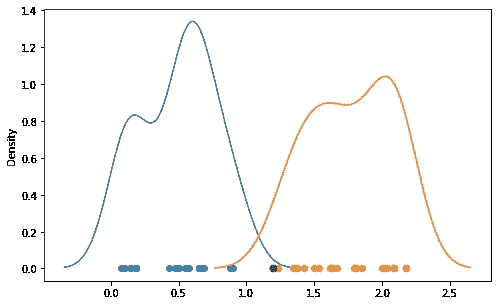
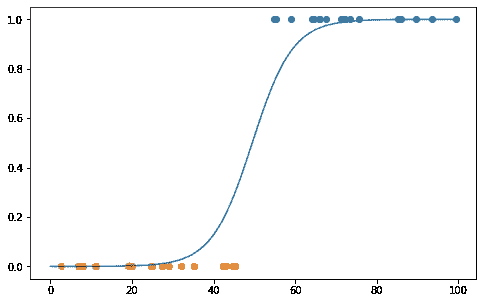
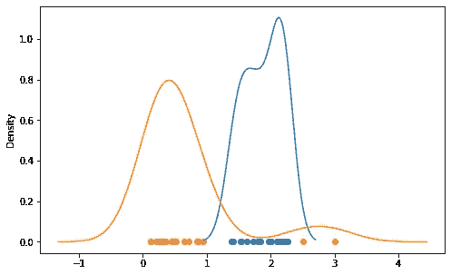

# 机器学习中的生成分类器与鉴别分类器

> 原文：<https://towardsdatascience.com/generative-vs-discriminative-classifiers-in-machine-learning-9ee265be859e?source=collection_archive---------14----------------------->

## 它们的不同之处以及它们如何执行分类任务

莎伦·麦卡琴在 [Unsplash](https://unsplash.com/s/photos/difference?utm_source=unsplash&utm_medium=referral&utm_content=creditCopyText) 上的照片

分类是机器学习中的一项普遍任务。流失预测、垃圾邮件检测、图像分类只是一些常见的例子。

有许多不同的算法可以执行分类任务。这些算法可以分为两大类，生成型和鉴别型。

在这篇文章中，我将试着解释生成性和区别性分类器之间的区别，以及它们是如何分类的。

## 生成分类器

考虑这样一种情况，我们有一个特征 x 和一个目标变量 y，我们试图根据 x 的值来预测 y。

生成分类器学习联合概率分布 P(x，y)。重点是特性和目标变量如何一起出现。目标是能够解释数据是如何生成的。

一旦模型捕获了生成数据的过程，它就可以对新的示例(即数据点)进行预测。因此，生成分类器的关键因素是能够学习底层数据分布。

为了进行预测，生成分类器通过使用贝叶斯规则将联合概率(P(x，y))转换为条件概率(P(y|x))。如果你不熟悉这个符号，P(y|x)表示给定 x 值时 y 的概率。

朴素贝叶斯分类器和隐马尔可夫模型是生成分类器的例子。

假设我们有一些属于蓝色或橙色类的点。这些点绘制在下图中。图中还显示了基于 x 和 y(训练数据)的已知值的联合概率分布。

(图片由作者提供)

基于联合概率分布来决定新数据点的标签。例如，上图中的绿点标记为橙色。

由于创成式模型了解数据分布，因此它们也可用于生成新数据。

## 区别性分类器

鉴别分类器试图找到分隔类别的边界。检查所有可能的边界阈值，并选择误差最小的阈值。

这些边界可以是硬的或软的，这取决于算法。软边界意味着允许一些例子被错误分类。例如，软间隔支持向量机(SVM)，顾名思义，创建一个软边界。

逻辑回归、SVM 和基于树的分类器(例如决策树)是区别分类器的例子。

> 判别模型直接学习条件概率分布 P(y|x)。回想一下，生成模型学习联合概率 P(x，y ),然后通过使用贝叶斯规则将其转换为 P(y|x)。

考虑下面的例子。数据点属于类别 0 或类别 1。逻辑回归模型绘制了一个边界，该边界指示数据点属于类 1 的概率(即 P(y=1 | x))。

(图片由作者提供)

## 极端值

生成模型对异常值更敏感，因为异常值有可能极大地影响分布。

在判别模型的情况下，异常值只是一个错误分类的例子。

考虑以下情况，在橙色类中有 2 个异常值。

(图片由作者提供)

由于这些异常值，橙色分布主导了一系列更有可能属于蓝色类的值。

我们不知道可能存在多少异常值，也不知道这些值有多极端。因此，在存在异常值的情况下，判别方法更适合。

## 结论

生成模型和判别模型都有优点和缺点。否则，我们就不会谈论这两个问题。

例如，生成型模型更需要数据。他们需要足够的数据来准确地表示分布。生成模型在计算上也比判别模型更昂贵。

判别模型对异常值更稳健，而异常值可能对数据分布有很大影响，从而对生成模型的准确性产生负面影响。

生成模型和判别模型在机器学习中都非常有用。最佳选择取决于任务和数据的特征。

感谢您的阅读。如果您有任何反馈，请告诉我。