# 遗传算法:简单直观的指南

> 原文：<https://towardsdatascience.com/genetic-algorithm-a-simple-and-intuitive-guide-51c04cc1f9ed?source=collection_archive---------28----------------------->

## 了解什么是元试探法，以及为什么我们有时使用它们而不是传统的优化算法。通过一个简单的分步指南，学习元启发式遗传算法(GA)及其工作原理。

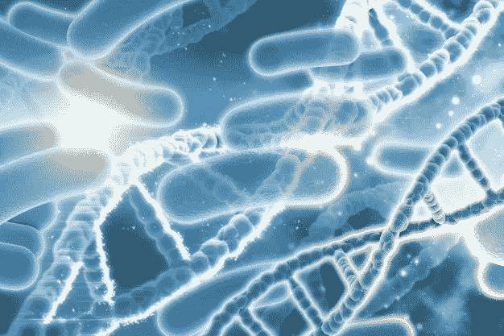

(图片由 Freepik 提供)

无论你是数据科学家、数据分析师还是机器学习工程师，运筹学和优化都应该是你工具箱的一部分。在深入研究遗传算法(GA)之前，我将解释什么是元启发式算法，以及为什么我们有时使用它们而不是传统的优化算法。之后，我将介绍元启发式算法 GA，并解释其工作原理及其背后的直觉。

# 什么是元启发式算法？

**元启发式算法是强大的优化算法，不依赖于问题** —这意味着它们的框架不是专门为某个问题设计的，但你可以用它们来解决几乎任何优化问题(不像启发式算法通常适用于手边的问题)。

许多元启发法是受自然启发的。例如，模拟退火算法的灵感来自加热然后慢慢冷却金属或玻璃的过程。另一个例子是蚁群优化，它模仿蚂蚁在前往食物源并通过信息素相互交流时的行为方式。

# 为什么我们使用元启发式算法而不是传统的优化算法？

传统的优化算法，如*贪婪算法、分支定界算法和 Dantzig 的单纯形算法*等等，都有缺点。以下是我们倾向于使用元启发式算法而不是传统优化算法的几个重要原因:

## #1-速度和问题大小:

**简答:**比传统算法更快，可以处理更大的问题。

为了解释这一点，让我们以*旅行商问题(TSP)* 为例。TSP 是一个广泛使用的优化问题，它表明有一个销售人员必须旅行到 n 个城市，每个城市只经过一次，然后返回他们出发的城市。给出的问题是，他们应该走哪条路线(从哪个城市到哪个城市)来最小化旅行的距离？

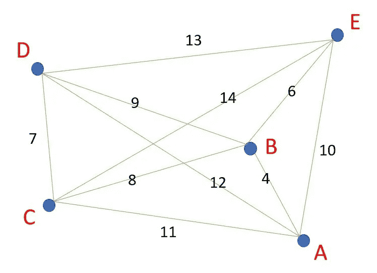

**图 1:** 一个有 6 个城市的 TSP(图片由作者提供)

假设您想要解决某个包含 6 个城市的 TSP，距离在左边的图像中给出(图 1)。可以看出，城市 A 和城市 B 之间的距离是 4 个单位的距离。

在这里，你需要找到推销员应该采取的最佳路线，以尽量减少旅行的距离。在这种情况下，最佳路线是，如果他们从 D 到 C 到 A 到 B 到 E，然后回到 D(因为你回到了出发城市)，这个距离将是 41 个单位(7+11+4+6+13=41)，而如果销售人员采取最差的路线，在这种情况下，它将是 E 到 A 到 D 到 B 到 C，然后回到 E，总距离将是 53 个单位，比最佳的 41 个单位要长。请记住，从 D 到 C 到 A 到 B 到 E，然后回到 D 与从 A 到 B 到 E 到 D 到 C，然后回到 A 是一样的，因为单个路由是一个闭环；你可以从环中的任何一点开始，以同一点结束，移动的距离是相同的。

对于 *n* 个城市，可能的路线组合数量将是 *((n-1)！)/2* 。它是 *(n-1)* ，因为你从哪个城市开始并不重要，只有当城市之间的距离对称时(即城市 A 和城市 B 之间的距离等于城市 B 和城市 A 之间的距离)，它才被除以 2。在不对称的情况下，可能的组合数量是 *(n-1)！*。在我们的 6 个城市的例子中，所有的距离都是对称的，组合的总数是*((6–1)！)/2* 有 60 种可能的组合。

现在想象一个场景，你有 25 个城市，而不是只有 6 个，在这种情况下组合的总数将是*((25–1)！)/2* 总共有 3.102242*10 条可能的路径。客观地说，如果你有一台每秒能分析 10，000，000 个组合的计算机，你的计算机需要 3.102242*10 ⁶秒才能找到所有的组合，也就是 983，041，000 年左右！

**元启发式算法寻找从一个解决方案到一个更好的解决方案的方法，而不考虑那里的每一个组合**；它会选择比现有解决方案更好的解决方案，并根据一些规则对其进行更新(第 2 点和第 3 点应该能更好地解释这一点)。

## #2-局部最小值和全局最小值:

**简而言之:**它可以避免陷入局部最小值并逃离它，因为它使用随机性(或随机数)来接受更差的移动(对于最小化问题，更大的 *f(x)* )，因为它们可能导致更好的答案(即更好的局部最小值或全局最小值)。

当你处理一个最优化问题时，你总是试图最小化一个目标函数，比如总行程，或者最大化一个目标函数，比如利润。

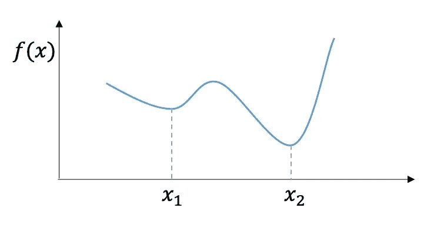

**图 2:**f(x)的搜索空间中的局部极小值(x1)和全局极小值(x2)(图片由[another bookon data science](https://www.anotherbookondatascience.com/chapter6.html)提供)

对于最小化问题，你会经常听到术语*局部最小值*和*全局最小值*(最大化问题的局部最优和全局最优)。让我们看看左边的图 2，其中 *x1* 是局部最小值，而 *x2* 是全局最小值。让我们假设我们有一个函数 *f(x)* ，如果你输入 *x1* ，我们将得到 *f(x)=10* ，如果我们输入 *x2* ，我们将得到 *f(x)=6* ，显然 *x2* 是比 *x1* 更好的输入，因为 6 低于 10，10 比**更好**无论函数 *f(x)* 是什么，它只是问:**要得到可能的最低值 *f(x)* 的 *x* 应该是什么？**

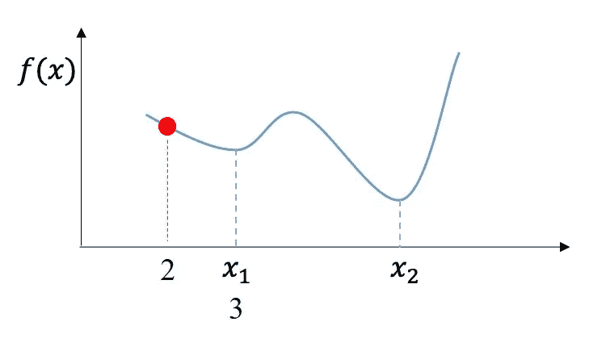

**图 3:** 我们当前的 x 值是 2(图片由作者编辑)

假设你从 *x1* 左边的一个点开始，这里 *x=2* (图 3)，你想用一个贪婪算法来最小化你的 *f(x)* 函数。贪婪算法倾向于只更新 *x* 如果它给你一个更好的答案，在我们的例子中，一个更低的 f(x)。现在我们试一下 *x=2.1* ， *f(x=2.1)* 比 *f(x=2)* 低**所以我们新的 x 会变成 2.1。仍然有改进的空间，所以我们继续这样做，直到我们到达 *x1* 这里 *f(x=3)* 。**

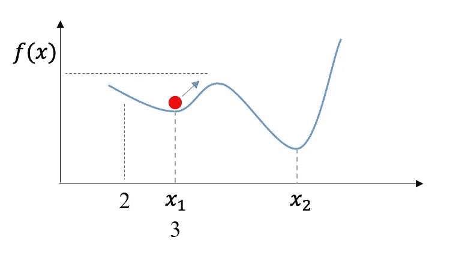

**图 4:**a——我们当前 x 的值是 3。如果我们将 x 增加到 3.1，b- f(x)会变得更差(更大)。c- x2 是比 x1 更好的选择，因为 f(x=x2)比 f(x=x1)小(图片由作者编辑)

然而，如果我们想要将 *x* 增加到 3.1，您可以看到它给出了更高的 *f(x)* ，如图 5 所示。因此，贪婪算法的最佳 *x* 将是当 *x* 等于 3 时(在 *x1* )。

通过查看图像(图 4)，可以清楚地看到 *x2* 甚至是比 *x1* 更好的选择，以降低 *f(x)* 但是在处理实际问题时，搜索空间是未知的，您需要为 *x* 尝试许多许多值，以便能够绘制如图所示的搜索空间。尽管如此，由于 *x* 的值有无限多种可能性，找到能够产生最佳结果的 *x* 的值有时是不可能的。然而，如果我们有 x 的上界和下界，找到全局最小值(最佳解)是可能的。

回到我们为什么使用元试探法，使用贪婪算法，当我们的 *x* 变成值为 3 的 *x1* 时，任何其他更新都会给出更差的 *f(x)* ，因此找到的最佳解决方案将是 *f(x=3)* 并且算法将终止。使用元启发式算法，我们有时会接受更差的移动(在图像的情况下，当 *x=3.1* )。我们接受更糟糕的举措的原因是，它们有可能让我们找到更好的解决方案，比如 *x=x2* 。如果我们继续朝着山顶更新 *x* ，我们将能够向下返回并找到 *x2* 其中 *f(x2) < f(x1)* 。

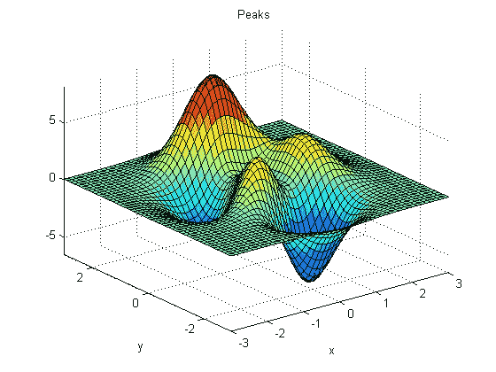

**图 5:** 具有两个输入变量的搜索空间(图片由 mathworks 提供)

**注意:**如果我们要计算一个问题的所有可能的解决方案，我们不会在意陷入局部最小值，因为我们可以从所有组合中选择最佳答案，这将为我们提供全局最小值，然而，正如前面所讨论的，**随着问题变得越来越大，计算所有可能的解决方案所需的时间也越来越长。**

如果你回头看一下图 2-4，你只会看到一个变量( *x* )，我们试图找到它的最佳值，使我们得到最低的 *f(x)* 。但是，**在现实生活的问题中，你会有数量多得多的变量需要优化**(找到每个变量的最佳值)。在图 5 中，我们有 2 个变量需要优化( *x* 和 *y* )，其中 *f(x)* 将在 *z* 轴上。这个案子，还有上一个，只要看看剧情就能轻松解决。然而，当你有两个以上的变量时，就不可能通过查看图表来绘制和求解，因为你不能绘制超过 3 个维度。

## #3-邻域搜索和基于人口的搜索:

**简答:**特别是在处理一个基于群体的搜索方法时，你会在你的搜索空间里一下子有很多解。这意味着您将能够评估许多点或解决方案，而不是只拥有一个解决方案并更新它。

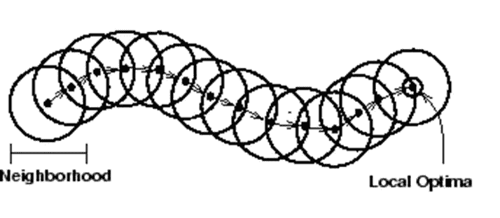

**图 6:** 收敛到局部最优的邻域搜索算法(图片由 CMU 提供)

有了元试探法，**你的算法要么是邻域(或局部)搜索算法，要么是基于种群的算法**。如果你的算法是邻域搜索，这意味着你在整个搜索过程中有一个点或解，你在算法运行时更新这个解。由于它是一个元启发式算法，如果它陷入局部极小值，这个解决方案能够逃脱，这种情况会继续下去，直到算法终止，您收敛到一个最终的解决方案，如图 6 所示。**当你的算法接近搜索结束时，接受更差走法的概率变小了**，这是因为你的算法需要收敛到更好的解。邻域搜索算法的例子是模拟退火和禁忌搜索。

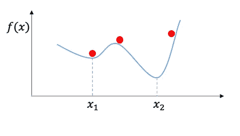

**图 7:** 基于群体的搜索算法中的解决方案(图片由作者编辑)

对于基于群体的搜索算法，您可以在搜索空间中同时拥有多个解决方案，就像它们的“群体”(图 7)，其中随着算法的每次迭代，一定数量的解决方案会更新并成为新的解决方案。每种基于群体的搜索算法在如何选择要更新的解决方案以及如何进行更新方面都有自己的规则。**基于群体的搜索算法往往非常强大，因为你可以探索搜索空间中的各个点，而不是一个点**，最后，当你的算法终止时，你可以从它收敛到的最后一次更新中选择最佳解决方案，或者，跟踪所有更新并从中选择最佳解决方案。基于群体的搜索算法的例子有 **GA(稍后将讨论)**、进化策略、粒子群优化和蚁群优化。

# 在深入 GA 之前先总结一下…

虽然传统算法能够很好地处理小问题，**但是当问题很大时**我们倾向于使用元启发式算法，因此需要更多的时间。**元启发式算法能够避免陷入局部极小值**。虽然在处理一个非常大的问题时，例如无界问题，其中每个决策变量可以取任何实数，您的搜索空间将*无限大*，因此，您可能无法找到全局最小值，即使使用元启发式算法，但您将找到一个足够好的局部最小值。最后，**基于群体的搜索算法具有在搜索空间中搜索各种点的巨大优势，这增加了算法找到更好的局部最小值或全局最小值的机会。**

# 那么，什么是遗传算法呢？

遗传算法是由霍兰德在 20 世纪 70 年代开发的一种基于群体的元启发式算法。遗传算法使用从自然中获得灵感的技术，更具体地说是**进化**，来寻找问题的最优或接近最优的解决方案。它应用进化概念，如**繁殖和适者生存**来解决问题。遗传算法属于进化算法的大类。

> 如果我尝试用几句话来解释遗传算法，我会说遗传算法是一种优化问题的方法，通过创建许多解决方案并以与进化概念相关的某些方式更新这些解决方案，以达到“足够好”的解决方案或可能的最佳解决方案。

在**连续问题**中，您想要找到最优值的决策变量采用实数，GA 中的解决方案如图 8 所示。这被称为**染色体**(有时被称为字符串)。下面的每个方块被称为一个**“基因”**，而每个基因取的值被称为一个**“等位基因”**。

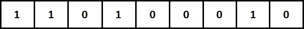

**图 8:**GA 中一条染色体的例子(图片由作者提供)

在现实生活的问题中，大多数决策变量是受约束和有界的，因此它不会取无穷大的值(这不是一个实数)。**例如**，如果你有一个优化问题，想让某个公司的利润最大化(或成本最小化)，它可能会问你我们能设定的最大劳动小时数是多少，通常是给定其他条件。你可能首先倾向于说，我们可以有无限的小时数，但由于这是不可行的，公司往往会设定一个每月的最大限制，例如，它可能会说每周的小时数不应超过 120，因此，**小时数的下限( *x* )将是 0，上限将是 120 ( *0≤x≤120* )。**

既然我们可以将决策变量 *x* 放在界限之间，那么就可以找到计算小时数的实数。

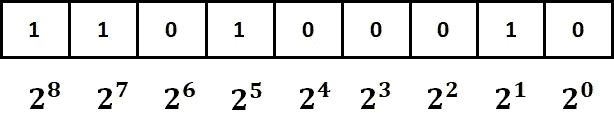

**图 9:** 每个基因及其对应的 2^i(图片由作者提供)

对于图 9 中的染色体，或任何其他编码为 0 和 1 的 GA 染色体(在**连续问题**的情况下)，每个基因将用 *2^i* 表示(2 的 I 次方，其中 *i* 从 0 开始，在最右边，染色体中的基因越多，就增加 1，即 *2⁰，2，2，2，…，2^i* )。

**为了解码这个染色体**(将其转换为实数值)，我们使用公式 1，其中通过将基因中每个值与其对应的 *2^i* 的乘积相加来计算比特* 2^i 的*总和。查看图 9，从右边开始，这将等于*(0*2⁰)+(1*2)+(0 * 2)+(0 * 2)+(0*2⁴)+(1*2⁵)+(0*2⁶)+(1*2⁷)+(1*2⁸)*，这将给出值 418。*

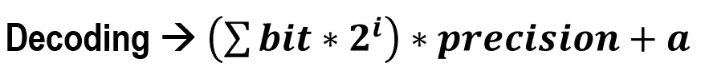

**公式 1:** 解码 g a 染色体

对于公式 1 的第二部分，精度，公式在下面的公式 2 中给出，其中 *l* 是染色体的长度，在我们的情况下是 9，因为我们有 9 个基因， *b* 是上限，我们有 120(在该示例中给出为允许的最大小时数)，而 *a* 是下限，为 0。现在的精度将是*(120–0)/(2⁹-1)*，等于 0.234833，因此解码染色体将是 *418*0.234833+0* ，即 98.16 小时——一个介于 0 和 120 之间的值。

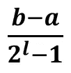

**公式二:** GA 精度

**重要提示:**如果我们将 9 基因染色体中的所有基因替换为 1，我们应该得到允许的最大**值 120，如上限所定义，如果我们将所有基因替换为 0，我们应该得到允许的最小**值 0，如下限所定义。当我们都是 1 时，让我们试着解码染色体。我们乘以 *2^i* 的比特总和将是*(1*2⁰)+(1*2)+(1 * 2)+(1 * 2)+(1*2⁴)+(1*2⁵)+(1*2⁶)+(1*2⁷)+(1*2⁸)*，看，没有零，这将给出我们总共 511。如果我们用精度 0.234833 乘以 511，并加上 *a* (为 0)，我们将得到 120。**注:**你实际上会得到 119.99963，因为精度 0.234833 有更多的位数但我只取了小数点后的前 6 位，然而，如果你包括所有的位数，你应该得到正好 120。****

**染色体表示(编码)称为“*基因型”*，而染色体的解码值称为“*表现型”*。**

**注:**染色体的长度( *l* )由用户设定。字符串越长，解码值就越准确，但这需要在计算时间上有所取舍。

## 如果我们有不止一个决策变量呢？

假设我们有一个最小化问题，我们需要为 *x* 和 *y* 找到最佳值，这将给出最低的 *f(x)* 。你会如何表达？简单，我们会有一条**染色体，其中一半基因代表 *x* ，另一半代表*y*。请记住，对于每一个 *x* 和 *y* ，代表每一个开始的基因都有一个相应的 2⁰.值**

参见图 10，其中绿色基因代表 *x* 而蓝色基因代表 *y* ，**它们都占据相同的字符串，但是在对每个字符串进行解码以获得其相应的值**时，它们应该被分别对待。你用和上面完全一样的方法解码。当你有两个以上的决策变量时，同样的原则也适用。

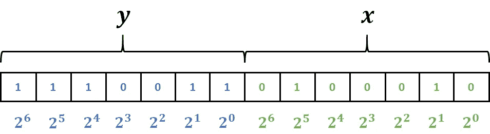

**图 10:** 具有两个决策变量(x 和 y)的染色体(图片由作者提供)

## **在深入了解 GA 之前，您需要了解的术语:**

除了上述术语，如染色体、基因、等位基因、基因型和表型，我在这里解释一些其他的术语，它们的解释可能会相互交织:

**1-种群:**我们说的种群，是指某一代的一组解( *gen* )。请记住，GA 是一种基于群体的搜索算法，这意味着在每一次**(*gen*)中，我们在搜索空间**中都有几个解决方案。所有这些都有可能更新并成为新的解决方案。在 GA 中，群体大小在整个搜索过程中保持不变，因此如果您的群体大小为 100，您将在每个 *gen* 中有 100 个解决方案，每个都是可以解码为某个值的染色体或字符串。

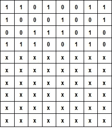

**图 11:** 人口规模为 10，向读者显示前 4 个(图片由作者提供)

图 11 显示了一个群体大小为 10 的例子(群体大小通常比 10 大得多，但是为了便于说明，我使用了 10)，每个群体的染色体大小为 8。所有 10 条染色体都填充了 0 和 1(我只显示了填充的前 4 条，也是为了说明的目的，但它们都将填充 0 和 1)。

**重要提示:**您想要开始算法的初始群体是随机选择的。你最初设置染色体的长度和你想要在群体中有多少条染色体(群体大小)，随机填入 0 和 1，你的第一代就是这种情况。下一代的种群是操纵和更新上一代种群的结果，**，即创建一个 *gen #1* 的随机种群，产生的后代成为 *gen #2* 的种群，然后他们的后代成为 *gen #3* 的种群，以此类推。**

**2 代:**您的算法在终止前将运行*代*代。每一代都有相同的人口规模，但有不同的解决方案(有些可能与上一代相同)。在进入下一代(例如从 *gen #1* 到 *gen #2* )之前，您需要使用交叉和变异算子更新您的当前种群，以在搜索空间中创建新的解决方案(后代)。**当你得到一组等于种群大小的新解后，你就可以进入下一代，重新开始使用新解作为你的种群。**

3-父母和后代:在每一代中，你们当前的人口都是潜在的父母，有一些机会“交配”并产生“后代”，即有机会成为父母。这些后代是一组新的解决方案，将继续成为下一代的群体，然后他们的后代将成为下一代的群体，以此类推。把它想象成我们在现实生活中是如何产生后代的。

# 我们如何更新人口和创造后代？

GA 的灵感来源于进化和适者生存，意思是为了产生后代， **2 条染色体或“父母”会繁殖创造 2 个后代或“孩子”。**

## 父选择:

因为我们在寻找解决问题的好的或最好的解决方案，我们需要尝试让我们的新的和更新的解决方案来自好的解决方案。

将有一个父代选择方法，我们将应用于群体以找到 2 个好的解决方案，这将是 2 个父代，并对所选的父代应用称为交叉的算子以产生子代。那么，我们如何才能确保选择 2 个好的解决方案来做父母呢？

首先，你需要知道**仅仅因为一个解决方案(染色体)与群体中的其他部分相比不好，并不意味着它不会作为父代被选中，这仅仅意味着它被选中的机会更低**。有许多父母选择方法发展，但两个广泛使用的是**锦标赛选择和轮盘赌选择。**

**1-锦标赛选择:**想法很简单，你从群体中随机选择 *k* 个解决方案(有或没有替换)，其中你设置值 *k* ，并挑选最好的一个作为父#1，然后通过挑选另一个 *k* 解决方案并选择最好的一个作为父#2 来重复。简单吧？但是你怎么知道哪个是最好的呢？你通过比较它们对应的目标函数值就知道了至于说哪个染色体是你的 *f(x)* 的最佳选择。

**举例:**我们以**布斯函数** *f(x，y)=(x+2y-7) +(2x+y-5)* 为一个最小化问题，其中 *x* 和 *y* 均以 *-10≤x，y≤10* 为界，其中-10 和 10 为下界( *a* )和上界我们想知道**x*x*和 *y* 的值是多少，这将使我们得到最低的 *f(x)*** 。

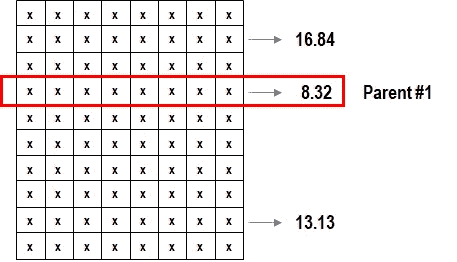

**图 12:** 使用锦标赛选择方法的父母#1 选择(图片由作者提供)

现在我们要选择父母来产生后代，我们设置 *k=3* 。我们**从我们拥有的群体中随机选择 3 条染色体**，然后我们**将每条染色体**解码成实际值 *x* 和 *y* 。从随机选取的第一条染色体开始，例如，如果解码后的 *x* 为 2.1，解码后的 *y* 为 3.6，我们将这些值代入 *f(x)* 得到*f(x)=(2.1+2 * 3.6-7)+(2 * 2.1+3.6–5)*，等于 13.13。然后我们尝试另一条被选中的染色体，通过同样的过程发现，例如，它的 *f(x)* 是 8.32，那么我们选中的最后一条染色体和它的 *f(x)* 是 16.84。由于这是一个最小化问题，我们需要最低的 *f(x)* 作为更好的解决方案，因此，**给我们 8.32 的染色体优于给我们 13.13 和 16.84 的另外两条染色体，所以这将是父代#1** ，这在图 12 中示出。为了找到父母#2，我们重复同样的事情。***【f(x)】对于任何一条染色体都称为适应度，适应值，或目标函数值。***

***因此，使用以下步骤应用锦标赛选择方法:***

*   *随机选择 *k* 个方案*
*   *为每个 *k* 染色体找到 *f(x)**
*   *选择给出最佳 *f(x)* 的染色体，如果有多个解并列最佳，选择任意一个*
*   *设置为父#1*
*   *重复查找父#2*

***2-轮盘赌轮选择:**染色体的适应度(*【f(x)】*)用于关联概率以选择亲本。**对于最大化问题**，f(x) 越高，被选中的概率就越高。如图 13 所示，我们需要从群体中选择 5 个解决方案。**概率基于解决方案与其他解决方案相比有多好，概率越高，被选中的机会就越大**，这就是*适者生存*理论，但仍然会给更差的解决方案一些被选中的机会。*

*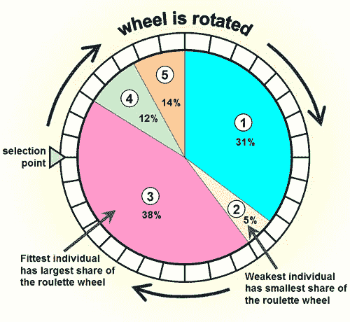*

***图 13:** 轮盘赌轮盘选择方法(图片由 NCL 提供)*

*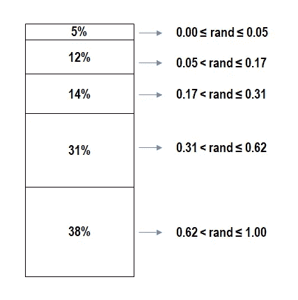*

***图 14:** 概率的累积和(图片由作者提供)*

*为了得到每个解的概率，你把所有的适应值( *f(x)* )加在一起得到总数，然后用每个 *f(x)* 除以总数得到它在总数中所占的百分比。然后，您选择一个介于 0 和 1 之间的随机数，并从概率集中选择解决方案作为父#1。如果 5 个解决方案基于它们的适合度得到概率 5%、12%、14%、31%和 38%，并且你的随机数出来是 0.89，那么它将在 0.62 和 1.00 的范围内，这将使我们选择染色体#3，它有 38%的概率被选中。如果我们的随机数是 0.16，那么我们会选择 4 号染色体，其概率为 12%。正如您在图 14 中看到的，范围是基于概率的累积和。*

*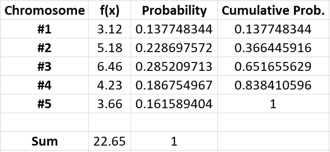*

***表 1:**5 条染色体及其相应概率的示例(作者提供的表格)*

***另一个例子:**如果我们有 5 条染色体，它们的适应值如下:#1: 3.12、#2: 5.18、#3: 6.46、#4: 4.23 和#5: 3.66，对于一个最大化问题，我们**首先将它们相加得到它们的总和**22.65。现在，我们**将每个除以总数**(即 3.12/22.65)得到百分比。我们将分别得到 0.13775、0.2287、0.28521、0.18675 和 0.16159，当你相加时，应该得到 1.00。之后，我们**找到累积概率**，这允许我们创建一个范围，我们的随机数将从中进行选择。在表 1 中，如果我们得到一个介于 0 和 0.137748344 之间的随机数，那么染色体#1 被选为亲本的概率是，为了得到染色体#4，该随机数应该高于 0.651655629 并且低于 0.838410596。*

*好吧，但是如果我们有一个最小化问题会发生什么呢？*

*在**最大化问题**中，染色体的概率与其适应值相关，适应值越高越好，概率也越高。**但是，如果我们有一个最小化问题，适应度越小越好，但我们需要将它与更高的概率相关联，如何实现？**有许多方法可以做到这一点，我选择的一种方法是**取每个适应度值的反相**、 *f(x)* ，这样当你取最低数字的反相并与其他数字的反相比较时，它将是最高的。*

***例如**，如果我们有一个最小化问题，3 条染色体的适应值是 2、4 和 6。我们希望 2(最低的 *f(x)* )得到最高的概率，6 得到最低的概率。所以，我们把它们反过来:2 会变成 1/2 (0.5)，4 会变成 1/4 (0.25)，6 会变成 1/6 (0.16667)。加上 0.5 到 0.25 到 0.16667，现在健身总数是 0.91667。因此，相关概率分别为 0.54545、0.27273 和 0.18182。可以看到 2，最低的 *f(x)* ，概率最高为 0.54545。*

## *交叉:*

*现在我们有了 2 个父代，下一步是执行交叉操作并创建后代或子代。做交叉的方法有很多，这里我将解释两种常用的方法:*

***重要提示:**我将使用字母而不是 0 和 1 来展示它是如何工作的，因为用 0 和 1 来解释可能会引起混淆。*

***#1-单点交叉:***

*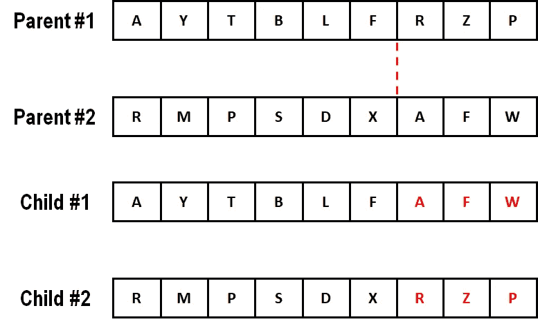*

***图 15:** 单点交叉示例(图片由作者提供)*

*当我们有 2 个双亲时，我们通过随机选择一个截止点来应用单点交叉。您可以通过选择一个随机整数来指定交叉发生的位置。例如，假设我们的随机整数是 6(这取决于您将使用什么编程语言，例如 Python，从 0 开始索引)。所以分界点之后的基因会在双亲之间交换。参见图 15，来自父#1 的[R，Z，P]将与来自父#2 的[A，F，W]互换，这将创建子代:子#1 和子#2。*

***#2-两点交叉:***

*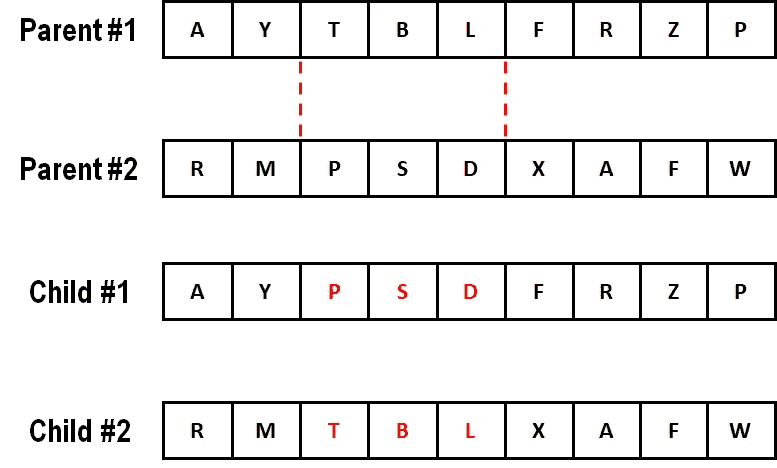*

***图 16:** 两点交叉示例(图片由作者提供)*

*这个想法和单点交叉是一样的，但是我们不是随机选择一个整数，而是选择两个整数并交换它们之间的值。在图 16 中，两点交叉使我们用[P，S，D]交换[T，B，L]来创建后代。您可以通过 if 或 while 语句使这两个随机整数彼此不同，也可以允许这两个整数偶然相同，但如果发生这种情况，它将成为单点交叉。这是基于用户的偏好。*

***注意:**交叉算子可以基于概率来完成，因此您不会每次都执行交叉，但是，大多数研究倾向于应用概率 1 (100%),交叉确保算子将在每次选择父代后发生。*

## *突变:*

*为了在搜索空间中产生多样性，以一定的概率(通常很低，例如 0.1 或 0.01)引入变异算子。在通过杂交两个父代来创建子代之后，对子代应用变异。*

*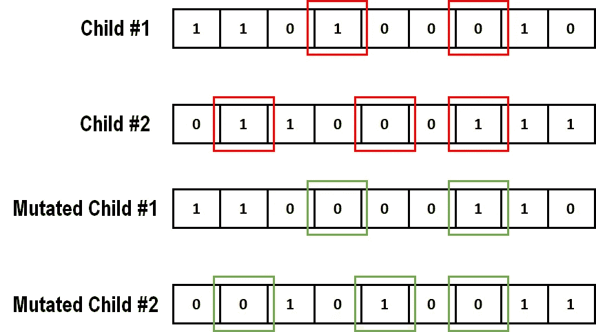*

***图 17:** 突变实例(图片由作者提供)*

*这样做的方法很简单:你从第一个孩子开始，一个一个地检查每个基因。你从第一个基因开始，得到一个随机数，如果这个随机数小于突变的概率，你就突变，否则，移动到下一个基因，应用另一个随机数，以此类推。但是当我们变异时会发生什么呢？很简单，如果你想突变的基因的值是 0，它就会变成 1，如果基因的值是 1，它就会变成 0。请看图 17，红框表示哪些基因将被突变，绿框显示突变的结果。由于突变的概率很低，所以不会有很多(甚至零)基因会发生突变。*

# *把所有的放在一起*

*下面的流程图，图 18，是我个人在使用锦标赛选择作为父选择方法时为 GA 开发的**流程图。我发现网上几乎所有的流程图对初学者来说都有点难以理解。流程图中的符号如下: ***M*** 为世代数， ***N*** 为种群大小， ***p_c*** 为交叉概率， ***p_m*** 为变异概率， ***k*** 为锦标赛选择时随机选择的染色体数。***

*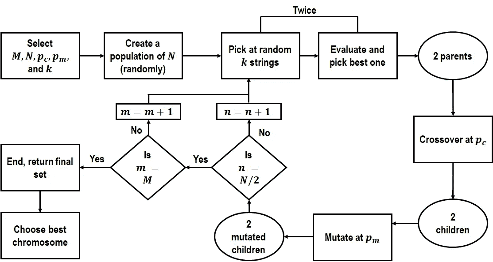*

***图 18:** 带有锦标赛选择的 GA 流程图(图片由作者提供)*

*首先，我们选择世代数( *M* )、群体大小( *N* )、交叉概率( *p_c* )、突变概率( *p_m* )、锦标赛选择要选择的染色体数( *k* )。假设我们设置 *M=100* ， *N=120* ， *p_c=1.00* ， *p_m=0.10* ， *k=3* 。我们要解决的问题是一个连续最小化问题。*

1.  *我们**随机**创建一个 120 条染色体的群体(每条染色体由 0 和 1 随机创建，长度由您选择( *l* )。此时此刻，**我们在 *gen #1* 。***
2.  *使用锦标赛选择选择 2 个父母的时间到了。我们从群体中随机选择 3 个解决方案，并找到具有最佳适应值(最低 *f(x)* ，因为我们正在处理最小化问题)的解决方案，这将是 *parent #1* 。然后，我们再次选择 3 个随机解决方案，并找到最佳方案，即 *parent #2* 。*
3.  *在 *p_c* 处，我们**将两个父母**杂交得到两个孩子。*
4.  *在*下午*，我们**对 2 个孩子**进行变异，得到 2 个变异的孩子。*
5.  *我们将这两个变异的孩子存储在一个数组中。*
6.  ***做*步骤 2 到 5 N/2 次(60 次)*——**60 因为 120/2 是 60。我们需要**为每一代后代重建一个 120** 的种群，以保持种群规模一致。因为每次我们产生 2 个孩子或者 2 个突变的孩子，我们需要执行*步骤 2 到 5* **60 次**才能得到下一代的 120 个种群( *120*2* )。**将所有产生的变异子代存储在一个数组中**。在这一点上，我们应该有 120 个种群，它们是 *gen #1* 的突变后代。*
7.  ***我们转移到下一代， *gen #2* ，重复*步骤 2 到 6*** 。产生的后代现在将成为第三代的种群。*
8.  *继续这样做，直到你完成所有的 100 代。*
9.  ***你有两个选择:** ***1)*** 要么从 *gen #100* (收敛解:你的算法在终止前收敛到右边的解)中选择最佳解(变异的子染色体)，要么， ***2)*** 从每一代的变异子染色体中，在你进入下一代之前，将最佳的变异子染色体存储在一个单独的数组中。你对所有代都这样做，这样在你的算法结束时，你将有一个数组，它对每代都有最好的解，每代都有你的算法所见过的最好的 100 个解。然后从这 100 条染色体中选出最好的作为你的最终解决方案——**我，我自己，选择选项#2，因为这样，你可以确保你有算法遇到的最好的答案**因为在数组中，如果你最终选择了算法收敛到的答案，解决方案#100 就是相同的解决方案，因为当你选择算法收敛到的答案(选项#1)时，你选择的是唯一的最好的 *gen #100* ，它与数组#100 相同这样，你就能确保从所有 100 代人中选出最好的，而不仅仅是最后一代。因为*很有可能*你可能在更早的一代(例如 *gen #42* )达到可能的最佳解决方案，但随后 GA 算法将开始进入搜索空间中比你在 *gen #42* 时更差的其他地方，并最终收敛到一个糟糕的解决方案。*
10.  *现在你有了最好的染色体，解码它得到真实的值，这样你就解决了问题！*

*恭喜你！您现在知道 GA 是什么以及它是如何工作的了！*

# *摘要*

*遗传算法是一种强大的基于种群的搜索元启发式算法。它的灵感来自于进化论及其概念，如繁殖和适者生存。*

*在这个解释中，**我介绍了遗传算法如何应用于连续优化问题**，其中染色体用 0 和 1 表示(编码)。我们学习了**如何将一条染色体解码成实际值**和**如何选择父母**，**进行交叉**产生孩子，以及**如何对他们进行变异**。**关于如何执行遗传算法的流程图和逐步指南也已经过详细说明。***

***最后注意:**交叉和变异的相同原理可以应用于组合问题，例如 TSP，其中您想要优化的不是采用*实数*的决策变量，而是*离散元素*，例如旅行者或车辆路线。虽然交叉和变异背后的思想对于组合问题来说是相同的，但是我们应用它们的方式略有不同，因为您不希望以像[A，D，B，D]这样的旅行者路径结束，其中城市 D 被提到两次，而城市 C 不包括在路径中，如果您在离散问题上使用连续的交叉或变异方法，这可能会发生。*

****2020 Dana Bani-Hani —未经许可和适当引用，不得使用由 Dana Bani-Hani 开发的文章、代码和图像。****

# *参考*

*荷兰，约翰·亨利。自然和人工系统中的适应:生物学、控制和人工智能应用的介绍性分析。麻省理工学院出版社，1992 年。*

***Intro Image:**[https://www . free pik . com/free-photo/DNA-bacterias _ 923816 . htm # page = 3&query = DNA+genetics&position = 21](https://www.freepik.com/free-photo/dna-bacterias_923816.htm#page=3&query=dna+genetics&position=21)*

***图二**:[https://www.anotherbookondatascience.com/chapter6.html](https://www.anotherbookondatascience.com/chapter6.html)*

***图 5:**[https://www . mathworks . com/matlabcentral/MLC-downloads/downloads/submissions/27178/versions/6/previews/html/gapeaksexample . html](https://www.mathworks.com/matlabcentral/mlc-downloads/downloads/submissions/27178/versions/6/previews/html/gaPeaksExample.html)*

***图 6:**[https://www . cs . CMU . edu/AFS/cs/project/Jair/pub/volume 15/ambite 01 a-html/node 9 . html](https://www.cs.cmu.edu/afs/cs/project/jair/pub/volume15/ambite01a-html/node9.html)*

*【http://www.edc.ncl.ac.uk/highlight/rhjanuary2007g02.php】图 13:*