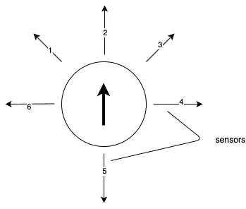
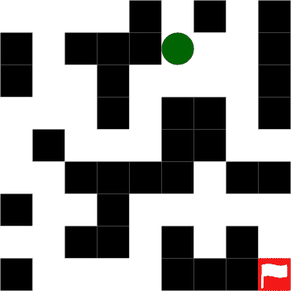
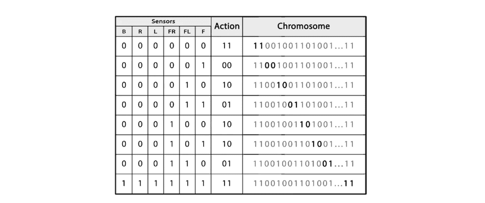
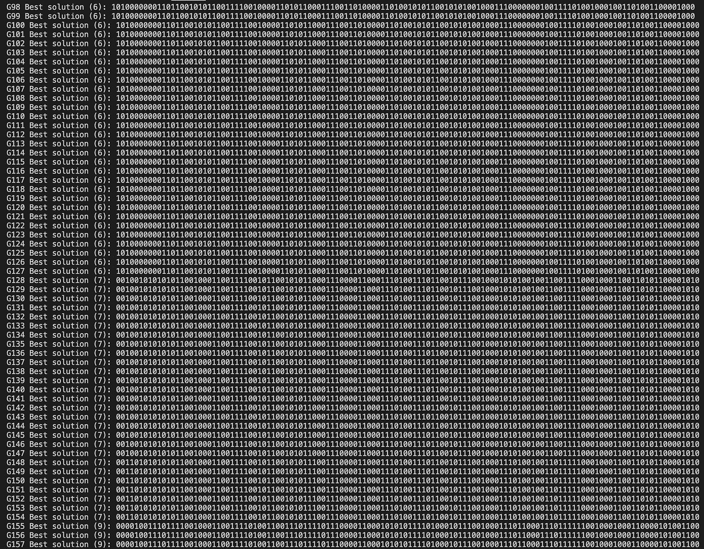

# 基于遗传算法的机器人控制器方法

> 原文：<https://towardsdatascience.com/genetic-algorithm-based-approach-for-robotic-controllers-3966a9b874fb?source=collection_archive---------32----------------------->

## **用 Python 实现**


由[埃里克·克鲁尔](https://unsplash.com/@ekrull?utm_source=medium&utm_medium=referral)在 [Unsplash](https://unsplash.com?utm_source=medium&utm_medium=referral) 上拍摄的照片

今天，我们要解决的一个现实问题是设计一个机器人控制器。有许多技术可以用来解决这个问题。其中包括遗传算法、粒子群优化算法和神经网络。

我们需要做的是将一种算法应用于机器人，作为设计机器人控制器的方法，使机器人能够执行复杂的任务和行为。

> 自主机器人是指在没有人类帮助的情况下，能够独立完成一定工作的机器人。

机器人的能力之一是从一点移动到另一点，这称为自主导航。想象一下，我们建造了一个可以在仓库里移动货物的机器人。在本文中，我们将使用 Python 语言实现这一功能。机器人如何看到它的局部环境？是的，我们将安装传感器，这使机器人可以环顾四周，我们给了它轮子，所以它可以根据传感器的输入进行导航。最大的问题是我们如何将传感器数据与电机动作联系起来，以便机器人能够在仓库中导航。

一般来说，我们经常使用神经网络，通过在学习过程中使用强化学习算法，成功地将机器人传感器映射到输出。但是我们今天将使用另一种方法，那就是使用遗传算法。通常，遗传算法将通过使用适应度函数来评估大量个体，以找到下一代的最佳个体，该适应度函数基于某些预定义的规则来计算个体的表现。

然而，我们将面临一个新的挑战，对每个机器人控制器进行物理评估对于一个大群体来说是不可行的，因为对每个机器人控制器进行物理测试是困难的，而且这样做需要时间。为此，我们将使用我们的遗传算法知识来设计和实现机器人控制器，并将其应用于虚拟环境中的虚拟机器人。

# 目标

我们的机器人可以采取四种行动:向前一步，左转，右转，什么也不做。

下图中机器人也有六个传感器。



有 6 个传感器的机器人

*   前面三个
*   一个在左边
*   一个在右边
*   一个在后面

迷宫由机器人无法跨越的墙壁组成，并将有一条勾勒出的路线。我们将设计一个机器人控制器，它可以使用机器人传感器来成功地引导机器人通过迷宫。



# 解决方案

## 遗传算法伪代码

基本遗传算法的伪代码如下

```
generation = 0;
population[generation] = initializePopulation(populationSize); 
evaluatePopulation(population[generation]);
While isTerminationConditionMet() == false do 
    parents = selectParents(population[generation]); 
    population[generation+1] = crossover(parents); 
    population[generation+1] = mutate(population[generation+1]);
    evaluatePopulation(population[generation]);
    generation++;
End loop;
```

这个伪代码演示了一个遗传算法的基本过程。接下来，我们将用 Python 实现它们。

## 将传感器值映射到动作

如前所述，机器人有四个动作，可以用二进制表示如下:

*   “00”——什么都不做；
*   “01”——前进；
*   “10”——左转；
*   还有“11”——右转。

我们还有六种不同的传感器。为了简化表示，我们将测量限制为二进制编码，也就是说，小于阈值的值表示检测到障碍物，大于阈值的值表示畅通无阻。6 个传感器为我们提供了 2⁶ = 64 种可能的传感器输入组合。由于一个动作需要 2 位，我们的控制器需要 64*2 = 128 位的存储来表示任何可能的输入。假设我们需要 128 位来表示不同组合指令。但是，我们应该如何组织染色体，以便对其进行编码和解码呢？

我们有一个人类可读的输入和输出列表，如下所示:

*   传感器#1(前):开
*   传感器#2(左前):关闭
*   传感器#3(右前):开
*   传感器#4(左侧):关闭
*   传感器#5(右):关闭
*   传感器#6(背面):关闭

我们还有一个二进制值为 10 的“左转”指令。下一步是获取六个传感器值并进一步编码。

```
000101 => 10
```

如果我们现在将传感器值的位串转换为十进制，我们会得到以下结果:

```
5 => 10
```

因此，我们可以使用传感器的十进制值作为染色体中的位置，表示传感器输入的组合，如下所示。

```
xx xx xx xx xx 10 xx xx xx xx (… 54 more pairs…)
```

从下图中可以看出，传感器值的组合产生了一个二进制输出，描述了典型的染色体如何将机器人的传感器值映射到动作。



这种编码方案初看起来可能很迟钝，染色体也不可读，但它有几个有用的特性。

*   首先，染色体可以作为一组位来操作，这使得交叉、变异和其他操作更加容易。
*   其次，每个 128 位的值都是有效的解。

# 履行

首先，我们需要在(`world.py`文件)中创建并初始化一个迷宫来运行机器人。我们创建的迷宫对象使用整数来表示不同的地形类型:

*   1 定义了一面墙；
*   2 是起始位置；
*   3 描绘通过迷宫的最佳路线；
*   4 是目标位置；
*   0 是一个空位置，机器人可以走过，但不在通往目标的路线上。

我们编写了一个构造函数来从一个 double int 数组创建一个新的迷宫，并实现公共方法来获得起始位置，在迷宫中找到一条路线。

## 个人

一个个体由一条由多个基因组成的染色体代表。

## 机器人

接下来，我们需要创建一个能够遵循指令并通过执行这些指令来生成路线的机器人。

## 人口

群体是指一组染色体。

## 遗传算法

我们实现了计算适应度、选择个体、交叉和变异的方法。

## 机器人控制器

最后，我们可以编写一个实际执行算法的类。如下创建另一个名为`main.py`的新文件。

输出。



很简单，对吧？

# 参考

[1] [遗传算法简介](/an-introduction-to-genetic-algorithms-c07a81032547)

[2][https://github . com/house cricket/基于遗传算法的机器人控制器方法](https://github.com/housecricket/Genetic-Algorithm-Based-Approach-for-Robotic-Controllers)