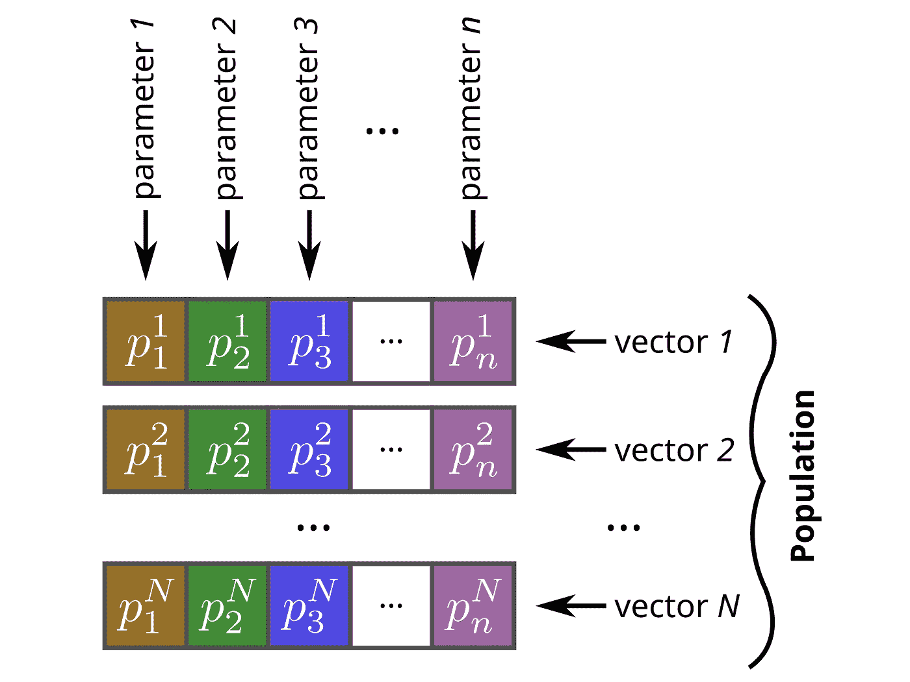
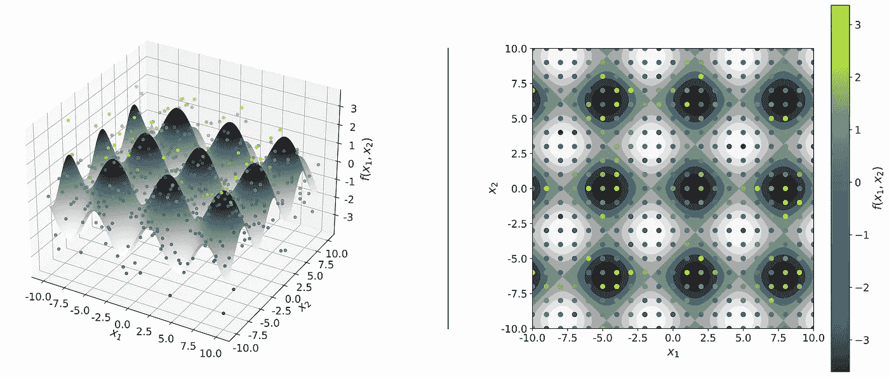
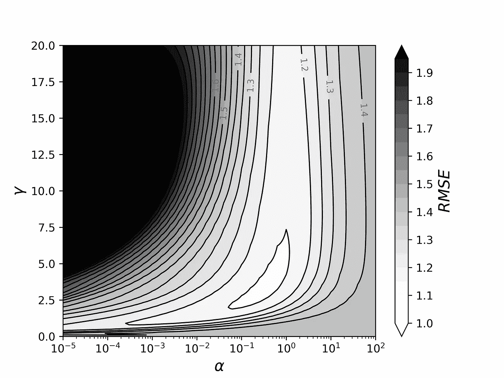
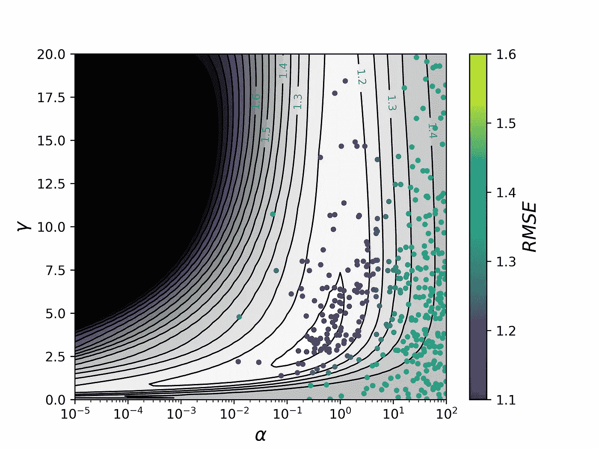

# 优化机器学习超参数的遗传算法

> 原文：<https://towardsdatascience.com/genetic-algorithm-to-optimize-machine-learning-hyperparameters-72bd6e2596fc?source=collection_archive---------11----------------------->


来自[的照片](https://freeimages.com/)

超参数调整对于机器学习模型的正确运行至关重要。您可以查看[Timo bhm](/how-to-optimize-hyperparameters-of-machine-learning-models-98baec703593)的文章，了解超参数调整的概述。

遗传算法为超参数调整提供了一种强大的技术，但它们经常被忽视。

在这篇文章中，我将展示遗传算法的概述。我还将提供一个详细的分步指南，介绍如何利用可用的库，使用遗传算法来优化机器学习模型的超参数。

> 遗传算法利用自然选择进化的基本概念来优化任意函数。

# 文章概述

这篇短文将介绍**差分进化**，并教授如何利用它来优化**核岭回归**中使用的超参数。

我提供了一些代码片段来展示如何在 Python 中使用差分进化算法。完整的代码和图表也在 GitHub 库[中提供，因此任何人都可以深入了解细节。](https://github.com/marcosdelcueto/Tutorial_Differential_Evolution)

# 差分进化算法概述

遗传算法，如差异进化，利用了自然选择进化的基本概念。在我们的例子中，我们有一个由包含具有不同值的**参数**的**向量**构成的**群体**。

参数相当于生物系统中的基因。它们的精确值在不同的向量之间是不同的。参数的不同组合导致向量显示不同的适应值。

随机参数突变被引入到群体中，并且具有较大适应度的向量比其他向量长寿。



作者图片

使用迭代过程，差分进化可以按照以下步骤**最小化函数**:

**1 —初始化:**用边界内随机参数值的 *NP* 个向量创建初始种群。

**2 —初始评估:**计算 *NP* 向量的函数值。

**3 —对于群体中的每个载体:**

**3.1 —突变:**我们构建了一个突变向量，其中每个参数的值被计算为从群体中随机选择的其他向量的参数的突变。计算该突变载体的常用策略是 *best1bin* ，其中突变载体的每个参数 *pᵢ* 如下式所示计算。突变参数是*最佳*载体(具有最低值的载体)的 *pᵢ* 参数加上*突变率* *(F)* 乘以随机选择的两个载体*【r₁】*和 *r₂* 的*差的变化。*

**

***3.2 —重组:**通过选择其每个参数作为当前载体的值或突变载体的值来创建试验载体。对于每个参数，我们在(0，1)区间内生成一个随机均匀数 *R* 。如果 *R* 低于 a *重组率*，那么我们接受突变参数；否则，我们使用当前参数的参数。*

***3.3 —替换:**评估试验矢量的功能。如果它比当前向量更稳定，就用试验向量代替当前向量。*

***4 —重复步骤 3，直到群体收敛:**当群体中函数的标准偏差小于函数平均值的特定百分比时，迭代停止。如果在最大迭代次数后没有达到收敛，循环也会停止。*

*所有这些过程都已经在主流编程语言的几个库中实现了。在这里，我们将使用 Python 中的 [Scipy 的实现](https://docs.scipy.org/doc/scipy/reference/generated/scipy.optimize.differential_evolution.html)，它让我们只需使用几行代码就可以做任何我们想做的事情。*

# *生成数据*

*例如，我们将使用遵循二维函数*【f(x₁,x₂)=sin(x₁)+cos(x₂】*的数据，加上区间(-2，2)中的一个小的随机变化来增加趣味。因此，我们的数据将遵循以下表达式:*

**

*在下图中，我们以灰度显示 *sin(x₁)+cos(x₂)* 的值作为参考。然后，我们用彩色点来表示我们的 441 个点(21 *x* 21 网格)，在区间 *x₁* :(-10，10)和 *x₂* :(-10，10)中用上面的表达式计算。*

**

*作者图片*

*我们在下面提供了一个代码片段，其中包含用于生成数据的函数:*

# *机器学习模型*

*我们的目标是使用之前生成的数据来训练一个 ML 模型，该模型将能够预测函数 *f(x₁,x₂)* 在不同配置下的值。*

*在本文中，我将使用**核岭回归** (KRR)。我们将对 KRR 使用径向基函数核，它取决于高斯核方差 **γ** 。对于 KRR，我们还需要优化正则化超参数 **α** 。如果你想知道更多关于 KRR 及其实现的细节，请随意查看我最近关于这个主题的教程。*

*在这里，我们使用 10 重交叉验证，其中我们的数据分为用于优化模型的训练集和用于测量模型准确性的测试集。作为准确性度量，我们将使用均方根误差( **RMSE** )，它代表测试集中的 *f(x₁,x₂)* 值与我们的模型预测的值之间的平均误差。*

# *上一步:探索超参数空间*

*作为可选的第一步，我们可以执行网格搜索，查看 RMSE 如何随两个超参数α和γ的值而变化。*

*我们在下面展示了这个网格的外观，以及用于执行超参数网格搜索的代码。下图让我们初步了解了什么样的超参数值会产生较小的 RMSE。*

**

*作者图片*

# *超参数调谐*

*最后，我们可以使用 Scipy 提供的差分进化算法，通过最小化我们模型的 RMSE 来优化超参数。*

*Scipy 的*差分进化*函数需要输入:*

*   ****KRR _ 功能*** *。*这是其输出(RMSE)将被最小化的功能。它需要输入:I)具有超参数的元组以优化(α和γ)和 ii) *X，y* 包含我们的数据的变量。*
*   ***定义超参数可能值的边界**。*
*   ***由*KRR _ 函数*使用的额外变量**。在我们的例子中，这将作为一个包含 *X* 和 *y.* 的元组给出*
*   *差分进化算法的其他相关选项有:*

1.  ***策略**。在我们的例子中，默认的*策略='best1bin'* 已经足够好了。采用这种策略，突变载体的每个参数值作为该参数的最佳载体值的变化而获得，与另外两个随机载体的差异成比例。*
2.  ***人口规模**。这就选择了我们要考虑的矢量数量。一个较大的数字将会减慢进度，但会使它更有可能发现全局最小值。这里，我们使用默认值 *popsize=15。**
3.  ***突变常数**。该值控制参数在突变阶段的变化程度。较大的值意味着较大的搜索半径，但会减慢收敛速度。我们使用*突变的默认值=0.5。**
4.  ***复合常数**。该常数控制重组阶段试验载体的参数改变的可能性。更大的值意味着突变更容易被接受，这可能会加速收敛，但有导致群体不稳定的风险。我们使用默认值*重组=0.7。**
5.  ***公差**。该值控制算法何时被视为收敛。我们将使用 *tol=0.01* ，这意味着当群体中所有向量的 RMSE 的标准差小于平均 RMSE 的 1%时，该算法被认为是收敛的。*

*此代码返回导致最小化 RMSE 的收敛超参数值:*

```
*Converged hyperparameters: alpha= 0.347294, gamma= 3.342522
Minimum rmse: 1.140462*
```

*我们可以取消函数*KRR _ 函数*的最后一行的注释，以打印所有中间值:*

```
*alpha: 63.925979 . gamma: 19.290688 . rmse: 1.411122
alpha: 59.527726 . gamma:  2.228886 . rmse: 1.421191
alpha: 24.470318 . gamma:  3.838062 . rmse: 1.379171
alpha: 61.944876 . gamma: 15.703799 . rmse: 1.407040
alpha: 68.141245 . gamma:  0.847900 . rmse: 1.431469
                        [...]
alpha:  0.347408 . gamma:  3.342461 . rmse: 1.140462
alpha:  0.347294 . gamma:  3.342522 . rmse: 1.140462
alpha:  0.347294 . gamma:  3.342522 . rmse: 1.140462
alpha:  0.347294 . gamma:  3.342522 . rmse: 1.140462*
```

*我们可以采用差分进化算法探索这些配置，并在之前的超参数网格搜索的基础上绘制它们:*

**

*作者图片*

*除了研究的所有中间值，我们还用红色标出了收敛值。这样，我们可以观察算法如何在设定的边界内探索不同的配置，并最终收敛到最小化 RMSE 的(α，γ)组合。*

# *结论*

*我们已经介绍了如何生成一个简单的二维数据集，以及如何用核岭回归来拟合它。我们已经介绍了差分进化的基础知识，以及如何使用这种算法来优化机器学习模型的超参数。*

*请记住这里展示的数据集、代码、图像等。在这个 [GitHub 库](https://github.com/marcosdelcueto/Tutorial_Differential_Evolution)中提供。*

*如果你对遗传算法优化机器学习超参数的更复杂的应用感到好奇，请随时查看我们最近在利物浦大学与东北师范大学合作的工作。在这项工作中，我们使用差分进化算法来优化几个机器学习模型，以预测有机太阳能电池的效率。*

*这篇文章对你有帮助吗？让我知道你是否能够成功地使用差分进化算法来优化你的机器学习模型的超参数！*