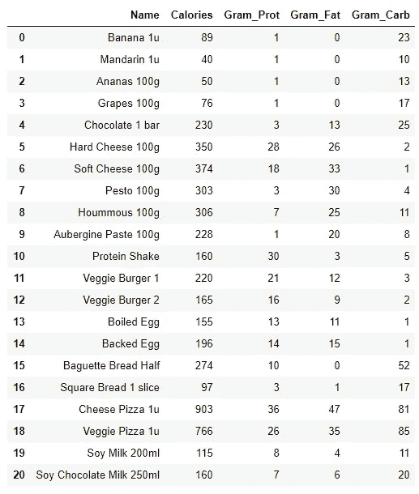
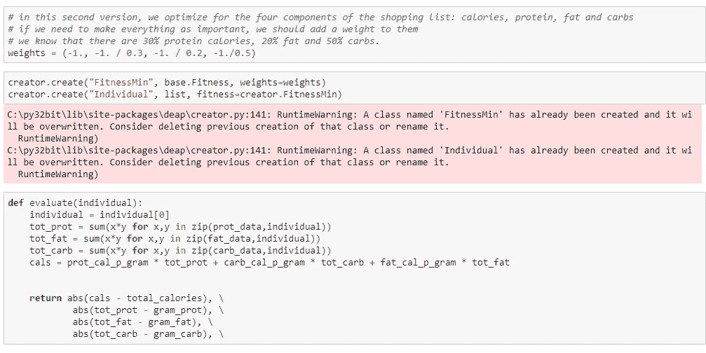

# 使用 DEAP 库的 Python 中的遗传算法

> 原文：<https://towardsdatascience.com/genetic-algorithms-in-python-using-the-deap-library-e67f7ce4024c?source=collection_archive---------12----------------------->

## 应用于大量营养素膳食计划的优化

在本文中，我将介绍 Python 中的遗传算法，以及一个优化膳食计划的例子。

# 示例以及如何应用优化

当优化膳食计划时，有许多事情要考虑。在这个例子中，我们将为一个人制定一个每周膳食计划，这个人已经决定了他们想要吃多少卡路里，以及这些卡路里中有多少百分比应该来自蛋白质、碳水化合物和脂肪。

除了这些固定值，优化程序还需要一个预定义的产品列表，用户可以从中进行选择。对于这些产品中的每一种，我们知道每单位的卡路里数，以及脂肪、蛋白质和碳水化合物的百分比。

## **我们示例中人员的目标数量是:**

*总热量= 2500 * 7 天= 17500 卡路里
蛋白质百分比= 30%
碳水化合物百分比= 50%
脂肪百分比= 20%*

## **下面列出了可供选择的产品:**

Python 中的遗传算法——产品表。作者配图。

## **优化的目标**

优化程序的目标是找到一周的产品列表，其中每周总热量和宏量营养素尽可能接近目标量。

本文将使用 DEAP 的遗传算法。来源:[https://deap.readthedocs.io/en/master/_images/deap_long.png](https://deap.readthedocs.io/en/master/_images/deap_long.png)

# **遗传算法优化**

存在许多优化算法，遗传算法是其中之一。遗传算法之所以迷人，是因为其背后的思想非常耐人寻味:遗传算法是基于遗传学中自然选择的思想。

## 繁殖/交配

那么优化在遗传学中是如何工作的，比如在动物中？这是一个简单的原则:一个个体被编码为一系列基因。这种动物可能会也可能不会通过与伴侣繁殖将自己的基因组合传递给下一代。如果发生这种情况，后代将拥有来自母亲和父亲的基因组合。

## 变化

除了繁殖，还有第二个影响将决定新一代的基因库:突变。由于许多随机环境，有一些基因会在任何新个体中随机改变。

## 选择

达尔文的选择原则指出，适者生存。我们认为在繁殖前死亡的动物有不良基因。因为它们不繁殖，所以它们不会把基因传给下一代。这样下一代的基因会比上一代略好。

## 人口优化

这种自然选择的原理可以看作是一种优化算法。通过死亡，大自然把每一代人的坏基因都扔了出去。剩下的人口会越来越好。

## 将遗传算法应用于其他优化

对于优化的其他用例，遗传算法实现了相同的迭代交配、变异和选择方法。而不是用一个基因序列作为一个个体，它可以是许多其他的东西。

例如，在优化膳食计划的例子中，我们可以将“购物清单”写成个人。只买 1000 根香蕉而不买其他东西会是一个相对糟糕的购物清单。每样东西买 10 个已经很现实了。

因此，我们为这种遗传优化所做的如下:

1.  生成大量随机购物清单
2.  通过测量它们离目标数量的距离来选择最佳的。
3.  然后，将这些顶级候选项混合在一起，以给出新的购物列表，这些列表是顶级父候选项的随机组合(应用了一些随机变异)
4.  我们重复第 2 步和第 3 步，直到我们观察到几代人都没有改善(或者尽可能长)
5.  然后，我们从最终群体中选择最佳个体，我们确信这是我们可能拥有的最佳购物清单之一。

# Python 中的遗传算法

听起来很神奇，我们用 Python 做个实际案例吧。我们将使用 DEAP 图书馆，因为它有许多我们可以重复使用的基因功能。你可以跟着这里的总笔记本走。

## 在 Python 中设置输入

首先，让我们确定目标营养素的数量。我用不同的方式设定它们，因为实际上它们通常以每份营养素的百分比来表示，但为了优化，用克来表示更容易。

Python 中的遗传算法——目标数量。作者配图。

创建产品表的第二件事是:

Python 中的遗传算法——产品表。作者配图。

## 为我们的具体示例设置 Python 中的 DEAP 工具箱

## **设计 DEAP 工具箱设置**

现在是更困难的部分，为我们的具体例子建立 DEAP 工具箱。你需要指定你的染色体的形状。最简单的形状是列表。

在本例中，我选择了长度为 21 的列表，因为在 products 表中有 21 个产品。然后我知道第一个元素是香蕉的数量，第二个元素是橘子的数量等等。

## **为 DEAP 工具箱设置的语法**

我知道，但是算法不需要知道。它在个体中是不可见的。正如我们在下面看到的，这个个体是使用 creator.create 创建的，这里它被指定为 list，但是有一个附加的 fitness。这种适合度被定义为 FitnessMin。

个人现在还没有填写。填充发生在函数“个人”被注册到工具箱的地方。个体是基于函数 n_per_product 的，它返回 21 个随机数的列表:正如您所认识到的，这些是每个产品的数量。

人口只是登记为一份个人名单。

评估函数是我定义的，它计算总购物清单的卡路里数与目标卡路里数之间的绝对差值。就像你在笔记本上看到的，把其他的量加进去是相对容易的。

Python 中的遗传算法—建立 DEAP 工具箱。作者配图。

交配，变异和选择功能是直接从 DEAP 图书馆。

## 优化循环

下面的函数进行优化。几乎是从 DEAP 的[例单中逐字抄来的。感谢我为这个例子选择的设置，只需要做很少的修改。](https://deap.readthedocs.io/en/master/examples/ga_onemax.html)

Python 中的遗传算法——主函数。作者配图。

# 遗传算法的结果

上一代的最佳个体是下面显示为“单变量 _ 选择”列的列表。

Python 中的遗传算法。作者配图。

Python 中的遗传算法。作者配图。

Python 中的遗传算法——解决方案。作者配图。

# 多元优化

目前，我们只优化了卡路里的数量，而没有考虑是否主要是蛋白质、脂肪或碳水化合物远离目标。DEAP 有可能非常容易地从单目标转移到多目标优化。

代码中唯一要改变的是 evaluate 函数，它现在应该返回四个值的元组(卡路里误差、蛋白质误差、脂肪误差和碳水化合物误差),并添加一个权重向量来平衡每一个值的权重。

Python 中的遗传算法——多目标评估。作者配图。

# 单目标与多目标优化

进一步检查单目标和多目标优化的结果是有趣的。在使用当前权重的情况下，它给出了以下内容:

*   计算四个目标的误差，我们看到多元解的总误差更好
*   我们还看到误差的分布是不同的。例如，如果蛋白质的正确性更重要，可以通过增加蛋白质的权重来调整。

Python 中的遗传算法——分析结果。作者配图。

最终，产品表总是限制因素:在某些时候，不可能找到完美达到目标的特定产品的组合。为了有一个更好的解决方案，我们必须增加更多的产品。

# 结论

关于遗传算法的实际工作还有很多要了解的，但是我希望这篇文章至少给你一个使用 Python 中的 DEAP 库开始使用遗传算法的快速方法，以及一个很好的用例例子。

不要犹豫，使用带有两个例子的[示例笔记本，在遗传算法](https://jooskorstanje.com/genetic-algorithm-optimize-your-diet.html)的学习道路上更进一步。*现在，感谢阅读！*