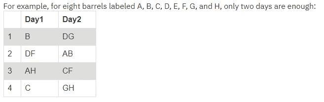
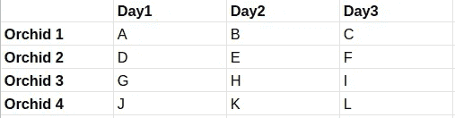
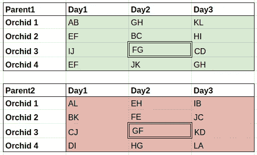
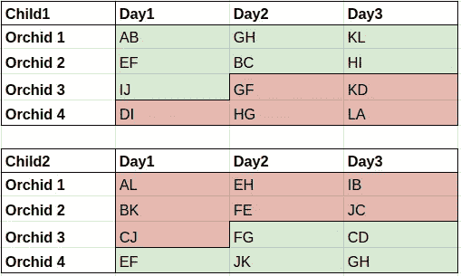

# 遗传算法——解决 IBM 的 2020 年 1 月问题

> 原文：<https://towardsdatascience.com/genetic-algorithms-solving-ibms-january-2020-problem-e694d59f407d?source=collection_archive---------24----------------------->

## 遗传算法的 Python 介绍


蒂姆·莫斯霍尔德在 [Unsplash](https://unsplash.com?utm_source=medium&utm_medium=referral) 上的照片

你好。

这篇文章是对 GAs 的温和介绍，也是对 IBMs 2020 年 1 月问题的解决方案。如果你想创造你自己的 GAs 或者在读完这篇文章后想玩玩我的代码，请随意拿起[这本装有所有代码的笔记本](https://gitlab.com/oncerecursive/ibm-ponder-this-jan2020/-/blob/master/january20.ipynb)。尽情享受吧！

# 问题是

每个月 IBM 都会在他们的思考博客中发布一个与编程相关的挑战。通常，这些挑战与编程有关，但偶尔纸笔解决方案也是可行的。前一个是 2020 年 1 月[挑战](http://www.research.ibm.com/haifa/ponderthis/challenges/January2020.html)，下面是问题陈述:

> “一个园丁有 12 桶特殊液体来浇灌他的兰花；正好有两桶有毒。使用任何数量，甚至一滴，从一个有毒的桶会杀死珍贵的兰花在 24 小时内。园丁在兰花死亡前只有三天时间，除非他能找出哪十桶是好的。他愿意牺牲四株兰花，用这些桶中的一个子集的混合物给它们浇水。他怎么能找到毒桶呢？”



表 1:挑战页面中的 8 筒配置

让我们花点时间思考一下问题是什么。本质上，我们有一个兰花浇水槽表，如上表所示。每个槽包括一组字母，每个字母代表一个桶。我们的任务是提出一个类似的表，其中有 4 朵兰花(行)，3 天(列)，总共 12 个桶，从 A 到 l 标记。我们想要这样的解决方案，即**无论哪两个桶中毒，我们总是可以通过查看哪一天哪些兰花死亡来找出它。作为一个例子，让我们考虑在上面只有 8 个桶的环境中，A 和 B 中毒了。**

*   第一朵兰花在第一天死去
*   第二朵兰花在第二天死去
*   第三朵兰花也在第一天死去
*   第四朵兰花存活了下来。

事实证明，无论你选择哪种桶的组合来下毒，你都不会得到相同的结果(兰花是如何死去的)。事实上，**每一对中毒的桶都有一个独特的结果，**这基本上是我们所追求的完美解决方案。



表 1:不起作用的 12 桶配置

乍一看，有 12 个不同的槽和 12 个桶，因此找到一个好的配置似乎很简单，但困难在于如果兰花在第一天死亡，剩下的两天浇水将不会提供任何额外的信息。上述解决方案不起作用的原因是不可能区分例如毒对 A&B 和 A&C，因为无论哪种方式，只有第一朵兰花会在第一天死亡，其余的存活下来！从第一张图中可以看出，2 天 8 桶的解决方案不包括在多天内对同一株兰花使用同一桶。

好的，我们可以猜测一个好的解决方案是每个槽大约有 2-3 桶。我们就不能试试不同的组合，看看什么有效吗？嗯，没有。

考虑到我们有 12 个不同的槽，为了简单起见，我们假设在每个槽中，我们正好使用 3 个不同的桶来给兰花浇水。可能的组合数将是(12*11*10)，大约等于 2.8*1⁰ ⁷，所以强制所有组合是不可能的。但是，这个问题在 NP(不确定是什么意思？→ [看这个](https://www.youtube.com/watch?v=YX40hbAHx3s)。即使搜索空间呈指数增长，也只需要相对较少的努力就可以检查一个解决方案是否是好的。

**验证解决方案**

毒桶只有 66 对可能(|{AB，AC，AD… LL}| = 12 选 2 = 66)。给定一种配置(例如上表)并检查所有 66 种中毒桶组合，我们可以通过简单地检查是否有任何相同的结果来确定解决方案是否良好。为什么会这样？因为如上所述，一个完美的解决方案，园丁必须能够准确地找出有毒的桶，但只看可怜的兰花发生了什么。因此，如果给我们一个给兰花浇水的配置，如果我们发现重复的结果，这不是最终的解决方案。

量化兰花结果的一个简单方法是用一个从 0 到 3 的数字来表示它们的每一个命运，这表示兰花死于哪一天(从 0 开始)。因此，对于有八个桶的表 1，如果 A 和 B 中毒，结果将是(0，1，0，3)。这里的 3 只是表示兰花存活了下来。我们使用第 1→ 0 天，因为零索引使编程更简单。因此结果(0，1，0，3)可以理解为“第一天兰花 1 和 3 死亡，第二天兰花 2 和兰花 4 存活”。

现在我们的任务变成了**寻找一个桶的配置(就像前面的表格一样),这样对于 66 个毒药桶对，所有的结果(我们用 0-3 的 4 个数字表示)都是唯一的。**因为我们喜欢单一的解决方案(而不是计算所有的方案)，所以我们可以利用 GAs。

# **遗传算法**

作为进化算法的一个子类，遗传算法(GA)是一种元启发式算法，它使用进化过程的元素来解决搜索和优化问题。很拗口，但本质上归结起来就是**不是迭代地改进一个解决方案，而是获取大量可能的解决方案，并将它们相互结合**。

这基本上是所有气体能量的来源。想象一下，给你一个随机配置的桶，你确定这不是最终的解决方案。您应该移动/移除/添加哪些桶？你越来越接近了吗？你离最终解决方案还有多远？

事实证明这些是很难问的问题，因为这不是一个凸或可微的问题，很多好的方法是不可行的。这就是 GAs 的疯狂之处:**你不需要精确估计你离解决方案有多远——只是一种比较解决方案的方法。**添加一些随机性和大量的迭代，我们就可以了！

遗传算法很大程度上受到进化论的启发，并且使用许多相同的术语，这可能并不令人惊讶，但是让我们更详细地看看遗传算法的两个基本组成部分:

**人口**

一组候选解称为群体。在我们的例子中，群体中的一个成员将是三天中桶的一种配置。随机初始化种群，并且**进一步的世代是初始种群**的更新和改进版本。就像进化一样，旧的单位被新的、可能更好的单位取代。如何测试哪些解决方案优于其他解决方案？

**健身**

适应度函数给每个候选人一个分数。这个分数有两个目的。

1.  选择—删除不好的解决方案
2.  结束条件—检查我们是否找到了最终解决方案

**适应度是你想要最小化/最大化的东西**(对于 ML 的那帮家伙，你可以把它想成一个损失函数)。

但是在我们的问题中，衡量一个解决方案有多好的好方法是什么？我们的问题是谨慎的，它需要一些严肃的问题工程来找出什么样的答案结构会给出好的结果的潜在原则。

一种方法是**采用结束条件并详述它**。我们的最终条件是找到一种给兰花浇水的方法，这样无论哪一对桶实际上有毒，园丁总能精确地找出它们是哪两个桶。如果有毒桶的组合会产生完全相同的结果，则解决方案无效(记住 4 位数表示)。现在让我们反过来想想，如果我们有*最坏的解决方案，*我们不会使用任何桶。这将给园丁零信息，因为所有的毒药桶组合将产生重复！所以*也许*有一种可能的方法来衡量一个答案有多好，就是简单地数一数有多少重复！

气体的神奇之处在于，我们的测量不必完全精确。这就足够了，这是一个我们想要着陆的大概估计，我们可以让随机过程来处理剩下的事情。

因此，为了我们的目的，我们可以用一个适应度函数来计算桶的给定配置

```
66 - # of unique outcomes.
```

如果有任何重复的结果(这是我们想要惩罚的)，则适应性得分较高，而“更好”的解决方案得分较低。最优解的分数是 0，因为正好有 66 个唯一的结果。我们现在的目标是简单地最小化我们人口中成员的这种适应性。但是怎么才能最小化呢？

**评估**

第一步是评估人口。这是我们**根据解决方案的好坏对其进行排名的地方**。在我们的设置中，这是基于重复的数量。如果候选解具有较少的重复，则它们的排名较高，在没有重复的情况下，最好的总是有效的解。

**选择**

在我们对群体进行评估和排序之后，自然选择就发生了。有很多有趣的方法可以做到这一点，但关键的想法是**去除不好的解决方案，以便为更好的解决方案留出空间**。

**交叉**

> 现在，我意识到大多数麻省理工学院的学生对有性生殖有了基本的了解，但是我发现在和学生的交谈中，很多时候他们对细节有点模糊。所以让我们先来思考一下它是如何工作的。— [帕特里克·温斯顿开始了关于遗传算法的讲座](https://www.youtube.com/watch?v=kHyNqSnzP8Y)

交叉有多种形式，但 GAs 的基本思想是好的解决方案可以相互组合，以产生可能更好的解决方案。在我们的例子中，我们可以使用一种最简单的交叉方法，即[单点交叉](https://en.wikipedia.org/wiki/Crossover_(genetic_algorithm)#Single-point_crossover)。

单点交叉的工作原理如下:

1.  取两个母解
2.  选择一个随机的位置将它们分开
3.  在子表之外，创建新的两个子解决方案，它们是两个父解决方案的组合。

在我们的例子中，分割位置(或支点)是一个随机的槽。在下面的图片中，单点杂交是在随机槽(兰花 3 |第 2 天)对两个任意亲本进行的



父配置



相应的子配置

对于交叉，可以包含*精英主义、*，这意味着在交叉后是否保留父代。如果保留父代，我们就不能创造同样多的子代，因为否则，种群规模将在每次迭代中增长，这可能会导致一些不稳定。通常，精英主义使算法稳定，因为好的解决方案停留的时间更长。如果我们在没有精英主义的情况下进行杂交，这意味着我们可以创造更多的后代，但如果进行过于随机的杂交，我们可能会失去潜在的可行解。

交叉的一个问题是，它本质上只是将旧的解决方案组合在一起。就其本身而言，这并不能保证找到一个好的解决方案，如果将两个好的解决方案组合在一起并不能构成一个更好的解决方案，我们可能会陷入局部最小值。那么，我们如何逃离死胡同，想出更新颖的解决方案呢？

**突变**

> 记住，当你在生活中不知道该做什么时，总是随机选择。省去了同样预期收益的麻烦。—组合学老师，2019

这里也是如此。与交叉相对应，突变是纯粹的随机变化。任意改变群体中个体成员的随机因素服务于一个重要的目的，因为我们不知道我们是否实际上接近实际的最佳解决方案，或者我们是否被困在局部体面的解决方案中。在更抽象的层面上，如果一个群体仅通过使用相同的候选人池来进化，它很可能变得非常同质，并可能错过更好的解决方案。

在我们的兰园中，变异将会从某个配置中随机添加和删除桶。通常，变异的作用较小，用于逃脱死胡同，因此变异率(即候选解发生变异的概率)较小。

过多的变异会使遗传算法变成一个随机猜测机器，过少的变异会导致它错过潜在的非常好的解决方案。慎用。

**算法**

总结我们到目前为止学到的东西，并放入算法框架中，

1.  首先，初始化种群并定义一个适应度函数。

2.其次，重复以下步骤，直到找到有效的解决方案。

*   评估:根据候选人的健康程度对其进行排名。
*   选择:删除弱(不太适合)的候选人
*   交叉:繁殖后代解(即通过合并旧解产生新的候选解)。
*   突变:添加一些突变(在这里和那里随机调整候选)。

由于显而易见的原因，循环的每次迭代，新的群体被称为*代、*。这些操作的顺序可以根据不同的 GAs 而有所不同，但是理论上就是这样，现在到 Python！

# 代码

现在我们可以开始实现实际的算法了。在下面的代码中，我们从导入*组合*-方法和*随机-* 包开始。*字母表*是包含所有可能桶的列表，从 *A* 到 *L* ，而 *test_answer* 显示了每个单独答案应该具有的结构，也就是一个 4x3 列表，其中每个元素也是桶的列表，即槽。

例如，在下面的代码中，slot ["D "，" K"]是第一行第二列的元素，所以这意味着兰花 1 在第二天用桶 D 和桶 K 浇水。

```
from itertools import combinations
import randomALPHABET = list("ABCDEFGHIJKL")test_answer = [ 
    [["A","J"], ["D","K"], ["G"]],
    [["G","H"], ["A","B"], ["D","E"]],
    [["E","F"], ["H","I"], ["B",]],
    [["C","J"], ["F","K"], ["I","C"]]
]
```

*init_population* 创建第一代，即填充那些 4x3 列表的群体，其中每个槽(元素)填充 3 个随机桶。

```
def **init_population**(n):
    """Return a population of n random solutions. Each solution is
    a 4x3 list, with each element being a selection of 3 distinct
    random barrels.
    """
    return [[[random.sample(ALPHABET,k=3) for d in range(3)] \
             for o in range(4)] for i in range(n)]
```

接下来我们定义*适应度*函数，为每个候选解调用。概括地说，我们希望它

1.  检查所有可能的有毒桶组合
2.  给定一个桶形配置，模拟每种组合的兰花会发生什么
3.  计算独特结果的数量
4.  返回 66 -那个数字

```
def **fitness**(candidate):
    """Return number of unique outcomes. Iterate through all
    possible pairs of poisonous barrels and the twelve slots.
    For each poisonous pair generate the outcome as a list
    e.g. [0,1,2,3], where the indexes are the orchids and
    numbers they day that orchid died (3 indicates that it
    did not die). Calculate the number of unique outcomes by
    adding outcomes o a set and return 66 - the length of
    that set. For a perfect solution there are 66 unique
    outcomes, thus return 0.
    """
    combs = list(combinations(ALPHABET,2)) 
    outcomes = set()
    for poisoned in combs: # Iterate through all poisonous barrels
        died_on = []
        for o in range(4): # Orchid
            dead_orchid = False
            for d in range(3): # Day
                if not dead_orchid and any([p in candidate[o][d]
                                            for p in poisoned]):
                    dead_orchid = True
                    died_on.append(d)
                elif not dead_orchid and d==2:
                    died_on.append(3) # Add the "survive" token 3.
        outcomes.add(tuple(died_on))
    return 66 - len(outcomes)
```

*评估*相当简单，只返回按适应度排序的人口。

```
def **evaluation**(population):
    """Return a population sorted by fitness."""
    return sorted(population, key= lambda x:fitness(x))
```

选择返回人口中更好的一半(这样就有空间给更多优秀的候选人)

```
def **selection**(population):
    """Return top half of population."""
    return population[:len(population)//2]
```

接下来是性的部分，即*交叉。*请注意，交叉操作会返回一个两倍于输入大小的新群体！所以我们假设选择是预先完成的。

```
def **crossover**(population,elitism=False):
    """Return a new population, generated by randomly pairing
    members of population (out-of-place). For each random pair,
    select a random pivot slot and generate 2 children:
    child1[j] = parent1[j],
    child2[j] = parent2[j], when j < pivot slot
    and
    child1[j] = parent2[j],
    child2[j] = parent1[j], when j >= pivot slot
    If elitism
        return parents and the child1s.
    Else
        return child1s and child2s
    """
    children = []
    n_pop = len(population)
    for i in range(n_pop): # Cross N times
        parent1,parent2 = random.sample(population,k=2)
        child1 = [[None for a in range(3)] for b in range(4)]
        child2 = [[None for a in range(3)] for b in range(4)]
        pivot = random.randrange(12) # Select a pivot slot.
        for j in range(12): # Iterate through slots
            o = j//3
            d = j%3
            if j < pivot:
                child1[o][d] = parent1[o][d]
                child2[o][d] = parent2[o][d]
            else:
                child1[o][d] = parent2[o][d]
                child2[o][d] = parent1[o][d]
        children.append(child1)
        if not elitism: children.append(child2)
    if elitism:
        return population+children
    else:
        return children
```

还有最后一个成分，*突变。*对于每个候选，它选择是否变异，取决于 *p_mutate。如果它确实发生了变异，无论是增加还是移除桶，它都会掷硬币。此外，如果只有一个或更少的桶，那么添加相同类型的桶和删除桶是没有意义的。返回一个(可能稍微)变异的群体。*

```
def **mutation**(population,p_mutate):
    """Return a mutated population (out-of-place). For each
    candidate, mutate with probability p_mutate.
    If mutate:
        Select random slot.
        Flip a coin whether to add or remove a random barrel.
    Else:
        The candidate is not affected.
    Return new (partially mutated) population.
    """
    mutated_population = []
    for candidate in population:
        if random.random() < p_mutate:
            # Mutate
            # Choose random slot
            o,d = random.randrange(4),random.randrange(3)
            if random.random() < 0.5 and len(candidate[o][d]) > 1:
                # Remove a barrel
                remove = random.choice(candidate[o][d])
                new_slot = [e for e in candidate[o][d] if e!=remove]
            else:
                # Add a barrel
                addable = list(set(ALPHABET)-(set(candidate[o][d])))
                add = random.choice(addable)
                new_slot = [e for e in candidate[o][d]] + [add]
            mutated_candidate = [[d for d in o] for o in candidate]
            mutated_candidate[o][d] = new_slot
        else:
            # Don't mutate
            mutated_candidate = [[d for d in o] for o in candidate]
        mutated_population.append(mutated_candidate)
    return mutated_population
```

我们走吧！现在我们只需创建训练循环。我选择了 0.9 的突变率，因为即使会发生突变，它对解决方案的影响也很小，所以有更多的突变也不会有什么坏处。此外，我只是粗略估计了 1000 人的人口规模，但它同样适用于 10，1000 或 10，000 人。精英主义似乎加快了事情的进展，所以这是可行的，但是你可能还是想尝试一下不同之处！

```
p_mutate = 0.9
n_pop = 100
best_fitness = 9999# Initialize population
pop = init_population(n_pop)
pop = evaluation(pop)i = 0
while best_fitness > 0:
    pop = selection(pop)
    pop = crossover(pop,elitism=True)
    pop = mutation(pop,0.5)
    pop = evaluation(pop)

    if fitness(pop[0]) < best_fitness:
        best_fitness = fitness(pop[0])
        print(f"New best fitness: {best_fitness} | i={i}")
    i+=1

print(pop[0])
```

它打印出类似这样的东西(在普通的笔记本电脑上大约需要 1-5 分钟)

```
New best fitness: 14 | i=0
New best fitness: 11 | i=5
New best fitness: 9 | i=13
New best fitness: 7 | i=14
New best fitness: 6 | i=20
New best fitness: 4 | i=23
New best fitness: 3 | i=70
New best fitness: 2 | i=101
New best fitness: 1 | i=770
New best fitness: 0 | i=915
[[['J', 'H'], ['A', 'K'], ['D', 'K', 'A', 'B']], [['L', 'F'], ['G', 'E', 'I', 'F'], ['D', 'L', 'G']], [['G', 'B'], ['L', 'K'], ['E', 'H', 'K', 'G']], [['A', 'I'], ['F', 'D', 'J', 'A'], ['E']]]
```

这就是我们的解决方案！对于实际的挑战，我重用了适应度函数中的一些代码来验证它实际上是一个正确的解决方案，但是假设一切顺利，这个应该是可行的。但是我们学到了什么？

有趣的是，我们可以从迭代中看到，计算最后几步需要成倍增加的时间(我运行了几次，得到了类似的模式)，这意味着从 1 或 2 适应度到 0 比从 14 到 2 要困难得多。有可能在适应度=1 附近存在局部最小值，其中交叉开始产生非常相似的结果，并且重要的多样性丢失。有可能这最后一步是通过纯粹的随机运气实现的，因为我们不知道有多少可能的正确解决方案。然而，突变率已经非常高了，所以将其更改为 1 不会有太大的差异，并且为了获得更稳定和更快的结果，该突变可能不只是一次更改一个插槽(可能在一次突变中更改几个？).

# 余波

当你处理一个搜索或优化问题时，遗传算法是有用的，而更传统的方法是不可行的(例如梯度下降或简化问题)，然而搜索空间太大而不能蛮干。从本质上来说，GAs 只是一种更精细的有根据的猜测方式，但是它们通过利用概率和计算能力以一种优雅的方式做到了这一点。他们有能力解决一些非常棘手的问题(比如[旅行推销员问题](https://medium.com/@becmjo/genetic-algorithms-and-the-travelling-salesman-problem-d10d1daf96a1))。然而，这些问题需要是 NP 的，因为检查一个解决方案的良好性(即计算适应度)在计算上不能太昂贵。因此，应用 GAs 适合复杂问题的特殊情况，在这种情况下，其他方法不适用(一种思考方式是，如果其他方法都不起作用，您可能想尝试一下 GAs)。一般来说，我建议使用 GAs 作为最后的手段，例如，当没有特定领域的知识或者问题不能被映射到一个更简单的图问题(它会有自己的，可能更快的方法)时。

一些好的属性是 GAs 很容易创建，并且(如上所示)可以使用普通 Python 来完成。此外，一个人不需要对问题有深入的理解就能找到解决方案，有时一个大概的启发就足够了！这就是我个人喜欢 GAs 的原因，它们提供了一个很好的中间地带，一个相对简单的程序可以用一种天生直观的方法来解决一个复杂的问题(毕竟，有什么比进化更容易理解)。