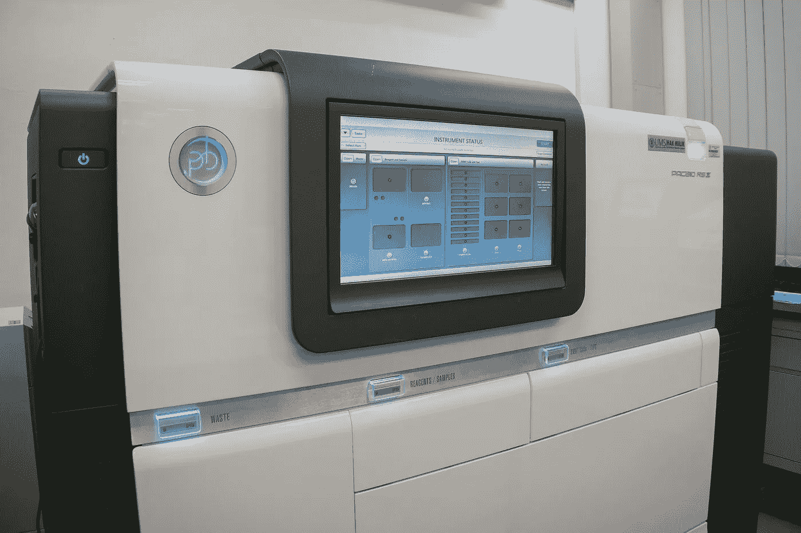
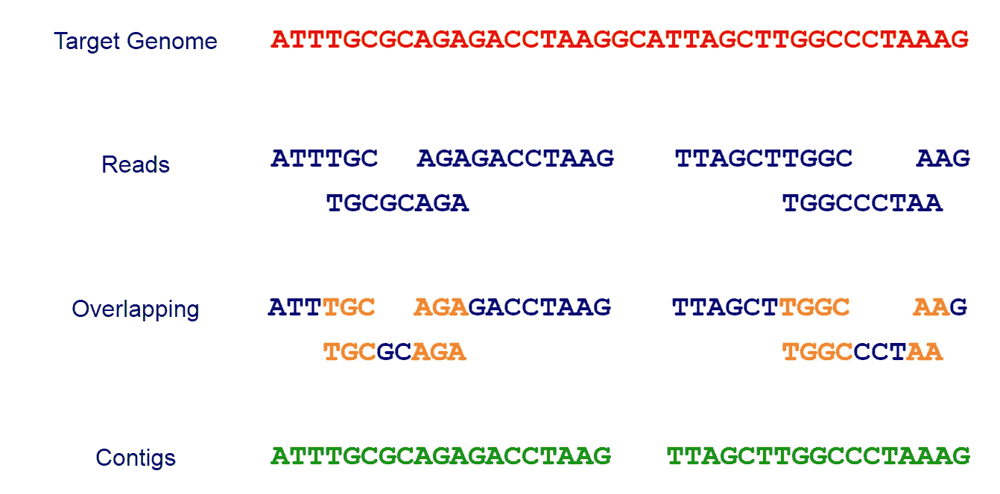
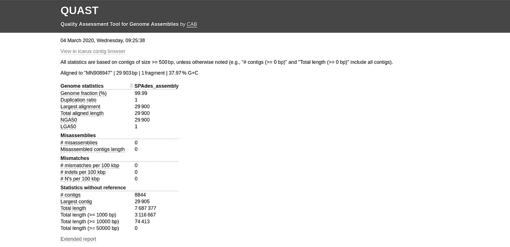
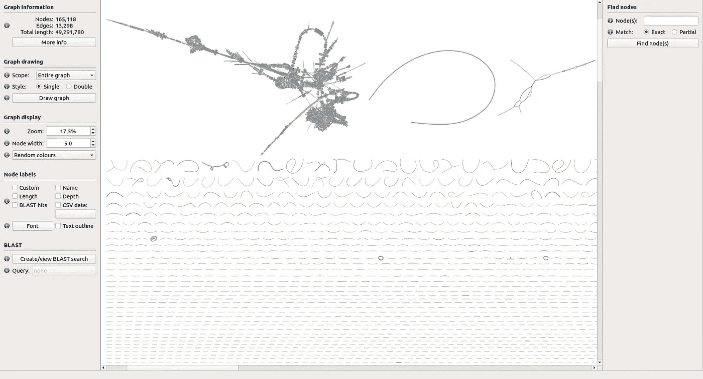

# 基因组组装——基因组分析的圣杯

> 原文：<https://towardsdatascience.com/genome-assembly-the-holy-grail-of-genome-analysis-fae8fc9ef09c?source=collection_archive---------17----------------------->

## 组装 2019 新型冠状病毒基因组

T he 2019 新型冠状病毒或冠状病毒病(*新冠肺炎*)疫情目前已经威胁到整个世界。科学家们正在夜以继日地研究新冠肺炎的起源。你可能最近听说了新冠肺炎的完整基因组已经发表的消息。科学家是如何算出新冠肺炎的完整基因组的？在这篇文章中，我将解释我们如何做到这一点。

# 基因组

一个**基因组**被认为是所有的遗传物质，包括一个生物体的所有基因。基因组包含了生物体构建和维持所需的所有信息。

# 定序

我们如何读取基因组中存在的信息？这就是**序列**发挥作用的地方。假设你已经读过我的[上一篇关于 DNA 分析的文章](/dna-sequence-data-analysis-starting-off-in-bioinformatics-3dba4cea04f)，你知道测序是用来确定一个有机体的单个基因、完整染色体或完整基因组的序列。



图一。PacBio 测序仪。PacBio 是第三代测序技术，可产生长读数。图片由[肯尼斯·罗德里格斯](https://pixabay.com/users/kennethr-5076425/?utm_source=link-attribution&utm_medium=referral&utm_campaign=image&utm_content=2223465)提供，来自[皮克斯拜](https://pixabay.com/?utm_source=link-attribution&utm_medium=referral&utm_campaign=image&utm_content=2223465) (CC0)

被称为**测序机器**的特殊机器被用来从我们感兴趣的基因组中提取短的随机序列。目前的测序技术不能一次读取整个基因组。它读取平均长度在 50-300 个碱基(下一代测序/短读取)或 10，000-20，000 个碱基(第三代测序/长读取)之间的小片段，这取决于所使用的技术。这些短片被称为**读作**。

如果你想了解更多关于病毒基因组如何从临床样本中测序的细节，你可以阅读以下文章。

1.  [临床样本病毒全基因组测序的完整方案:应用于冠状病毒 OC43](https://www.sciencedirect.com/science/article/pii/S0042682219300728)
2.  [从临床样本中特异性捕获病毒并进行全基因组测序](https://journals.plos.org/plosone/article?id=10.1371/journal.pone.0027805)

# **基因组组装**

一旦我们有了基因组的小片段，我们必须根据它们的重叠信息将它们组合(组装)在一起，并构建完整的基因组。这个过程叫做**组装**。组装就像解决一个拼图游戏。被称为**组装器**的特殊软件工具被用来根据它们**如何重叠**来组装这些读数，以便生成被称为**重叠群**的连续串。这些重叠群可以是整个基因组本身，也可以是基因组的一部分(如图 2 所示)。



图二。排序和组装

装配工分为两类，

1.  **从头组装器**:不使用参考基因组进行组装(例如:[黑桃](http://cab.spbu.ru/software/spades/)、 [SGA](https://github.com/jts/sga) 、 [MEGAHIT](https://github.com/voutcn/megahit) 、[天鹅绒](https://github.com/dzerbino/velvet)、[卡努](https://github.com/marbl/canu)和 [Flye](https://github.com/fenderglass/Flye) )。
2.  **参考引导装配器**:通过将序列映射到参考基因组进行装配

# 两种主要类型的装配工

在生物信息学文献中可以找到两种主要类型的装配器。第一种是**重叠-布局-一致性(OLC)方法**。在 OLC 方法中，首先，我们确定读数之间的所有重叠。然后我们将所有的读数和重叠以图表的形式排列出来。最后，我们识别共有序列。SGA 是一个基于 OLC 方法的流行工具。

第二种汇编程序是 DBG 图法。DBG 方法不是使用完整的读数，而是将读数分成更短的片段，称为*k*-mer(长度为 *k* )，然后使用所有的*k*-mer 构建一个德布鲁因图。最后，根据德布鲁因图推断基因组序列。[黑桃](http://cab.spbu.ru/software/spades/)是一个基于 DBG 方法的流行汇编程序。

# 基因组组装会出什么问题？

基因组包含在基因组中多次出现的核酸模式。这些结构被称为**重复**。这些重复会使组装过程变得复杂并导致歧义。

我们不能保证测序机器能够产生覆盖整个基因组的读数。测序机器可能会错过基因组的某些部分，并且不会有覆盖该区域的读数。这将影响装配过程，并且那些遗漏的区域将不会出现在最终装配中。

基因组组装者应该解决这些挑战，并尽量减少组装过程中造成的错误。

# 如何评估程序集？

组件的评估非常重要，因为我们必须决定最终的组件是否符合标准。其中一个广为人知且最常用的汇编评测工具是[](http://bioinf.spbau.ru/quast)**。下面列出了一些用于评估组件的标准。**

*   ****N50:** 覆盖组件总长度的 50%所需的最小重叠群长度。**
*   ****L50:** 比 N50 长的重叠群的数量**
*   ****NG50:** 覆盖 50%参考基因组长度所需的最小重叠群长度**
*   ****LG50:** 比 NG50 长的重叠群的数量**
*   ****NA50:** 要求覆盖组件总长度 50%的对齐砌块的最小长度**
*   ****LA50:** 比 NA50 长的重叠群的数量**
*   ****基因组比例(%):** 与参考基因组比对的碱基百分比**

# **弄脏手**

**让我们开始做实验吧。我将使用汇编程序[](http://cab.spbu.ru/software/spades/)****来汇编从测序患者样本中获得的读数。黑桃利用下一代测序读取。你也可以免费下载[](http://bioinf.spbau.ru/quast)**。您可以从相关的主页(我提供了链接)获得代码和二进制文件，并运行这些工具。********

******键入以下命令，并验证工具是否正常工作。******

```
****<your_path_to>/SPAdes-3.13.1/bin/spades.py -h
<your_path_to>/quast-5.0.2/quast.py -h****
```

## ******下载数据******

******我想你知道如何从国家生物技术信息中心(NBCI)下载数据。如果没有，可以参考这个[链接](https://www.ncbi.nlm.nih.gov/genome/doc/ftpfaq/)。******

******我们实验的读数可以从 NCBI 下载，NCBI 登记号为 [**SRX7636886**](https://www.ncbi.nlm.nih.gov/sra/SRX7636886[accn]) 。您可以下载运行 [**SRR10971381**](https://trace.ncbi.nlm.nih.gov/Traces/sra/?run=SRR10971381) ，其中包含从 [Illumina MiniSeq](https://sapac.illumina.com/systems/sequencing-platforms/miniseq.html) 运行中获得的读数。确保下载 [FASTQ](https://en.wikipedia.org/wiki/FASTQ_format) 格式的数据。下载的文件可以找到为`**sra_data.fastq.gz**`。您可以使用 gunzip 提取 FASTQ 文件。******

****提取之后，您可以运行下面的 bash 命令来计算数据集中的读取次数。您将看到有 56，565，928 次读取。****

```
**grep '^@' sra_data.fastq | wc -l**
```

****你可以从 NCBI 下载公开的新冠肺炎完整基因组[3]，GenBank 登录号为 [MN908947](https://www.ncbi.nlm.nih.gov/nuccore/MN908947.3/) 。你会看到一个 [FASTA](https://en.wikipedia.org/wiki/FASTA_format) 格式的文件。这将是我们的参考基因组。注意，我们已经将其重命名为`**MN908947.fasta**`。****

## ****装配****

****让我们把新冠肺炎的作品汇编起来。运行以下命令，使用黑桃来组合读数。您可以提供压缩的。gz 档直接给黑桃。****

```
**<your_path_to>/SPAdes-3.13.1/bin/spades.py --12 sra_data.fastq.gz -o Output -t 8**
```

****这里我们使用了通用的黑桃汇编器作为本文的演示。然而，由于 reads 数据集由 [RNA-Seq](https://en.wikipedia.org/wiki/RNA-Seq) 数据组成(从[我的上一篇文章](/starting-off-in-bioinformatics-rna-transcription-and-translation-aaa7a91db031)中了解更多关于 RNA 的信息)，最好使用`--rna`选项。****

****在`Output`文件夹中，你可以看到一个名为`**contigs.fasta**`的文件，其中包含我们最终组装的重叠群。****

## ****评估装配结果****

****使用以下命令在组件上运行**撤销**。****

```
**<your_path_to>/quast-5.0.2/quast.py Output/contigs.fasta-l SPAdes_assembly -r MN908947.fasta -o quastResult**
```

## ****查看评估结果****

****一旦 QUAST 完成，您可以进入 *quastResult* 文件夹并查看评估结果。您可以通过在 web 浏览器中打开 report.html 文件来查看 QUAST 报告。您可以看到类似于图 3 所示的报告。您可以点击“扩展报告”了解更多信息，如 NG50 和 LG50。****

********

****图三。撤销报告****

****您可以研究不同评估标准的值，如基因组比例 NG50、NA50、错配和重叠群数量。此外，您可以使用 **Icarus contig 浏览器**(点击“在 Icarus contig 浏览器中查看”)查看与参考基因组的重叠群比对，如图 4 所示。****

********

****图 4。撤销报告****

****从 Icarus contig 浏览器中，我们可以看到名为`NODE_1`的 contig 与新冠肺炎的参考基因组非常接近。它的基因组比例为 99.99%(如图 3 所示)。此外，29，900 个碱基对的总比对长度非常接近 29，903 个碱基对的参考基因组的长度。****

## ****可视化装配图****

****有一个名为 [**绷带**](https://rrwick.github.io/Bandage/) 的工具可以用来可视化装配图。您可以从它们的主页下载预编译的二进制文件并运行该工具。您可以加载可在黑桃输出文件夹中找到的图形文件`**assembly_graph_with_scaffolds.gfa**`(进入文件→加载图形→选择。在`Output`中打开 gfa 文件)进行包扎，点击“绘制图形”进行可视化，如图 5 所示。请注意，图 5 中第一行线段中间的绿色长曲线线段对应于我们的黑桃组合的 NODE_1。****

********

****图五。使用绷带可视化的新冠肺炎读数数据集的黑桃装配图的一部分。****

# ****他们最初是如何发现新冠肺炎基因组的？****

****由于新冠肺炎的参考基因组现在是可获得的，我们可以评估我们的装配。然而，起初，新冠肺炎没有确切的参考基因组。那么科学家们是怎么弄明白的呢？正如我在[之前的文章](/metagenomics-who-is-there-and-what-are-they-doing-9f204342eed9)中解释的，分析病毒基因组属于宏基因组学，有许多技术可以做到这一点。他们分析了重叠群的**覆盖范围**(覆盖重叠群中每个碱基位置的平均读数)，并与蝙蝠 SARS 样冠状病毒(CoV)分离株— **蝙蝠 SL-CoVZC45** (GenBank 登录号[mg 772933](https://www.ncbi.nlm.nih.gov/nuccore/MG772933.1/))【3】。结果显示，它们最长的组装重叠群具有高覆盖度(从我们的组装中，您可以看到 NODE_1 也具有高覆盖度值),并且与 bat SL-CoVZC45 非常接近。他们已经进行了更多的测试来证实这一点，我就不赘述了。****

# ****最后的想法****

****基因组组装为我们研究生物体基因组内部的实际情况铺平了道路。即使在新冠肺炎病毒爆发期间，基因组组装也在识别这种致命病毒的实际遗传密码方面发挥了重要作用。****

****如果你检查新冠肺炎基因组的大小，它是 29903 个碱基对(大约 30k 个碱基对)。随着第三代测序技术的进步，我们可能能够直接对小基因组如病毒基因组的全长进行测序。随着阅读长度变得更长，组装阅读的需求将会减少，最终，我们将可以从测序仪中直接获得基因组(特别是在宏基因组学中，基因组的范围从几千个碱基到几兆个碱基)！此外，革命性的基于纳米技术的方法，如**量子测序技术**【4】包括**石墨烯纳米器件**【5】可能会变得流行。****

****谢谢大家的阅读。如果你觉得我的文章有趣，请在你的网络上分享。我也很想听听你的想法。****

****干杯！****

# ****参考****

****[1]挖掘冠状病毒基因组寻找爆发起源的线索|科学|美国科学促进会([https://www . Science mag . org/news/2020/01/Mining-coronavirus-genomes-clues-outbreak-s-origins](https://www.sciencemag.org/news/2020/01/mining-coronavirus-genomes-clues-outbreak-s-origins))****

****[2]李振玉等.两大类组装算法的比较:重叠-布局-一致性和 de-bruijn-graph，*功能基因组学简报*，第 11 卷，第 1 期，2012 年 1 月，第 25-37 页。https://doi.org/10.1093/bfgp/elr035****

****[3]吴芳芳，赵，于等*等*一种新型冠状病毒在中国发现与人类呼吸系统疾病相关。*性质* (2020)。[https://doi.org/10.1038/s41586-020-2008-3](https://doi.org/10.1038/s41586-020-2008-3)****

****[4]张一日和金武南。从头全基因组组装的现在和未来。*生物信息学简报*，第 19 卷，第 1 期，2018 年 1 月，第 23–40 页。[https://doi.org/10.1093/bib/bbw096](https://doi.org/10.1093/bib/bbw096)****

****[5]希雷玛和德克尔。用于 DNA 测序的石墨烯纳米器件。 *Nature Nanotech* **11，**127–136(2016)。[https://doi.org/10.1038/nnano.2015.307](https://doi.org/10.1038/nnano.2015.307)****