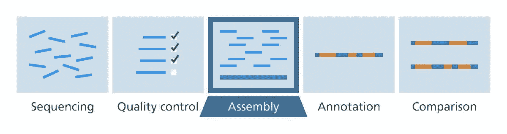
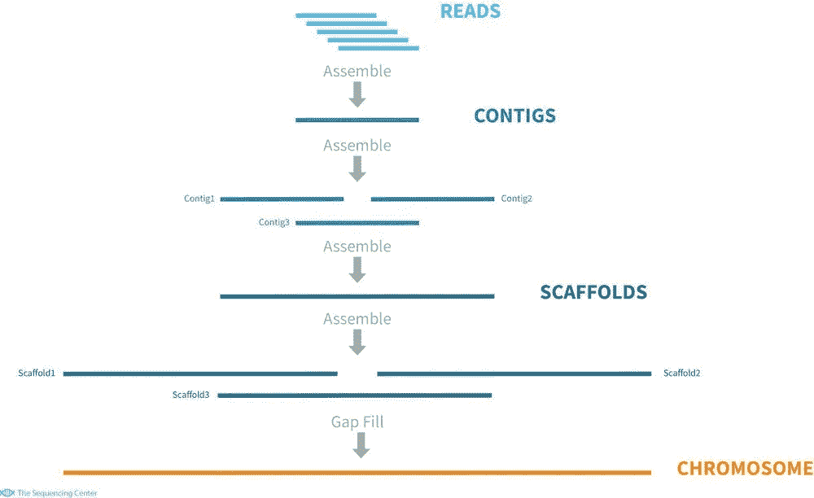
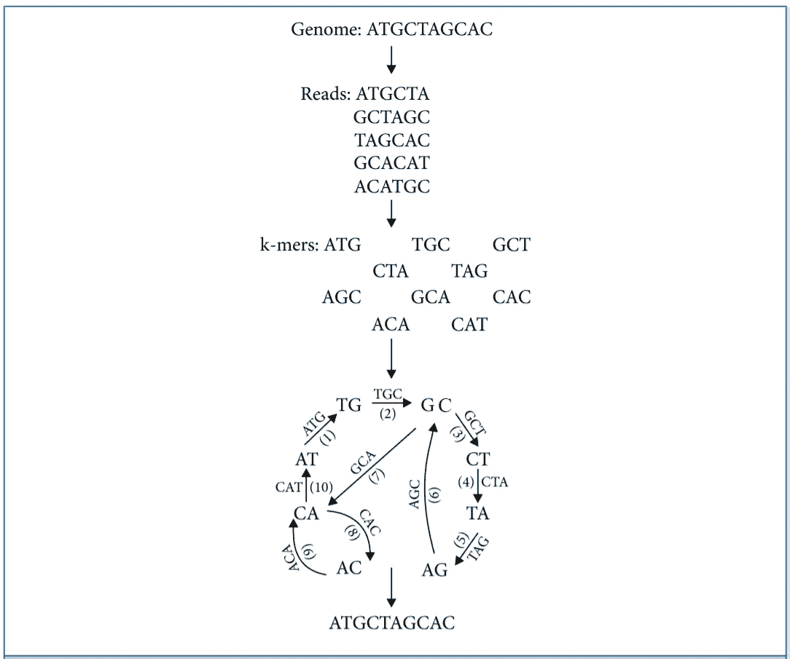
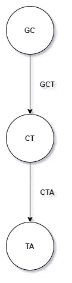
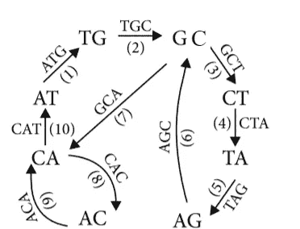

# 使用德布鲁因图的基因组组装

> 原文：<https://towardsdatascience.com/genome-assembly-using-de-bruijn-graphs-69570efcc270?source=collection_archive---------16----------------------->

[来源](https://www.wallpaperbetter.com/en/hd-wallpaper-gtknu)

基因组测序后，我们可以找出基因组中 DNA 核苷酸或碱基的顺序——组成生物体 DNA 的 As、Cs、Gs 和 Ts 的顺序。整个基因组不能一次全部测序，因为可用的 DNA 测序方法一次只能处理很短的 DNA 片段。因此，相反，科学家必须将基因组分成小片段*(缩写)*，对片段进行测序，然后按照正确的顺序重新组装，以获得整个基因组的序列。

基因组组装可以被描述为一种计算过程，它将之前提到的来自生物体细胞内靶 DNA 不同部分的称为*读数*的众多短序列集合在一起。这是一个算法驱动的自动化过程。DNA 序列组装程序利用序列重叠来以正确的顺序进行序列组装。

图 1-[https://www.yourgenome.org/](https://www.yourgenome.org/)

实现基因组组装有许多挑战。一个主要的挑战是处理错误的读数。无论使用何种测序技术，读数都不会 100%准确。为了克服这种测序，可以多次使用相同的 DNA 片段。一个部分被排序的次数叫做覆盖率。覆盖面越广，可信度就越高。所以覆盖率高导致了大量的 DNA 序列的短阅读。这些短文像拼图中的小块碎片一样混在一起。它们应该被组织在一起，并按照正确的顺序组合成基因组序列。因此，组合这些短的阅读片段来获得原始基因组是一项艰巨的任务。

# 从头基因组组装

这是一种在不使用参考基因组的情况下将短的核苷酸序列组装成更长的序列的程序。在这种进行装配的方法中，假设没有源 DNA 序列长度、布局或组成的先验知识。序列汇编器的最终目标是从短序列中产生长的连续序列片段(重叠群)。然后，重叠群有时被排序并相对于彼此定向以形成支架。两种常见的*从头*组装器是[贪婪算法](https://en.wikipedia.org/wiki/Greedy_algorithm)组装器和*布鲁因图*组装器。在贪婪方法中，它的目标是[局部最优](https://en.wikipedia.org/wiki/Local_optimum)，而在图方法中，它的目标是[全局最优](https://en.wikipedia.org/wiki/Global_optimization)。我们将在本文中讨论后者。

一般 *de nevo* 装配也包括脚手架和间隙填充步骤。支架是将一系列不连续的基因组序列连接成一个支架，由已知长度的缺口分隔的序列组成。连接的序列通常是对应于阅读重叠的连续序列。

图 2-de nevo 装配的一般工作流程

# *德布鲁因图*装配工

早期，一种应用于第一代测序数据的有效组装方法是**重叠-布局-一致性**方法，该方法涉及所有读数对的比较以识别重叠。但是这对于用第一代方法组合这些读数所需的计算既不实际也不困难。

在 20 世纪 40 年代，一位名叫 Nicolaas de Bruijn 的荷兰数学家开始对寻找最短的环形字符串感兴趣，该字符串包含给定字母表中所有可能的子字符串，每个子字符串长度相同。他想出的解决方案包括构建一个以所有可能的(k1)聚体为节点的图。如果节点 **A** 中的(k-mer 是 k-mer 的前缀，而节点 **B** 中的(k-mer 是 k-mer 的后缀，则每个 k-mer 都是从节点 **A** 到节点 **B** 的边。

现在这个问题的答案是找到一条穿过图的路径，这条路径恰好穿过每条边一次，或者换句话说，欧拉路径。下面是一个例子，其中长度为 10 的序列“ **ATGCTAGCAC** ”由五个长度为 6 的读取组合而成。

图 3-使用德布鲁因汇编程序的过程

读取被分成指定大小为 k 的较小片段。在上面的示例中，k 对应于 3。确定了 k-mers，并绘制了以(k–1)mers 为节点、k-mers 为边的德布鲁因图，如文中所述。通过这个网络追踪欧拉路径，导致原始基因组序列的重建。

在从给定的短读数重建原始序列的过程中，可以指定以下步骤。

# 步伐

1.  从 k-mer 集合中取出所有(k-1)个 mer，例如 ATG、TGC-> AT、TG、GC。我们应该已经超过了 k-mer 读取的大小。
2.  构造一个节点为 k-1-mers 的多图；仅当两个 k-1 mer 来自同一读数时，在两个 k-1 mer 之间画一条边。 **Ex:** GCT & CTA

带 GCT 和 CTA 的多重图

3.以这种方式构造的图保证具有欧拉轨迹，跟随该轨迹并连接节点以形成我们的原始序列。将出现与此类似的图形。

多重图重建序列 **ATGCTAGCAC**

现在这个算法可以用来组装 k-mer 读数。我们可以放宽条件，接受超过给定长度的读取，并将每个 k-mer 分成(k-mer，以考虑具有 k-n 个重叠而不是 k-1 个重叠的读取。此外，重建更容易组装的部分(重叠群)并省去不明确的部分是方便的。

以下 Jupyter 笔记本可用于实现*德布鲁因*汇编程序。

用于*德布鲁因*装配工的 Jupyter 笔记本

的确，基于 de Bruijn 图的组装方法开始时，有些违背直觉，用一组较短的固定长度的全重叠序列代替每个读数，但这是一种流行的基因组组装方法。

可以免费下载、使用和修改的稳定和健壮的软件包已经被开发出来，用于使用 de Bruijn 图从短阅读中组装基因组。一种名为 [Velvet](https://www.ebi.ac.uk/~zerbino/velvet/) 的流行软件似乎在组装基因组方面表现得非常好(主要是在细菌上)。

虽然 *de bruijn* 组装器是实现组装的流行手段，但是对于 *de bruijn* 基因组组装来说仍然存在一些挑战。序列错误、不均匀的测序深度、重复的部分和计算成本是几个主要的挑战。

**参考文献:**

*   [https://link . springer . com/content/pdf/10.1007% 2fs 40484-019-0166-9 . pdf](https://link.springer.com/content/pdf/10.1007%2Fs40484-019-0166-9.pdf)
*   [https://www . your genome . org/facts/how-do-you-put-a-genome-back-together-after-sequencing](https://www.yourgenome.org/facts/how-do-you-put-a-genome-back-together-after-sequencing)
*   细菌基因组学-基因组组织和基因表达工具