# 面向数据科学家的基因组学、转录组学和蛋白质组学

> 原文：<https://towardsdatascience.com/genomics-transcriptomics-and-proteomics-for-data-scientists-60fd5b2d09ff?source=collection_archive---------26----------------------->

## 细胞、DNA、RNA 和蛋白质

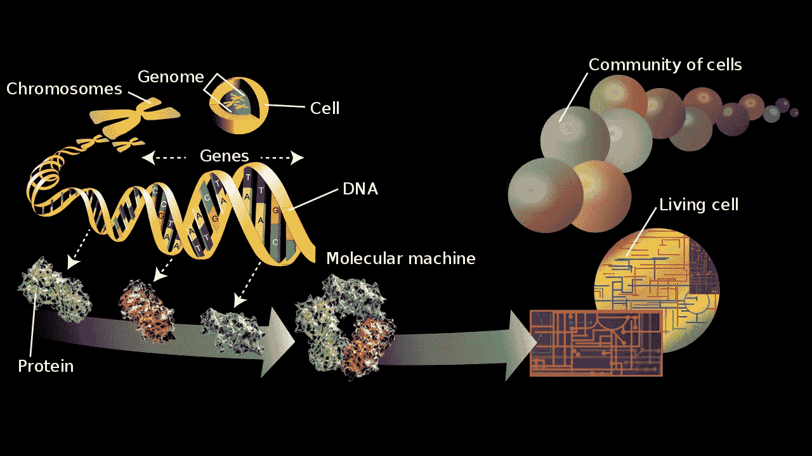

图片来源:[维基百科，归功于威廉·克罗夫特](https://en.wikipedia.org/wiki/Omics#/media/File:Genome-en.svg)。

你的基因组大约有 750 兆字节的信息(3 个 10⁹字母 x 1 个字节/4 个字母)。这大约是一个操作系统的一半大小，除了它为一个完整的人体编码，并且整个代码适合一个比一粒米小一百倍的体积。你的大脑是由你的基因组指定发展的，是一台不可思议的超级计算机，它需要的电力也比昏暗的灯泡少——实际上比人造超级计算机的能效高数万倍。

那么基因组是如何工作的呢？

基因组学、转录组学和蛋白质组学是数据驱动的领域，旨在回答基因组如何为一个有生命、有呼吸的人(或猫、或植物、或细菌)编码的问题。这篇文章向对“组学”数据感兴趣的计算科学家和工程师介绍了基因组学、转录组学和蛋白质组学，并希望快速介绍这些数据的来源和数据背后的关键生物学。这篇文章使用最少的术语和多种类比来阐明这些不同类型的“组学”数据之间的异同，以及它们如何为现存最复杂的软件之一——你的 DNA——提供不同的窗口。

# **牢房**

细胞是所有生物的基本组成部分:人、狗、老鼠、树、花、苍蝇和细菌。所有形式的“组学”都在测量细胞内发现的大量物质。

这是用显微镜拍摄的一些细胞的照片。我用红色标出了一些单元格。每个红色圆圈对应一个单元格:

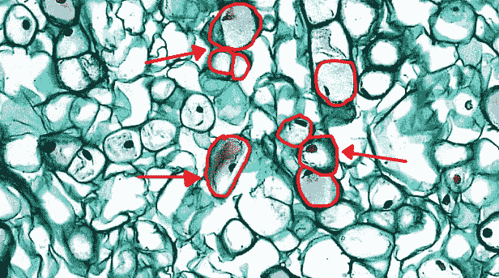

修改自[维基百科](https://upload.wikimedia.org/wikipedia/commons/6/64/Gymnosperm_Stem_Cork_and_Cortex_in_Pinus_Wood_%2836348377021%29.jpg)。

罗伯特·胡克在 1665 年发现并命名了细胞。他称它们为细胞，因为在显微镜下它们看起来像“细胞”或小房间——换句话说，“细胞”被称为“细胞”，因为它们在显微镜下看起来像监狱的细胞。

来自人、狗、老鼠、树、花和苍蝇的细胞是[“真核细胞”](https://en.wikipedia.org/wiki/Eukaryote)，这意味着这些细胞将它们的 DNA 打包在一个袋子里(细胞核)。

来自细菌的细胞被称为“原核细胞”，因为它们不把 DNA 保存在袋子里(即它们没有细胞核):

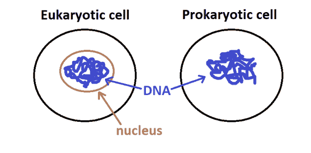

这是早期(真核生物)细胞的特写照片，细胞核用棕色圈起来:

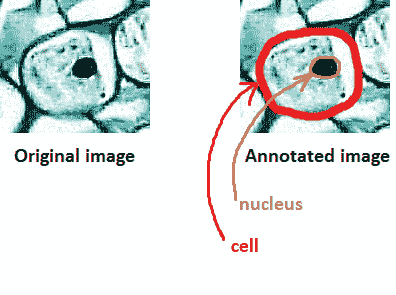

# **DNA 和基因**

你的 DNA 是由 30 亿个字母组成的长序列，存在于你的细胞核内。你身体里的每个细胞(很少例外)都有你整个基因组的完整拷贝(即你所有的 DNA)。因为你的身体里大约有 37.2 万亿个细胞，这意味着你携带了大约 37.2 万亿份你的整个 DNA 序列！其中的含义很有趣:这意味着你指尖的一个细胞包含了构建整个大脑所需的所有指令。

“基因”是编码制造蛋白质指令的特定 DNA 片段。

我们可以把身体想象成一个工厂，它需要某些“机器”(蛋白质)来运转:

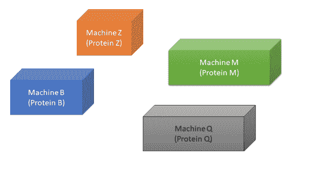

基因是一组如何建造特定机器的指令。例如，基因 B 包含建造机器 B(蛋白质 B)的指令，基因 Q 包含建造机器 Q(蛋白质 Q)的指令等等。

只有 [1%](https://ghr.nlm.nih.gov/primer/basics/noncodingdna) 的基因组实际上由基因组成。基因被称为基因组的“编码”部分，因为基因“编码”蛋白质。人类基因组中大约有 25，000 个基因，相当于 25，000 个使你身体运转的小机器(蛋白质)。

剩下的 99%的基因组是“非编码的”基因组的“非编码”部分仍然很重要，因为它告诉细胞如何利用“编码”部分。

换句话说，如果“编码”部分作为如何制造不同机器的指令，那么“非编码”部分作为如何在工厂中使用这些机器的指令:何时需要打开机器，何时需要关闭机器，需要多少台机器，何时应该使用机器，等等。

如果我们把基因组想象成一本书，它将包含一些关于如何构建机器的文本(编码部分，在下面以橙色和蓝色显示)，以及一些关于如何使用机器的文本(非编码部分，在下面以黑色显示):

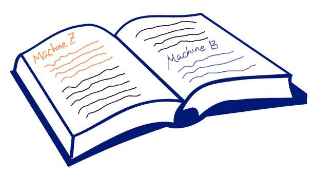

由[维基百科](https://www.google.com/url?sa=i&url=https%3A%2F%2Fcommons.wikimedia.org%2Fwiki%2FFile%3AOpen_book_nae_02.svg&psig=AOvVaw133o18SwCm0Cc3F5f-Uhpm&ust=1586639363617000&source=images&cd=vfe&ved=0CAIQjRxqFwoTCNjk4a_i3ugCFQAAAAAdAAAAABAO)上的空白开卷图片修改而来

## **核苷酸:DNA 的构件(A，T，C，G)**

DNA 中的 30 亿个字母来自一个有限的字母表，只有 4 个可能的字母:A、T、C 和 G。(有趣的事实:这就是为什么电影《Gattaca》讲述了一个基因“劣等”的人战胜他的社会的故事，在片名中只使用了字母 A、T、C 和 G。)

这是人类基因 S100A10(也称为“p11”)的完整 DNA 序列，[基因组中最短的基因之一](http://rulai.cshl.edu/smallgenes/annsmgenes/chr1.html):

```
CCGGTTACCTCTGGTTCTGCGCCACGTGCCCCACCGGCAGGACGGCCGGGTTCTTTGATT TGTACACTTTCTAAAACCAAACCCGAGAGGAAGGGCAGGCTCAGGGTGGGATGCCCTAAA TATTCGAGAGCAGGACCGTTTCTACTGAAGAGAAGTTTACAAGAACGCTCTGTCTGGGGC GGGCGAGCGCTCTGCGAGGCGGGTCCGGGAGCGAGGGCAGGGCGTGGGCCGCGCGCCCGG GGTCGGGGGAGTCGGGGGCAGGAAGAGGGGGAGGAGACAGGGCTGGGGGAGCGCCCTGCC GAGCGCCCGCCAGGCTCCTCCCCGTCCCGCACCGCCTCCCTCTACCCACCCGCCGCACGT ACTAAGGAAGGCGCACAGCCCGCCGCGCTCGCCTCTCCGCCCCGCGTCCACGTCGCCCAC GTCGCCCAGCTCGCCCAGCGTCCGCCGCGCCTCGGCCAAGGTGAGCTCCCAGTTCGGCCC
```

【序列来源: [ebi.ac.uk](https://www.ebi.ac.uk/ena/data/view/M77483&display=fasta)

DNA 的组成部分(四个字母 A、T、C 和 G)被称为[“核苷酸”](https://en.wikipedia.org/wiki/Nucleotide)它们的全称是鸟嘌呤(G)、腺嘌呤(A)、胞嘧啶和胸腺嘧啶(T)。

每个核苷酸构件依次由碳、氢、氧和氮组成。例如，胞嘧啶由 13 个原子组成。这是 2D 关于胞嘧啶的“棍球漫画”:

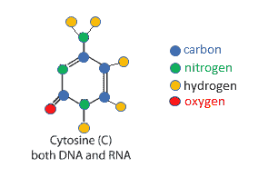

基于[cs.boisestate.edu](http://cs.boisestate.edu/~amit/teaching/342/lab/structure.html)所示的化学结构

这是胞嘧啶的 3D 效果图:

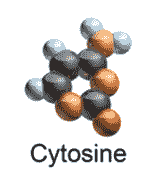

3D 渲染来源:[维基百科](https://en.wikipedia.org/wiki/Nucleobase#/media/File:Blausen_0324_DNA_Pyrimidines.png)

(技术说明:上面胞嘧啶的图片实际上是“核碱基”胞嘧啶，它是最基本的化学部分。“核苷”是核碱基加上糖核糖。“核苷酸”DNA 的直接构建模块——是核碱基加上糖核糖再加上一个或多个磷酸基团。因此，从技术上来说，为了让上面显示的胞嘧啶图片代表真正的 DNA 构建模块，它需要添加一个核糖和一个磷酸。)

当我们将核苷酸 A、T、C 和 G 串在一起形成 DNA 时，我们得到了一种叫做“核酸”的东西——因此 DNA 的全称是“脱氧核糖核酸”。

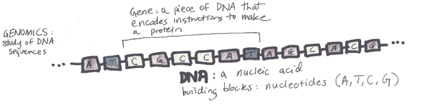

DNA 是双链的；为了简单起见，我在上面的卡通图中只展示了一条线。DNA 的双链性质是“双螺旋”的原因:


来自[维基百科](https://upload.wikimedia.org/wikipedia/commons/0/0c/DNA_animation.gif)的动画

这两股 DNA 相互缠绕形成双螺旋。一条链中的信息是另一条链中信息的“镜像拷贝”。这是由于 A、T、C 和 G 构件是如何相互配对的。a 与 T 配对，C 与 g 配对。因此，如果一条链读为“AAATTC ”,则相反的链将总是读为“TTTAAG”。一条链的信息量等于另一条链的信息量。

拥有两份相同的信息似乎是一种浪费，但事实上 DNA 的双链性质非常重要:

*   双链[促进了 DNA 复制](https://www.genetics.org/content/209/2/357)(即复制整个基因组，这必须在每次一个细胞分裂成两个细胞时发生，因为每个“子细胞”都需要基因组的完整副本)；
*   双链使得身体能够[错误纠正基因组](https://www.genetics.org/content/209/2/357)(即，如果在复制过程中出现错误，双链能够纠正错误)；
*   双链[比单链](https://sciencing.com/structural-stability-dna-double-helix-2232.html)更稳定，这对生命蓝图的稳定非常重要。

从计算的角度来看，你只需要一条链的序列来进行分析。

人类基因组计划是一个国际项目，旨在找出一个人的完整 DNA 序列——即读出一个人基因组中所有 30 亿个 A、T、C 和 G 字母。人类基因组计划花费了 27 亿美元。如今，花少几个数量级的钱获得完整的基因组序列是可能的——例如，你可以花 299 美元通过 Nebula Genomics 获得你的整个基因组序列。

# **基因组学**

基因组学是对人类、动物、细菌等的 DNA 序列的研究。为了了解健康和疾病，基因组经常被相互比较。

例如:

*   可以比较健康人和病人的基因组，以了解影响疾病风险或直接导致疾病的基因(*例如*参见“[全基因组关联研究](https://en.wikipedia.org/wiki/Genome-wide_association_study)”)。
*   许多人的基因组可以进行比较，以了解与疾病无关的基因组中的自然变异——例如，*影响头发颜色、眼睛颜色、身高和其他特征的基因。*
*   为了重建生命树和理解进化史，可以比较人和动物的基因组。

## **基因的异同**

这个星球上任何随机选择的男人[和这个星球上任何随机选择的女人](https://scholar.harvard.edu/files/srichard/files/richardson_2010.pdf)有 99.9%的基因相同。

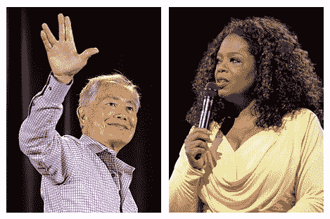

例如，[竹井乔治](https://upload.wikimedia.org/wikipedia/commons/thumb/f/f6/George_Takei_by_Gage_Skidmore_3.jpg/220px-George_Takei_by_Gage_Skidmore_3.jpg)和[奥普拉·温弗瑞](https://en.wikipedia.org/wiki/Oprah_Winfrey#/media/File:Oprah_in_2014.jpg)有 99.9%的基因相同

黑猩猩和人类总体上有 96%的基因相同(在编码区域有 98%的基因相同):

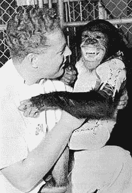

[两个人。](https://en.wikipedia.org/wiki/Hominini)

狗和狼有 99.9%的相似性，事实上它们在基因上是如此相似，以至于从技术上来说它们是同一物种:

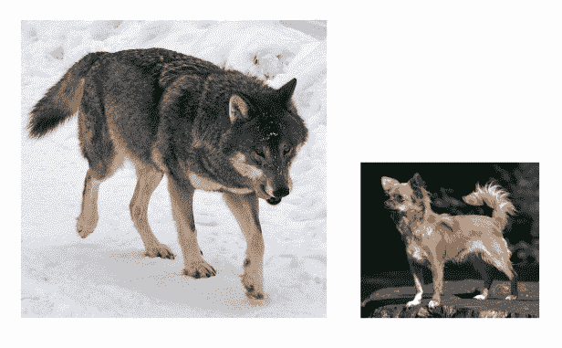

狼的形象来自[维基百科](https://en.wikipedia.org/wiki/Wolf#/media/File:Kolm%C3%A5rden_Wolf.jpg)；吉娃娃图片来自[维基百科](https://en.wikipedia.org/wiki/Chihuahua_(dog)#/media/File:Chihuahua1_bvdb.jpg)。

因此，大部分基因组学是关于识别导致差异的微小基因组部分(狗是一个特别有趣的研究物种，因为它们在大小、颜色、行为、寿命和疾病风险方面有很大差异)。基因组学可能是“大海捞针”，特别是在比较不同的人类基因组以了解疾病风险时，因为任何给定的两对人类几乎都是相同的。

## **各种基因组数据**

假设一个人的 DNA 序列可以存储大约 750 兆字节。然而，在现实中，DNA 测序的过程并不完美，它不是从开始到结束获得完整基因组的一个完美读数，而是产生许多部分读数，这些读数必须像拼图一样组装在一起。例如，假设给你以下句子片段:

*   “鸟儿飞了进来”
*   《天空中的苍蝇》
*   “在天空中歌唱”

把这些句子对齐叠加起来，就可以重构出“小鸟在天空中飞翔歌唱”这句话了。

因为 DNA 是以这种方式测序的，所以直接从测序机器上得到的原始 DNA 序列大约是 200 千兆字节，并且在分析之前必须被“清除”。想了解更多信息，你可以看看这篇文章。

到目前为止，我们只是在谈论获得完整的基因组序列，这被称为“全基因组测序”也可以用其他种类的基因组测量进行基因组研究:

*   [全外显子组测序(“WES”)](https://en.wikipedia.org/wiki/Exome_sequencing):在这项技术中，只有基因组的编码部分(编码蛋白质的部分)被测序。
*   [SNP 基因分型](https://en.wikipedia.org/wiki/SNP_genotyping):在这项技术中，只测量已知重要位置的单个字母。“SNP”是“单核苷酸多态性”:单一，因为它只有一个位置(例如“4，576，877 位”)，核苷酸，因为 DNA 的构件是核苷酸，并且在该位置有一个核苷酸(A、T、C 或 G)，以及多态性，因为这些是被考虑的特殊位置，已知它们在群体中是变化的(即它们是“多态性的”)。在一个 SNP 上有某些核苷酸而不是其他核苷酸会导致戏剧性的后果。例如，镰状细胞贫血症这种疾病可以由单个核苷酸的改变引起。

# **RNA &转录**

像 DNA 一样，RNA 是一种核酸——具体来说，是核糖核酸。

DNA 和 RNA 的比较:

*   DNA 由 A、T、C 和 g 组成。RNA 由 A、U、C 和 g 组成。因此，RNA 含有 U(尿嘧啶)而不是 T(胸腺嘧啶)。
*   DNA 是双链的。RNA 是单链的。
*   DNA 是用来稳定、长期储存制造生物所需的所有信息的。RNA 被用作临时模板来帮助制造蛋白质。

这是可以从人类基因 S100A10 中提取的 RNA 序列:

```
AAUCAAAGAACCCGGCCGUCCUGCCGGUGGGGCACGUGGCGCAGAACCAGAGGUAACCGGUUUAGGGCAUCCCACCCUGAGCCUGCCCUUCCUCUCGGGUUUGGUUUUAGAAAGUGUACAGCCCCAGACAGAGCGUUCUUGUAAACUUCUCUUCAGUAGAAACGGUCCUGCUCUCGAAUACCGGGCGCGCGGCCCACGCCCUGCCCUCGCUCCCGGACCCGCCUCGCAGAGCGCUCGCCCGGCAGGGCGCUCCCCCAGCCCUGUCUCCUCCCCCUCUUCCUGCCCCCGACUCCCCCGACCACGUGCGGCGGGUGGGUAGAGGGAGGCGGUGCGGGACGGGGAGGAGCCUGGCGGGCGCUCGUGGGCGACGUGGACGCGGGGCGGAGAGGCGAGCGCGGCGGGCUGUGCGCCUUCCUUAGUGGGCCGAACUGGGAGCUCACCUUGGCCGAGGCGCGGCGGACGCUGGGCGAGCUGGGCGAC
```

[使用[arep.med.harvard.edu](http://arep.med.harvard.edu/labgc/adnan/projects/Utilities/revcomp.html)计算]

RNA 被用作构建蛋白质的模板。首先，一段 RNA 是基于 DNA 中的一个基因构建的。从 DNA 上制造 RNA 的过程被称为“转录”，因为 RNA 是从 DNA 上“转录”下来的，利用了前面讨论的配对规则(除了这次不是 DNA 链-DNA 链配对来形成双螺旋，而是 D [NA 链-RNA 链配对](https://www.peekskillcsd.org/cms/lib/NY01913880/Centricity/Domain/827/DNA%20RNA%20Base%20Pairing%20Rules.pdf)来制造 RNA 模板):

*   RNA C 与 DNA G 配对
*   RNA G 与 DNA C 配对
*   RNA U 与 DNA A 配对
*   RNA A 与 DNA T 配对

接下来，这段 RNA 被用来制造蛋白质，这个过程被称为“翻译”，因为 RNA 的核苷酸构件被“翻译”成蛋白质的氨基酸构件:

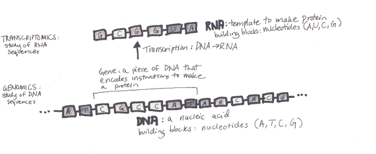

# **转录组学**

“转录组学”是对 RNA 序列的研究。转录组学很有趣，因为它告诉我们在身体的不同部位什么基因被“开启”。

让我们回到 DNA 序列作为指导手册的类比:


回想一下，橙色和蓝色文本分别包含构建“机器 Z”和“机器 B”的指令(代表两个基因，它们提供构建蛋白质 Z 和蛋白质 B 的指令)。

现在，假设我们每次要向工厂的一个房间添加新的机器 Z 时，都必须为“机器 Z”影印页面—也许我们正在将机器 Z 指令的影印页面交给某个要去构建机器 Z 的工人。如果我们为“机器 Z”影印页面总共 25 次， 然后有人溜进工厂的房间，计算机器 Z 页的复印总数，就可以推断出在工厂的那个特定房间里，我们需要 25 台机器 Z。

这样，通过统计工厂某个房间(身体部位)的影印(RNA 转录物)数量，我们就可以推断出工厂那个部位使用最多的是哪些机器(蛋白质)。

身体是由组织构成的——比如肌肉是一种组织，神经细胞是另一种组织。这是来自 [genevisible](https://genevisible.com/tissues/HS/Gene%20Symbol/S100A10) 的图表，显示了 S100A10 基因“表达”的前 10 个组织——换句话说，S100A10 基因在这些组织中最频繁地被转录成 RNA:

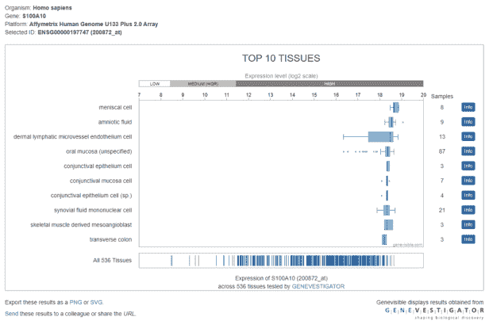

从图表中我们可以看到，S100A10 基因在身体的某些部位比其他部位使用得更多。“表达”只是从 DNA 中提取一段 RNA 的另一种说法。当一个基因被用来制作 RNA 模板时，我们说这个基因被“表达”了。短语“测量基因表达”指的是检测特定目的基因制造 RNA 的程度。换句话说，[“测量基因表达”](https://www.nature.com/scitable/definition/microarray-202/)与“测量转录组”相同。

# **蛋白质&翻译**

到目前为止，我们已经讨论了 DNA 是如何变成 RNA 的。现在我们将讨论 RNA 的用途:作为制造蛋白质的模板。

蛋白质是在体内执行不同工作的小机器。我不会轻易使用“机器”这个词——蛋白质确实是分子机器。下面是一个动画，展示了马达蛋白质驱动蛋白沿着微管(一种微观支撑结构，像建筑物中的木梁)拖动囊泡(一种微观存储容器，像背包):

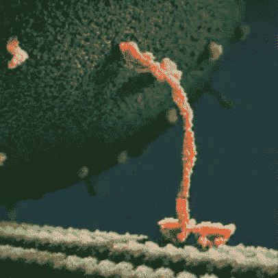

[GIF 来源](https://imgur.com/4bAORXP.gif)

蛋白质是由氨基酸组成的。在人类中，有 20 种氨基酸可以作为蛋白质的组成部分。

以下是用于制造人体蛋白质的 20 种氨基酸，以及它们的单字母和三字母缩写:

*   **G** —甘氨酸
*   **脯氨酸(Pro)**
*   **甲**——丙氨酸
*   **V** —缬氨酸(Val)
*   **L** —亮氨酸
*   **I** —异亮氨酸(Ile)
*   **M** —蛋氨酸(Met)
*   **C** —半胱氨酸
*   **F** —苯丙氨酸
*   **Y** —酪氨酸
*   **W** —色氨酸
*   **H** —组氨酸(His)
*   **K** —赖氨酸
*   **R** —精氨酸
*   **问** —谷氨酰胺(Gln)
*   **N** —天冬酰胺(Asn)
*   **E** —谷氨酸
*   **D** —天冬氨酸(Asp)
*   **S** —丝氨酸
*   **T** —苏氨酸

回到我们的 S100A10 的例子，这是最终由基因 S100A10 产生的蛋白质的完整蛋白质序列:

```
MPSQMEHAMETMMFTFHKFAGDKGYLTKEDLRVLMEKEFPGFLENQKDPLAVDKIMKDLD QCRDGKVGFQSFFSLIAGLTIACNDYFVVHMKQKGKK
```

【序列来源:[uniprot.org](https://www.uniprot.org/uniprot/P60903.fasta)

提醒:

*   当你读出一个蛋白质序列时，“G”代表氨基酸“甘氨酸”，但当你读出一个 DNA 序列时，“G”代表核苷酸“鸟嘌呤”。
*   类似地，“C”在蛋白质序列中代表“半胱氨酸”,但在 DNA 序列中代表“胞嘧啶”,
*   “T”代表蛋白质序列中的“苏氨酸”,但代表 DNA 序列中的“胸腺嘧啶”,
*   “A”在蛋白质序列中代表“丙氨酸”,但在 DNA 序列中代表“腺嘌呤”。
*   幸运的是，你可以很快分辨出一个序列是蛋白质还是 DNA，因为蛋白质序列将包含比 ATCG 更多的字母。

尽管氨基酸和核苷酸的名字听起来很相似，但它们之间有很大的不同，具有不同的分子结构。这是 20 种氨基酸的示意图(其中 O 是氧，H 是氢，N 是氮，不带字母的角是碳):

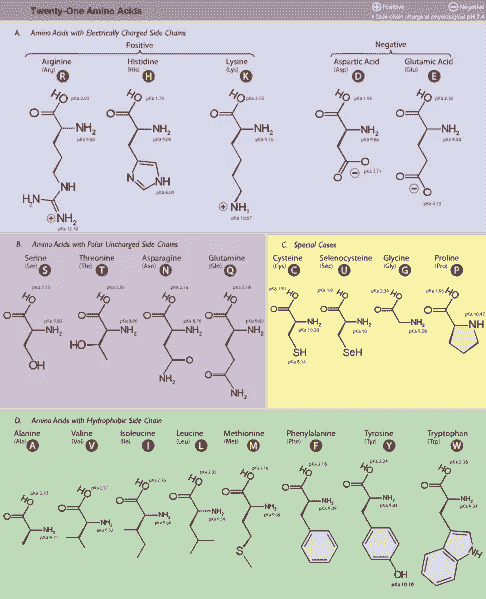

来源:[维基百科](https://commons.wikimedia.org/wiki/File:Amino_Acids.svg)

蛋白质是用一段 RNA 作为模板制成的。RNA 模板规定了应该用什么样的氨基酸来制造蛋白质。

你可能会问，如果 RNA 只由 4 种核苷酸组成，怎么可能为由 20 种不同氨基酸组成的蛋白质指定指令？如果核苷酸和氨基酸之间有一对一的映射，那么我们只能编码 4 种不同的氨基酸。如果核苷酸和氨基酸之间存在二对一的映射，那么我们只能使用这些 2 元核苷酸编码来编码 4 x 4 = 16 种不同的氨基酸:


因为两个仍然不够，身体用 3 个核苷酸来表示一个氨基酸。使用 3 个氨基酸提供了 4×4×4 = 64 种可能性，这足以编码 20 种可用的氨基酸(留下一些三联体来编码“开始”和“停止”)。3 个氨基酸的组合被称为“三联体”或“[密码子](https://en.wikipedia.org/wiki/Genetic_code)在“翻译”(从 RNA 制造蛋白质)的过程中，身体以三个字母为单位读取 RNA，一次产生一个氨基酸。

“打破遗传密码”发生在 [1966 年](https://www.genome.gov/25520300/online-education-kit-1966-genetic-code-cracked)，指的是通过实验确定哪些氨基酸对应于哪些核苷酸三联体的艰苦努力的结果。

这是遗传密码，显示了从 RNA 三联体(如“UUU”)到氨基酸(如“苯丙氨酸”)的映射:

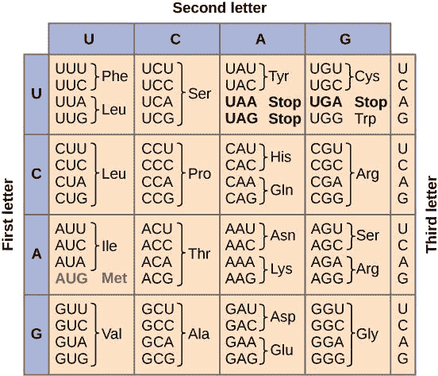

[遗传密码。CC 乘 3.0](https://cnx.org/contents/GFy_h8cu@9.87:QEibhJMi@8/The-Genetic-Code)

序列“AUG”(标记为红色)既作为“起始”指示([“起始密码子”](https://en.wikipedia.org/wiki/Start_codon))又作为氨基酸甲硫氨酸(Met)的编码。序列“UAA”、“UAG”和“UGA”都代表“停止”剩下的三个字母代码都表示特定的氨基酸。从图中可以看出，遗传密码是多余的，即有多种方式编码同一种氨基酸。

这是我们的图表，包括所有的部分:DNA、RNA 和蛋白质。

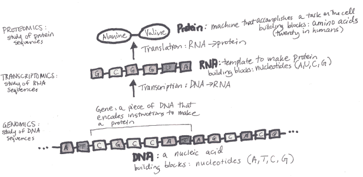

注意，标记为“基因”的 DNA 序列具有序列 CGCCAT，根据前面描述的配对规则，它对应于所示的 RNA 序列:GCGGUA。然后，使用遗传密码表，我们可以看到，RNA 中的 GCG 对应的是氨基酸丙氨酸(Ala)，而 RNA 中的 GUA 对应的是氨基酸缬氨酸(Val)。(为了简单起见，我在图中省略了“开始”和“停止”密码子)。

快速补充一下[的实际大小](https://bionumbers.hms.harvard.edu/files/Human%20genome%20and%20human%20gene%20statistics.pdf):真正的基因比图片中显示的 6 个核苷酸要大得多。平均蛋白质编码基因由 53，600 个核苷酸组成(也写作“53.6 kb”，其中 kb =千碱基；53.6 x 1,000 个碱基)。最大的基因是 2.4 兆碱基(dystrophin)，正如你所想象的，它编码了一段真正巨大的 RNA，最终是一段真正巨大的蛋白质。

## **可视化蛋白质**

有许多方法可以看到一个给定基因最终产生的蛋白质。蛋白质是以氨基酸序列的形式产生的，但它们最终会折叠成对其功能非常重要的三维结构。确定蛋白质的三维结构需要大量的工作，确定蛋白质的功能也需要大量的工作。x 射线晶体学是一种可以用来确定蛋白质三维结构的技术。还有一个大的计算研究领域专注于预测仅给定其序列的蛋白质的 3D 结构(这是一个非常困难的问题)。

这是几个由 S100A10 基因产生的蛋白质的图像，来自瑞士模型。如果你想以一种互动的 3D 方式移动这些渲染图，你可以在这里[这样做](https://swissmodel.expasy.org/repository/uniprot/P60903?csm=3E8E03A6E7DD7A8D)。

首先，这是 S100A10 蛋白的“球和棒”渲染，其中每个原子是一个球，原子之间的连接是棒:

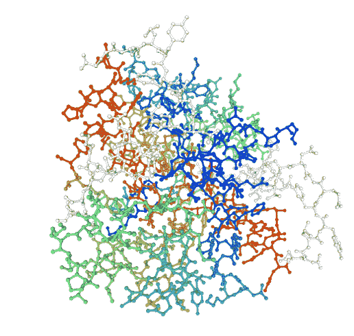

这是一个“空间填充”渲染:

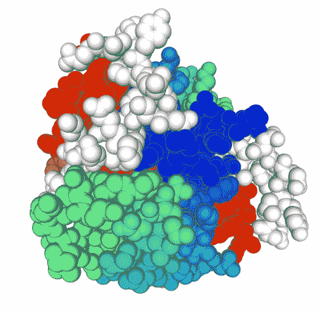

下面是一个“表面”渲染:

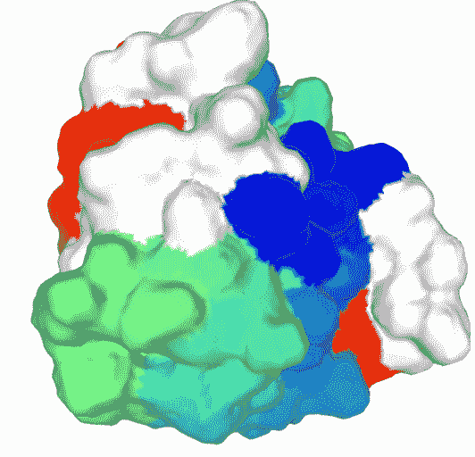

最后，这是一幅卡通渲染图(螺旋是一种抽象的非文字形式的 3D 主题，称为“阿尔法螺旋”，在许多蛋白质中可见):

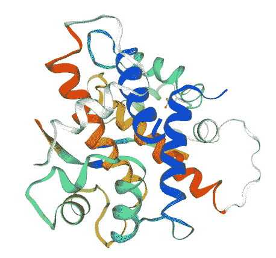

# **蛋白质组学**

你可能已经猜到了，蛋白质组学指的是对蛋白质的大规模研究。你可能会奇怪，如果我们有基因组学(了解构建身体的所有指令)和转录组学(了解身体的哪些部分需要哪些机器)，为什么还会有人想研究蛋白质组学。

事实证明，转录组学并不能完美地代表身体的哪个部位需要什么样的机器，因为 RNA 并不能以 1:1 的比例合成蛋白质。换句话说，你不能仅仅统计基因 A 产生的 RNA 片段的数量就得出结论，因为基因 A 有 100 个 RNA 片段，这意味着产生了 100 个版本的蛋白质 A。有时候，RNA 根本没有被制成蛋白质。有时，某一段 RNA 被用来制造许多蛋白质，而其他时候，一段 RNA 只被用来制造少数蛋白质。因此，蛋白质组学提供了一种更直接的方法来评估特定身体部位的机器总数。

通过结合基因组学、转录组学和蛋白质组学的分析，我们可以更全面地了解生物的健康状况和功能。

# **细胞的内部生命**

最后，我强烈推荐观看 YouTube 视频[“细胞的内部生活”](https://www.youtube.com/watch?v=wJyUtbn0O5Y)它描绘了我们在这篇文章中谈到的许多过程，是对我们所有人体内分子机制的惊人和生物学上准确的描述。

# **总结**

*   DNA 是生命的蓝图。人体内的 30 亿个 DNA 字母包含了构建身体的所有指令。
*   基因组学是对大规模 DNA 序列的研究。
*   转录是用 DNA 制造 RNA 模板的过程。
*   翻译是使用 RNA 模板制造蛋白质的过程。
*   转录组学是对 RNA 序列的大规模研究。
*   蛋白质是在体内执行不同功能的分子机器。
*   蛋白质组学是对大规模蛋白质的研究。

*原载于 2020 年 4 月 11 日 http://glassboxmedicine.com**[*。*](https://glassboxmedicine.com/2020/04/11/genomics-transcriptomics-and-proteomics-for-data-scientists-dna-rna-protein/)*