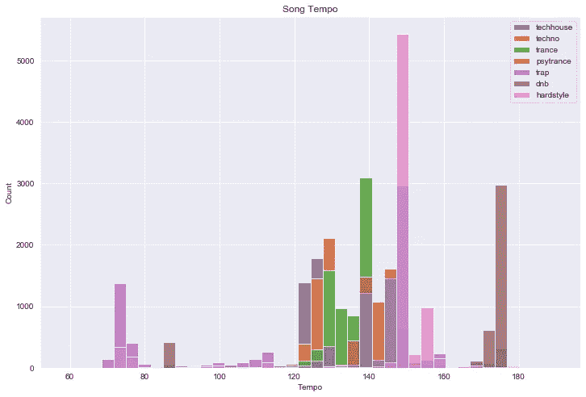
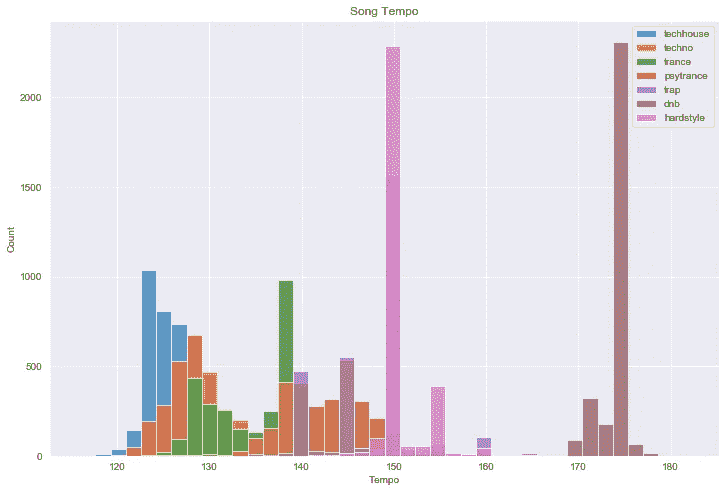
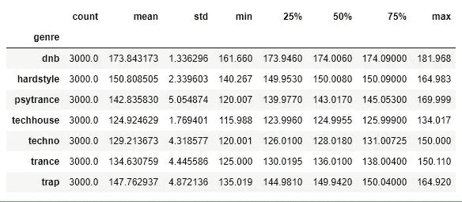
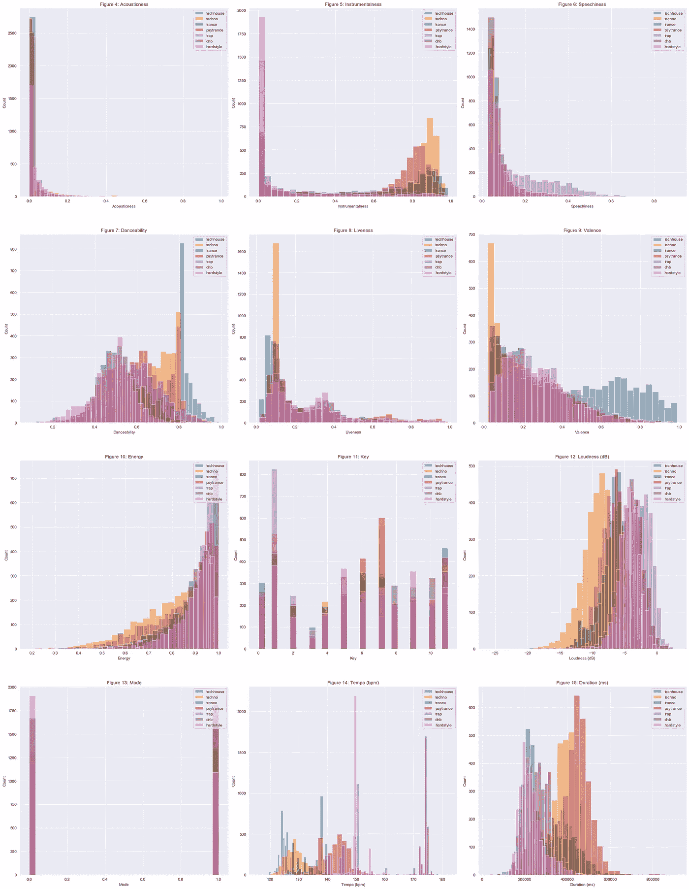
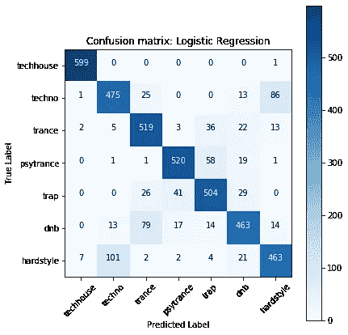
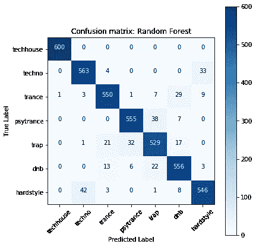
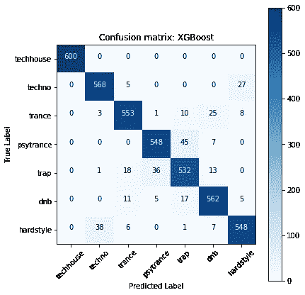
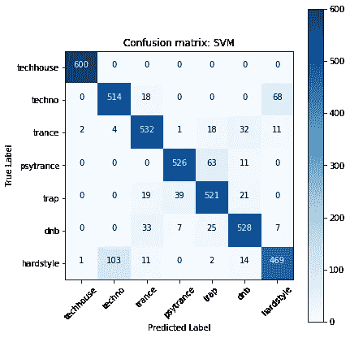
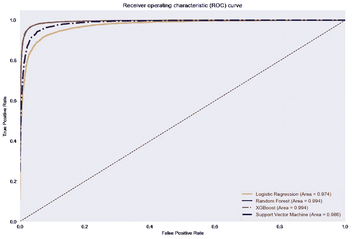

# 利用 Spotify 的音频分析对电子舞曲进行流派分类

> 原文：<https://towardsdatascience.com/genre-classification-of-electronic-dance-music-using-spotifys-audio-analysis-7350cac7daf0?source=collection_archive---------6----------------------->

## 使用机器学习深入研究 EDM


Aditya Chinchure 在 [Unsplash](https://unsplash.com/s/photos/music-festival?utm_source=unsplash&utm_medium=referral&utm_content=creditCopyText) 上拍摄的照片

# 介绍

电子舞曲有一个史诗般的起源故事。它始于 DJ 用鼓机给迪斯科唱片配音，并在非法的仓库派对上播放。我们今天所知的 EDM 已经发展成为一个价值 7 . 5 亿美元的庞大产业。随着受欢迎程度的提高，越来越多的听众将会接触到他们从未听过的流派和子流派。

随着 Spotify 等流媒体服务使用机器学习算法推出个性化歌曲推荐，发现新音乐也变得前所未有的简单。作为一名听众，第一次听到一首歌并沉浸在一种新的风格中是最令人愉快的部分。发现自己在一个有趣的兔子洞，异想天开地添加越来越多的歌曲到您保存的歌曲。可能会导致 Spotify 图书馆混乱无序。

该项目探索了机器学习算法的应用，使用 Spotify 的音频分析对给定歌曲的流派进行识别和分类。允许用户按流派自动组织他们的图书馆。

这个项目的所有代码可以在这里找到:【https://github.com/towenwolf/genre-classification 

# 数据集

包含 7 个独特的电子舞曲类别的 21，000 首歌曲的音频分析:tech house，techno，trance，psy-trance，trap，drum & bass 和 hardstyle。这些歌曲是从 136 个用户创建的播放列表中收集来的，来自可靠的来源，如经过验证的唱片公司和官方 Spotify 播放列表。

为了获得数据集，我在 python 上编写了一个脚本，从 Spotify 的开发者应用程序获取凭证，读取播放列表的 csv 文件，检索播放列表中每首歌曲的音频特征，并创建一个按流派标记的歌曲数据框。该脚本还删除了任何重复的，低于 50 bpm 的低节奏歌曲，以及超过 16 分钟的歌曲。最终的数据集随机抽取了每个类别的 3000 首歌曲进行分析。

数据帧的每一行代表一首歌曲，列是歌曲的[音频特征](https://developer.spotify.com/documentation/web-api/reference/tracks/get-audio-analysis/)测量:

**声学** —一首歌曲是纯声学的还是合成的概率。歌曲的录音将具有接近 1 的值。

**乐器性** —一首歌不含人声的概率。纯器乐歌曲的值会更接近 1。

**语音度** —一首歌只包含语音的概率。朗读单词轨道和声乐简介的值将接近 1。

**可跳性** —一首歌的可跳性从 0 到 1 不等。

**活跃度** —检测录像中是否有观众，范围从 0 到 1。

**价**——一首歌的意境。听起来快乐的歌曲值接近 1，听起来悲伤的歌曲值接近 0。

**能量** —强度和活动的感知度量。高能轨道感觉起来很快，很响，很嘈杂，接近 1。

**Key** —估计的轨道整体 Key。

**响度** —音轨的整体响度，单位为分贝(dB)。

**Mode** —表示一个音轨的模态(大调或小调)，大调用 1 表示，小调为 0。

**速度** —轨道的总体估计速度，单位为每分钟节拍数(BPM)。

**拍号** —一个音轨的估计整体拍号。

**持续时间** —音轨的持续时间，单位为毫秒(ms)。

获取 _ 数据笔记本

使用 Spotify 的 API 来构建数据集而不是分析原始音频的优点是节省时间和计算能力，尤其是在大型数据集的情况下。要了解如何使用 Spotify 的 API，请查看这篇文章。

# 探索性数据分析

为了找到有助于按流派对歌曲进行分类的特征，我们应该听听它们之间的差异……一些歌曲比其他的快/慢吗？因为我们没有时间去听数据集中的每一首歌。让我们通过查看每种风格的速度分布直方图来直观地检查差异。



图 1:歌曲速度

我们看到一些节奏较低的歌曲，特别是陷阱、鼓和贝斯以及硬派风格的歌曲。我怀疑音频分析返回的是半场节奏，而不是全程节奏。这不是问题，考虑到中场休息在音乐上是正确的。只是换个角度看每分钟打多少拍，只数第一和第三个四分音符而不是一、二、三、四。比如一首 140 bpm 的歌，半场就 70 bpm 了，这对于某些流派来说很常见。为了解决这个问题，我编写了一个函数，将任何作为半场时间返回的速度更改为全时时间，以保持数据的一致性。

当使用用户创建的播放列表时，我们遇到的另一个潜在问题是将不属于该流派的歌曲添加到播放列表中，导致错误标记的观察。例如，用户可能错误地将一首说唱歌曲放在了家庭播放列表中。查看技术宅节奏的描述统计，我们可以看到最小值和最大值远远高于和低于平均值。

```
techhouse
count    3509.000000
mean      124.917453
std         2.845667
min        95.075000
25%       123.995000
50%       124.995000
75%       125.998000
max       217.009000
```

这些远离平均节奏的数据点告诉我们，它们实际上并不属于科技流派。如果我们像这样给算法错误标记的观察值，它会导致分类器正确预测的问题。因此，为了解决这个问题，我根据阿贝尔顿的音乐制作章节中关于[节奏](https://learningmusic.ableton.com/make-beats/tempo-and-genre.html)的内容，用流派的*已知*节奏为数据设置了一个阈值。

## 类型的速度范围

*   配音:60-90 BPM
*   嘻哈音乐:60-100 次/分钟
*   房价:每分钟 115 至 130 美元
*   技术/催眠:120-140 次/分钟
*   dubstep:135–145 BPM
*   鼓和贝斯:160–180 BPM



图 2:调整半场/用户错误后的歌曲速度



图 3:按流派的节奏统计

在对用户的错误进行调整并将半拍节奏改为全拍节奏后，流派节奏的分布显示出围绕其均值和等方差的单峰结构。从统计学上讲，数据具有这些特征是很重要的，因为许多算法使用假设正态性的线性模型。这意味着在预测一首歌曲的风格时，节奏会有很大的分量。

现在，除了速度，还有什么其他音频分析功能可以帮助预测正确的流派？



图 4–15:音频分析特征直方图

如果你看一下可跳舞性的直方图(图 7)，我们会发现技术宅和电子乐平均来说比所有其他流派更“适合跳舞”。这并不奇怪，豪斯和泰克诺以他们的高帽和掌声让舞者们点头而闻名。数据的结构是正常的，并且类型的平均值彼此不同，表明这将是另一个有助于分类的特征。

观察歌曲整体响度的差异(图 12)也给了我们一些对流派差异的洞察。陷阱，鼓&低音和 hardstyle 都是以非常高的分贝录制的，揭示了这些流派在扬声器上可以输出的强度和力量。听这些流派的时候不要把耳机开得太大。

歌曲的持续时间(图 15)也在它可能属于的流派中起作用。Psy-trance 和 techno 歌曲比其他类型的歌曲长得多，75%以上的数据在每首 6-15 分钟之间。

不适合分析的突出特征是调、调式和拍号，这些都是与歌曲的音乐性相关的分类特征。它们可能在以后的分析中有用，但对于本项目，它们将从要素选择中移除。

# 训练机器学习分类器

为了训练分类模型，我们需要将数据分成特征和标签。使用来自 sklearn 的标签编码器对类型标签进行编码。

```
X = data[features].copy()
y = LabelEncoder().fit_transform(data[‘genre’])
```

## 列车测试分离

然后使用 sklearn 的 train_test_split 将数据分成训练集和验证集，随机将数据分成 80/20%的块，用于训练和验证分类器。

```
X_train, X_test = train_test_split(X, test_size=0.2, random_state=98)
y_train, y_test = train_test_split(y, test_size=0.2, random_state=98)
```

## *数据预处理*

使用 sklearn 的 MinMaxScaler，所有的特征将被转换为 0 到 1 之间的相同比例。

```
scaler = MinMaxScaler()
scaler.fit(X_train)X_train = pd.DataFrame(scaler.transform(X_train), columns = X.columns)
X_test = pd.DataFrame(scaler.transform(X_test), columns = X.columns)
```

## 分类器

既然数据准备好了，分类器就要被训练并预测每种类型的概率。分类器是一种算法或“机器”,它使用统计数据来输出一个数学模型，该模型与我们输入的数据相匹配。允许我们预测有用的东西，比如一首歌是什么类型的！在本文中，我们不打算深入研究每一种算法的数学原理，但会提供一个简短的解释，说明是什么使这些分类算法成为这个用例的候选算法。

## 逻辑回归

是一个线性数学模型，通常用于二元分类。在这种情况下，我们有 7 个类别，并将实施 One vs Rest 方法，该方法将训练 7 个单独的模型，概率最高的一个将是预测的类别。

```
# Train logistic regression model
logreg = LogisticRegression(penalty='l2', max_iter=10000, multi_class='ovr')
logreg.fit(X_train, y_train)# Probabilities of each genre
logreg_probs = logreg.predict_proba(X_test)
```

## 随机森林

是适合许多决策树分类器的集成分类器。使用 sklearn 的 GridSearchCV 找到了最佳参数。

```
# Train random forest model with optimal parameters
rf = RandomForestClassifier(max_depth=25, min_samples_leaf=1, min_samples_split=5, n_estimators=1200)
rf.fit(X_train, y_train)# Probabilities of each genre 
rf_probs = rf.predict_proba(X_test)
```

## XGBoost

Boosting 是另一种通过组合多个弱学习器(如决策树)获得的集成分类器。使用 sklearn 的 GridSearchCV 找到了最佳参数。

```
# Train model with optimal parameters
xgb = XGBClassifier(max_depth=5, learning_rate=0.1, objective='multi:softprob', n_estimators=500, sub_sample = 0.8, num_class = len(genres))
xgb.fit(X_train, y_train)# Probabilities of each genre
xgb_probs = xgb.predict_proba(X_test)
```

## SVM

经典的分类算法，常用于二元分类。就像逻辑回归一样，将使用一对其余的方法。

```
# Train model with optimal parameters
svm = SVC(gamma='auto', probability=True)
svm.fit(X_train, y_train)# Probabilities of each genre
svm_probs = svm.predict_proba(X_test)
```

# **评估分类模型**



## *逻辑回归*

准确率:84%

F1 得分:0.84

ROC AUC: 0.974

墙壁时间:543 毫秒

对于一个简单的分类器来说还不错，预测最正确的类型是技术宅和 psy-trance。



## *随机森林*

准确率:93%

F1 得分:0.93

ROC AUC: 0.994

挂壁时间:40.6 秒

随机森林的表现明显更好。建议决策树分类器是使用该数据进行分类的好方法。



## *XGBoost*

准确率:93%

F1 得分:0.93

ROC AUC: 0.994

挂壁时间:52.2 秒

得分几乎与 random forest 完全相同，只是在预测上有微小的变化。预测的准确性有一个清晰的结构。



## *支持向量机*

准确率:88%

F1 得分:0.88

ROC AUC: 0.986

挂壁时间:16.1 秒

除了电子音乐和硬派音乐之外，大多数音乐类型都有相对较高的准确度。错误地预测了两者的关系。

## 受试者工作特征曲线

评估分类器算法性能的另一种方法。说明了特异性和敏感性的权衡，曲线下面积越大，预测越准确。



图 20:分类器的 ROC 曲线

XGBoost 和 Random forest 算法在预测歌曲类型方面表现最佳。在对技术宅进行分类时，所有算法都表现良好，在所有分类器上都具有近乎完美的准确性。一些 techno 的例子经常与 hardstyle 混淆，反之亦然，也是 psy-trance 的陷阱。这表明这些流派之间的差异可能比音频特征能够检测到的更微妙。

## 讨论

Random Forest 和 XGBoost 的性能在大规模自动分类流派的能力方面都很有前途。能够根据音频分析的特征来确定一首歌曲的流派，可以帮助听众组织他们的图书馆或推荐类似的歌曲。

但最终，真正让每种音乐风格独一无二的是它在聆听时激发的感觉和情感。自己听一听，这里有分析中使用的 Spotify 播放列表的链接。

*   [技术宅](https://open.spotify.com/playlist/7AUqarp6W3pf0tVFrRvzZw?si=HcQlT3iPSPGRseRFOOJcCg)
*   [泰克诺](https://open.spotify.com/playlist/37i9dQZF1DX6J5NfMJS675?si=cm_V6tw4TmmZZd--LRNbWw)
*   [恍惚](https://open.spotify.com/playlist/37i9dQZF1DX91oIci4su1D?si=6HrdgfzHQy-KkSjXAV7aXg)
*   [精神恍惚](https://open.spotify.com/playlist/37i9dQZF1DWXWbLEOaHnU3?si=MuWeSFtxQLSYkMpzCAT06Q)
*   [陷阱/低音音乐](https://open.spotify.com/playlist/6Sr742m2alGaGfmqf9uweW?si=NywOUTIPRdi3lPPKofACZw)
*   [硬质风格](https://open.spotify.com/playlist/56Dq7bAWZ6aXfGnYHqPtm3?si=Voex0bGdQbCZFQ6HCzwPLw)
*   [鼓&贝斯](https://open.spotify.com/playlist/6qkFoVGCjhrfQzHZ153fG8?si=qCKuXepvThiw1nTnDOXLkw)

接下来，我想找到算法有效分类一个流派的最少歌曲数量。这样一来，流派数量的规模就可以包括大量的小众流派。如果某个流派有足够多的播放列表，那么分类器甚至能够预测最狂野的流派，比如俄罗斯波尔卡硬核音乐(见下文)。所以，走出去，做一些你最喜欢的类型的公共播放列表。

Gif 由 Ohmagif.com 的未知

## 参考

 [## 使用机器学习技术的音乐流派分类

### 在音乐信息检索领域，根据音乐文件的类型对其进行分类是一项具有挑战性的任务

arxiv.org](https://arxiv.org/abs/1804.01149) [](https://medium.com/@maxtingle/getting-started-with-spotifys-api-spotipy-197c3dc6353b) [## 开始使用 Spotify 的 API & Spotipy

### 《数据科学家快速入门指南》,指导如何浏览 Spotify 的 Web API 并使用 Spotipy Python 访问数据…

medium.com](https://medium.com/@maxtingle/getting-started-with-spotifys-api-spotipy-197c3dc6353b) [](https://learningmusic.ableton.com/make-beats/tempo-and-genre.html) [## 节奏和风格

### 一首音乐的风格(或流派)是由许多因素决定的，包括声音的类型和…

learningmusic.ableton.com](https://learningmusic.ableton.com/make-beats/tempo-and-genre.html) [](https://spotipy.readthedocs.io/en/2.9.0/) [## 欢迎来到 Spotipy！- spotipy 2.0 文档

### Spotipy 是 Spotify Web API 的轻量级 Python 库。有了 Spotipy，您可以完全访问所有音乐…

spotipy.readthedocs.io](https://spotipy.readthedocs.io/en/2.9.0/) [](/making-your-own-discover-weekly-f1ac7546fedb) [## 制作自己的 Spotify Discover 每周播放列表

### 每周一醒来我都很兴奋。在你认为我是那种喜欢每天去上课的怪人之前…

towardsdatascience.com](/making-your-own-discover-weekly-f1ac7546fedb) [](https://stackoverflow.com/questions/39086287/spotipy-how-to-read-more-than-100-tracks-from-a-playlist) [## Spotipy:如何从一个播放列表中读取超过 100 首曲目

### 感谢贡献一个堆栈溢出的答案！请务必回答问题。提供详细信息并分享…

stackoverflow.com](https://stackoverflow.com/questions/39086287/spotipy-how-to-read-more-than-100-tracks-from-a-playlist)