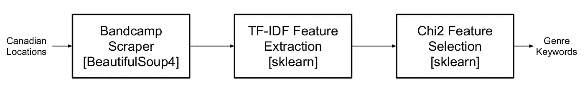
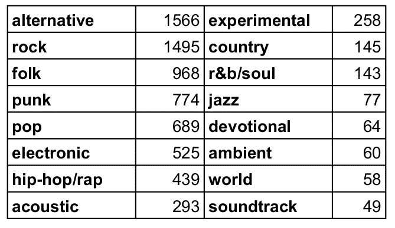
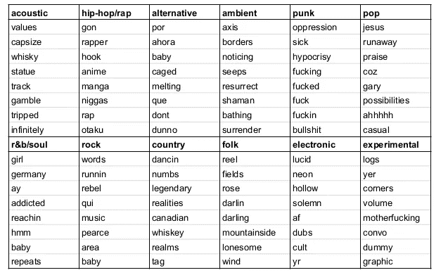

# 使用 Bandcamp 歌词的流派特征选择

> 原文：<https://towardsdatascience.com/genre-feature-selection-using-bandcamp-lyrics-c61a3902c969?source=collection_archive---------94----------------------->

## 使用 Python 的 scikit-learn 和 langdetect 根据歌词关键字特征对音乐类型进行分类

照片由乔丹 N 圣约翰市中心

歌词通常根据其对应的音乐流派具有共同的关键词和短语。例如，民间音乐经常反映自然和朴实的主题，而朋克音乐反映个性和自由。

我最近一直在为最近发布的搜集 Bandcamp，这时我意识到我有了一个不错的数据集来根据流派进行文本分类。下面是如何处理数据的框图。

数据集大小超过 7500 首歌曲，涵盖 16 个流派，使用 BeautifulSoup4 web scraper 生成。请注意，这些歌曲来自加拿大的位置，所以许多(1000+)不得不删除，因为他们的法语内容。我使用 python langdetect 库来检测每首歌对应的语言。数据集也不是平均分布在各个流派中，但是这个项目的目的不是分类，而是简单的特征检索。具有较少数据点的类型在最终结果中被忽略。

为了执行文本分类，我使用了 scikit-learn 的 TF-IDF(术语频率逆文档频率)特征提取器以及 chi2 特征选择器，这是根据一个类似的项目[这里](/multi-class-text-classification-with-scikit-learn-12f1e60e0a9f)。 [TF-IDF 变换](https://scikit-learn.org/stable/modules/generated/sklearn.feature_extraction.text.TfidfVectorizer.html)强调更罕见但更有趣的术语，而 [chi2 特征选择器](https://scikit-learn.org/stable/modules/generated/sklearn.feature_selection.chi2.html)试图忽略“过于罕见”且与分类无关的术语。常见的[停用词](https://www.geeksforgeeks.org/removing-stop-words-nltk-python/)如“the”和“but”从该分类中移除，以生成更有意义的特征。最相关的单字(单个词)的最终无序结果如下所示。

虽然原声音乐和民间音乐有更健康的常用词，如“领域”和“价值”，但像嘻哈和朋克这样的流派有更多的世俗语言。我喜欢电子和 r&b 使用含糊不清的语言，而实验真的不知道它在做什么。

我可以创建一个分类器，但我认为我的数据集不够大。我知道 Genius API 相对容易使用，我可以从中获得更多的歌词，但那是以后的事了。感谢阅读:)

产生这些数据的加拿大音乐数据库可以在这里找到。当前代码在[这里](https://github.com/jpnaterer/sonicboards/blob/master/scripts/analyze_lyrics.py)可用，存储库在[这里](https://github.com/jpnaterer/sonicboards)可用。