# 卡方独立性检验简介

> 原文：<https://towardsdatascience.com/gentle-introduction-to-chi-square-test-for-independence-7182a7414a95?source=collection_archive---------5----------------------->

## 统计数字

## 使用 Jupyter 笔记本的卡方初学者指南


由[卢克·切瑟](https://unsplash.com/@lukechesser?utm_source=medium&utm_medium=referral)在 [Unsplash](https://unsplash.com?utm_source=medium&utm_medium=referral) 上拍摄的照片

```
**Table of contents**[**Introduction**](#6a58) 1\. [Prerequisite](#19e2)
 2\. [SciPy package](#9b64)
 3\. [Setup](#b9f9)
 4\. [Python indexing](#794a)
 5\. [chi2_contingency](#92ef)
 6\. [Expected values](#77b7)
 7\. [𝜒2 value](#e764)
 8\. [Side note about Latex](#8a58)
 9\. [p-value](#bebc)
10\. [Degree of freedom](#72ba)
11\. [Importing data](#c195)
12\. [Pandas.DataFrame.transpose()](#53f4)
13\. [Critical values](#41b8)
14\. [The null and alternative hypotheses](#56a0)[**Conclusion**](#56b6)
```

# 介绍

独立性的卡方检验也称为皮尔逊卡方检验。卡方独立性检验用于科学、经济、营销或其他各种领域。有三种方法可以使用卡方。独立性卡方检验显示了两组数据是如何相互独立的。拟合优度检验的卡方显示了您的数据与期望值的差异。[同质性测试](https://courses.lumenlearning.com/wmopen-concepts-statistics/chapter/test-of-homogeneity/)确定两个或更多人口是否具有单一分类变量的相同分布。

在本文中，我们将使用 Jupyter 笔记本探索独立性的卡方检验。哦，顺便说一下，我们把 chi 发音为 kai，就像 kite 一样，而不是 Chili 中的 Chi。𝜒是希腊字母“Chi ”,所以𝜒2 读卡方。

# 先决条件

即使这篇文章是针对几乎没有编码经验的初学者，阅读的《Jupyter 笔记本入门指南》会帮助你如何入门。

[](/beginners-guide-to-jupyter-notebook-8bb85b85085) [## Jupyter 笔记本初学者指南

### 从设置到描述性统计

towardsdatascience.com](/beginners-guide-to-jupyter-notebook-8bb85b85085) 

# SciPy 包

为了找到卡方，我们将使用 [SciPy](https://www.scipy.org/) 包。SciPy 是一个基于 Python 的数学、科学和工程开源软件。`[scipy.stats.chi2_contingency](https://docs.scipy.org/doc/scipy/reference/generated/scipy.stats.chi2_contingency.html)`是独立性卡方检验的有用工具。还有一个叫做`[scipy.stats.chisquare](https://docs.scipy.org/doc/scipy/reference/generated/scipy.stats.chisquare.html?highlight=stats%20chisquare#scipy.stats.chisquare)`的，用于卡方拟合优度检验。

# 设置

[启动 Anaconda，启动 Jupyter 笔记本](http://bit.ly/2S1yHIm)。


通过单击新建> Python 3 创建一个文件。

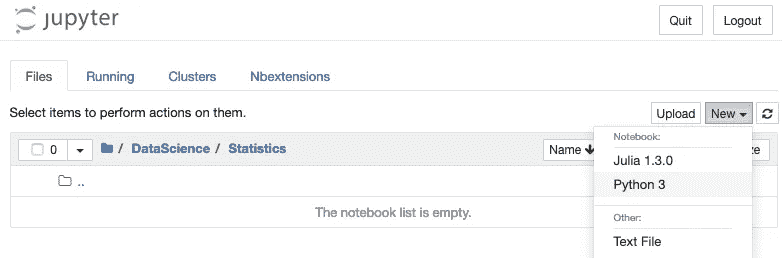

将文件重命名为“卡方独立性检验”。


在第一个单元格中，我们将导入 chi2_contingency、pandas 和 numpy 库。

```
from scipy.stats import chi2_contingency
import pandas as pd
import numpy as np
```

在 Jupyter 笔记本中运行代码时，按 SHIFT + RETURN。

我们将创建样本数据。假设我们收集了男女最喜欢的 t 恤颜色的数据。我们想弄清楚肤色和性别是否独立。我们使用 Pandas 数据帧创建一个小样本数据，并将我们的数据存储在一个名为`tshirts`的变量中。

熊猫`index`和`columns`用于命名行和列。为了打印我们的`tshirts`变量中的内容，我们只需在最后写下`tshirts`，并输入 SHIFT + RETURN。

```
tshirts = pd.DataFrame(
    [
        [48,22,33,47],
        [35,36,42,27]
    ],
    index=["Male","Female"],
    columns=["Balck","White","Red","Blue"])
tshirts
```

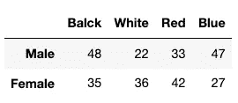

您可以通过使用`columns`找到列中的标签。

```
tshirts.columns
```

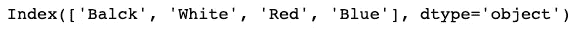

同样，您可以使用`index`来找出什么是索引。

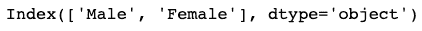

# Python 索引

Python 使用从零开始的索引。这意味着，第一个元素的索引为 0，第二个元素的索引为 1，依此类推。如果您想访问`chi2_contingency(tshirts)`中的第四个值，您需要使用`[3]`。

# chi2 _ 偶然性

SciPy 的`chi2_contingency()`返回四个值， *𝜒* 2 值，p 值，自由度和期望值。

```
chi2_contingency(tshirts)
```

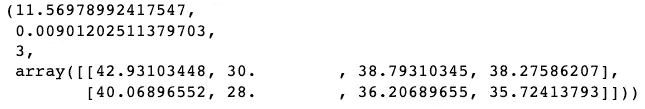

# 期望值

您可以在返回值的第四行找到期望值。它是一个数组形式。让我们友好地打印期望值。我们再次使用熊猫数据框架。我们将添加索引和列值，并将这些值四舍五入到两位小数`round(2).`

```
df=chi2_contingency(tshirts)[3]pd.DataFrame(
    data=df[:,:], 
    index=["Male","Female"],
    columns=["Black","White","Red","Blue"]
).round(2)
```

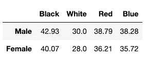

上表称为列联表。您可以使用以下公式根据观察数据计算期望值。

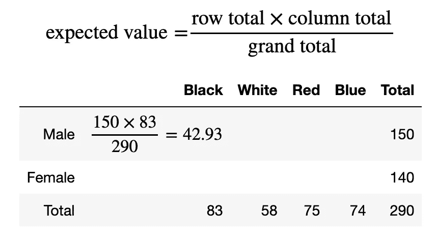

# 𝜒2 值

你可以在`chi2_contingency`返回的第一个值中找到 *𝜒* 2 的值。但是你如何手动找到𝜒2 呢？卡方的公式是:

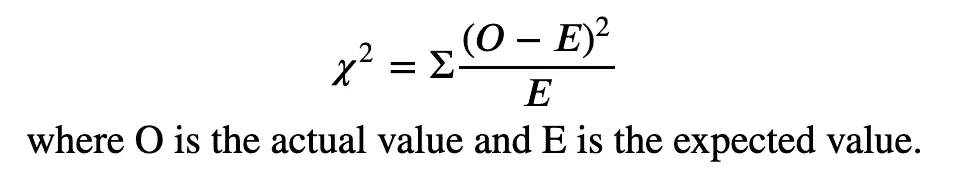

卡方公式

𝜒公式告诉我们，要找到实际值和期望值之差的平方，然后除以期望值。然后将所有这些加在一起，得出 *𝜒* 2 值。

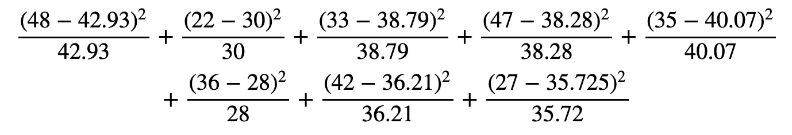

卡方的手工计算

这就是`chi2_contingency`在幕后做的事情。由于 Python 是基于 0 的索引，为了打印出 *𝜒* 2，我们需要使用第一个值`[0]`。

```
chisquare=chi2_contingency(tshirts)[0]
chisquare
```

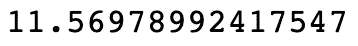

# 关于乳胶的补充说明

我用 Latex，发音为‘lah-Teck’在 Jupyter 笔记本上写了上面的等式。您正在写的单元格必须是 Markdown，这是您需要在单元格中键入的内容。

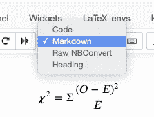

```
\begin{equation}
\chi^2=\Sigma\frac{(O-E)^2}{E} \\
\text{where O is the actual value and E is the expected value.}
\end{equation}
```

# p 值

您可以在返回值的第二个位置找到 p 值。p 值衡量当零假设为真时看到效果的概率。因此，当 p 值足够低时，我们拒绝零假设，并得出结论，观察到的效果成立。我们将在本文后面讨论零假设。

*   [https://www.machinelearningplus.com/statistics/p-value/](https://www.machinelearningplus.com/statistics/p-value/)
*   [https://statisticsbyjim . com/hypothesis-testing/hypothesis-tests-significance-levels-alpha-p-values/](https://statisticsbyjim.com/hypothesis-testing/hypothesis-tests-significance-levels-alpha-p-values/)
*   [https://www . analyticsvidhya . com/blog/2015/09/hypothesis-testing-explained/](https://www.analyticsvidhya.com/blog/2015/09/hypothesis-testing-explained/)

```
pvalue=chi2_contingency(tshirts)[1]
pvalue
```

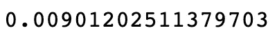

# 自由度

你可以在第三个返回值中找到自由度。我们待会要用这个来求临界值。你为独立的 *𝜒* 2 找到自由度(dof)的方式与 *𝜒* 2 拟合优度不同。

争取 *𝜒争取* 2 独立:

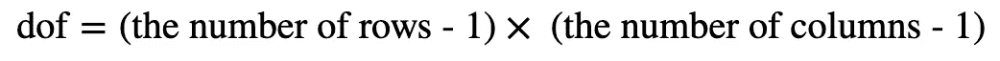

例如，如果您的数据有 4 行 x 3 列，则自由度为:

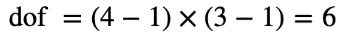

对于 *𝜒* 2 拟合优度，分类数据有一维。自由度是:

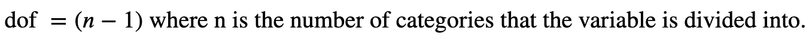

在从`chi2_contingency`返回的值中，第三个是自由度。我们用第三个`[2]`。下面将输出 3。

```
dof=chi2_contingency(tshirts)[2]
dof
```

[](/the-subtlety-of-spearmans-rank-correlation-coefficient-29478653bbb9) [## 斯皮尔曼等级相关系数的微妙性

### 单调关系的未知部分

towardsdatascience.com](/the-subtlety-of-spearmans-rank-correlation-coefficient-29478653bbb9) 

# 导入数据

## 水平数据

通常，您希望从文件中导入数据。第一个 CSV 文件包含横向数据。通过使用`pd.read_csv`，数据自动转换为熊猫数据帧。

CSV 文件包含以下数据。

```
gender,Black,White,Red,Blue
Male,48,12,33,57
Female,35,46,42,27
```

让我们将数据存储到一个名为`tshirtshor`的变量中。我们添加`index_col="gender"`使性别列成为索引。

```
csvfile = '[https://raw.githubusercontent.com/shinokada/python-for-ib-diploma-mathematics/master/Data/tshirts-horizontal.csv'](https://raw.githubusercontent.com/shinokada/python-for-ib-diploma-mathematics/master/Data/tshirts-horizontal.csv')
tshirtshor = pd.read_csv(csvfile,index_col='gender')
tshirtshor
```

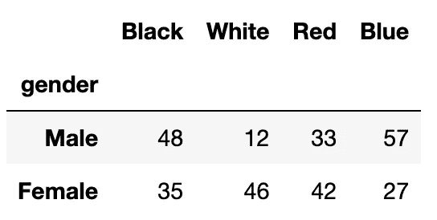

我们在`tshirtshor`上运行`chi2_contingency`。

```
chi2_contingency(tshirtshor)
```

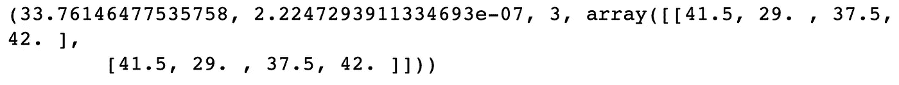

## 垂直数据

我们将使用垂直布局的数据。让我们将数据存储到一个名为`tshirtsver`的变量中。

```
csvfile2 = '[https://raw.githubusercontent.com/shinokada/python-for-ib-diploma-mathematics/master/Data/tshirts-vertical.csv'](https://raw.githubusercontent.com/shinokada/python-for-ib-diploma-mathematics/master/Data/tshirts-vertical.csv')
tshirtsver = pd.read_csv(csvfile2,index_col='Color')
tshirtsver
```

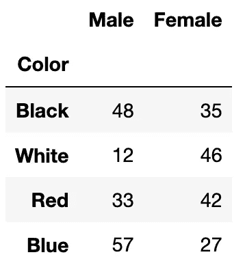

我们在`tshirtsver`上运行`chi2_contingency`。除了期望值之外，我们得到了和以前一样的值。

```
chi2_contingency(tshirtsver)
```

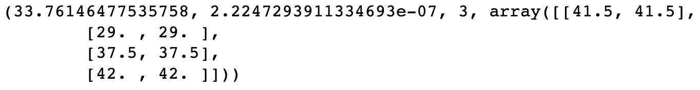

# 熊猫。DataFrame.transpose()

如果你更喜欢水平数据而不是垂直数据，你可以通过使用`Pandas.DataFrame.transpose()`或简称`T`将数据从垂直转置为水平。

```
tshirtsver.T
```

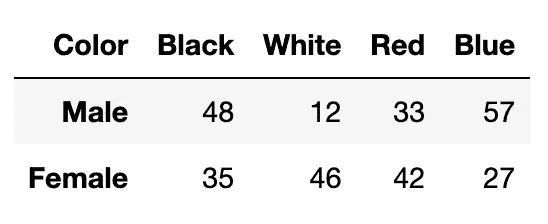

使用`chi2_contingency()`。

```
chi2_contingency(tshirtsver.T)
```

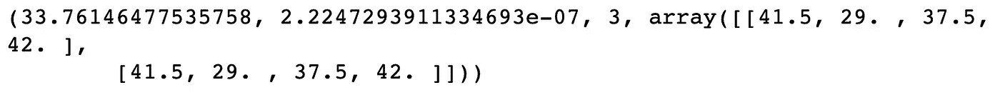[](/modeling-functions-78704936477a) [## 建模功能

### 从线性回归到逻辑回归

towardsdatascience.com](/modeling-functions-78704936477a) 

# 临界值

显著性水平和自由度可用于寻找临界值。正如我之前提到的，你可以从数组中找到自由度。为了找到临界值，您需要从 scipy.state 导入 chi2，并从显著性、1%、5% 10%等级别定义概率。

```
from scipy.stats import chi2
significance = 0.01
p = 1 - significance
dof = chi2_contingency(tshirtshor)[2]
critical_value = chi2.ppf(p, dof)
critical_value
```

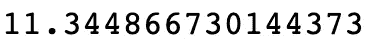

当自由度为 3 且显著性水平为 1%时，临界值约为 11.34。您可以使用 cdf 确认该值。下面将输出 0.99。

```
p = chi2.cdf(critical_value, dof)
p
```

# 无效假设和替代假设

卡方检验要求陈述原假设 H0 和替代假设 H1。零假设是指我们的两个变量是独立的。另一个假设是他们不是独立的。

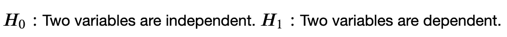

```
subjects = pd.DataFrame(
    [
        [25,46,15],
        [15,44,15],
        [10,10,20]
    ],
    index=['Biology','Chemistry','Physics'],
    columns=['Math SL AA','Math SL AI','Math HL'])
subjects
```

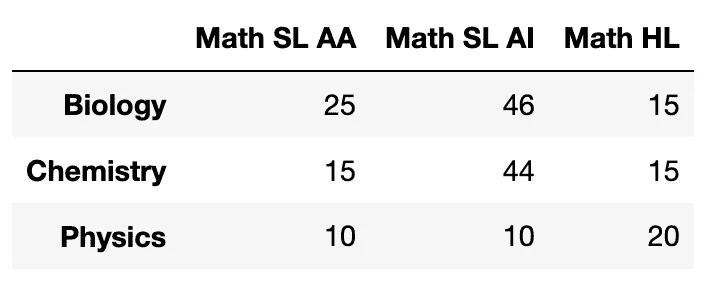

如果计算的卡方大于临界值，我们拒绝零假设。

```
chi, pval, dof, exp = chi2_contingency(subjects)
print('p-value is: ', pval)
significance = 0.05
p = 1 - significance
critical_value = chi2.ppf(p, dof)print('chi=%.6f, critical value=%.6f\n' % (chi, critical_value))if chi > critical_value:
    print("""At %.2f level of significance, we reject the null hypotheses and accept H1\. 
They are not independent.""" % (significance))
else:
    print("""At %.2f level of significance, we accept the null hypotheses. 
They are independent.""" % (significance))
```

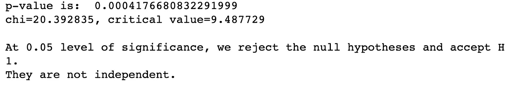

或者，我们可以比较 p 值和显著性水平。如果`p-value < the level of significance`，我们拒绝零假设。

```
chi, pval, dof, exp = chi2_contingency(subjects)
significance = 0.05print('p-value=%.6f, significance=%.2f\n' % (pval, significance))if pval < significance:
    print("""At %.2f level of significance, we reject the null hypotheses and accept H1\. 
They are not independent.""" % (significance))
else:
    print("""At %.2f level of significance, we accept the null hypotheses. 
They are independent.""" % (significance))
```

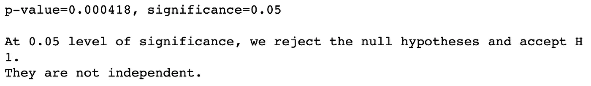

# 结论

在本文中，我使用 Jupyter 笔记本解释了卡方检验的基础知识。独立性卡方检验需要零假设和替代假设、期望值、卡方值、p 值、自由度和临界值。

**通过** [**成为**](https://blog.codewithshin.com/membership) **会员，获得媒体上所有故事的访问权限。**


[请订阅。](https://blog.codewithshin.com/subscribe)

# 参考

*   [https://stats . stack exchange . com/questions/110718/chi-squared-test-with-scipy-what-the-difference-between-chi 2-contingency-and](https://stats.stackexchange.com/questions/110718/chi-squared-test-with-scipy-whats-the-difference-between-chi2-contingency-and)
*   [https://www.machinelearningplus.com/statistics/p-value/](https://www.machinelearningplus.com/statistics/p-value/)

[](/exploring-normal-distribution-with-jupyter-notebook-3645ec2d83f8) [## 用 Jupyter 笔记本探索正态分布

### 使用 scipy 和 matplotlib 的正态分布初学者指南

towardsdatascience.com](/exploring-normal-distribution-with-jupyter-notebook-3645ec2d83f8)