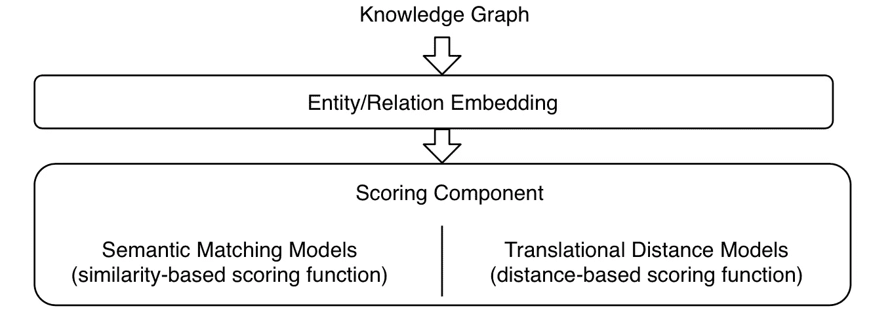
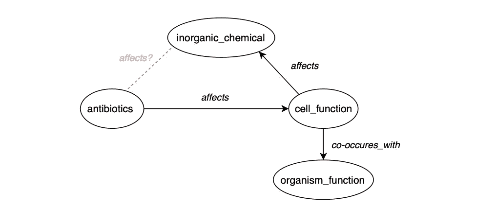
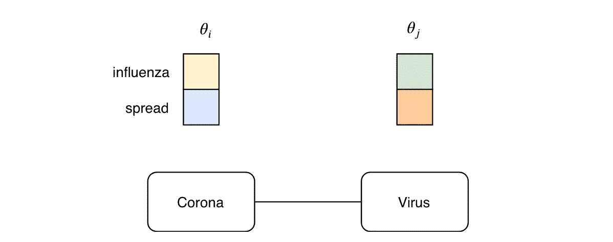
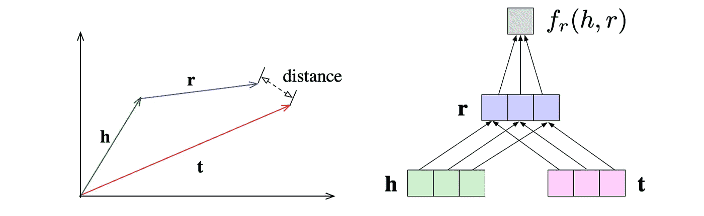

# 知识表征学习简介

> 原文：<https://towardsdatascience.com/gentle-introduction-to-knowledge-representation-learning-1ee873830219?source=collection_archive---------41----------------------->

知识表示学习(KRL)主要关注学习知识图嵌入的过程，同时保持语义的相似性。事实证明，作为特征输入，这对于各种预测和图形分析任务非常有用[1，2，3]。我们将在以后的文章中进一步阐述具体的应用。现在我们将主要关注技术实现。

一般来说，KRL 系统包括三个部分(图 1)。知识图数据、将图解码成低维向量空间的实体/关系嵌入，以及第三，评分组件测量事实的似然性，以采用嵌入之间的语义相似性。这里，我们可以区分基于相似性的评分函数和基于距离的评分函数。

图 1:知识表示学习系统的三个主要组成部分

# 知识图谱

知识图(KG)以图中节点和边之间的互连形式表示知识(图 2)。它提供了从实体之间的关系中提取的事实的结构化表示。实体可以是现实世界的对象，也可以是抽象的概念，关系是连接两者的箭头。

图 2:更大的生物医学知识图表的一部分

Fromally 定义为三元组(头实体，关系，尾实体)，设 *E={e_1，…，e_n}* 为所有实体(头和尾)的集合， *R={r_1，…，r_m}* 为知识图中所有关系的集合。这组实体和关系上的每个潜在三元组 x_ijk 可以用一个压缩在三维邻接张量中的二元随机变量 *y_ijk= 0* ∨ *y_ijk = 1，*来表示。

图 3:表示现有相互作用的邻接张量 E × R × E ∈ KG

# 实体/关系嵌入

在第一步中，我们通过实体的潜在特征嵌入三元组:对以下事实的一种可能解释是:*冕*是 V *病毒*与在人类中迅速传播的流感家族有关。这种解释使用实体的潜在特征(例如，流感家族的一部分)来解释可观察到的事实。这个概念不太直观，因为它不能在数据中直接观察到。图 4 提供了一个简单的例子。这里，我们应用两个特征来代表每个实体。实体*电晕*的潜在特征表示 *θ_i* 可以表示为二维特征向量。注意，在实践中，特征维度大约为 200，并且不像这个例子，通常由潜在特征模型推断，这使得它们通常不可能被翻译或解释。关系潜在特征模型的基本直觉是，实体之间的关系可以从它们潜在特征的数学交互中得到解释。有多种可能的方法来模拟这些交互，也有多种方法可以从中推导出关系的存在，其中一些我们将在第二步中探讨。

图 4:每个实体节点的二维嵌入向量的例子。

# 评分组件

这里，想法是在向量空间中嵌入相似/连接的节点。在内部，该模型试图最大化任何*三重∈ KG* 的 *f(θ_h，θ_r，θ_t)* 的得分，并最小化不在 KG 中的三重*的得分。这个过程通过多个时期进行迭代，以共同学习图中所有节点/关系的嵌入。在神经链接预测模型中，这两个步骤都由多层神经网络组成，该网络由编码层(CNN 工作得非常好)和多个评分组件(大多数是完全连接的层)组成，以测量三元组的似然性。各个模型之间的主要区别在于它们对评分函数 *f* 的选择。根据使用的评分函数，模型可以大致分为两种主流，平移距离模型和语义匹配模型。基于距离的评分函数通过计算实体之间的距离来衡量事实的似然性，其中广泛使用具有 h + r ≈ t 关系的附加翻译。基于语义相似度的评分通过语义匹配来衡量事实的似然性，通常采用乘法公式，即 h⊤M_r ≈ t⊤，来转换表示空间中靠近尾部的头部实体。*

图 5:基于翻译距离的评分(左)和基于语义相似性的评分函数(右)[4]

# 参考

1.  曹绍圣，，许琼凯。Grarep:用全局结构信息学习图形表示。在 2015 年第 24 届 ACM 国际信息和知识管理会议的会议记录中，第 891-900 页。
2.  阿迪蒂亚·格罗弗和朱尔·莱斯科维奇。node2vec:网络的可扩展特征学习。载于*第 22 届 ACM SIGKDD 知识发现和数据挖掘国际会议论文集*，第 855–864 页，2016 年。
3.  布莱恩·佩罗齐、拉米·艾尔弗和史蒂文·斯基纳。深度行走:在线学习社会表征。载于*第 20 届 ACM SIGKDD 知识发现和数据挖掘国际会议论文集*，第 701–710 页，2014 年。
4.  季，邵雄，等。知识图的研究综述:表示，获取和应用。arXiv 预印本 arXiv:2002.00388 (2020)。