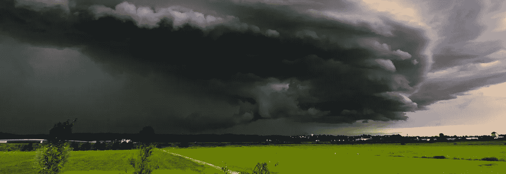
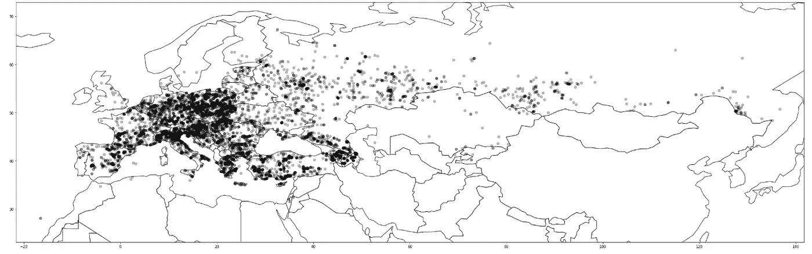
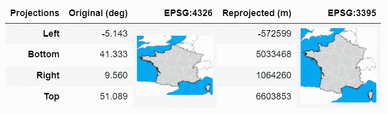
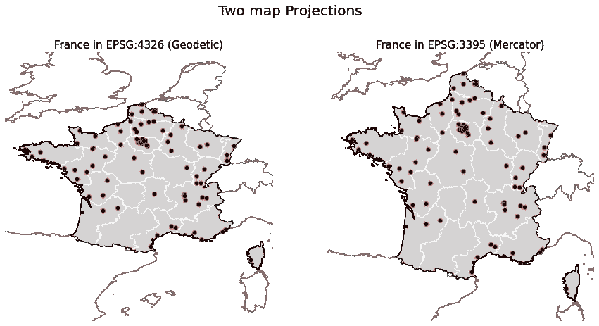
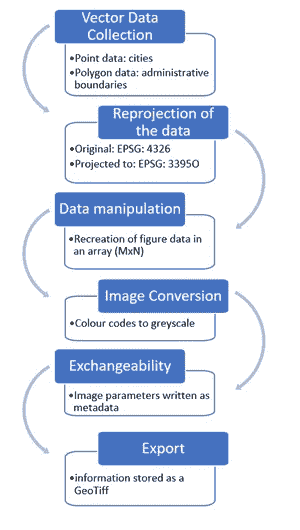
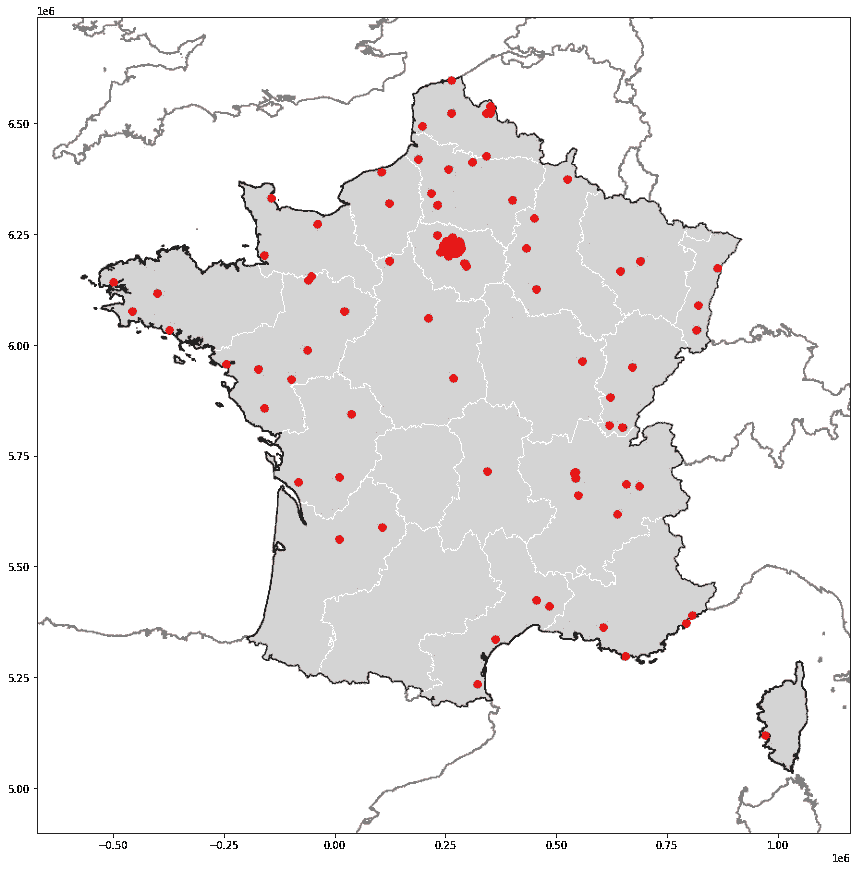
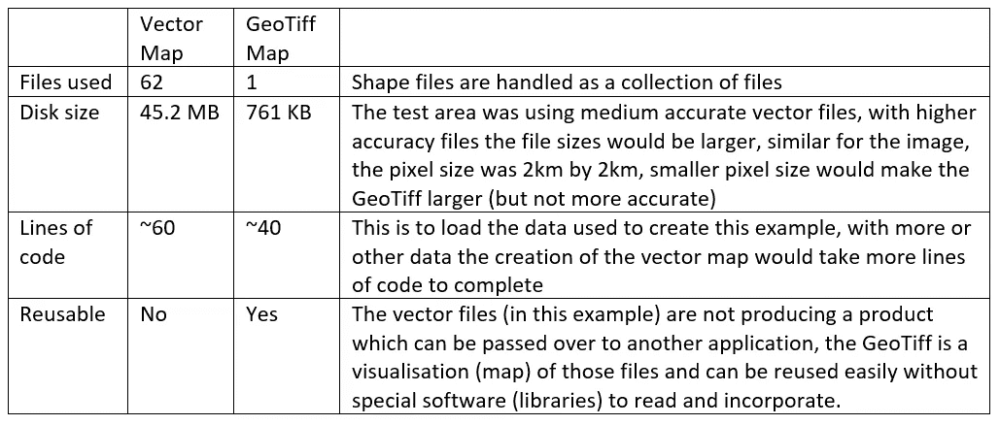

# 将图形地理参考为图像

> 原文：<https://towardsdatascience.com/geo-referencing-a-figure-as-an-image-fc5e77caa00b?source=collection_archive---------38----------------------->



## *从矢量数据创建静态背景图像，用作 Jupyter 笔记本中 MatLibPlot 图形的标准图层。*

## 动机

最近，我开始从事一项新的研究项目，研究欧洲自然事件观测的模式。为了使协作更容易，我想与其他人分享我的笔记本，一起解决问题，并展示数据分析的结果。

目前，我正在使用[ [GeoPandas 0.7.0](https://geopandas.org/) 作为地理数据处理库，其中包括一组矢量文件。然而，该版本中仅包含美国县轮廓和世界国家，分辨率非常低(见下图)。标准数据可用于生成地图，甚至进行一些粗略的空间分析。

边界文件足以在世界范围内显示国家统计数据，也可以在区域级别使用。当范围缩小到国家级别(例如法国的轮廓)时，地图就不再那么有用了。在这种情况下，应该使用外部数据来创建图形，以捕捉所需的细节。



欧洲的名胜(使用 GeoPandas)

外部矢量数据可以有许多不同的“形状”和格式，包括 Shapefiles(最常用的、ArcInfo Coverage、E00 ArcInfo Interchange、空间数据库引擎(ArcSDE)、数字线图(DLG)、GeoJSON、AutoCAD DXF 和 Keyhole 标记语言(KML)等等。

格式的独特处理是不可避免的，每种数据类型都需要特定的方法来加载和可视化数据。这让我想到，也许可以简化背景图的创建和共享。

比如，如果项目中的每个人都以相同的风格和布局看着相同的图像/图形，会怎么样？

> **一张静态背景图！**

这不是一个新概念，也不会在所有情况下都有用。尽管如此，我还是对探索创造一种方法的可能性很感兴趣，这种方法:

1.  标准化背景；这样我就可以专注于项目的其他方面，而不是为项目中的每个地块创建相同的布局(但略有不同)
2.  简化了数据交换；shapefile 是最常使用和最容易得到的，使用 shape file 的缺点是它们不是作为一个单独的文件，而是作为一个集合使用(显示一个 shape file 需要最少 3 个文件，最多 7 个文件)。
3.  减少磁盘空间；当在本地处理(shape)文件时，磁盘空间不是一个真正的问题，但是当将数据移动到(免费的)云计算环境(在这个例子中是 Google CoLab)时，磁盘空间可能会成为一个问题。背景光栅图像的传输大小只是其矢量图像的一小部分
4.  减少图形创建/显示时间，同样取决于您的本地系统或云计算环境，这可能不是问题。但是，基于栅格的地图比基于矢量的地图生成速度快得多(主要是因为数据的分辨率，矢量比栅格有更多的计算“点”)。
5.  是一个挑战。最后一点是个人的，是学习处理地理信息的新编码库的练习。

我相信这里概述的方法，并存储在链接的笔记本中，在将图像转换为地理标志并在另一个图形中重用信息方面做得相当不错。我很乐意分享这个笔记本，我希望代码对您有用，并且您可以在您的项目中测试它；我期待着评论中的反应和反馈。

**一般说明**

本文中的文本基于笔记本中的标记文本。我没有包括所有的代码(为了提高可读性)，并且在某些地方的写作可能是技术性的(为了解释程序和提供一些背景信息)。

这个项目使用的所有数据都被压缩并存储在属于这个笔记本的 GitHub 文件夹中。要使用这个笔记本，要么运行在 Google Colab 中创建的将数据带到这个笔记本的代码，要么使用本地存储的数据在本地运行代码。

*Google CoLab 笔记本链接:*[geo-referencing-a-figure-as-image . ipynb](https://gist.github.com/GvdDool/ca5eecb1ed647788a60ffff75507ca9a)

*数据链:* [行政矢量数据](https://github.com/GvdDool/Notebook-test/blob/master/Export.zip)

## 属国

这个笔记本背后的想法是创建一个可以在最少的依赖上运行的方法。有许多不同的方法和库可以处理地理数据和绘制地图。代码块中突出显示的是处理笔记本中地理数据的三个包。这些库是作为建议选择的，是完成本笔记本中的任务所必需的。还有其他包(例如 earthpy ipyleaflet 或 mpl_toolkits.basemap 等)同样适用于执行本文中描述的制图任务。

*所选库:*

```
# Data Science Packages
import numpy as np
import pandas as pd
import **geopandas** as gpd# Visualisation Package
import matplotlib.pyplot as plt
from matplotlib.backends.backend_agg import FigureCanvasAgg# Spatial Packages
import **gdal**, ogr, os, osr#Raster Packages
import **rasterio**
import rasterio.plot
from affine import Affine%matplotlib inline
```

## 装置

在下面的代码部分中，本程序中使用的所有库都被注释掉了。这是故意的，当所有的库都已经是最新的并且由用户在其他或先前的运行中安装时，笔记本敌人的加载更快(无需更新)。

```
#!pip install --upgrade numpy
#!pip install --upgrade pandas
#!pip install --upgrade geopandas
#!pip install --upgrade matplotlib
#!pip install --upgrade gdal
#!pip install --upgrade ogr
#!pip install --upgrade osr
#!pip install --upgrade rasterio
#!pip install --upgrade affine
```

## 使用的数据

本笔记本中的数据是开源的，与正在进行的项目或正在进行的研究无关。地图上显示的点(下图)是法国的主要城市，它们被选为示例位置，以显示对背景地图的操作是成功的。当使用其他数据运行代码时，可以对添加到图形中的点、线和多边形进行样式化(标记、格式化和显示)以最好地反映数据。如何格式化和可视化信息超出了本笔记本的范围。

```
#getting the data
url = 'https://github.com/GvdDool/
      Notebook-test/blob/master/Export.zip?raw=true'import requests, zipfile, io
#The copied URL goes here ->
r = requests.get(url) 
z = zipfile.ZipFile(io.BytesIO(r.content))
z.extractall("/AdministrativeData")
```

## 加载数据

本文/笔记本中突出显示的代码是出于显示比 GeoPandas 库中可用地图更详细的地图的需要而开发的。库中包含的矢量数据的质量足以创建大比例地图的小图形。但是，当放大到感兴趣的区域时，默认地图的质量不足以显示信息。

本笔记本中描述的方法是使用外部矢量数据创建自定义背景地图，并说明为法国所有国家收集的流程边界数据。对于法国，更高级别的行政边界(省)被添加到地图上，以在“感兴趣的区域”中给出更多细节。本项目的边界数据从[http://www.diva-gis.org/gdata,](http://www.diva-gis.org/gdata,)获得，使用由[https://gadm.org/](https://gadm.org/)提供的数据。点位置(城市)通过将 Diva-GIS 上列出的地名录数据与来自[http://www.map-france.com/cities/](http://www.map-france.com/cities/)的列表相结合而获得。

```
# Detailed map for France, with internal boundaries:
map_file_FR = "/AdministrativeData/Export/FRA_adm1.shp"# Detailed contry outlines
map_file_BEL = "/AdministrativeData/Export/BEL_adm0.shp"
map_file_NLD = "/AdministrativeData/Export/NLD_adm0.shp"
map_file_LUX = "/AdministrativeData/Export/LUX_adm0.shp"
map_file_DEU = "/AdministrativeData/Export/DEU_adm0.shp"
map_file_CHE = "/AdministrativeData/Export/CHE_adm0.shp"
map_file_ITA = "/AdministrativeData/Export/ITA_adm0.shp"
map_file_ESP = "/AdministrativeData/Export/ESP_adm0.shp"
map_file_GBR = "/AdministrativeData/Export/GBR_adm0.shp"
map_file_FRA = "/AdministrativeData/Export/FRA_adm0.shp"Code section <<Loading the Data>> not fully displayed
```

## x/y 和纬度/经度之间的关系

使用地理数据和地图时，有必要对地图的投影(创建)方式有一个基本的了解。我在此仅强调地图定位术语的重要性:

*   纬度值(lat)沿垂直轴(Y 轴，行)增加或减少。
*   经度值(long)随着水平轴(X 轴)的变化而变化

本笔记本的其余部分将在绘制地图时使用“X/Y”作为坐标符号。查看输出中函数调用的打印输出，我们可以得出结论，原始投影和首选投影之间存在显著差异。

*示例输出(针对法国范围):*



从 EPSG 转换:4326 到 3395

另请注意，投影系统已发生变化，在本例中，原始数据(点和多边形)被投影到:

*   WGS 84/1984 年世界大地测量系统(EPSG:4326)，并重新投影到
*   WGS 84 /世界墨卡托(EPSG:3395)

第一个投影系统用于 f.e. GPS 设备，可在全球范围内使用，单位为度(以及供应商定义的表示、小数位数)。后者更适合以欧洲为中心的世界地图，不包括极地地区。单位是米，主要用于南纬 80 度和北纬 84 度之间([https://epsg.io/](https://epsg.io/))

表中的单位在 EPSG 是度:4326，在 EPSG 是米:3395。对于两个投影来说，零经度线都穿过格林威治，负左侧意味着法国从这条线以西开始。

## 创建示例地图

请注意，在本例中,(城市)点与下图一起显示和保存，以证明该方法正在返回所需的结果。该代码旨在不启用控制点的情况下运行。

```
# print(eea_FR.total_bounds)
# Expanding the area of interest to have a bit clearnace around the edges of the data
# Values are set to get an image which is almost square 
(~7.86 x7.86 // ~12.25x12.25)
# These values have to be set based on the area of interest and the projection:
('Map1 Width: ',  7.852  // Height:   7.877)
('Map2 Width: ', 12.245  // Height:  12.269)Code section <<Creating the Example maps>> not fully displayed
```

## 重新投影的结果

代码块下方的图像显示了矢量数据在原始投影系统和目标投影系统中的投影效果。

```
#Combining the two maps#figsize : (float, float), as width, height
#f, ax = plt.subplots(1, figsize=((maxx2 - minx2)/150000,(maxy2 - miny2)/150000))
fig, (ax1, ax2) = plt.subplots(1, 2, figsize=(15,7.5))
fig.suptitle('Two map Projections', fontsize=20)
ax1.set_title('France in EPSG:4326 (Geodetic)', fontsize=15)
ax2.set_title('France in EPSG:3395 (Mercator)', fontsize=15)
ax1.set(xlim=(minx1, maxx1), ylim=(miny1, maxy1))
ax2.set(xlim=(minx2, maxx2), ylim=(miny2, maxy2))
ax1.set_axis_off()
ax2.set_axis_off()#plotting on the defined axis => ax1=ax1
eea_FR.plot(color='lightgrey', edgecolor='white', ax=ax1)
rdf.plot(facecolor='none', color='none', edgecolor='grey', ax=ax1)
eea_FRA.plot(facecolor='none', color='none', edgecolor='black', ax=ax1)#plotting on the defined axis => ax=ax2
eea_FR_rp.plot(color='lightgrey', edgecolor='white', ax=ax2)
rdf_rp.plot(facecolor='none', color='none', edgecolor='grey', ax=ax2)
eea_FRA_rp.plot(facecolor='none', color='none', edgecolor='black', ax=ax2)# In this example the points are on, and saved with the image, to prove that the 
# method is returnin the desired result.
# The code is intended to run without the contol points
geo_FR_df.plot(ax=ax1, facecolor='black', edgecolor='red')
points.plot(ax=ax2, facecolor='black', edgecolor='red')plt.savefig('FRA_map1.eps', dpi=1080, bbox_inches='tight')
plt.show()
```



地图投影的差异(EPSG: 4326 到 3395)

这是示例背景地图，法国为灰色，白色的省界，法国周围国家的边界设置为深灰色，没有填充。
当你用自己的数据运行这段代码时，布局可以根据你的个人喜好进行设置。我喜欢背景地图尽可能的中性，这样人们的注意力就会被吸引到地图的基本元素上，在这种情况下，就是法国的主要城市。

## 准备导出

代码的下一部分是准备格式化的图片，作为背景地图，以 GeoTIFF 格式保存。导出时使用 GeoTiff 格式的优势在于元数据信息嵌入在图像中。
在新图形中使用导出的 GeoTiff 时，元数据将用于重建背景图像，包括投影、像素大小和图形尺寸。

## 数据准备

背景图的数据可视化是不必要的，最终(右侧)图形在内存中处理。

```
Code section <<Data preparation>> not displayed, duplicating the earlier code block
```

## 转换数字

这是这个过程中最关键的一步，图形被转换成一个多维数组，存储像素的宽度和高度，以及颜色深度。有关该方法的详细信息，请点击下面的链接。

```
# MatPlotLib as another method to convert a Canvas to an Array:
# [https://matplotlib.org/3.1.1/gallery/](https://matplotlib.org/3.1.1/gallery/) 
     user_interfaces/canvasagg.htmlcanvas = FigureCanvasAgg(f)
# Save the figure to a string.
canvas.draw()
s, (width, height) = canvas.print_to_buffer()# Convert to a NumPy array.
X = np.frombuffer(s, np.uint8).reshape((height, width, 4))
```

**转换数据数组**

原始颜色存储在图像矩阵的最后一个维度中，作为具有四个属性的列表。在这个例子中，颜色被压缩为灰度值，因为创建的地图是具有中性色的背景地图。第四列用于 alpha(透明度),该列在本例中未使用，并设置为 0。当创建更复杂的背景地图时，可以使用第四个元素，但是有了这个地图，就不需要在多波段图像中存储原始值。

*颜色转换功能:*

```
Y = (0.2989 * (X[:,:,0])) + 
    (0.5870 * (X[:,:,1])) + 
    (0.1140 * (X[:,:,2]))
```

## 将数据数组存储为地理标志

在本笔记的下一个单元/步骤中，使用 GDAL 库将数据数组导出到图像，包括:

1.  GetDriverByName:导出为 GeoTIFF
2.  SetGeoTransform:保存坐标，以及
3.  osr。SpatialReference:以及投影，在本例中为硬编码(3395)

**使用**从图形数据创建图像

*   newRasterfn:文件名(str)
*   rasterOrigin:左上角(minx，maxy)
*   像素宽度:单元尺寸(w)
*   像素高度:单元格尺寸(h)
*   数组:图中的展平数据(NxM)

```
Code section <<Storing the data array as a GeoTiff>> is not displayed fully, and is only giving the high level view of the functions# Export array to raster (main function)
def array2raster(newRasterfn,
       rasterOrigin,pixelWidth,pixelHeight,array):
       # newRasterfn: File Name
       # rasterOrigin: upper left corner
       # pixelWidth: cell dimetion (w)
       # pixelHeight: cell dimetion (h)
       # array: the data from the figure# Creating the Image from a Figure
def createImageFromFigure(newRasterfn,
       rasterOrigin,pixelWidth,pixelHeight,array):# Creating the image from the figure data, with:
createImageFromFigure (newRasterfn,
      rasterOrigin,pixelWidth,pixelHeight,Y)Rechecking the dimentions
cols (X):  881  // rows (Y):  883
Cell size:  2084  (w) ,  2084  (h)
rasterOrigin:  (-672599.7581629481, 6738853.145639915)
Image saved to disk
```

## 总结第一部分

代码的第一部分到此结束，总结了我们到目前为止所涵盖的内容:



转换工作流程

1.  向量数据被加载到 MatPlotLib 图形中
2.  为项目选择正确的投影，并非所有项目都使用相同的坐标系。
3.  重构图像的像素信息，从多维到简单的数据阵列。
4.  背景中只需要灰度值
5.  图像的参数存储为元数据
6.  该图形存储为地理标志

在下一部分中，转换后的图像被重新加载到项目中，并检查转换过程(查看图像是否投影到正确的位置)。

## 可视化导出的图像

笔记本的这一部分相对较短，演示了如何加载数据，并使用图像作为背景图来显示新信息。

该笔记本的主要目标是创建一个简单的程序，将标准背景图像包含到其他笔记本中，而无需管理制作地图所需的数据。因此，下一个代码部分也可用于项目的相关笔记本中，但没有生成地图所需的数据和代码开销。

只剩下两项任务:

1.  加载已创建的 GeoTiff
2.  显示创建的地理标志

相对于分析和笔记本而言，显示的图形可以被丰富得多的信息。

## 重新加载检查点

查看图像的范围并检查元数据中的条目，是验证该过程是否成功的一种方法。重新导入并在导出的地图上显示城市将提供一个直观的确认，即数据的重新投影、图形的转换以及图片作为新图形的重建都按设计进行。

```
Prompt: Current projection:  epsg:3395Code section <<Reloading the checkpoints>> is not displayed fully
```

## 加载导出的图像

本节中的代码将:

*   读入带有 GeoTIFF 地理信息的文件
*   使用元数据信息重新创建图像
*   生成 X 和 Y 网格位置
*   检查边界坐标
*   将数据(颜色)作为数组读取
*   检查方向(翻转阵列)

```
Code section <<Loading the exported image>> is not displayed, duplication of earlier code
```

## 显示转换的结果

在图片下面的红点是点(城市)，在之前的段落中加载，它们完美地落在之前添加到地图的点上。在第一张地图中，这些点显示为带有红色轮廓的黑点。在转换过程中，所有颜色都被重新编码为“灰色”值，如果转换不成功，红点周围会出现“灰色/黑色”阴影。

```
# Creating the new figure with the image as background
fig, ax = plt.subplots(figsize=(15, 15))
rasterio.plot.show(src, ax=ax, cmap='gist_gray')
points.plot(ax=ax, facecolor='red', markersize=40, linewidth=2,alpha=1)     
plt.show()
```



带有检查点的转换背景图像

# 结论

可以从图形(GeoTiff)创建地理参考图像，然后将此新图像用作 MatPlotLib 图形的背景。

一些数字说明了不将原始矢量文件传递到过程的第二部分的好处:



汇总结果

使用预先配置好的背景图(可以轻松共享)在团队内部协作时会有所帮助，因为图像不会分散项目中交换的其他信息的注意力。然而，在拥有标准背景图的所有优点中，有一个(或更多)缺点。大多数人喜欢动态地图，构建的地图是静态的，只能用于一个目的和一个比例(范围)。因此，当缩放和平移地图是工作流的一部分时，标准静态地图对项目的探索阶段没有帮助。

# 结束语

希望这款笔记本有助于减少大数据集的转移，大数据集只用于显示静态背景图，对讲故事没有贡献。举个例子，我将在我的总体项目的下一阶段使用本笔记本中开发的技术。在这个子项目中，我将需要在我的下一个项目:“按地点和时间聚类事件数据”的所有地图轻量级背景图像

很抱歉，你可能已经注意到了，这篇文章没有包含笔记本中的所有代码(可以从下面的链接下载)。文本已经很长了，而且有些地方是技术性的，添加更多的代码会使长度增加一倍，但不会提高可读性。

请不要犹豫，我非常乐意提供更多关于所用方法的信息，或者纠正代码中在使用其他数据而不是本演示中使用的数据进行测试时可能不符合预期的部分。

> 感谢您的阅读，我希望这篇文章已经帮助您解决了一个问题，或者为您的下一个项目提供了一个思路。

*Google CoLab 笔记本链接:*[https://gist . github . com/gvd dool/873 ed 1c 8 B3 de 4 CCC 7 ba 5 f 376671 b 7 BC 0](https://gist.github.com/GvdDool/ca5eecb1ed647788a60ffff75507ca9a)

## 信用

由@dexplo 开发的“jupyter 到 medium”转换器使得从 Jupyter 笔记本到这篇 Medium 博客文章的转换成为可能

 [## Jupyter 到 Medium

### 在 jupyter_to_medium 的帮助下，直接从您的笔记本中将 Jupyter 笔记本发布为中型博客文章。做…

www.dexplo.org](https://www.dexplo.org/jupyter_to_medium/) 

封面图片由来自 Pixabay 的[托比亚斯·哈默](https://pixabay.com/users/sturmjaegertobi-7096811)拍摄