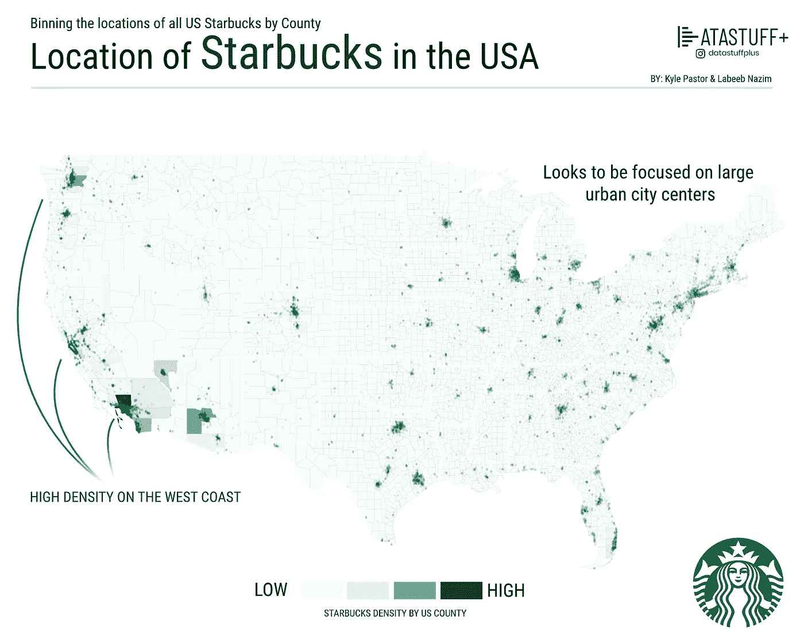
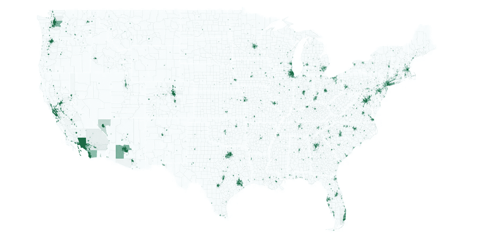

# Geobinning 星巴克

> 原文：<https://towardsdatascience.com/geobinning-starbucks-88bc636f43c6?source=collection_archive---------65----------------------->

## 利用 Python、Geobinning 和 Matplotlib 生成 Choropleth 图



我看到外面有很多 choropleth 地图，它们看起来非常好，真的吸引了很多注意力。如果你有一个干净的数据集，创建它们是非常容易的，但是，我想探索的很多数据并没有按照我想要的方式分类。通常情况下，它以坐标(lat/lng)的形式出现，这让我来决定他们应该去地图的哪个区域。

> 即。我需要想出如何地理定位结果

为此，我创建了一个名为 **Geobinning** 的 pypi 库，它并不十分花哨，但可以让我们将点数据绑定到任意多边形中。这将允许我们生成 choropleth 地图，并做一些有趣的事情，如叠加原始点数据。今天，我们将使用这个 python 包和 matplotlib 重新创建上面的图像，以绘制最终的地图。

注意:我专门用 Kaggle 来做我的编码，因为我喜欢有一个基于云的平台，我可以到处玩。所有的数据集和代码对我的顾客都是可用的(如果你想要它，只要问，我会给你！)但是如果你想支持我的工作，请检查一下

[](https://www.patreon.com/datastuffplus) [## Datastuffplus 正在创建数据驱动的图形和可视化。帕特里翁

### 嘿，欢迎光临！Datastuffplus 主要是我开始分享一些开发工作的 instagram 账号…

www.patreon.com](https://www.patreon.com/datastuffplus) 

## 代码

首先，我们将安装我们的软件包

```
!pip install **geobinning**
```

接下来，我们将加载加载和处理数据所需的包

```
import numpy as np # linear algebra
import pandas as pd # data processing, CSV file I/O (e.g. pd.read_csv)
import geobinning as gb
import shapefile  # Shapefile processing
```

对于这个特定的研究，我将按美国县来收集数据，但我还想画出美国的州边界，以便以后更容易理解。所以我会加载。shp 和。dbf 文件，可从

[](https://www.census.gov/geographies/mapping-files/time-series/geo/carto-boundary-file.html) [## 地图边界文件-形状文件

### 查看 2018 年及以前年份的 shapefile 格式的制图边界文件。

www.census.gov](https://www.census.gov/geographies/mapping-files/time-series/geo/carto-boundary-file.html) 

```
**# Load in the shape data****# Counties**
myshp = open('**../input/us-county-
    shapefile/cb_2018_us_county_5m.shp**', "rb")
mydbf = open('**../input/us-county-
    shapefile/cb_2018_us_county_5m.dbf**', "rb")county = shapefile.Reader(shp=myshp, dbf=mydbf)
county_shapes = county.shapes()# **States**
myshp = open('.**./input/us-states-shapefile/tl_2017_us_state.shp**',
    "rb")
mydbf = open('**../input/us-states-shapefile/tl_2017_us_state.dbf**',
    "rb")
states = shapefile.Reader(shp=myshp, dbf=mydbf)
state_shapes = states.shapes()
```

接下来，我们将获取形状文件对象，并提取定义县和州形状的多边形

```
**state_polygons** = []
for s in state_shapes:
    state_polygons.append(s.points)**county_polygons** = []
for s in county_shapes:
    county_polygons.append(s.points)
```

加载我在 Kaggle 上找到的星巴克数据

[](https://www.kaggle.com/starbucks/store-locations) [## 星巴克在全球的位置

### 运营中的每家星巴克店的名称、所有权类型和位置

www.kaggle.com](https://www.kaggle.com/starbucks/store-locations) 

```
starbucks = pd.read_csv('**../input/store-locations/directory.csv**')**# Filter for US only**
starbucks = starbucks[starbucks['Country'].isin(['US'])]**# Extract the coordinates** points = []
for i,d in starbucks.iterrows():
    points.append([d['Longitude'],d['Latitude']])**# Use the geobinning package we created to bin the points in the polys**
star = gb.geobin(county_polygons,points)
```

剩下的就是使用 matplotlib 来生成我们的最终图像。不使用标准的绘图功能，我决定只使用多边形和圆形补丁对象。效果超级好！基本上使用 matplotlib 作为 MS paint

```
**# Load the packages**
import matplotlib.pyplot as plt
import matplotlib
from matplotlib.patches import Polygon,Circle
from matplotlib.collections import PatchCollection**# Generate a figure with a white background**
fig, ax = plt.subplots(figsize=(80,40), dpi=80, facecolor='w', edgecolor='k')**# Generate the patches (polygon objects) using the county data polygon set we created earlier**
patches = []
colors = []
for i,poly_data in enumerate(county_polygons):
    polygon = Polygon(poly_data, True)
    patches.append(polygon)
    colors.append(star[i])  ***# Colour by binning!!!!!*****# Make a patch collection of these polygons and use the BuGu colormap for the polygon colours (this creates a choropleth map)**
p = PatchCollection(patches, cmap=matplotlib.cm.BuGn, alpha=1,linewidth=0.1,edgecolor=(0,0,0))
p.set_array(np.array(colors))
ax.add_collection(p)**# Same treatment as above but for the state polygon set**
patches = []
colors = []
for i,poly_data in enumerate(state_polygons):
    polygon = Polygon(poly_data, True)
    patches.append(polygon)**# Notice facecolour is none since we only want the borders** p = PatchCollection(patches, alpha=1,linewidth=6,edgecolor='w',**facecolor='none'**)
ax.add_collection(p)**# Now we plot the actual raw point data.  Same deal as before but we are using the Circle instead of Polygon**
patches = []
for i,point_data in enumerate(points):
    pt = Circle(point_data,radius=0.06)
    patches.append(pt)
p = PatchCollection(patches,color='#0f713e',alpha=0.1)
ax.add_collection(p)**# Set the x/y ranges to be the rough boundary coordinates of the continental US**
ax.set_ylim(24, 50)
ax.set_xlim(-130, -60)**# Remove the axis and plot!**
plt.axis('off')
plt.show();
```

## 结果



上面代码的原始结果(原始内容)

哇，看起来真不错！在这一点上，我们可以继续下去，做任何其他编辑，我们想告诉这个故事。在这种情况下，有人指出，这基本上是一个人口地图，并没有提供太多的信息，但现在我们配备了工具来做更有趣的事情，如比较不同地点的不同商店密度等。

# **贡献者**

凯尔·帕斯托尔和拉贝·纳齐姆

# 参考

[](https://pypi.org/project/geobinning/) [## 地理分箱

### 使用 geobinning 根据 geojson 几何来存储[lng，lat]点。任何包含 ID 和多边形的 geojson

pypi.org](https://pypi.org/project/geobinning/)