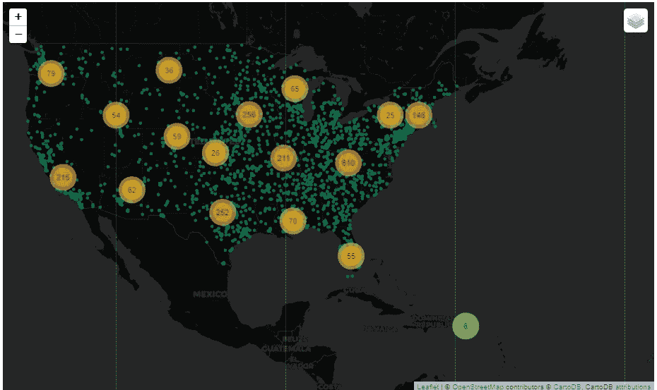

# 使用 Python 进行地理编码和反向地理编码

> 原文：<https://towardsdatascience.com/geocoding-and-reverse-geocoding-using-python-36a6ad275535?source=collection_archive---------20----------------------->

## 当地址已知时查找纬度和经度，或者使用 OpenCage 的 geocoder & geopy 查找数据帧的纬度和经度。


照片由[捕捉人心。](https://unsplash.com/@dead____artist?utm_source=medium&utm_medium=referral)号上[的 Unsplash](https://unsplash.com?utm_source=medium&utm_medium=referral)

**地理编码**是获取输入文本(如地址或地名)并返回纬度/经度位置的过程。简单来说，地理编码就是把物理地址转换成经纬度。

python 中有许多地理编码 API 选项。一些流行的有 GeoPy，OpenCage geocoder，google geocoding。Geopy 是为数不多的为非商业用途提供无限制访问的 API 服务之一。对于 Google API 和 OpenCage 地理编码器，每天有 2500 个请求的限制。使用 geopy，我的数据集中一些地址的纬度和经度显示了不同的国家，而不是美国。使用 **OpenCage** **地理编码器**，令人惊讶的是所有的地址都是准确的，所以我使用 OpenCage 编码器。

## 使用 OpenCage 地理编码器和 pandas

要在 python 中使用 OpenCage Geocoder，应该首先使用`pip install opencage`安装 python 库。关于这个库的更多信息可以在这里找到:[Github 上的 OpenCageGeocode](https://github.com/opencagedata/python-opencage-geocoder)

一旦安装了库，您将需要一个 OpenCage 地理编码器帐户来生成 API 密钥。可以使用[opencagedata.com](https://opencagedata.com/)创建一个免费账户。注册帐户后，您可以在 Dashboard 中找到 API 密钥，如下图所示。


## 例子

```
from opencage.geocoder import OpenCageGeocode
key = "Enter_your_Api_Key"
geocoder = OpenCageGeocode(key)
address='1108 ROSS CLARK CIRCLE,DOTHAN,HOUSTON,AL'
result = geocoder.geocode(address, no_annotations="1")  
result[0]['geometry']
```

输出:{ '纬度':31.2158271，'液化天然气':-85.3634326}

我们得到了一家名为东南阿拉巴马医疗中心的医院的经度和纬度。在大多数情况下，我们会有多个地址需要像现在这样绘制在地图上。在这种情况下，使用 pandas 创建数据框将容易得多。我使用的数据集包含美国所有医院的列表，以及医院所在县的新冠肺炎病例总数。数据集可以从[这里](https://www.kaggle.com/jaswanthhbadvelu/us-hospital-location-with-covid-cases-for-counties)下载。

```
import pandas as pd
data=pd.read_csv(‘Final.csv’)
data.head(10)
```


医院位置数据框架

我们有一个数据框，其中包含美国所有医院的设施名称及其地址的列表，因此我们只需要找到位置坐标。

首先，我们应该将地址列转换为列表。因此，循环所有地址会更容易。

接下来，从 OpenCage geocoder 网站输入您的 API 密钥，并创建空列表来存储纬度和经度。创建空列表后，创建一个循环，给出所有地址的经度和纬度

```
addresses = data["Full_Address"].values.tolist()
key = "Enter-your-key-here"
geocoder = OpenCageGeocode(key)
latitudes = []
longitudes = []
for address in addresses: 
    result = geocoder.geocode(address, no_annotations="1")  

    if result and len(result):  
        longitude = result[0]["geometry"]["lng"]  
        latitude = result[0]["geometry"]["lat"] 
    else:  
        longitude = "N/A"  
        latitude = "N/A"  

    latitudes.append(latitude) 
    longitudes.append(longitude)
```

我们有数据框中所有地址列表的纬度和经度。我们可以使用这个简单的 pandas 命令将纬度和经度添加到现有的数据框中。

```
data["latitudes"] = latitudes
data["longitudes"] = longitudes
data.head(10)
```

最后，我们得到了所有医院地址的经度和纬度。为了更好地理解这个位置坐标，让我们使用 follow maps 将所有位置坐标绘制成地图中的点。

```
folium_map= folium.Map(location=[33.798259,-84.327062],zoom_start=4.4,tiles=’CartoDB dark_matter’)FastMarkerCluster(data[[‘latitudes’, ‘longitudes’]].values.tolist()).add_to(folium_map)folium.LayerControl().add_to(folium_map) for row in final.iterrows():
    row=row[1]
    folium.CircleMarker(location=(row["latitudes"],
                                  row["longitudes"]),
                        radius= 10,
                        color="#007849",
                        popup=row[‘Facility_Name’],
                        fill=False).add_to(folium_map)

folium_map
```

现在，我们可以看到美国所有医院的位置点。我使用 CircleMarker 聚类来更好地了解医院数量最多的地区。



使用 follow 创建的地图可视化快照(聚类位置)

# 反向地理编码

[反向地理编码](https://en.wikipedia.org/wiki/Reverse_geocoding)，另一方面，将地理坐标转换为位置的描述，通常是一个地点或可寻址位置的名称。地理编码依赖于地址点、街道/道路网络以及邮政和行政边界的计算机表示。

对于反向地理编码，我发现 Geopy API 的输出格式比 OpenCage Geocoder 更详细。此外，Geopy API 没有限制，因此我们将使用 Geopy 而不是 OpenCage Geocoder。

**OpenCage 反向地理编码器示例**

```
result = geocoder.reverse_geocode(31.2158271,-85.3634326)  
result[0][‘formatted’] 
```

输出:美利坚合众国 AL 36302 Dothan Alma 街东南健康医疗中心

**Geopy 反向地理编码器示例**

```
from geopy.geocoders import Nominatim
geolocator = Nominatim(user_agent="test_app")
location = geolocator.reverse("31.2158271,-85.3634326")
location.raw[‘display_name’]
```

输出:“美国阿拉巴马州休斯顿县多森莫里斯高地罗斯克拉克圈 1108 号东南健康校园，邮编 36301。”

# **使用 Geopy 地理编码器和熊猫**

对于反向地理编码，如上所述，首先，我们将纬度和经度转换为列表并压缩在一起。

```
lats=data['latitudes'].to_list()
lons=data['longitudes'].to_list()
# Creating a zip with latitudes and longitudes
coords=list(zip(lats,lons))
```

因为，我们已经创建了列表，就像上面一样，我们将创建一个循环来查找每个位置坐标的地址，并将它们附加在一起。

```
from geopy.geocoders import Nominatim
geolocator = Nominatim(user_agent="test_app") 
full_address=[]
for i in range(len(coords)):
    location = geolocator.reverse(coords[i])
    address=location.raw['address']['country']
    full_address.append(address)
#Creating dataframe with all the addresses
addres=pd.DataFrame(data=full_address , columns=['Address'])
addres
```


最后，我们有美国所有医院的地址列表。

对于感兴趣的读者，我把代码放在我的 GitHub Repo [这里](https://github.com/JaswanthBadvelu/Geocoding/blob/master/Geocode%20%26%20Reverse.ipynb)。如果您有任何疑问，请使用 [linkedin](https://www.linkedin.com/in/jaswanth-badvelu/) 联系我。