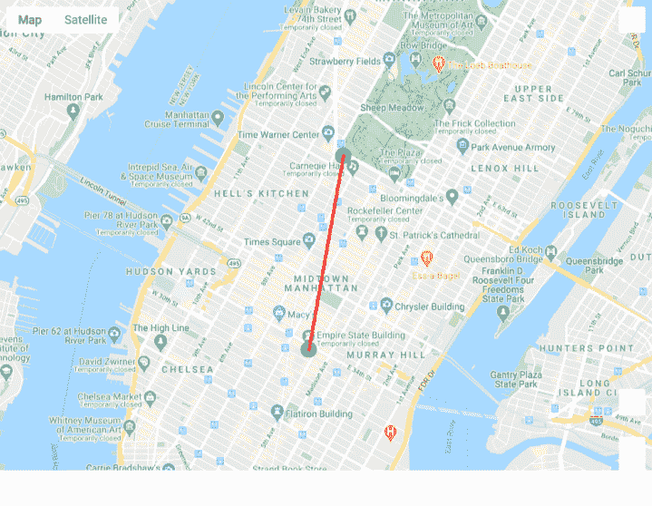
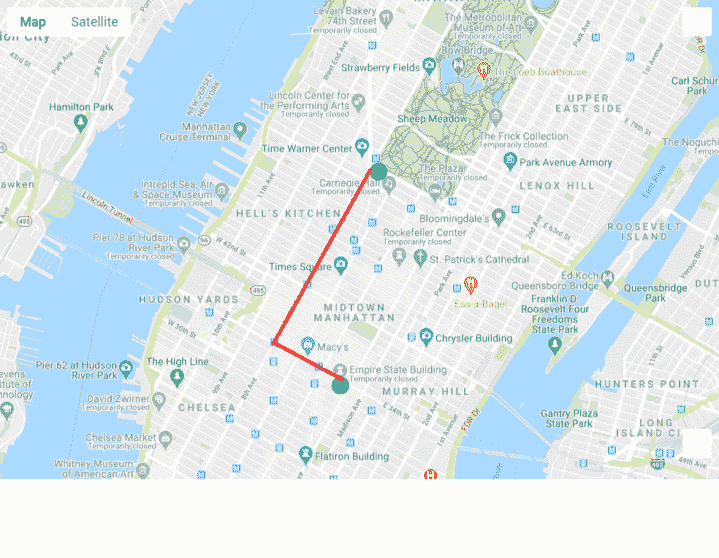

# 使用 Google Maps API 在 Python 中进行地理编码

> 原文：<https://towardsdatascience.com/geocoding-in-python-using-google-maps-api-56278816cdd6?source=collection_archive---------36----------------------->

## 本文将重点介绍 Python 中的地理编码，它获取地址或世界上任何地方的坐标，并计算两个位置之间的距离和路线。


米卡·鲍梅斯特在 [Unsplash](https://unsplash.com/s/photos/google-map?utm_source=unsplash&utm_medium=referral&utm_content=creditCopyText) 上的照片

**目录:**

*   介绍
*   用 Python 对地址和位置进行地理编码
*   在 Python 中计算测地线距离
*   使用 Python 中的 Google 距离矩阵 API 计算行驶距离
*   结论

# 介绍

公司可以访问大量基于位置的数据，例如客户地址、销售地址、办公地点、商店地点等等。从这些信息中可以得出很多对决策非常有用的见解。因此，投资于初步地理空间分析的愿望越来越强烈。

这就是数据科学空间变得开放的地方。帮助企业分析与某些位置、地区或地址相关的指标。他们向数据科学家寻求一些技术帮助。

在本文中，我将使用 [googlemaps API](https://developers.google.com/maps/documentation) 解释使用 geopy 和 Google Maps 库在 Python 中进行地理编码的基础知识。然后，我将演示在给定坐标的情况下，地图上两点之间的基本距离计算。

简而言之，地理编码作为一个过程是将地址或位置作为输入，并生成其坐标(纬度和经度)作为输出。稍后，这些数据可用于创建不同的地图或热图，以绘制路线或显示基于位置的指标。

# 用 Python 对地址和位置进行地理编码

为了继续学习本教程，我们需要三个 Python 库:pandas、geopy 和 googlemaps。

如果您没有安装它们，请打开“命令提示符”(在 Windows 上)并使用以下代码安装它们:

```
pip install pandas
pip install geopy
pip install googlemaps
```

导入所需的库:

一旦下载、安装和导入了库，我们就可以继续 Python 代码实现了。

## 步骤 1:创建 Google Maps API

作为第一步，您需要创建一个 [Google Maps API](https://developers.google.com/maps/documentation) 并启用它的服务。这不是免费的，但是你可以获得每月 200 美元的免费积分，这在大多数情况下是足够的，除非你试图对一个非常大的数据集进行地理编码。

一旦创建了 API，就应该将其作为字符串存储在 Python 中:

## 第二步:选择地点

在这篇文章中，我将使用我在纽约出差时最喜欢去的两个地方:[帝国大厦](https://www.esbnyc.com/)(因为它的风景)和 [Marea 餐厅](https://www.marearestaurant.com/new-york)(因为它的食物)。

使用我提供的代码，你将能够找到位置的坐标使用他们的地址或位置名称。两者都会产生相同的结果。

## 步骤 3:创建谷歌地理编码器

在 geopy 中，每个地理编码器都有自己的类。由于我们正在使用谷歌的地理定位服务，我们将创建一个[谷歌地理编码器类](https://geopy.readthedocs.io/en/stable/#googlev3)，然后检查它的类型:

```
class 'geopy.geocoders.googlev3.GoogleV3'
```

现在我们有了一个地理编码器，它将使用我们的 Google API 代码来连接到 Google Maps，并为我们提供所需的位置数据。

## 步骤 4:用 Python 对位置进行地理编码

前期工作和设置已经完成。激动人心的部分从这里开始。仅用地名，我们就能找到它的地址和坐标:

```
20 W 34th St, New York, NY 10001, USA
40.7484405 -73.98566439999999
```

如你所见，它工作得很完美。这些数据相当于你去[谷歌地图](https://www.google.com/maps)搜索“帝国大厦”得到的数据。

那么我们的代码到底产生了什么呢？首先，我们创建了一个 **name** 字符串，并给它分配了我们的地名。然后我们使用了来自*步骤 3* 的地理定位器，它创建了一个[位置类](https://geopy.readthedocs.io/en/stable/#data)，我们将其存储为**位置**。它有多个数据点，但是我们只打印我们感兴趣的数据点:地址、纬度和经度。

最后一步，我们需要存储我们的结果，我将把它保存为熊猫数据框:

```
name                   address
Empire State Building  20 W 34th St, New York, NY 10001, USA
lat        lon
40.748441 -73.985664
```

按照相同的步骤，我们现在将找到第二个位置的坐标，并将其全部合并到一个数据帧中:

```
name                       address        lat        lon
Empire State Building      20 W 34th St, New York, NY 10001, USA  40.748441 -73.985664
Marea Restaurant New York  240 Central Park S, New York, NY 10019, USA  40.767448 -73.981133
```

# 在 Python 中计算测地线距离

我发现 geopy 的一个特别有用的特性是它能够计算坐标之间的距离。默认情况下，测地线距离用于距离计算。

什么是测地线距离，它是如何计算的？测地线距离是两个坐标之间的最短距离，假设地球是椭球形的。

下面我在地图上标出了这些地点:



作者图片

如你所见，两个绿点是我们的位置。在这种情况下，测地线距离是连接两个绿点的直线的长度。

使用以下代码计算两个位置之间的测地线距离:

```
2.145211377374085
```

两个位置之间的测地线距离约为 2.15 公里。但是我们看到它有什么问题吗？如果你看地图，你的目标是找到距离，在这种特殊情况下，你可能对道路距离感兴趣。由于纽约曼哈顿的景观和建筑位置，你无法通过直线行走从 A 点到达 B 点。

有什么解决办法？在下一节中，我们将探索如何计算从帝国大厦到 Marea 餐厅的实际道路距离(在我们的例子中是步行距离)。

# 使用 Python 中的 Google 距离矩阵 API 计算行驶距离

在本节中，我们将使用 googlemaps 库和 [Google 的距离矩阵 API](https://developers.google.com/maps/documentation/distance-matrix/start) 来计算从帝国大厦到 Marea 餐厅的“道路”距离。

和上一节有什么不同？在这种情况下，我们被限制只能使用适合驾驶的道路从 A 点到 B 点。在业务绩效分析的情况下，这通常可以方便地测量不同地点之间的平均通勤时间，而不仅仅是考虑直线距离。

## 步骤 1:创建谷歌地图客户端

由于我们使用 Google 的地理定位服务，我们将创建一个 Google Maps 客户端类，然后检查其类型:

```
class 'googlemaps.client.Client'
```

## 步骤 2:用两点之间的所有数据创建一个字典

使用*步骤 4* 中的位置坐标，我们现在将创建一个字典，其中包含通过谷歌距离矩阵 API 获得的两个坐标之间的所有信息:

```
{'destination_addresses': ['240 Central Park S, New York, NY 10019, USA'],
 'origin_addresses': ['14 W 34th St, New York, NY 10001, USA'],
 'rows': [{'elements': [{'distance': {'text': '3.2 km', 'value': 3246},
     'duration': {'text': '18 mins', 'value': 1070},
     'status': 'OK'}]}],
 'status': 'OK'}
```

让我们来分析一下上面这段代码做了什么。它从之前我们用 Python 执行地理编码的一个部分获取两个位置的坐标:**P1**和**p2**，并从*步骤 1* 通过 Google Maps 客户端解析它。因此，上面的函数生成了一个包含这些坐标的所有“距离”数据的字典。

如您所见，字典包含大量数据点。我们感兴趣的是“行”->“元素”->“值”。让我们访问它:

```
3246
```

我们看到的输出距离是 3246 米，约为 3.25 千米。与 2.15 公里的测地线距离相比，它肯定更大。Google Maps APIs 允许您找到一条 excat 路线，这条路线会一直显示到这个距离，但这不在本文的讨论范围之内。我的近似路线如下所示:



作者图片

与两点之间的直线测地距离相比，谷歌距离是沿着道路上的实际行驶路线，这导致两点之间的距离明显更大。

# 结论

本文重点介绍了数据科学家可以用来学习用 [Python](https://pyshark.com/python-list-data-structure/) 进行地理编码的工具。这应该是一个良好的基础，不断探索不同的坐标之间的距离测量，并可以进展到地理空间数据可视化。

如果你有任何问题或者对编辑有任何建议，请在下面留下你的评论。

*原载于 2020 年 4 月 30 日*[*【https://pyshark.com】*](https://pyshark.com/geocoding-in-python/)*。*