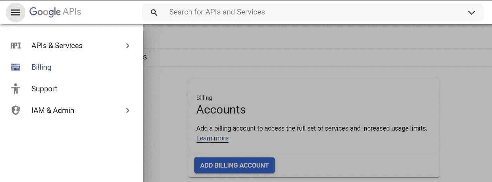
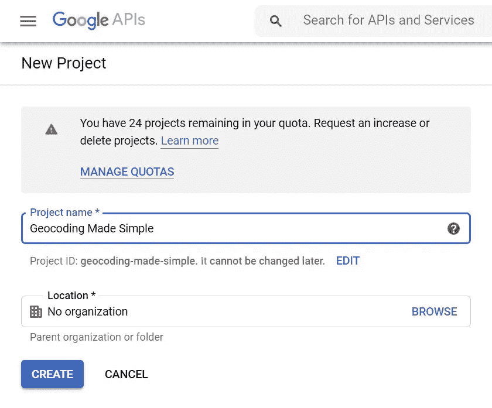
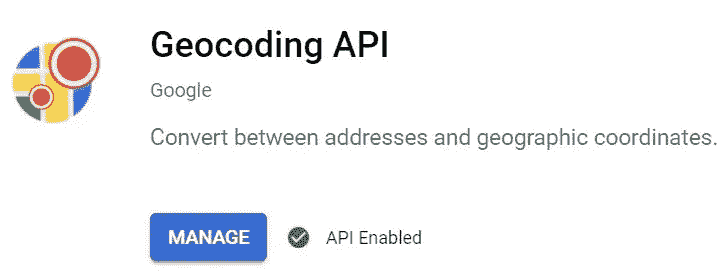
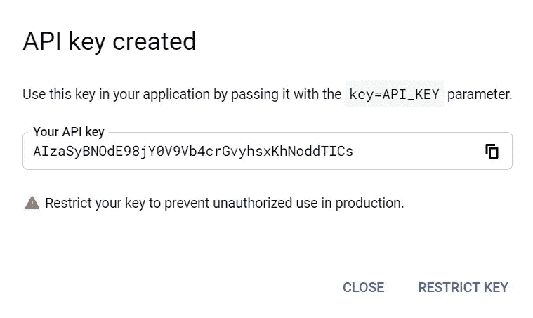
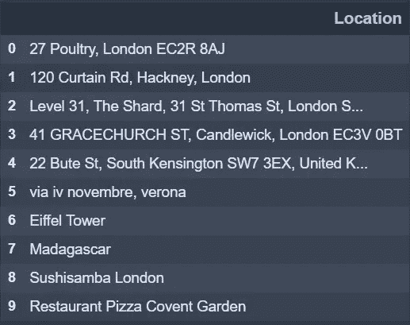
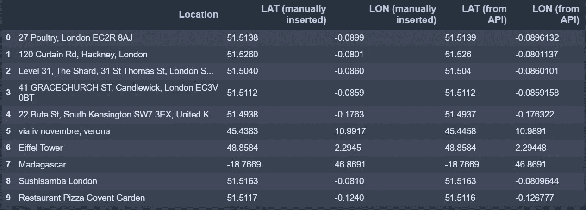
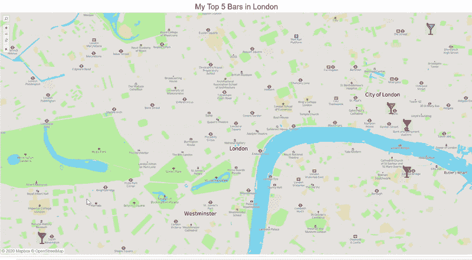

# 地理编码变得简单

> 原文：<https://towardsdatascience.com/geocoding-made-simple-1f2904da2b4b?source=collection_archive---------54----------------------->

## 使用 Python 和 Google API 获得 Lat & Lon 的 10 行代码

照片由 Canva 的 Alesmuth 拍摄

我们现在生活在一个快速和视觉化的世界里，图像比语言更有说服力。决策越来越依赖于数据，数据以如此惊人的速度和数量向我们袭来，如果没有某种抽象层，比如视觉层，我们就无法理解它。

这可能是为什么**数据可视化**变得越来越重要的一个原因，它允许以一种既引人注目又易于消化的方式组织数据。

当数据位于地理位置时，地图可以非常有效地显示数据在特定区域的分布和比例。**地理编码**是将数据绘制成地图的关键过程。简而言之，地理编码意味着将地址或位置作为输入，并生成其坐标(纬度和经度)作为输出。

在本文中，我旨在向您展示使用 Google API 检索地理编码信息是多么容易。要做到这一点，我们首先需要建立一个谷歌开发人员帐户，并获得一个位置样本数据集。然后我们将实现 10 行简单的代码来获取这些位置的坐标。

# 我们需要的是…

## 1.设置您的 Google 开发者帐户

要获得 API 密匙，我们需要首先用你的谷歌账户邮箱和密码登录到[谷歌开发者账户](https://console.developers.google.com/)。如果你没有谷歌账户，就在这个[链接](https://accounts.google.com/signup/v2/webcreateaccount?service=cloudconsole&continue=https%3A%2F%2Fconsole.developers.google.com%2Fapis%2Fdashboard%3Fproject%3Dgeocoding-made-simple&hl=en_US&gmb=exp&biz=false&flowName=GlifWebSignIn&flowEntry=SignUp&nogm=true)创建一个。

下一步是为 Google 创建计费帐户，以便对 API 的使用进行收费。要创建计费账户，请进入谷歌开发者账户主页左上方的菜单，然后点击*计费*部分，然后点击*添加计费账户*。提供您的账单详情并选择*谷歌地图平台* 以完成帐户的创建。

每月可以获得 200 美元的谷歌地图平台积分，所以如果你每月的请求超过 40，000 次，我建议你在这个[链接](https://developers.google.com/maps/documentation/geocoding/usage-and-billing)查看价格细节(考虑一个请求意味着获得一个位置的纬度和经度)。

我们还需要创建一个新项目。点击顶栏上的*选择项目*，然后点击窗口左上方的*新建项目*。

现在我们已经有了我们的计费帐户和项目，我们需要为项目启用 API。访问您刚刚创建的项目，并点击*Enable API and Services。*搜索*地理编码 API* ，点击*启用*。

我们需要做的最后一件事是创建 API 密钥，为此我们只需转到*凭证*选项卡，单击*创建凭证*，然后单击 *API 密钥。*复制 API 密钥，因为我们将在接下来的步骤中使用它。

## 2.导入库

现在让我们打开编码环境，导入所需的库。我们将使用*熊猫*和*谷歌地图*。

## 3.添加 API 密钥

现在，我们将在步骤 1 结束时创建的 API 键作为变量添加到代码中。

## 4.获取我们的样本数据

然后我们需要得到我们的数据。出于本练习的目的，我创建了一个 csv 文件，其中包含 10 个地点的列表(我在伦敦最喜欢的 5 个酒吧的地址加上其他 5 个随机地点)。

**我们想要的输出是所有位置的纬度和经度**，这就是为什么我还将创建两个新列来存储这些信息。

# 用 10 行代码进行地理编码

现在我们已经拥有了所需的一切，我们可以运行 10 行代码来检索样本位置的地理编码信息，并将结果存储在我们刚刚创建的两列中。

为了交叉检查我们的结果，我创建了两列，并手动插入 10 个位置的正确纬度和经度。如你所见，我们得到的结果相当准确。

我真正喜欢这个 API 的地方是**地址或位置不必有特定的格式**。您可能已经注意到，在示例数据中，我在 location 列中使用了不同的格式。我添加了没有邮政编码、街道号码、只有大写字母甚至罗马数字的地点。我还尝试过检测兴趣点、国家、餐馆名称和伦敦广场上的普通披萨店，结果仍然令人满意。

现在我们已经有了所有的地理编码信息，让我们把这个练习付诸实践。使用 Tableau，我们可以创建一个我在伦敦的前 5 家酒吧的简单**地图，就是我们在样本数据文件中的那些。**

好了，现在你有了一个结合 Python、Google API 和 Tableau 创建的简单地图。

# 结论

我希望这篇文章清楚地展示了使用 Google API 获得地理编码信息是多么容易。

> *说到数据可视化，* ***人人都爱一张图*** *。比图表更令人兴奋，比信息图更简单。因此，我希望这种方法能帮助你可视化你的地理数据，并利用你的洞察力。*

请务必联系我，告诉我你所有的建议和意见。

感谢阅读！

我正在创建一个与数据科学和分析相关的所有我最喜欢的课程、书籍和用例的列表。点击 [**链接**](https://landing.mailerlite.com/webforms/landing/v3w3s2) 即可在**免费**访问该内容。

 [## 用我的推荐链接加入 Medium-Lore 那又怎样

### 阅读 Lore 的每一个故事那又怎样(以及媒体上成千上万的其他作家)。您的会员费直接支持…

medium.com](https://medium.com/@loresowhat/membership)