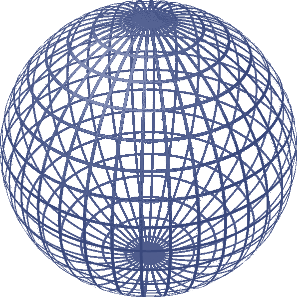
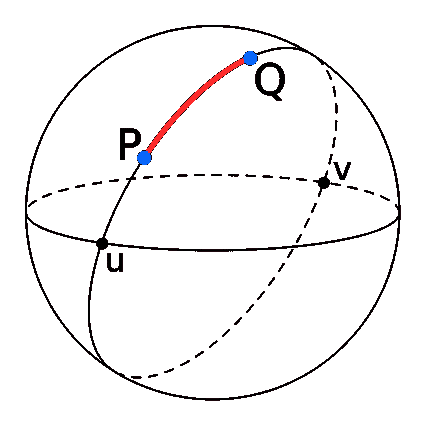
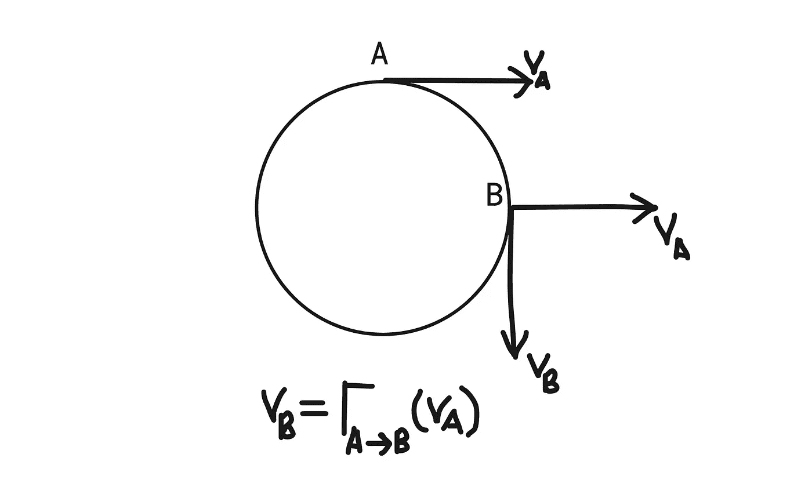
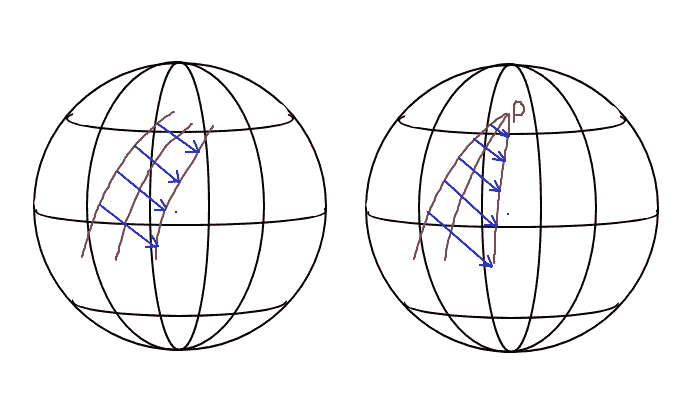
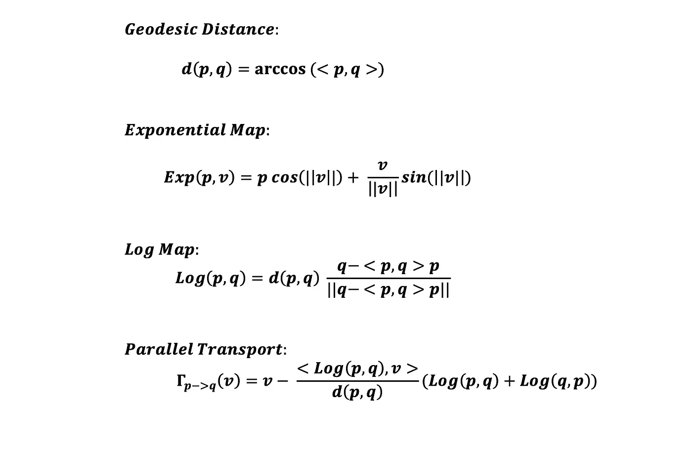
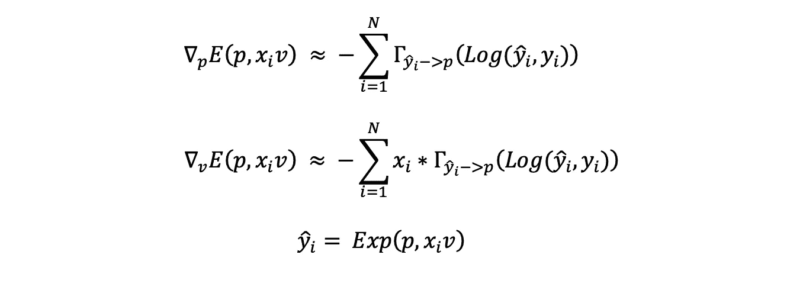
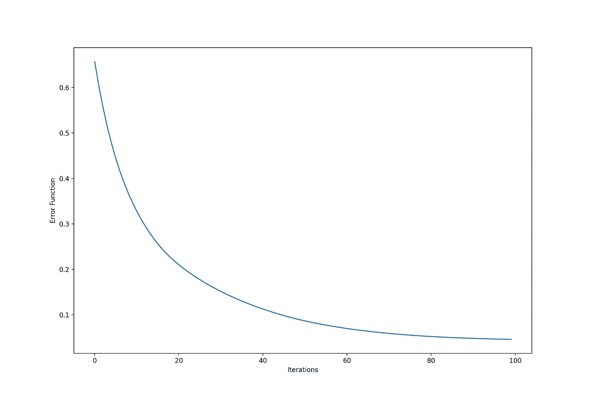
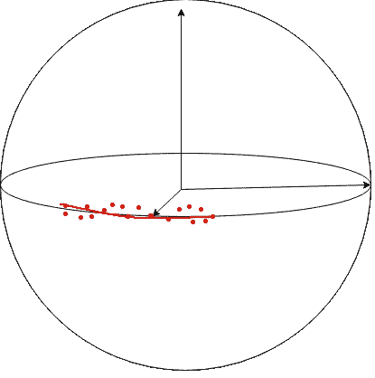

# 测地线回归

> 原文：<https://towardsdatascience.com/geodesic-regression-d0334de2d9d8?source=collection_archive---------10----------------------->

## 机器学习遇上黎曼几何

黎曼几何可以被安全地称为数学中的“革命性”理论。首先，该理论通过将“平坦的”欧几里得空间推广到弯曲流形，提出了一种激进的空间和几何观点。后来，阿尔伯特·爱因斯坦利用这一理论解释了空间和引力，这就是我们所知的“广义相对论”，这是一场重大物理学革命的基础。

黎曼几何在机器学习中也有应用。在本文中，我们将学习测地线回归，它是线性回归到黎曼空间的延伸。假设读者对最小二乘线性回归模型有很好的理解，并有一定的黎曼几何知识。在深入主题之前，有必要讨论一下几何学的基础知识。解释将用简单的术语来表达，这是理解主题所必需的，我们不会深入到几何学的细节中。因此，我们可能会有一个不完全符合标准数学定义的随意解释。

## 再说空间！

在学校和高中，我们被教授大量建立在欧几里得空间基础上的几何定理。欧几里得几何是唯一流行的东西，直到天才高斯和黎曼暗示事情可以不同。他们提出了弯曲空间理论，该理论并不一定要求具有欧几里得性质。假设底层基础被破坏，这些定理对弯曲空间(流形)不再成立。因此，它要求我们重新思考我们迄今为止所学的一切。

图 1:球形流形(来源:[维基百科](https://en.wikipedia.org/wiki/Sphere#/media/File:Sphere_wireframe_10deg_6r.svg))

欧几里得空间是众所周知的，然而，让我们从技术上定义它:一个有限维(a1，a2，a3，…an)的实数空间，有一个明确定义的内积(点积)。我们通常把它想象成一个由相互垂直的线性轴构成的向量空间。相反，黎曼空间是非线性轴的跨度。一个常见的例子是球面，它是纬线和经线的跨度。当我们深入研究弯曲空间的几何时，事情似乎很奇怪。例如，矢量空间的概念并不存在，毕达哥拉斯定理不再有效，在赤道上看似平行的经线最终会汇聚并在极点相遇。说了这么多，我们接着来解释一下它的一些概念。

*向量空间是在向量运算(加、减等)下封闭的空间。)

## **距离**

计算点与点之间的距离是一种常见的几何运算。在欧几里得空间中，勾股定理允许我们进行简单的距离计算。现在让我们来考虑一下，在一个球体中寻找两点之间的距离。一旦我们认识到连接这些点的曲线不可能是直的，勾股定理在这里就不再适用了。然而，如果我们放大到曲线上足够小的一段，它可以安全地被认为是直的，我们有一个局部定义的向量空间。点与点之间的距离是这一小段的积分。

> **注意:**由于坐标轴在局部向量空间中可以是非正交的，因此计算小段的长度并不简单。我们需要利用一种叫做“黎曼度规”的东西来计算距离。如果感兴趣，下面的链接已经涵盖了黎曼度量的良好细节:【https://www.ime.usp.br/~gorodski/teaching/mat5771/ch1.pdf】T2。

## **测地线**

这是将“直线”的概念推广到曲线流形。测地线是空间中两点之间的最短路径，是弯曲流形中“最直的可能路径”。如图 2 所示，连接点 ***P*** 到 ***Q*** 可以有无限多条路径。但是最短的，用红色突出显示的，是测地线。测地线距离的数学符号是 ***d(P，Q)*** *。*

这里要注意的是，我们不能用一条直线连接 P 点和 Q 点来获得它们之间的最短路径，因为这条直线将位于球体的内部。记住，要定义一条曲线，曲线上的每个点都必须位于定义它的流形上。球体内部的任何东西都不在球面流形中。

图 2:测地线(来源:[维基百科](https://en.wikipedia.org/wiki/Great-circle_distance#/media/File:Illustration_of_great-circle_distance.svg))

## **切空间**

它是流形上一点的切向量所跨越的空间。这可以简单地想象成一个球面上一点的切平面。请注意，我们在黎曼流形中没有向量。所以，切空间不是它的一部分。它是一个独立的欧几里得空间，其中的切向量是黎曼流形上的点的泛函映射。

> 请注意，向量只能定义在一点的切空间上，而不能定义在流形上。

## **指数图**

这是本文的一个重要概念。让我们回想一下，在欧几里得空间中，通过最短路径将一个点转换到另一个点只需要矢量加法。既然已经提到了黎曼流形中不存在向量空间的概念，那么任何向量运算(这里是加法)都没有意义。我们需要不同的数学运算才能从一点到达另一点。这就是指数地图发挥作用的地方。

我们将借助于切空间中流形上的一点 ***M*** 。如图 3 所示，我们可以在球面流形的一点上有一个平的切面。切面是一个向量空间，我们可以在这里进行平移。例如，在图 3 中， ***T_pM*** 是球面流形的点 ***P*** 处的切空间，并且我们已经通过切平面中的向量*平移了点 ***P*** 。现在的重点是将向量映射回球面流形，就像球面中的 ***v*** 到点 ***A*** 的映射一样。这种映射称为指数映射，最后，我们能够在流形上从*行进到*，并且我们得到的路径是点之间的最短路径。***

******

***图 3:指数图(*图片作者*)***

***请注意，指数映射的存在涉及到一些数学上的手续，这里不做讨论。简而言之，求流形中各点之间的最短路径基本上就是 3 次运算。(1)在一个点上实现一个切空间，(2)通过一个向量平移切空间中的点，(3)将平移的点映射回流形。这样，我们将在流形上得到一条测地线。此外，映射被定义为使得向量 ***v(||v||)*** 的范数等于测地线距离 ***d(p，A)*** 。数学上，指数映射定义为:***

****

**映射函数 ***Exp(p，v)*** 取决于流形，并且可以解析地确定。**

> **黎曼空间中的指数映射类似于欧氏空间中的直线方程。**

## ****测井图****

**这是指数映射的逆映射，将点从流形映射到切面。在图 2 中，这是从点*到向量*的映射。由于向量 ***v*** 的范数等于测地距离，我们可以推断| ***Log(p，A)| = d(p，A)。*** 它在数学上被定义为:****

****

## ****平行运输****

**当我们定义切空间和切空间中的向量时，还有一点需要注意。在欧几里得几何中，大小和方向相同的向量在空间的任何一点都具有相同的意义。相比之下，对于弯曲流形，向量和切空间仅被局部定义，因此我们不能有相同的全局解释。**

**为了理解这一点，让我们把球面流形再次带入图中，如图 4 所示。我们可以把球体想象成我们的地球，把 A 和 B 想象成地球上的两个地方。对于住在点 **A** 的人，矢量 **V_A** 是水平方向。但是当我们继续定义同一个向量在点 **B，**时，它变成了一个垂直方向。要在 B 点定义水平方向，我们需要修改原始向量(在这种情况下，旋转它)。向量 **V_B** 是对向量 **V_A** 的修改，使得 **V_B** 对于点 **B** 的意义与 **V_A** 对于点**A**的意义相同。这种修改称为并行传输，我们称之为**向量 **V** 从点 **A** 并行传输到**平行运输的数学符号如图 4 所示。******

************

******图 4:并行传输(*图片作者*)******

******平行迁移是理解曲面和定义黎曼流形中曲率的一个重要概念。然而，对于我们这里的目的，我们坚持我们的简单定义。像指数映射一样，平行传输的表达式依赖于流形本身的性质。******

******现在，我们有了足够的数学概念来深入主题。先来回顾一下线性回归的案例*。*******

## ********线性回归********

******给定一个参变量 **X** 和相应的因变量**Y =(Y _ 1，y_2，y_3…，y_n)，** 线性回归的目标是将 ***Y*** 表示为 ***X*** 的线性函数。******

************

******通过最小化最小二乘误差来确定参数 *w* 和 *b* :******

************

******我们有一个参数 *w* 和 *b* 的闭合解，可以通过使用线性代数来解析地确定。在下一节中，我们使用类似的方法将测地线回归参数定义为最小二乘最小化任务。******

## ********测地线回归********

******GR 背后的动机是，现实生活中并非所有的数据点都位于欧几里德空间。例如，对于球形流形，数据点由球体表面上的点表示。然而，任何流形仍然可以在更高维的欧几里得空间中实现，就像二维球面流形可以在欧几里得空间中实现为三维表面一样。因此，欧几里得空间中的非线性回归可以对驻留在流形上的数据点进行建模。但是，由于维数增加和复杂的非线性关系，这样的模型将会相当复杂。模型的复杂性会导致很大的差异。******

******对于驻留在非欧几里德流形中的数据，自然要用 GR 来建模，我们假设欧氏空间中的自变量 ***X*** ，流形 ***M*** 中的因变量 ***Y* 。GR 模型是 LR 模型的概括，如下所示:********

************

******注意，对于欧氏空间，指数映射只是向量加法。因此，当 ***M*** 是欧几里得空间时，上面的等式简化为 LR 模型。上式中的变量 ***Y*** 是测地线，因此得名测地线回归。参数 ***p*** 和 ***v*** 由以下最小化确定:******

************

******与 LR 不同，在 LR 中，我们对误差最小化任务有一个封闭形式的解决方案，而在这里，我们需要对最小化误差函数执行梯度下降。给定误差函数，******

************

******应根据参数 ***p*** 和 **v** *计算梯度。*测地距离相对于其中一个点的梯度就是对数图(暂且认为是理所当然的):******

************

******这里的挑战是导出指数映射 ***Exp(p，xv)的梯度。*** 让我们先对此养成一种直觉。******

************

******图 5:雅可比场(图片由作者提供)******

********M**是包含点 ***p*** 的黎曼流形。图 5 左边部分是指通过参数 ***p*** 来区分 ***Exp(p，xv)*** 。红线是具有相同平移向量 ***v*** 但在不同点 ***p*** 上的指数映射(测地线)。微分的结果是一个向量场，由穿过测地线的蓝色箭头表示。图的右边部分解释了关于参数 ***v*** 保持点 ***p*** 恒定的微分。结果是一个由蓝色箭头表示的向量场。这两种情况下产生的矢量场合称为**雅可比场**。**雅可比场**也可以理解为附近测地线之间的分离向量。******

## ******好的，它们是如何计算的？******

******像指数映射一样，雅可比场是流形本身的性质。因此，它们是解析计算的，并且依赖于流形。注意雅可比场的推导需要黎曼几何的一些核心概念，不在本文讨论范围之内。详情可在标准在线资源中找到。******

******既然我们已经解决了确定测地距离和指数地图的梯度，我们可以继续计算误差函数的梯度，并执行梯度下降。得到的参数就是我们的 GR 模型的参数。******

******所以我们看到，一旦我们对 LR 有所了解，对 GR 来说就没什么了。尽管如此，我们讨论的一切都是理论上的，如果我们是第一次学习 GR，关于实现，事情会变得非常混乱，尤其是在指数图和 Jacobi 场周围。让我们看一个简单的例子。******

## ********在球形管汇上实现********

******对于 LR，我们需要一组独立的和相应的因变量。对于 GR，我们需要一个额外的信息:因变量所在的流形的性质。让我们以嵌入在三维欧几里得空间中的二维球面流形为例。******

******首先，让我们定义球面流形的测地距离、指数映射、对数映射和平行传输的表达式。******

******(假设中心在(0，0，0)的单位球，其中 p 和 q 是其上的点)。******

************

******下面是函数定义的 python 代码:******

******如前所述，回归模型是******

************

******带误差函数******

************

******其中 p 和 v 是模型参数。计算梯度包括计算球体的雅可比场，并且可以通过以下等式来近似。******

************

******这些梯度的精确解可以在下面引用的论文**稳健测地线回归**中找到。******

******最后一步是更新参数，这有点棘手。请注意，我们得到的梯度是一个矢量。在 LR 中，我们可以简单地通过学习速率来缩放梯度向量，并将其从当前参数值中减去。但是正如已经讨论过的， **p** 是流形上的一个点，我们没有这样的向量运算。因此，我们必须应用指数映射来更新参数 **p** 。******

************

******为了更新参数 **v，**让我们回忆一下图 3: **v** 本身是切空间中的一个向量。因此，这可以简单地通过向量减法来更新。******

************

******然而，还有一件事需要注意。参考图 3，我们看到向量 **v** 被定义在 **p** 所在的同一点上。因此，当我们将 **p** 更新为 **p_new 时，**新向量 **v_new** 必须位于点 **p_new。**但是由于更新后的向量 **v'** 仍然位于同一个旧点 **p** ，我们需要想办法在新点 **p_new** 定义 **v'** 。这可以通过将更新的向量**v’**从 **p** 并行传输到 **p_new 来完成。********

************

******这就完成了我们的参数更新，为了在 python 中实现这一点，让我们首先在球面上生成合成数据，并在数据上实现 GR。******

******现在我们有了独立变量 **x** 和相应的数据点 **y** ，我们准备学习一个 GR 模型来拟合数据:******

******100 次迭代的误差函数的递减值(根据数据点的数量归一化)如下:******

************

******图 6:误差函数的梯度下降最小化(作者的*图片)*******

******获得的参数值为:******

************

******这是对真实值的很好的估计:******

************

******上例中描述的数据点和生成的测地线曲线可以如图 7 所示:******

************

******图 7:GR 示例的可视化(作者的*图片)*******

******红色虚线点是球体表面上的噪声数据点，红色实线曲线是拟合到数据点的测地线。这与课文中的例子并不完全相同，但非常接近。******

## ********结论:********

******在这篇文章中，我们把对回归的理解从欧几里德空间扩展到黎曼空间。更一般地说，我们用不同的视角处理机器学习问题。我们讨论了球面流形上的 GR 的一个例子，但是更实际的例子在于形状分析和计算机视觉任务，尤其是医学成像和生物统计学。针对这些应用，正在研究和开发针对黎曼空间中的数据的机器学习算法。******

******此外，我们不仅探索了一种新的回归技术，而且讨论了一种新的几何理论本身。黎曼几何在机器学习中的应用仍处于萌芽阶段，但其有效性是有希望的。******

## ********参考文献:********

******1.黎曼流形上的测地线回归。[https://www . sci . Utah . edu/publications/Fletcher 11/Fletcher _ mfca 2011 . pdf](https://www.sci.utah.edu/publications/fletcher11/Fletcher_MFCA2011.pdf)******

******2.稳健的测地回归:【https://arxiv.org/abs/2007.04518 ******

******3.[https://ronnybergmann.net/mvirt/manifolds/Sn.html](https://ronnybergmann.net/mvirt/manifolds/Sn.html)******

******4.流形值数据的非线性回归技术及其在医学图像分析中的应用。[https://www . cv-foundation . org/open access/content _ cvpr _ 2016/app/S18-44 . pdf](https://www.cv-foundation.org/openaccess/content_cvpr_2016/app/S18-44.pdf)******