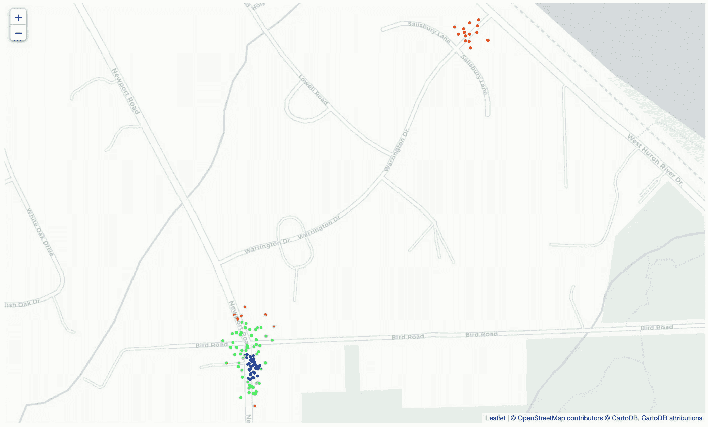
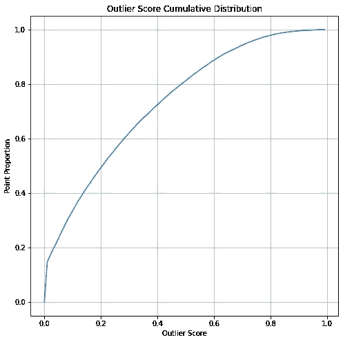
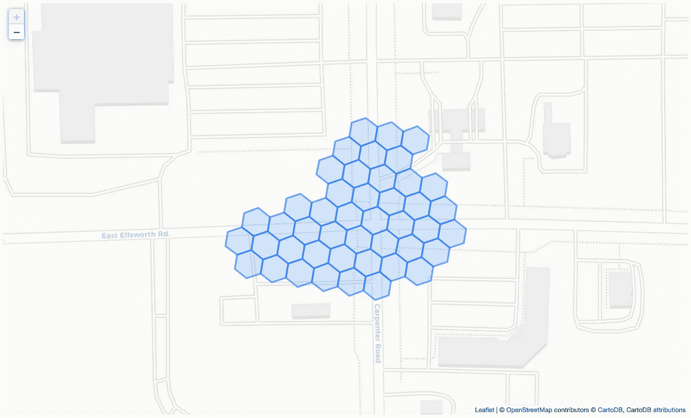
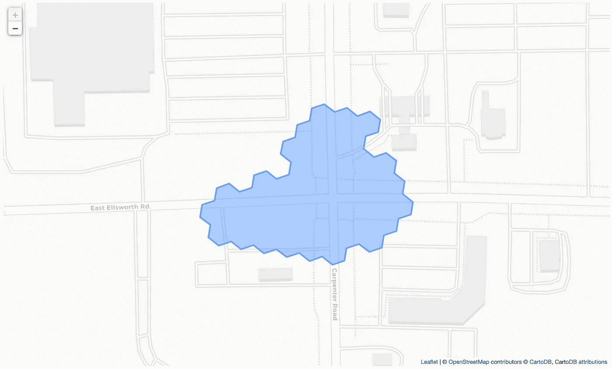
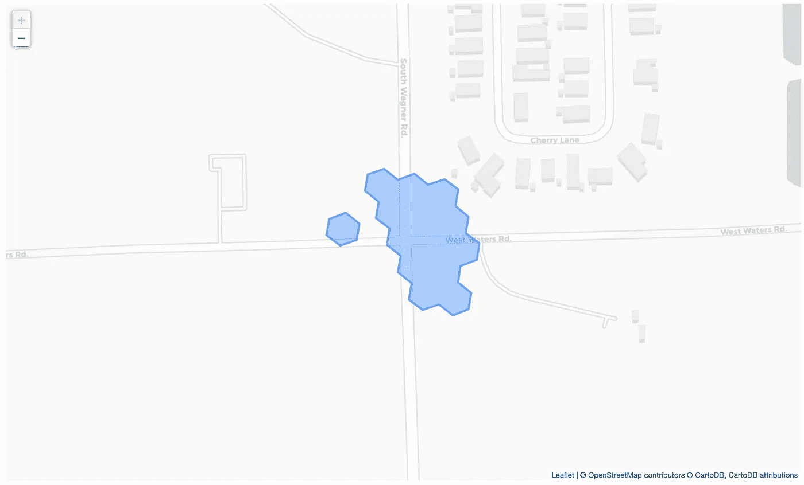
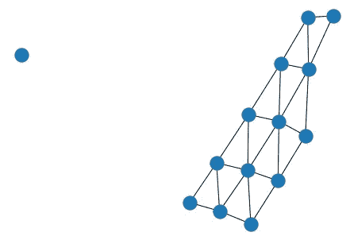
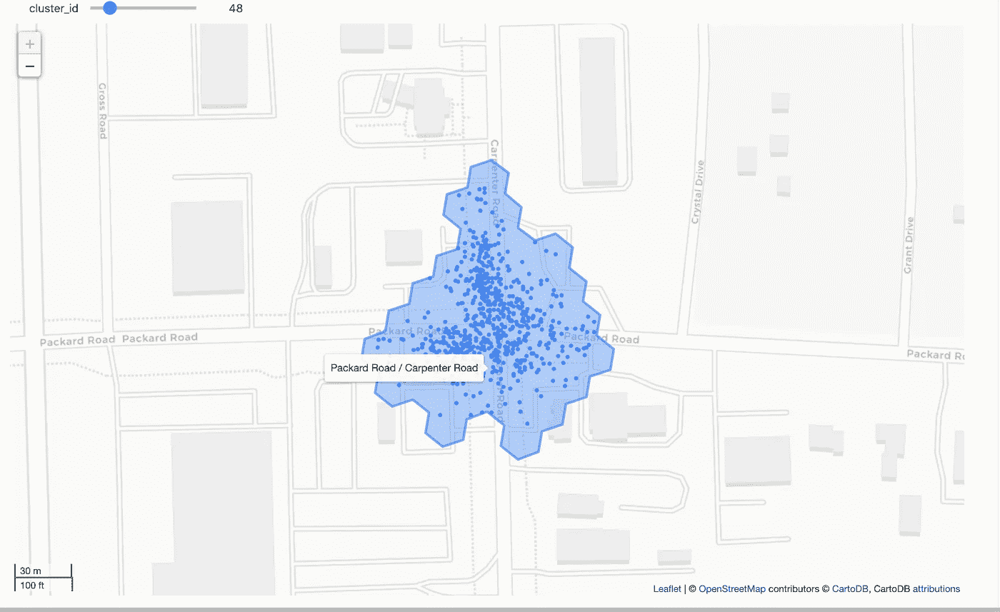

# 使用 HDBSCAN 进行地理聚类

> 原文：<https://towardsdatascience.com/geographic-clustering-with-hdbscan-ef8cb0ed6051?source=collection_archive---------19----------------------->

## 如何使用 HDBSCAN、H3、图论和 OSM 探索地理数据。


马丁·桑切斯在 [Unsplash](https://unsplash.com?utm_source=medium&utm_medium=referral) 上的照片

你的智能手机知道你何时在家或在办公室。至少，我的能，甚至能告诉我什么时候出发，准时到达我的一个共同目的地。我们都接受我们的智能设备收集我们的偏好信息，并将它们发送到云端进行处理。这些反馈回来作为购物、食物、交配以及何时离开办公室回家的建议。

推断一个通常位置背后的魔力是什么？云计算机是如何找到我们生活的“地方”的？答案包括时间戳地理区域和聚类的集合。

在本文中，我将使用 HDBSCAN [1]算法和[车辆能源数据集](https://arxiv.org/abs/1905.02081v1)来说明地理聚类的过程。请参考我的上一篇名为“ [*中型数据集*](/the-medium-sized-dataset-632cf0f15bb6) *，*”的文章，在这篇文章中，我展示了数据集以及如何用 SQLite 数据库处理它的细节。本文共享同一个 [GitHub 存储库](https://github.com/joaofig/ved-explore)，并在此基础上为地理数据分析提供更多功能。

聚类方法来自另一篇名为“ [*绘制英国交通事故热点图*](/mapping-the-uks-traffic-accident-hotspots-632b1129057b) *，*”的文章，在这篇文章中，我使用 DBSCAN 帮助在英国最常报告的交通事故区域周围创建地理围栏。在这里，我使用著名的基于密度的聚类算法的改进版本来处理城市环境中自然出现的复杂聚类，并使用公开可用的数据以一种非常简单但有效的方式命名它们。

# 车辆能源数据集

2019 年，G. S. Oh、David J. Leblanc 和 Huei Peng 发表了一篇关于车辆能源数据集(VED)的论文，其中包含一年的车辆轨迹和能耗数据。这些数据是从 2017 年 11 月至 2018 年 11 月在安阿伯收集的，参考了 383 辆不同类型和动力源的车辆样本。在这里，我们将只使用数据集中的地理数据，并将能源动力学的分析推迟到以后的文章中。

本文讨论了一种有趣的个人数据去识别方法，并研究了与燃油经济性和能效相关的使用案例。最重要的是，该调查收集了超过 374，000 英里的 GPS 数据，我们可以将这些数据用于本文的地理聚类目的。

这项研究的数据收集过程通过一个相对简单的三步法确保了司机匿名。这个过程变得与本文非常相关，因为它产生了一个副产品，一个关键的信息:个性化的车辆轨迹。为了匿名化驾驶员信息，研究作者应用了*随机模糊*、*地理围栏*和*主要交叉边界*技术。随机雾化会移除行程起点和终点附近的观测位置，而地理围栏会在城市边界周围定义的边界框外裁剪观测值。作者还在第一个和最后一个十字路口附近修剪了行程。除了驾驶员匿名化，这些程序还具有生成易于使用的个人轨迹的好处。

我在上一篇文章中给出了如何提取和显示这些轨迹的示例。在这里，我将使用所有轨迹的端点来识别感兴趣的地方，以便将来进行分析。不幸的是，这些将指的是安娜堡最常用的十字路口，而不是司机的最终目的地本身，因为这些都不存在。但这足以说明构建由所有轨迹端点定义的地理聚类的过程。

在我们开始之前，我邀请您克隆本文的 [GitHub 库](https://github.com/joaofig/ved-explore)，并运行前四个编号的笔记本。下面的每一节都详细介绍了接下来的三个 Jupyter 笔记本，引导您到达端点:集群命名。

# 使用 HDBSCAN 进行聚类

> 遵循笔记本中的这一部分`*5-clustering-hdbscan.ipynb*`

运行上述四个笔记本将使您准备好开始地理聚类过程。我们寻找的行程终点信息保存在 SQLite 数据库的`move`表中，我们使用下面的代码通过一个查询读取行程的开始和结束位置。

一旦数据可用，我们可以将它重新排列成只有两列的数组，一列表示纬度，另一列表示经度，如下所示:

现在，我们可以将位置信息提供给 HDBSCAN 算法，该算法的输出是一个集群标识符数组。下面的函数处理所有的工作。

请注意将地理坐标从度转换为米的要求。现在我们可以在端点坐标上调用这个函数，并以相同的顺序收集集群索引。

```
clusterer = fit_utm_clusterer(locations)
```

得到的数组在第一维上具有与位置数组相同的大小，并且计算出的聚类标识符位于相应的索引中，使得查询非常容易。下面的函数在给定 id 的情况下在地图中显示一个聚类。这里，点定义感兴趣的区域，而不是地理围栏。

您可以在第五台笔记本电脑上看到这个功能，它还配有一个交互式小部件来简化集群选择。使用这种设置，您可以快速检查生成的集群质量，并可能调整一些 HDBSCAN 算法参数。

**处理异常值**

毫无疑问，突出的问题之一是一些集群的质量差。一些聚集的点出现在离主要聚集非常远的地方，这些应该通过将它们标记为噪声来处理。下一张图展示了这种现象的一个明显例子。



聚类号 2 显示了东北方向的一组独特的边远点。每个点的异常值分数反映在它的颜色上，蓝色点分数低，红色点分数高。

幸运的是，HDBSCAN 算法为我们提供了一种处理这些点的方法，即*异常值得分*。异常值的范围从 0 到 1，其中 0 表示算法非常确定该位置属于该聚类，而接近 1 的值则表示相反。在上图中，计算出的异常值分数被转换成一个颜色条带，从代表零的蓝色到代表一的红色。看着地图，很明显红色的点是噪音，不属于中央集群。

尽管如此，我们必须想出一个阈值来区分离群值或其他。我的方法非常直观，所以我浏览了所有的聚类点，寻找一个合理的阈值。离群值分数高于该阈值的点将被转换为噪声，而所有其他点将被保留。原来，红色的位置总是在最奇怪的地方，红色意味着高于 *0.8* 的异常值。

这样一个值的选择似乎是任意的，所以我决定提供一些数字支持。我试图确定这样一个门槛是否会去掉太多的分数。简单看一下整个数据集的异常值分布让我放心了。



通过选择 0.8 的异常值分数阈值，我们保留了超过 97.85%的聚类点。

从数值上看，这种计算非常简单，并且产生了 97.85%的相对高的值。

```
scores = clusterer.outlier_scores_
scores[scores < 0.8].shape[0] / scores.shape[0]
```

如果您想在聚类质量上保守一点，保留少一点，比如 95%的点，该怎么办？这个计算也很容易执行。

```
pd.Series(scores).quantile(0.95)
```

事实证明，如果只考虑 95%的聚类点，可以将离群值阈值设置为 72.7%。让我们保留 0.8 的值，并过滤掉外围位置。

```
filtered_clusters = np.copy(clusterer.labels_)
filtered_clusters[scores >= 0.8] = -1
```

如您所见，过滤是将所有异常值标记为噪声的简单过程。我们现在可以将它们保存到数据库中。对于每个聚类点，我们存储相应的 id(对于离群值可能是-1)、地理位置和 12 级 H3 指数。正如我们将在下面看到的，这会给我们带来一点麻烦，解决起来会很有趣。

聚类已经有了很大的价值，因为它们让我们能够从地理上了解旅行的起点和终点。然而，我们可以更进一步，设计一种方法，在聚类点周围绘制地理围栏。此地理围栏将作为判别函数来测试某个位置是否属于某个聚类。

# 集群地理围栏

> 遵循笔记本中的这一部分`*6-cluster-geofencing.ipynb*`

为了解决地理围栏问题，我将再次求助于 H3。正如我在之前的一篇文章中所展示的，我们可以用 H3 来图形化地描述集群。对于每个 H3 索引，我们可以根据地理坐标查询相应的六边形顶点。下面的函数将 H3 六边形索引转换成相应顶点坐标的数组。请注意第一个坐标是如何复制到最后以产生一个闭合的多边形的。

通过将一个集群的所有六边形粘贴在一起，我们可以构建一个类似蜂巢的集群表示。



通过将所有六边形粘贴在一起，我们创建了一个类似蜂巢的集群表示。然而，我们只想保留大纲。

上图有助于理解基于哈希的聚类包含检测算法是如何工作的。这些六边形中的每一个都对应于 12 级的 H3 指数。为了测试一个随机点在聚类中的包含性，我们必须将其坐标转换为 H3 指数，并将其与聚类列表进行比较。这种计算速度很快，并且很容易在数据库索引或内存哈希表的帮助下进行编码。

我们将保留这种基于哈希的搜索功能，但将通过仅保留多边形的整体轮廓来改进表示。我们在 Shapely 包的帮助下合并所有的多边形。

```
merged = cascaded_union(polygons)
```

我们将六边形多边形列表提供给级联联合函数。对于上面的简单情况，它返回单个多边形对象，或者当六边形的放置产生分散的“岛”时，它返回多多边形对象这就是我们想要的结果。



与上面相同的簇，但是现在所有的六边形合并成一个形状。

但并不是所有的星团都会聚结成一个单一的形状。由于点分散和用于表示的固定 H3 水平，我们可能会看到一些不连续的区域，如下图所示。



由于点分散和用于表示六边形的固定 H3 水平，这些岛逐渐增大。

这个问题的解决方案似乎很简单:我们必须在某个地方放置另一个六边形，并将两个组件连接起来，这让我想起了网络组件。也许我们可以用一些图论来解决这个问题。

我们可以通过将六边形视为节点，将相邻关系视为边，来构思一个表示我们的集群单元的图。如果两个六边形是邻居，将有一条边连接它们。下面的函数就是这样做的。

该函数接收六边形索引列表作为输入参数，并扫描所有可能的紧邻对。产生的邻域图不是有向类型，所以该函数只测试所有可能关系的一半。

一旦生成，我们就可以查询该图，以了解它有多少个[连通分量](https://en.wikipedia.org/wiki/Component_(graph_theory))。从视觉上看，结果如下图所示。



上面的集群表示为一个图形。请注意两个明显的组件，以及较大组件中的节点是如何连接的。每条边都是邻居关系。为了将孤立的节点链接到更大的组件，我们必须至少添加另一个节点(六边形)。

NetworkX 包通过一个简单的查询证实了我们的直觉。

```
nx.number_connected_components(g)
```

这个查询返回值 2，我们甚至可以查询组件是什么。

```
list(nx.connected_components(g))
```

该查询生成一个列表，其中包含每个连接组件的一组节点。在这种情况下，结果如下。

```
[{'8c274994cbb45ff'},
 {'8c274994c85a3ff',
  '8c274994c85a7ff',
  '8c274994c85b1ff',
  '8c274994c85b3ff',
  '8c274994c85b5ff',
  '8c274994c85b7ff',
  '8c274994c85bdff',
  '8c274994cbb49ff',
  '8c274994cbb4bff',
  '8c274994cbb51ff',
  '8c274994cbb59ff',
  '8c274994cbb5bff',
  '8c274994cbb5dff'}]
```

现在，我们可以迭代这两个组件，并尝试找到它们之间最短的桥。幸运的是，H3 用一个在两个六边形之间“画线”的功能来拯救我们。下面的函数使用此服务来查找两个不同连接组件的任意两个六边形之间的最短可能直线。

该函数遍历输入列表中的前两个连接组件，并枚举它们之间所有可能的“桥”。选定的桥要么是枚举中最短的桥，要么是只有三个元素的第一个桥。

一旦我们有了桥，我们就可以在两个组件之间构建它，生成一个新的图，并进行迭代。找到最新的连接组件列表，如果我们有多个组件，重新运行整个列表。

下面是整个过程。

请注意，我们只保留桥中的内部六边形，因为外部六边形已经存在于连接的组件中。上面的代码还会在数据库中插入新的集群点。

现在，我们确信所有的集群都已连接并存储在数据库中。那么给它们命名呢？

# 集群命名

> 遵循笔记本中的这一部分`*7-cluster-names.ipynb*`

本文中的最后一个挑战是在不使用反向地理编码服务的情况下获得聚类名称。我们将使用 [OSM 立交桥 API](https://wiki.openstreetmap.org/wiki/Overpass_API) 来查询地理数据，并使用它来分配名称。每个查询都需要一个地理边界框，所以我们必须首先从数据库中获取它们。

现在可以跨线查询了，但是我们需要做额外的准备，以避免通过缓存所有返回的数据来加重公共 API 的负担。这个策略将允许我们在出错的情况下防止发出重复的调用。为此，我们创建了一个特定的目录，将所有收集到的数据存储为 JSON 格式的文件。请注意，如果您决定返回并调整集群定义，您将必须擦除所有缓存文件，因为集群编号可能会发生变化。

该函数在提取文件缓存的同时检索与集群相关的 OSM 数据。

我们现在可以迭代集群集合，并使用下面的代码计算相关的名称。

上面的代码有两处值得注意的地方。首先，我们使用一个转换 JSON 编码数据的辅助函数来构建每个 OSM 网络对象。第二，聚类名称是定义聚类本身的点集的函数。该函数计算距离每个输入点最近的 *K* 个位置，并使用简单的投票机制检索前两个最常见的街道名称。最终的集群名称仅仅是这两个名称的串联，因为我们正在命名街道交叉口。



位于帕卡德路和卡彭特路交叉口的一个命名集群。

# 结论

在本文中，我展示了一些处理地理聚类的技术，从聚类过程本身开始，然后是地理围栏过程，最后是一个轻量级地理编码器。

关于这些数据还有很多需要探索的地方，我打算在以后的文章中这样做。最令人兴奋的模式之一无疑是车辆在两个集群之间行驶时的路线。敬请关注。

# 参考

长度麦金尼斯，j .希利，s .阿斯特尔斯， *hdbscan:基于层次密度的聚类*，《开放源码软件杂志》，第 2 卷，第 11 期。2017

Ester，m .，Kriegel，H.P .等人(1996)一种基于密度的算法，用于在带有噪声的大型空间数据库中发现聚类。KDD，226–231

[汽车能源数据集(VED)，用于汽车能源消耗研究的大规模数据集](https://arxiv.org/abs/1905.02081v1)

# 相关文章

[中型数据集](/the-medium-sized-dataset-632cf0f15bb6)

[绘制英国交通事故热点图](/mapping-the-uks-traffic-accident-hotspots-632b1129057b)

[优步 H3 的地理空间索引](/geospatial-indexing-with-ubers-h3-766399b690c)

# 油管（国外视频网站）

[闪电对话:用 HDBSCAN 集群](/lightning-talk-clustering-with-hdbscan-d47b83d1b03a)

[](https://www.linkedin.com/in/joao-paulo-figueira/) [## joo Paulo Figueira—数据科学家—TB . LX by Daimler Trucks & bus | LinkedIn

### 查看 joo Paulo Figueira 在全球最大的职业社区 LinkedIn 上的个人资料。圣保罗列出了 1 份工作…

www.linkedin.com](https://www.linkedin.com/in/joao-paulo-figueira/)