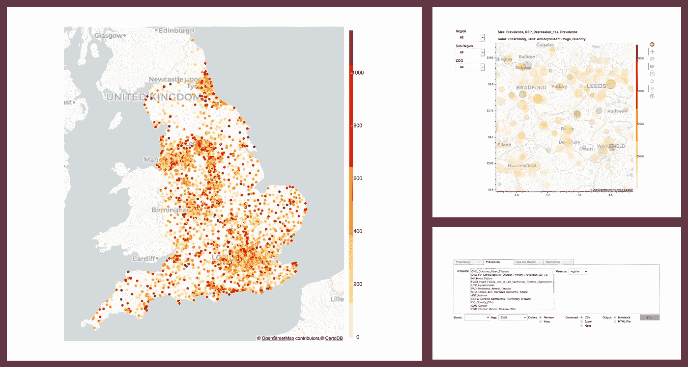
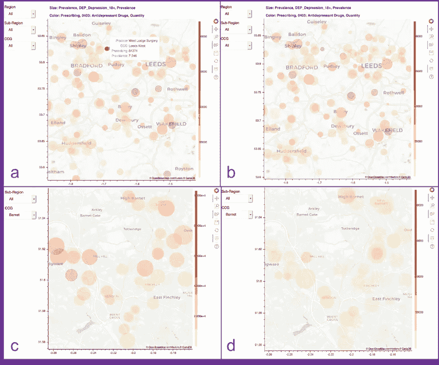
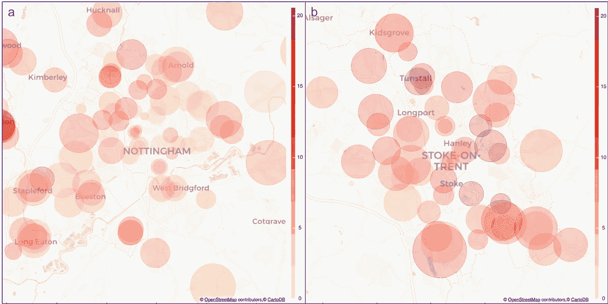
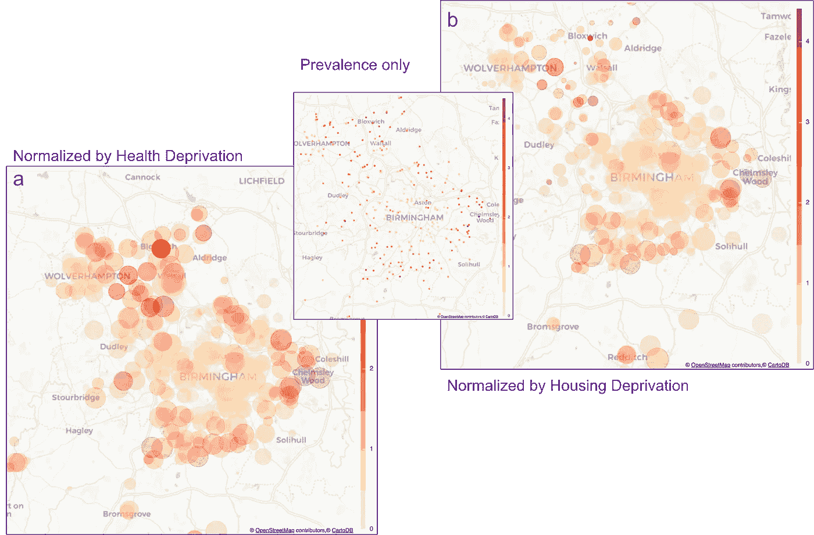

# GeoHealth:医疗和社会数据的统一仪表板

> 原文：<https://towardsdatascience.com/geohealth-a-unified-dashboard-for-medical-and-social-data-d33a03b94c2e?source=collection_archive---------64----------------------->

# 介绍

GeoHealth 是一个公共卫生仪表板模型，旨在展示和连接来自不同来源的医疗和社会数据。目前的版本侧重于英格兰，使用公共卫生和社会人口统计信息，这些信息可从大约 8000 例手术的一般实践层面获得。作为该项目的一部分，收集和清理了他们的数据集，可对其进行查询，以生成国家、区域和地方各级疾病流行率、风险因素和社会贫困的地理空间表示。

一旦完成，仪表板可以支持公共卫生政策的形成和有关疾病治疗和预防的循证决策。数据来源是由 NHS 英格兰和公共健康英格兰管理的[全科医疗数据中心](https://digital.nhs.uk/data-and-information/data-tools-and-services/data-services/general-practice-data-hub)和[国家全科医疗概况](https://fingertips.phe.org.uk/profile/general-practice/page-options/map-ao-4)，它们建立了长期仪表板来监控[药物处方行为](https://openprescribing.net/)和[疾病流行率和风险因素](https://healthierlives.phe.org.uk/)。仍处于发展阶段的地理健康受到了这些努力的启发，不应作为替代方案进行咨询。目的是建议开发一个统一的可视化平台，连接健康、人口和社会[剥夺](http://dclgapps.communities.gov.uk/imd/iod_index.html)数据，并支持机器学习、统计和流行病学工具的开发。

仪表板演示

# 药物利用和疾病流行

该项目的大部分数据是处方数据，自 2011 年以来，每个月在英格兰的所有实践中均可获得。这些数据集可以支持药物利用研究，以量化、理解和评估药物的处方、配药和消费过程，并测试干预措施，以改善人群对药物的使用。该仪表板允许用户比较不同地理区域的药物利用(DU ),将 DU 与这些区域的发病率概况相关联，检查特定药物 groups⁴的治疗效果，或审查处方政策的影响，如英国 5 年抗菌药物耐药性策略。⁵

处方数据也被检查作为慢性病患病率的指标，其中监测是复杂的，并且经常依赖于临床和管理来源。geohealth 的流行率来源于[质量和结果框架(QOF)](https://digital.nhs.uk/data-and-information/data-tools-and-services/data-services/general-practice-data-hub/quality-outcomes-framework-qof) ，该框架旨在监控医疗质量。由于报告是自愿的，并且由于病例发现、编码定义和实践记录之间的差异，QOF 登记册可能不符合流行病学标准(技术附件，2015-16，第 9 页)；在一些研究中，它们被确定为低估了健康调查中模拟或测量的某些疾病的发病率。⁸ ⁹ ⁰这些因素使得使用 QoF 数据来解释逐年变化或评估适应症的实际患病率变得困难。然而，它们可能有助于确定地理变异的模式，以及对流行和威胁生命的疾病的诊断不足。

对处方和流行之间的复杂关系感兴趣的用户可以选择药物和适应症，放大特定的实践及其领域。图 1 中的曲线显示了糖尿病的患病率与抗糖尿病药物的量(a，c)以及抑郁症的患病率(18 岁以上)与每次治疗中开出的抗抑郁药的量(b，d)的关系。图 a 和 b，为利兹、布拉德福德和韦克菲尔德绘制，以呈现地区级别的流行率和处方；图 b 和 d 显示了单个临床委托组(Barnet，North London)的数据，该临床委托组构成了英格兰医疗保健提供的本地单位。流行程度用点的半径来表示，而它们的颜色则表示处方药物的数量。深色小圆圈表示诊断和处方水平可能不匹配，反之亦然。如果是这种情况，则该图表明与糖尿病和精神疾病相关的高处方或诊断不足。

图 1

# 新冠肺炎的风险群体

年龄、性别和背景疾病与严重感染新冠肺炎病毒的风险之间的关系表明，GeoHealth 也可能告知疫情的遏制措施。NHS 呼吁所有人呆在家里，以帮助阻止冠状病毒的传播，但重点是受某些慢性疾病影响的人，70 岁或以上的人和明显超重的人(身体质量指数> 40)。虽然建议他们遵守更严格和更谨慎的规定，但他们的地理差异可能会通知区域级别的预防计划，并用于相应地更新感染模型。图 2 显示了他们的地理差异，显示了冠心病(a)、糖尿病(b)、肥胖症(c)和慢性阻塞性肺病(COPDd)。模式各不相同，但总体情况是，与伦敦地区相比，英格兰北部和沿海地区的发病率有所上升。

图 2

# 性别和年龄组

可以结合人口统计数据探索显示高水平疾病流行的区域。实践中的性别和年龄构成被确定为对所诊断的疾病的流行程度和可能使用的药物有很大影响。⁴心血管疾病、神经系统疾病和糖尿病的发病率随着年龄的增长而增加，[心理健康带来的最大负担](https://www.gov.uk/government/publications/health-profile-for-england-2018/chapter-3-trends-in-morbidity-and-risk-factors#trends-in-risk-factors)发生在年轻人身上。冠状病毒感染流行的研究表明，在⁵ ⁶，男性的病死率高于女性，这一点在 2002-2003 年 SARS 流行期间、最近的中东呼吸综合征爆发和实验室研究中都有发现。⁷

图 3 比较了邻近的北中部城市诺丁汉(a)和特伦特河畔斯托克(b)的肥胖患病率(%)(点颜色)和 70 岁或以上患者的患病率(%)(根据圆圈的大小)。他们的图表显示了人口统计学和发病率模式的地方和区域差异。在诺丁汉，老龄化和肥胖的人口出现在城市的边缘，而在斯托克，他们更靠近市中心。观察到的变化表明了新冠肺炎风险的地理分布，这可能为城市、区域和次区域级别的遏制计划提供信息，也许是通过结合这些地区护理院的数据。

图 3

# 健康和贫困

对疾病和健康因素的监测还应了解所研究地区的社会经济状况。社会剥夺被确定为高血压、癫痫、冠心病、肺病、糖尿病和各种类型的癌症⁰ ⁸ ⁹ ⁴患病率增加以及为精神疾病开出更多抗生素和药物处方的主要决定因素。⁰:仪表板使用多重剥夺指数(IMD) ,这是英国相对剥夺的官方衡量标准，计算方法是收入(22.5%)、就业(22.5%)、教育、技能和培训(13.5%)、健康和残疾(13.5%)、犯罪(9.3%)、住房和服务障碍(9.3%)以及生活环境(9.3%)的地区级加权总和。这些分数是使用小范围的人口普查变量计算出来的，这些变量的值被标准化或转换，标准化为当地、地区或国家的平均值，并根据加权方案进行组合。

贫困指数通常对城乡差异敏感，但可能有助于比较城市之间和城市内部的差异，以确定需要重点关注的风险热点。伦敦玛丽女王大学[全球公共卫生教授大卫·麦考伊批评](https://www.theguardian.com/commentisfree/2020/apr/10/modelling-pandemic-politicians-decisions-science?CMP=Share_iOSApp_Other)英国政府不加批判地坚持科学顾问，没有考虑病毒对老年人和男性的不成比例的影响，以及“控制措施的附带损害将不成比例地影响更贫穷和更边缘化的社会阶层。”在疫情之前、期间和之后，应对这些影响的努力可以通过探索健康地理和贫困指数来识别健康和经济风险人群。

图 4 探讨了中西部地区 COPD 的患病率，重点是伯明翰和附近的伍尔弗汉普顿市。COPD 患病率单独显示，并与健康和残疾指数(a)或住房和服务障碍指数(b)相关。前者衡量过早死亡的风险和因身体或精神健康状况不佳而损害生活质量的风险，而后者指的是商店、手术室、学校和邮局以及负担得起的住房的可及性，包括家庭过度拥挤和无家可归。虽然 COPD 患病率不超过人口的 5%,但其与剥夺措施相关的标准化可能指向城市间的位置，在这些位置，由于住房条件、获得服务的机会或人口的健康状况，新冠肺炎风险可能会增加。

# 代码和开发

该项目是用 Python(3.7 版)编写的，使用了用于数据可视化和用户交互的 [ipywidgets](https://ipywidgets.readthedocs.io/en/latest/) 和 [bokeh](https://docs.bokeh.org/en/latest/index.html) 库。数据保存在[的 PostgreSQL](https://www.postgresql.org/) 数据库中，该数据库托管在 [AWS](https://aws.amazon.com/rds/) 的一个私人账户中，该账户对所有用户开放只读访问。虽然不能作为 web 应用程序使用，但仪表板可以下载并在 [Jupyter 笔记本](https://jupyter.org/)中运行，这是一个方便的数据科学研究环境。[代码](https://github.com/ronyarmon/geohealth)和数据可免费获得，以支持数据探索、连接到额外的数据源，并在需要时开发用户界面。[该软件包以模块化方式设计](https://medium.com/@rony_armon/geohealth-build-up-and-architecture-29f3b45e68fb)，允许分析师、开发人员和数据科学家使用 SQL 或 BI 软件查询数据，构建统计和机器学习模型，添加数据集和选择菜单，使仪表板适应其他国家的数据或改进用户界面。

1.Wettermark B，Elseviers MM，Almarsdottir ABirna 等(2016)药物利用研究导论。在:药物利用研究。

2.vlahovic-palc evski V，Wettermark B，Ibáez L 等人(2016)不同地理区域药物利用的比较。药物利用研究:151–159

3.拉米卡内·DC、吉里·布里、帕塔克·奥克等人(2006)尼泊尔西部一所教学医院门诊患者的发病率概况和处方模式。麦吉尔医学杂志 9:126–132

4.Lipska KJ，Yao X，Herrin J 等人(2017)药物利用、血糖控制和严重低血糖发生率的趋势，2006-2013。糖尿病护理，40:468–475

5.英国卫生和社会福利部(2019)2013 年至 2018 年五年期抗微生物药物耐药性战略。

6.斯洛伯·LCJ、Füssenich K、Wong A 等人(2019)使用随机森林算法从药物利用数据中估计疾病流行率。欧洲公共卫生杂志 29:615–621

7.Chini F，Pezzotti P，Orzella L 等(2011)我们能使用药房数据来估计慢性病的患病率吗？多个数据源的比较。BMC 公共卫生 11: 688

8.Standing P，Deakin H，Norman P 等(2005)高血压——英国全科医疗质量驱动下的高血压检测、患病率、控制和治疗。英国心脏病学杂志，12:471–6。

9.Kendrick T，Stuart B，Newell C 等人(2015)2003-2013 年英国初级保健中记录的抑郁症比率的变化:经济衰退影响的时间趋势分析和全科医生合同质量结果框架(QOF)。情感障碍杂志 180:68–78

10.阿什沃斯 M、梅迪纳 J 和摩根 M (2008)英国社会剥夺对血压监测和控制的影响:来自质量和结果框架的数据调查。BMJ 337:1215–1218

11.Nacul LC，Soljak M & Meade T(2007)用于估计慢性阻塞性肺疾病人群患病率的模型:来自英格兰健康调查的横断面数据。人口健康指标 5:1–8

12.Soljak M，Samarasundera E，Indulkar T 等人(2011)英格兰诊断不足的心血管疾病的变化:全国横断面空间分析。BMC 心血管疾病 11: 12

13.周芳，于婷，杜锐等(2020)中国武汉地区成年新冠肺炎住院患者的临床病程和死亡危险因素:一项回顾性队列研究。柳叶刀 395:1054–1062

14.Lloyd DCEF，Harris CM & Roberts DJ (1995)特定治疗组年龄-性别相关处方单位(STAR-PUs):用于分析英格兰一般实践处方的权重。BMJ 311: 991

15.杨军，郑燕，苟 X 等(2020)新型武汉冠状病毒(新冠肺炎)感染的共病患病率:一项系统综述和荟萃分析。国际传染病杂志 94:91–95

16. [Worldometer。冠状病毒年龄、性别、人口统计(新冠肺炎)。](1.%09https:/www.worldometers.info/coronavirus/coronavirus-age-sex-demographics)访问日期:26.4.20

17.Channappanavar R，Fett C，Mack M 等人(2017)对严重急性呼吸综合征冠状病毒感染易感性的性别差异。免疫学杂志 198:4046–4053

18.Steer S，Pickrell WO，Kerr MP 等人(2014)英格兰癫痫患病率和社会经济剥夺。癫痫症 55:1634–1641

19.牛顿 JN，布里格斯 ADM，默里 CJL 等人(2015)英国的健康变化，按英国地区和贫困地区分析，1990-2013 年:2013 年全球疾病负担研究的系统分析。柳叶刀 386:2257–2274

20.Hull SA，Aquino P & Cotter S(2005)解释了伦敦东部抗抑郁药处方率的变化:一项横断面研究。家庭实践 22:37–42

21.Hope EC、Crump RE、Hollingsworth TDeirdre 等人(2018 年)确定了英国的做法，即高抗生素处方说明了共病和变异的其他合法医学原因。临床医学 6:36–41

22.Bertin M，Chevrier C，Pelé F 等人(2014 年)贫困指数可以合法地用于城市和农村地区吗？国际健康地理杂志 13: 22

23.国家统计局(2009 年)《理解贫困模式》。区域趋势 41:93–114

24.Nacul L，Soljak M，Samarasundera E 等人(2011)英格兰的慢性阻塞性肺病:基于模型的预期患病率与从全科医学数据中观察到的患病率的比较。公共卫生杂志 33:108–116