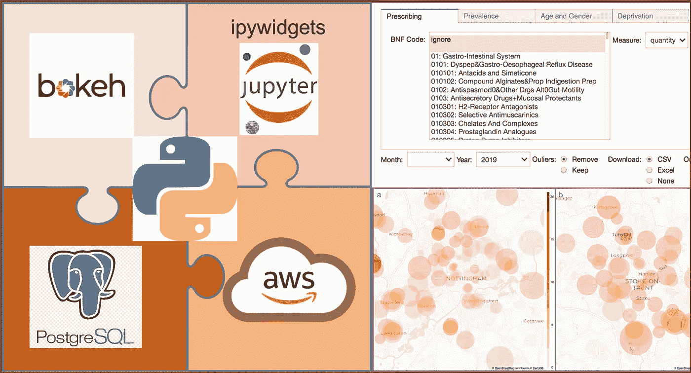
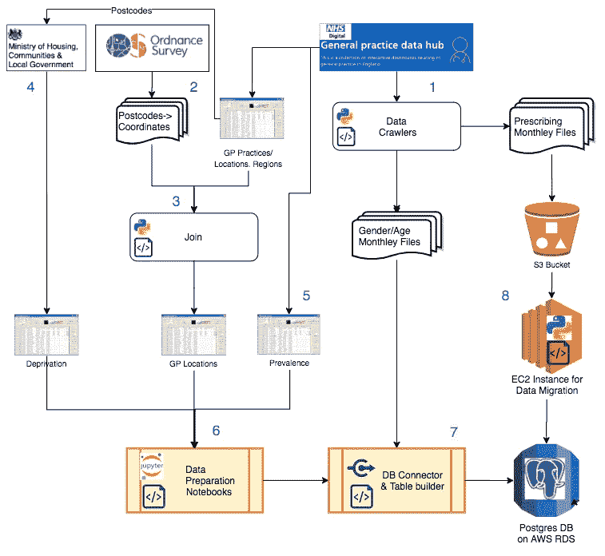
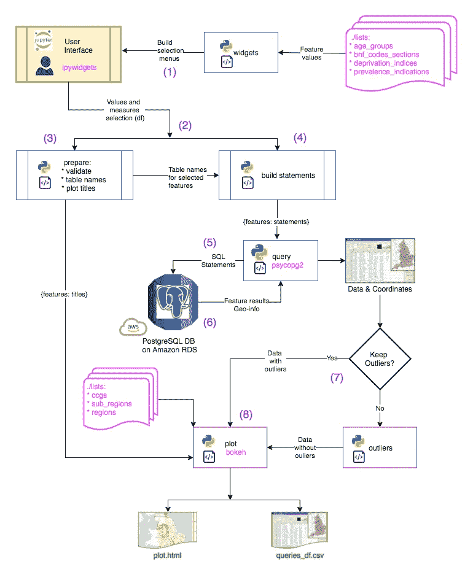

# 地理健康:建立和建筑

> 原文：<https://towardsdatascience.com/geohealth-build-up-and-architecture-29f3b45e68fb?source=collection_archive---------49----------------------->

## 或者如何从头开始构建 Python 仪表板

这篇文章介绍了 [GeoHealth dashboard](/geohealth-a-unified-dashboard-for-medical-and-social-data-d33a03b94c2e) 的构建流程和架构，是项目文档的一部分，也是数据科学 dashboards 的一个诀窍。GeoHealth (Python，3.7)利用 [ipywidgets](https://ipywidgets.readthedocs.io/en/latest/) 和 [bokeh](https://docs.bokeh.org/en/latest/index.html) 库来捕捉用户输入并提供交互式地理空间图。这些数据是从一个私有账户中的 [AWS](https://aws.amazon.com/rds/) 上托管的 [PostgreSQL](https://www.postgresql.org/) 数据库中查询的。该项目可以通过结合地块内外的小部件来构建您的仪表板原型，与云基础设施连接，并查询大数据和公开可用的来源。Jupyter 笔记本通常与 ipywidgets 和/或 bokeh 一起使用，以构建和共享交互式可视化。数据准备和查询代码的详细和图形化描述可能对希望增强笔记本体验的数据科学家或寻求分析后端的前端开发人员有用。文章随后向对 GeoHealth 感兴趣的读者以及希望在其他项目中使用 geo health 或其组件的其他人发表。

# 数据来源和准备

仪表板通过查询英国卫生和其他政府机构公开提供的数据来支持卫生地理的研究。如图 1 所示，准备工作从识别可以查询医疗、社会和地理数据的门户开始。 [NHS Digital](https://digital.nhs.uk/data-and-information/data-tools-and-services/data-services/general-practice-data-hub) 是英格兰国家医疗服务系统的数字化分支，提供个体手术(GP 实践)层面的多样化数据集，包括治疗处方、疾病患病率、性别-年龄登记和每个实践的地址。

图 1:准备阶段(来源:作者)

数据集是手动下载的，或者在处方和性别/年龄(每月可用)的情况下，使用特定的爬虫程序下载。坐标文件可从[英国国家测绘局](https://www.ordnancesurvey.co.uk)获得，用于每个邮政编码，通过 GP 实践的邮政编码进行过滤(2)并结合形成 GP 位置文件，包含每个实践的名称、地址坐标和区域信息(3)。邮政编码也被用来从英国住房、社区和地方政府部为此目的建立的门户网站[中提取贫困指数(4)。年度电子表格中可用的疾病患病率数据被下载(5)，然后在笔记本中进行探索和预处理，就像对位置和剥夺数据集所做的那样(6)。每个数据集都与一个](http://imd-by-postcode.opendatacommunities.org/imd/2019)[表构建脚本](https://github.com/ronyarmon/geohealth/blob/master/preparation/load_tables_db_example.py)匹配，利用 [Python PostgreSQL](https://pynative.com/python-postgresql-tutorial/) 连接器[读取数据集并将其加载到数据库上的指定表](https://github.com/ronyarmon/geohealth/blob/master/preparation/load_tables_db_example.py)。PostgreSQL 是一个开源的关系数据库，可以扩展到远远超过项目中的数据大小，并且可以通过编程或通过[一个方便的用户界面](https://www.pgadmin.org/download/)来访问。表名由特征和周期组合而成(例如:gender_age_201907 ),以支持用户查询检索(见下文)。

处方数据集列出了英格兰所有诊所开出的所有药物、敷料和器械，每月提供大约 1000 万行和 1GB 的数据**(2)。它们的文件大小需要特定的准备过程。爬虫和数据库连接器脚本被加载到一个虚拟机实例(EC2，Ubuntu 18:04，t2.micro machine ),并用于将文件从 NHS 数字门户复制到 S3 桶作为备份。这些文件随后被从这个桶运送到托管在 [AWS 的关系数据库服务(RDS)](https://docs.aws.amazon.com/AmazonRDS/latest/UserGuide/CHAP_GettingStarted.html) 上的 PostgreSQL 数据库。Postgres 的安全特性允许将数据库管理员与仪表板用户角色分离，仪表板用户角色可以被授予[只读角色权限](https://github.com/ronyarmon/geohealth/blob/master/preparation/create_dashboard_user_example.py)。与家庭网络相比，EC2 实例享有增强的连接性，家庭网络被证明对于从 NHS Digital 向 S3 下载和上传文件是有用的。现在，所有数据集都存储为关系表，接下来就是构建具有用户界面、查询机制和绘图功能的仪表板了。**

# **查询和绘图**

**为了增强代码的可重用性，仪表板以模块化的方式编写，这样它的[功能模块](https://github.com/ronyarmon/geohealth/tree/master/modules)(图 2)可以作为独立组件在其他项目中进行修改。[主笔记本的运行](https://github.com/ronyarmon/geohealth/blob/master/main.ipynb)从[构建选择部件](https://github.com/ronyarmon/geohealth/blob/master/modules/widgets.py)开始，这些部件从每个特性的[列表](https://github.com/ronyarmon/geohealth/tree/master/lists)中获取它们的值。用户被指示选择最多两个特征，每个特征的测量值和感兴趣的时间段。选择值以数据帧的形式收集，并传递给 [**准备**](https://github.com/ronyarmon/geohealth/blob/master/modules/prepare.py) 模块(2)中的功能。它们验证选择，提取每个特征的表的名称，并捕获图标题的搜索词(3)。表名被添加到选择数据帧中，该选择数据帧被传递到合适的类[**build _ statements**](https://github.com/ronyarmon/geohealth/blob/master/modules/build_statements.py)**模块(4)，该模块将搜索参数插入到合适的 SQL 语句中，这些 SQL 语句将被传递到查询数据库的 [**查询**](https://github.com/ronyarmon/geohealth/blob/master/modules/query.py) 模块(5)。为了保持过程的模块化，每个感兴趣的特性都被转换成一个单独的语句，用于查询一个单独的表。例如，将性别百分比与肥胖流行率相结合的选择将被转换为性别年龄表的语句和同一时期流行率表的另一个语句。各个查询的结果被收集到各个数据帧中(6)。这些与实践位置数据结合成构成搜索结果的单个数据框架。****

********

****图 2:解决方案架构(来源:作者)****

****用散景写的 [**plot**](https://github.com/ronyarmon/geohealth/blob/master/modules/plot.py) 函数是用来通过数据点的颜色或半径来显示特征值的。由于颜色条的范围反映了所显示特征的最小值和最大值，偏离该范围的异常值会掩盖数据中的变异。例如，在 1–50 之间有 7000 个值且在 200 附近有 3 个异常值的数据将使用 1–200 范围来隐藏中间范围内的点。用户可以选择保留异常值，特别是如果目的是通过其他统计工具将数据作为一个整体来研究，或者如果目标是检测异常。但是，如果选择了默认(也是推荐的)选项，则[异常值](https://github.com/ronyarmon/geohealth/blob/master/modules/outliers.py)模块会应用[图基规则](https://math.stackexchange.com/questions/966331/why-john-tukey-set-1-5-iqr-to-detect-outliers-instead-of-1-or-2)来排除 1.5 个四分位数范围之外的点，并生成一个干净的数据集进行绘制。绘图模块获取数据集、标题的搜索词以及在笔记本中显示绘图或在单独的浏览器选项卡上显示绘图之间的输出选择，浏览器选项卡也将绘图保存在 HTML 文件中。除了可以用一行代码[配置的缩放、平移和悬停功能](https://docs.bokeh.org/en/latest/docs/user_guide/tools.html)之外，该图还应用了带有 JavaScript 回调的[散景小部件](https://docs.bokeh.org/en/latest/docs/user_guide/interaction.html)来实现对特定地图区域的聚焦。除了绘图之外，用户还可以获得 csv 或 excel 格式的连接数据，以便通过其他 dahaboard 软件或分析工具进行探索。虽然[代码](https://github.com/ronyarmon/geohealth)的结构可以被克隆并用作库，但它的模块可以用作其他 ui 的查询工具，或者为其他功能和数据集定制数据科学接口。****