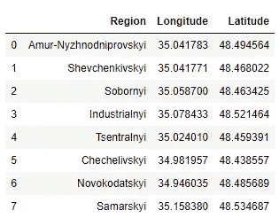
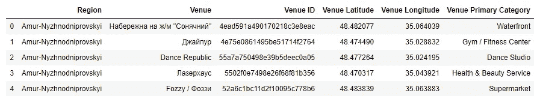
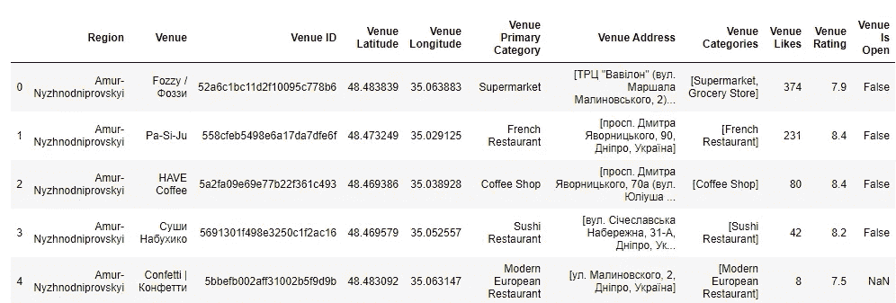
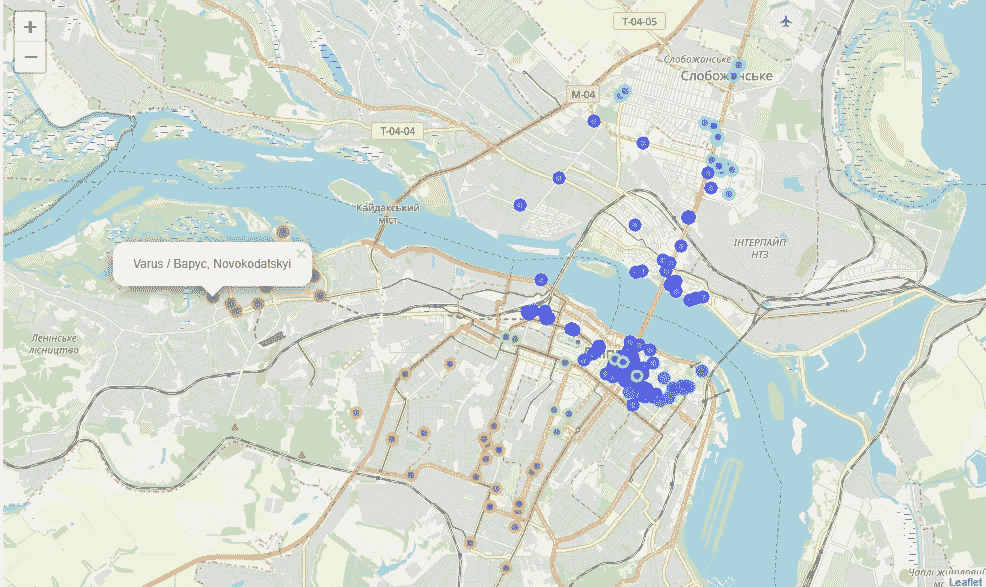
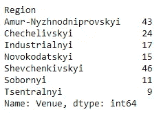
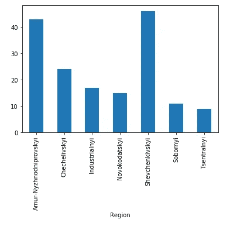
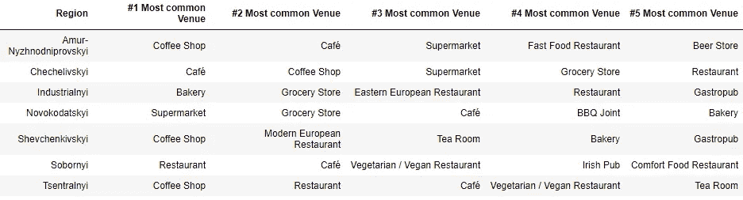

# 用于数据分析的地理定位和地理编码仪器组

> 原文：<https://towardsdatascience.com/geolocations-and-geocodes-instrument-set-for-data-analysis-5eb4e33a1677?source=collection_archive---------27----------------------->

## 数据科学提示

## four square+geopy+leav 完美共生


在 [Unsplash](https://unsplash.com?utm_source=medium&utm_medium=referral) 上由 [Aron 视觉](https://unsplash.com/@aronvisuals?utm_source=medium&utm_medium=referral)拍摄的照片

地理对象、地址或坐标的大型数据集的分析需要一些固定的仪器。您需要提取关键数据，获得必要的细节，在地图上可视化数据点，并为分析或某种学习算法做好准备。我想以我的家乡城市为例，分享我在这些任务中使用的工具集。

# 1.使用 geopy 获取城市区域位置

城市的地理标签本身有一点信息，所以我们应该发现城市所有区域的坐标。对于大城市来说，这可能是一项复杂的任务，需要额外的邮政编码数据集、一些网络抓取工具或其他资源。嗯，我的家乡(第聂伯)不是很大，所以这里是它的地区:

```
['Amur-Nyzhnodniprovskyi',
 'Shevchenkivskyi',
 'Sobornyi',
 'Industrialnyi',
 'Tsentralnyi',
 'Chechelivskyi',
 'Novokodatskyi',
 'Samarskyi']
```

现在我们将使用[地理包](https://github.com/geopy/geopy)来发现这些地区的地理标签。默认的地理编码器对我们来说已经足够了，尽管你可以在[文档页面](https://geopy.readthedocs.io/en/stable/)上找到更多的 API。为了以防万一，我们将设置响应的最大延迟和尝试次数。

```
from **geopy**.geocoders import **Nominatim**
from **geopy**.extra.rate_limiter import RateLimitergeolocator = **Nominatim**(user_agent="dnipro",timeout=10)
geocode = RateLimiter(geolocator.geocode, min_delay_seconds=2)longitudes = []
latitudes = []
for region in dnipro_regions['Region']:
    location = geocode('{}, Dnipro'.format(region))
    longitudes.append(location.longitude)
    latitudes.append(location.latitude)
```

将坐标连接到我们的数据集并继续。



带有地理标记的区域

# 2.使用 Foursquare 获取咖啡馆和商店的详细信息

让我们假设，我们为孤独的游客开发推荐系统，他们想去一个外国城市的咖啡馆或食品店吃饭。为此，我们需要一个咖啡馆、餐馆、食品店等的列表。在每个城市区域的邻近地区。我们可以在地理定位服务的帮助下形成数据集。我更喜欢 Foursquare API。它有非常方便的端点来搜索不同的地点(像旅游场所，咖啡馆，汽车站等。)通过具体的坐标或在一些邻居、端点内发现场地细节、评级和许多其他东西。这是[有据可查的](https://developer.foursquare.com/docs/api)，其免费帐户允许足够数量的调用，所以让我们来看看代码。

## 2.1.获取场地

首先，我们必须找到所有符合“咖啡馆或食品店”类别的场所。**“探索”** endpoint 将帮助我们完成这项任务:

```
venues_list=[]
for name, lat, lng in zip(names, latitudes, longitudes):
    url = 'https://api.foursquare.com/v2/venues/**explore**?&**client_id**={}&**client_secret**={}&**v**={}&**ll**={},{}&**radius**={}&**limit**={}'.format(CLIENT_ID, CLIENT_SECRET, VERSION, lat, lng, 3000, 200)

    results = requests.get(url).json()["response"]['groups'][0]['items']
    venues_list.extend([
        [name, v['venue']['name'], v['venue']['id'],
         v['venue']['location']['lat'],
         v['venue']['location']['lng'],  
         v['venue']['categories'][0]['name']
        ] for v in results]) nearby_venues = pd.DataFrame(venues_list)
    nearby_venues.columns = ['Region', 'Venue', 'Venue ID',
                             'Venue Latitude', 'Venue Longitude',
                             'Venue Primary Category'] 
```

我们只保存了对我们的目的重要的信息:位置坐标、名称、id 和主要类别。简单看一下我们的场馆数据:



现在，通过“场馆主要类别”一栏，只过滤我们需要的“食品和咖啡馆”类别，我们就可以开始下一步了。

## 2.2.获取场馆信息

我们的数据集包含大量的场馆，并附有它们的类别、位置和区域。信息量很大，但肯定不够。任何学习算法都需要更多的信息。所以，是时候测试另一个 Foursquare 端点了— **“场馆详情”**。它的主要参数是 venue ID，这是我们在上一步中获得的。

```
venues_list=[]
for venue_id in venues_dataset['Venue ID'].values:
    url_venue = 'https://api.foursquare.com/v2/**venues**/{}?&**client_id**={}&**client_secret**={}&**v**={}'.format(venue_id, CLIENT_ID, CLIENT_SECRET, VERSION)
    venue_results = requests.get(url_venue).json()["response"]['venue']

    venues_list.append([
        venue_results['location']['formattedAddress'],
        [el['name'] for el in venue_results['categories']],
        venue_results['likes']['count'] if 'likes' in venue_results else 0, 
        venue_results['rating'] if 'rating' in venue_results else 0,
        venue_results['hours']['isOpen'] if 'hours' in venue_results else np.nan
        ])venues_table = pd.DataFrame(venues_list)
venues_table.columns = ['Venue Address', 'Venue Categories',
                        'Venue Likes', 'Venue Rating',
                        'Venue Is Open']
```

API 响应中有很多细节，不过，我们将只使用其中的几个:扩展类别、用户点赞数、评级以及场馆是否暂时开放的信息。到这个时候，我们的连接了场馆细节的数据集就快完成了。



# 3.用叶子想象咖啡馆和商店

我们的“地理管道”的最后一步是地图的可视化，以获得整个画面。我最喜欢的工具是[叶库](https://python-visualization.github.io/folium/quickstart.html)，所以，没有更多的话，只有地图。

```
import **folium**
import matplotlib.cm as cm
import matplotlib.colors as colorsmap_venues_food = folium.Map(location=[lat, lon], zoom_start=12)colors_array = cm.rainbow(np.linspace(0, 1, 7))
rainbow = [colors.rgb2hex(i) for i in colors_array]for lat, lng, name, region in zip(
                         dnipro_venues_food['Venue Latitude'],
                         dnipro_venues_food['Venue Longitude'],
                         dnipro_venues_food['Venue'],
                         dnipro_venues_food['Region']):
    label = folium.Popup('{}, {}'.format(name, region))
    folium.CircleMarker(
        [lat, lng],
        radius=5,
        popup= label,
        color=rainbow[region_index],
        fill=True,
        fill_color='#3186cc',
        fill_opacity=0.7,
        parse_html=False).add_to(map_venues_food)
```



带有按区域分组的场馆的树叶地图

# 4.使用数据

然而，地理工具仅仅为我们提供了数据分析的基础。接下来的步骤取决于你。

我们可以统计每个地区的场馆数量:

```
gp_venues = dnipro_venues_food.groupby('Region').count()['Venue']
```



```
grouped_venues.plot.bar()
```



找出每个地区的前 5 个类别:

```
dnipro_onehot = pd.get_dummies(venues[['Venue Primary Category']])
dnipro_onehot['Region'] = venues['Region']top_5 = dnipro_onehot.groupby('Region').sum().reset_index()for i in np.arange(top_5.shape[0]):
    row = top_5.iloc[i, 1:].sort_values(ascending=False)
    top_5_sorted.iloc[i, 1:] = row.index.values[0:5]
```



或者我们甚至可以将这些值转换成学习算法的特性表(参见 GitHub 上的完整代码)。

继续你想要的任何例子。

你可以看到，提供的“地理管道”让我们能够非常灵活地为您的项目提供坐标、地址和不同的位置，这肯定可以用于进一步的分析。您可以在我的 GitHub 上的 Jupyter 笔记本中看到当前的工作示例:

[](https://github.com/Midvel/medium_jupyter_notes/blob/master/geolocation_for_analysis/geolocations-for-analysis.ipynb) [## 中级/中等 _jupyter_notes

### 此时您不能执行该操作。您已使用另一个标签页或窗口登录。您已在另一个选项卡中注销，或者…

github.com](https://github.com/Midvel/medium_jupyter_notes/blob/master/geolocation_for_analysis/geolocations-for-analysis.ipynb) 

你可能会注意到，“地理管道”包含了我自己更喜欢的工具。但是它可以扩展，元素可以改变。您使用哪些服务和工具来处理地理数据？