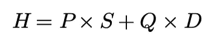
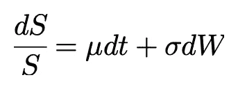
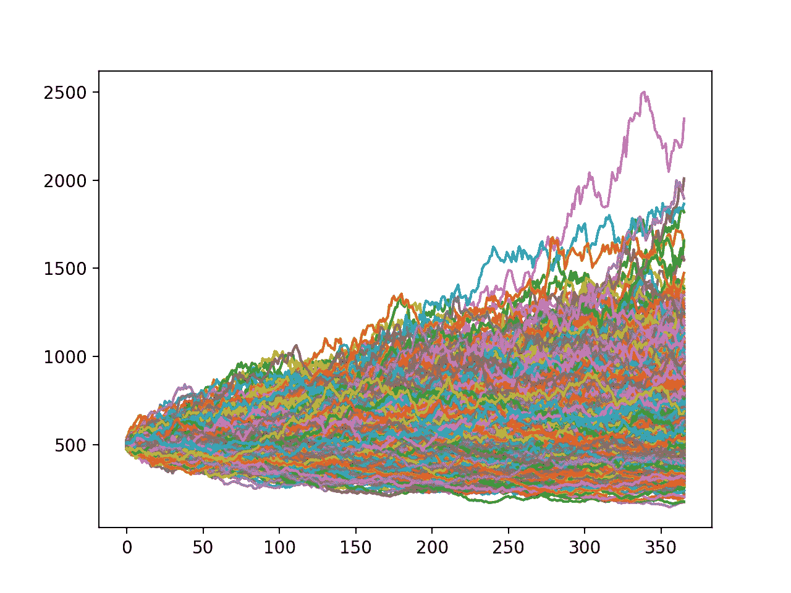

# 几何布朗运动

> 原文：<https://towardsdatascience.com/geometric-brownian-motion-559e25382a55?source=collection_archive---------21----------------------->

## 模拟资产价格的随机、非线性过程

照片由来自[佩克斯](https://www.pexels.com/photo/timelapse-photography-769650/?utm_content=attributionCopyText&utm_medium=referral&utm_source=pexels)的[约翰尼斯·拉普里奇](https://www.pexels.com/@jrapprich?utm_content=attributionCopyText&utm_medium=referral&utm_source=pexels)拍摄

如果你读过我以前的任何一篇金融文章，你会注意到在很多文章中我提到了一种被称为几何布朗运动的扩散或随机过程。我想在一篇完全致力于此的文章中正式讨论这个过程，它可以被看作是对[鞅和马尔可夫过程](https://medium.com/swlh/martingales-and-markov-processes-724de97dab1c)的扩展。在本文中，我想讨论这个过程的目的和实际应用。

## 理论应用

解释几何布朗运动的最佳方式是给出一个需要模型本身的例子。考虑一个投资组合，该投资组合由一个期权和相对于期权 delta 的标的资产的抵消头寸组成。

对冲投资组合

**变量:**

*   **P —** 标的资产的股份
*   **S —** 标的资产的价格
*   **Q —** 衍生产品(期权)的份额
*   **D —** 导数的值
*   **H —** 投资组合的价值

对于那些有更多金融经验的人，或者读过我以前文章的人，你会认为这是布莱克-斯科尔斯理论期权定价模型的论据(完整的推导和解释见[推导布莱克-斯科尔斯模型](https://medium.com/swlh/deriving-the-black-scholes-model-5e518c65d0bc))。注意，我们可以确定投资组合中任一资产的份额( **P** 和 **Q** )，但是我们不能控制它们的值( **S** 和 **D** )。为了确定如何基于该投资组合对期权的价格进行建模，我们首先需要确定对基础资产进行建模的方法。

## 实际应用

虽然理论应用很重要，但你的主要兴趣可能是作为一名实践者。假设你是一个投资组合经理，基于你团队的市场研究，你试图确定你投资组合的平均回报。将几何布朗运动与你的研究结合起来，你可以得出投资组合中每种资产可能遵循的不同样本路径。这将给你一整套与投资组合表现相关的统计数据，从最大提款到预期回报。几何布朗运动也可以用于衍生产品的定价。如果你是一些异国情调的保险商，你需要一种方法来确定保费收取的风险。实现这一点的一种方法是在由几何布朗运动生成的一组样本路径中以编程方式实现奇异值，将平均收益贴现到现值，从而得到奇异值的公允价值。关于代码的完整解释，请参见 [Python 为外来物种定价](https://medium.com/p/3a2bfab5ff66/edit)或查看以下视频。

无论是哪种应用，我们都需要一种方法来建模底层资产。

## 数学符号

为了在理论/实践中更准确地模拟基础资产，我们可以修改布朗运动，以包括一个漂移项，捕捉随时间的增长和对该增长的随机冲击。

几何布朗运动的表达式实际上很简单…

几何布朗运动

**变量:**

*   **dS —** 一段时间内资产价格的变化
*   **S —** 前一(或初始)期间的资产价格
*   **—** 该时间段的预期收益或*漂移*
*   **dt —** 时间的变化(一段时间)
*   **σ —** 波动率术语(价差的一种度量)
*   **dW —** 布朗运动项的变化

**条款:**

*   **dS/S —** 返回给定的时间段
*   **dt —** 该时间段的预期收益
*   **σdW —** 对该时间段预期收益的随机冲击

由于这个模型中存在一定程度的随机性，每次它被用来模拟资产价格时，都会产生一条新的路径。

让我们使用这个等式和 Python 来为资产生成一个示例路径。

首先，我们需要构建一个接受与该模型相关的参数的类…

接下来，我们需要创建一个函数，它基于几何布朗运动和我们的 time_period 的大小向未来前进一步，直到我们到达 total_time。

*注:time_period 和 total_time 均为年化含义 1，无论哪种情况，均指 1 年，1/365 =每日，1/52 =每周，1/12 =每月。*

在*模拟*函数中，我们基于几何布朗运动创建资产价格的新变化，并将其添加到前一期的价格中。这种变化可能是正的、负的或零的，并且基于漂移和随机性的组合，其正态分布的平均值为零，方差为 **dt** 。这在直觉上是有意义的，越大的 **dt** (时间或时间段的变化)样本路径的集合将越分散。为了在将来创建一个单一的样本路径，我们可以简单地创建一个 *GBM* 类的实例。然而，如果我们想要生成遵循几何布朗运动的样本路径的多个实例(并绘制它),我们可以编写以下代码…

因此，我们根据使用 matplotlib 绘制的参数为资产生成 1000 个样本路径…

## 结论

现在你应该对几何布朗运动及其理论/实际应用有了牢固的掌握。如果你对带代码的现场解释感兴趣，你可以看看下面的视频…