# 几何深度学习:快速浏览

> 原文：<https://towardsdatascience.com/geometric-deep-learning-a-quick-tour-12cef72492ca?source=collection_archive---------70----------------------->

## 下面的文档提供了几何深度学习中一些基本概念的旋风之旅。

克林特·王茂林在 [Unsplash](/s/photos/network?utm_source=unsplash&utm_medium=referral&utm_content=creditCopyText) 上拍摄的照片

> 找到这篇文章的乳胶版本[在这里](https://blog.eekosasih.com/notes/geometric-deep-learning)

下面的文档提供了几何深度学习中一些基本概念的旋风之旅。数学推导可能没有严格地显示出来，有些方程没有证明。这样做是为了使文档简短而又足够全面。更深入的分析请参考布朗斯坦等人(2017)、龚(2018)、基普夫等人(2017)、哈蒙德等人(2011)、等人(2011)[、](http://geometricdeeplearning.com/)。这是一份动态文档，如果您发现任何错误或不一致之处，请告诉我，我会尽快修复。我绝不是这方面的专家，因为这篇笔记只是为了我自己的学习目的而写的。

我们首先回顾图中拉普拉斯矩阵的概念及其特征值分解。接下来，我们在图中定义卷积运算，并表明它等价于在图的谱域中应用滤波器，这里的谱指的是拉普拉斯算子的特征值。我们表明，通过构造，谱卷积类似于将拉普拉斯算子应用于函数。最后，我们展示如何用切比雪夫多项式的和来近似拉普拉斯滤波器，以降低算法复杂度(因为执行完整的特征值分解是 **O(n )** 其中 **n** 是图中顶点的数量。

# 图拉普拉斯算子

假设我们有一个无向、连通且加权的图 **G = (V，e，W)** 其中 **V** 是一组 **|V| = n** 个顶点， **E** 是一组边， **W** 是每条边的一组权重*w*ᵢⱼ**I ~ j**。定义 **D** 为度矩阵，其中 d =diag(σⱼ*w*ᵢⱼ).归一化图拉普拉斯δ可以定义如下。

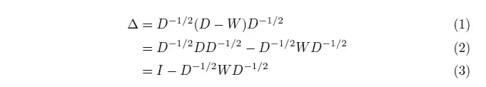

我们可以如下对拉普拉斯矩阵δ执行特征值分解。

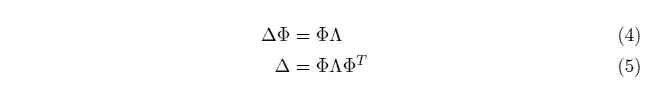

# 光谱卷积

受傅立叶变换中卷积运算的启发，我们将图形卷积定义为对拉普拉斯谱分量应用滤波器。简而言之，这个想法是将输入函数 **f** 投影到它的“傅立叶”基，或者这里借助于**φ**ᵀ**f**的拉普拉斯特征向量。将基乘以滤波后的特征值**ĥ(λ)**，得到**ĥ(λ)φ**ᵀ**f**。最后，通过与**φ**的点积应用“逆傅立叶变换”，得到**φĥ(λ)φ**ᵀ**f**。

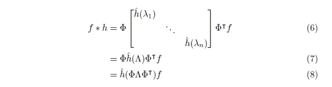

在进行一些重新排列后，我们可以看到，等式的右侧可以转换为等式 5 中归一化拉普拉斯矩阵δ=φ**λ**φᵀ的函数。

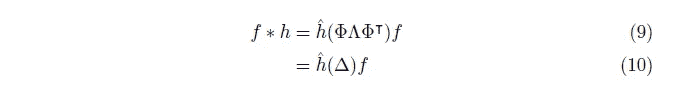

现在，与卷积神经网络类似，我们希望应用 1 个以上的卷积滤波器，并增加一个非线性输出转换。假设我们使用带有 **ξ** 非线性变换的 **p** 滤波器，频谱卷积网络定义如下。

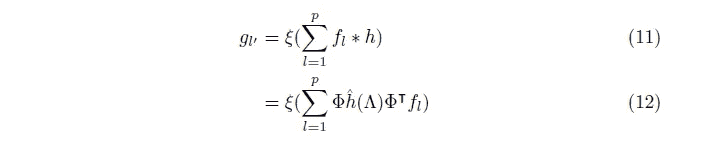

# 用切比雪夫多项式逼近

## ChebNets

等式 12 的主要问题是我们需要计算所有特征向量，复杂度为 O(|V|)。当我们用|V| > >处理非常大的图时，这是不可伸缩的。ChebNets 的主要思想是用一组正交切比雪夫多项式来逼近φ**ĥ**(λ)φᵀ，这些多项式可以使用以下公式迭代计算。

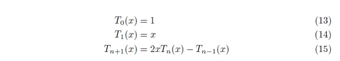

我们首先用 **r** 切比雪夫多项式的加权和来近似特征值滤波器，其采用变换后的特征值矩阵λ^.需要这种变换，因为只有当输入域区间在 **[-1，1】**时，切比雪夫多项式才形成正交基。同时，特征值范围从**【0，λ** ，ₘₐₓ**。因此，为了将后者转换成前者，我们可以应用 **2x/λ** ₘₐₓ **-1** ，使得对于 x = 0，(2(0)/λₘₐₓ-1 = -1)，对于 x = λₘₐₓ，(2λₘₐₓ/λₘₐₓ -1 = 1)。**

**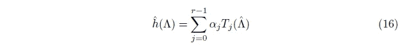**

**现在，我们可以利用等式 12，用切比雪夫多项式代替滤波器。注意**λ^ = 2λ/λₘₐₓ-I**类似的，**δ^ = 2δ/λₘₐₓ-I**。通过重排，我们可以将右侧转换为应用于归一化拉普拉斯**δ^**的切比雪夫多项式之和。**

**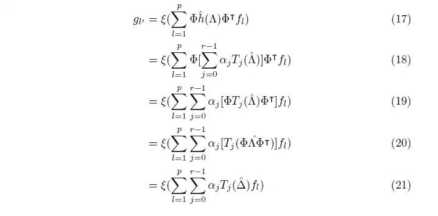**

## **图表网络**

**GraphConvNets 是 ChebNets 的一个特例，这里我们只取 2 个 Chebyshev 多项式项 **r = 2** 。由于使用了归一化拉普拉斯δ，已经证明了 **λₘₐₓ = 2** 。我们可以用等式 21 代替给定的假设。**

**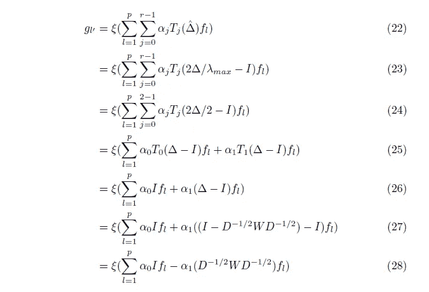**

**我们现在有了一个纯粹使用度矩阵 **D** 和权重矩阵 **W** 定义的图形卷积网络。为了进一步简化，我们假设α₀ = -α₁ = α。**

**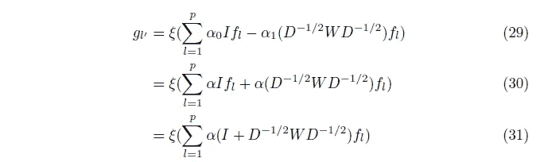**

**尽管在实践中，由于本征值在[0，2]范围内，重复应用这种乘法可能会导致数值不稳定。因此，我们通过让**ŵ= w+I**和 d̂= diag(σ{ j≠I } ŵᵢⱼ).正如在 Kipf 和 Welling (2017)中所写的，这相当于设置以下重整化技巧:I+d^(-1/2)w d^(-1/2)= d̂^(-1/2)w d̂^(-1/2)**

**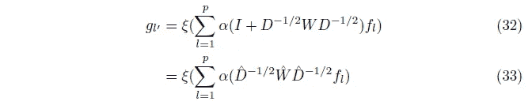**

**使用这些假设，GraphConvNets 避开了对切比雪夫多项式的显式计算的需要，并导致了对每个顶点的邻域的加权和运算的纯应用。**

# **参考**

**Bronstein，M. M .、布鲁纳，j .、LeCun，y .、Szlam，a .、Vandergheynst，P. (2017)。几何深度学习:超越欧几里德数据。IEEE 信号处理杂志，34(4):18{42。arXiv: 1611.08097。**

**龚，S. (2018)。几何深度学习。伦敦帝国学院硕士论文。**

**Hammond，D. K .，Vandergheynst，p .，和 Gribonval，R. (2011)。基于谱图论的图的小波。应用和计算谐波分析，30(2):129{150。**

**舒曼，D. I .，Vandergheynst，p .，和 Frossard，P. (2011)。分布式信号处理的切比雪夫多项式逼近。2011 年传感器系统和研讨会分布式计算国际会议(DCOSS)，第 1-8 页。arXiv: 1105.1891。**

**T.Kipf，M. Welling，[图卷积网络半监督分类](https://arxiv.org/pdf/1609.02907.pdf)， *ICLR* 2017**