# 线性回归的几何解释

> 原文：<https://towardsdatascience.com/geometric-interpretation-of-linear-regression-dd10601a85b1?source=collection_archive---------32----------------------->

## 了解如何使用几何解释推导线性回归的成本函数，并从头开始实现算法。

艾萨克·史密斯在 [Unsplash](https://unsplash.com?utm_source=medium&utm_medium=referral) 上拍摄的照片

线性回归是一种建模标量响应(或因变量)和一个或多个解释变量(或自变量)之间关系的线性方法。在几何解释术语中，线性回归算法试图找到尽可能最适合数据点的平面或直线。线性回归是一种预测真实值的回归技术。

> ***术语*“寻找最符合数据点的平面”*是什么意思*？**

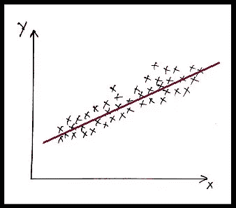

图 1:示例二维数据集的表示

对于上面给出的二维数据集样本(图 1)，覆盖尽可能多的点的直线的一般方程是 **y = m*x+c，**其中 m 是直线的斜率，c 是截距项。线性回归算法试图找到成本函数最小化的线/平面。在本文的后面，你会知道一个成本函数是如何推导出来的。

我们将上述平面方程表示为 **y = w1*x + b**

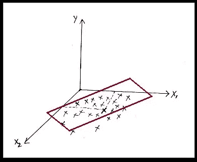

图 2:样本三维数据集的表示

类似地，对于样本 3 维数据集(图 3)，最适合尽可能多的点的平面方程是**y = w1 * x1+w2 * x2+b。**

同样的等式可以扩展到 d 维数据集:

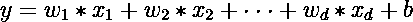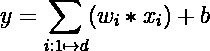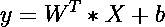

所以，我们需要找到上面方程的一个平面 **(W，b)** 来最好地拟合大多数数据点。

> ***深究推导几何解释的算法:***

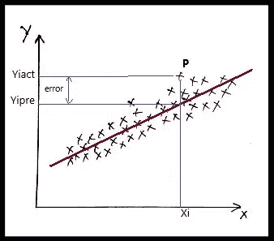

图 3

对于任意点 **P** (图 3)， **y_iAct** 为该点的实际输出值，而 **y_iPre** 为预测值。因此，误差可以计算为:

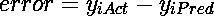

由于误差可以是正的，也可以是负的，因为 y_iPred 可以在平面/直线之上或之下，所以为了保持正误差，我们对每个 x_i 的误差求平方

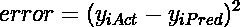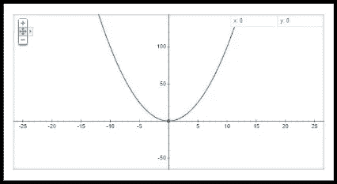

来源:谷歌地图，y=x 的地图

误差函数遵循抛物线，这意味着误差(Y 轴)将始终为正。

我们需要最小化所有点集的误差，这被称为 MSE(均方误差)。

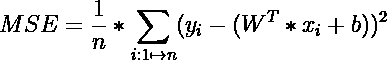

而线性回归的成本函数是:

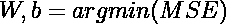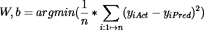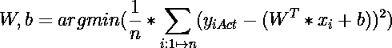

成本函数定义了我们需要找到一个具有给定的 **W，b** 的平面，使得所有点集的误差最小。用平面方程代替 **y_iPred** 新的成本函数变成:

使用优化器来计算使上述成本函数最小化的 **W，b** 的最佳值。梯度下降优化器可用于找到均方误差最小的平面的最佳值。

> ***对查询点的预测:***

图 5

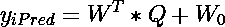

对于查询点' *Qx* '(图 5)，对应的预测值是 *Ypred* ，其可以使用平面(W，w0)的方程使用上述方程来计算。

> **使用梯度下降优化器实现线性回归模型:**

为了找到平面(W，b)，我们希望误差尽可能小。梯度下降是一种迭代方法，以达到最小误差。为了找到最小误差，我们找到函数的梯度。

梯度下降法应遵循的步骤:

1.  初始化权重向量和偏差项。
2.  求函数关于权重和偏差的导数。
3.  更新权重和偏差

重复这三个步骤，直到我们达到最小误差。随着每次迭代，权重向量和偏置项被更新以达到最小值。

> **样本数据集 LR 算法的实现:**

图 6:样本数据集点

我们取 300 个数据点的二维样本数据集(第 2 行)。将数据集分为训练和测试数据集，其中 210 个点(70%)属于训练数据，其余 90 个点(30%)用于测试(第 5 行)。上图(图 6)表示样本数据集，下面是代码实现。

代码实现

**步骤#1:初始化权重向量和偏置项:**

用随机值初始化权重向量和偏差项(第 8-10 行)。权重向量的维数将等于数据集的维数。

**第二步:求函数关于权重和偏差的导数:**

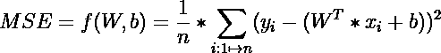

以上是文章上面推导的 MSE 的方程。我们需要找到函数 f(W，b)关于 W 的导数(第 21 行)，以及函数 f(W，b)关于 b 的导数(第 22 行)。

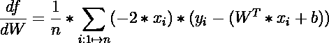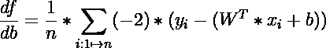

上述两个方程分别表示函数 f 关于权向量和偏差项的导数。

**步骤#1:更新权重和偏差:**

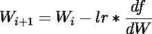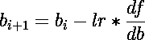

权重向量和偏置项的更新方程分别如上所述。根据上述等式，为每次迭代更新权重向量和偏差项(第 24-25 行)。*lr’*代表学习率，其定义了更新应该发生的速度。

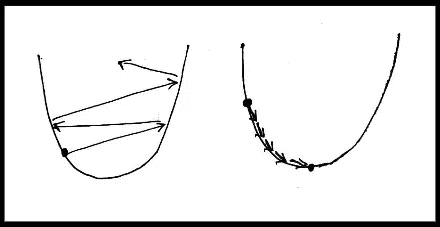

左图:大单反，右图:小单反

如果学习率很大，则永远无法达到最小值，如果学习率很小，则通过一定次数的迭代可以达到最小值。

> 上述 3 个步骤重复一定次数的迭代(第 16 行),直到 W(I+1)变得非常接近或等于 W_i。
> 
> **观察:**

计算出的权重向量和偏差项分别为[50.265]，-0.131(第 2-3 行)。计算所有测试数据集的预测值(第 6–9 行)。绘制直线和所有数据点(第 12-19 行),观察结果。

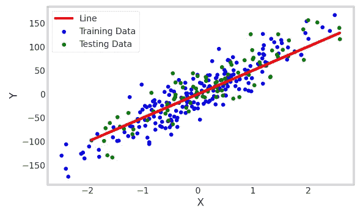

图 8:线的观察

**观察:**可以观察到线图(图 8)与数据点尽可能吻合。

 [## krsatyam 1996/Linear _ Regression _ 从头开始

### 在 GitHub 上创建一个帐户，为 krsatyam 1996/Linear _ Regression _ from _ scratch 开发做贡献。

github.com](https://github.com/krsatyam1996/Linear_Regression_from_scratch) 

> 感谢您的阅读！