# 逻辑回归的几何解释

> 原文：<https://towardsdatascience.com/geometric-interpretation-of-logistic-regression-4f85047a5860?source=collection_archive---------27----------------------->

## 理解如何使用几何解释导出逻辑回归的成本函数


在 [Unsplash](https://unsplash.com?utm_source=medium&utm_medium=referral) 上拍摄的 [ThisisEngineering RAEng](https://unsplash.com/@thisisengineering?utm_source=medium&utm_medium=referral)

逻辑回归是一种统计模型，它使用逻辑函数来模拟二元因变量。在几何解释术语中，逻辑回归试图找到一条线或一个平面来最好地区分这两类。逻辑回归处理几乎或完全线性可分的数据集。

> **术语线性可分是什么意思？**

对于二元分类数据集，如果一条直线或一个平面可以几乎或完全分隔两个类，那么这样的数据集称为线性可分数据集。否则，如果这两个类不能被线或平面分开，则数据集不是线性可分的。

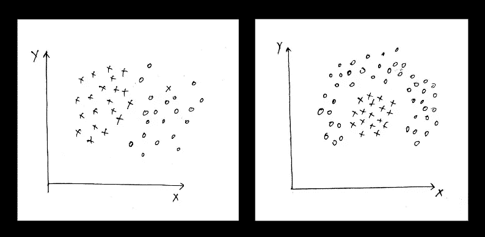

左图:线性分离，右图:非线性分离

从上面的二维样本数据集中，左边的样本数据集几乎可以用一条线线性分离，而对于右边的样本数据集，没有一条线可以将这两类点分开。

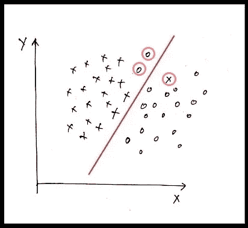

图片 2

在(图 2)中，该线最好地分隔了两类点，错误分类了 3 个点(红色圆圈)。

> **深入推导算法的几何解释:**

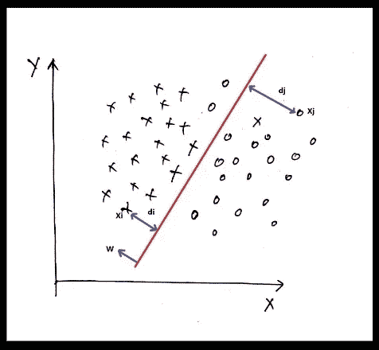

图 3: Xi 和 Xj 是正确分类的点

对于上面的样本数据集，假设我们需要找到一个平面‘P’来分隔这两个类。

平面的一般方程由下式给出:

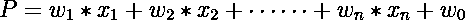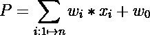

所以最后我们需要找到一个平面 P。设这两类点为 y_i = {1，-1}。对于任意两个随机点 x_i 和 x_j。

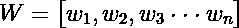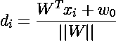

d_i =平面和 x_i 之间的距离

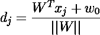

d_j =平面和 x_j 之间的距离

这里 W 垂直于平面。当一个点的方向垂直于平面时，那么距离为正，否则为负。

对于正确分类的点(图 3):

**d_i > 0** 和 **d_j < 0**

```
Now for a positive class point: **y_i = +1**
**(d_i * y_i) > 0**, since **d_i > 0** and **y_i > 0**For a negative class point: **y_i = -1**
**(d_i * y_i) > 0,** since **d_i < 0** and **y_i < 0**
```

所以对于正确分类的点， **(y_i * d_i)总是正的**

对于错误分类的点(图 4):

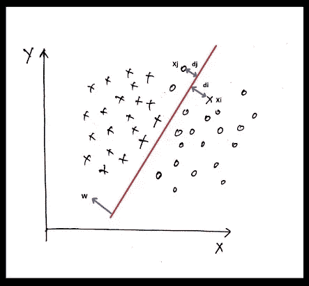

图 4: Xi 和 Xj 是错误分类的点

**d_i < 0** 和 **d_j > 0**

```
For a positive class point: **y_i = +1**
**(d_i * y_i) < 0**, since **y_i > 0 and d_i < 0 (because on wrong side)**For a negative class point: **y_i = -1**
**(d_i * y_i) < 0,** since **d_i > 0** and **y_i < 0 (because on wrong side)**
```

对于错误分类的点， **(y_i * d_i)总是负的**

因此，为了得到最优解，我们需要最大化 **(y_i * d_i)。**我们需要找到最优的 W，w0，它使下面的等式最大化。

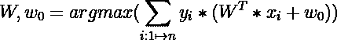

> **乙状结肠挤压:**

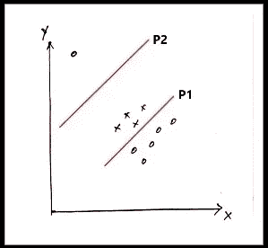

图 4

由于存在负类的离群点，因此上面获得的成本函数将获得平面“P2”作为最佳平面，但这不是真的。平面“P1”最好地分隔了这两类点。

异常值或极值点的存在会在很大程度上影响平面。为了避免这种情况，我们需要找到一个函数，使 **(y_i * d_i)** 值变小，如果它太大，id **(y_i * d_i)** 值变小，它应该保持小。

我们需要这样一个函数

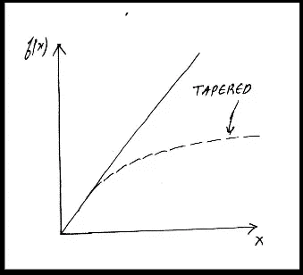

图 5

如果 x 的值很大，那么 f(x)逐渐变小，如果 x 的值很小，那么它仍然很小。

> **乙状结肠功能:**

sigmoid 函数的图形清楚地定义了它满足我们的条件。sigmoid 函数的数学方程:

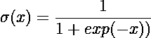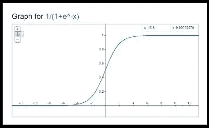

来源:Google Plots，图片 6，sigmoid 函数的绘图

所以我们的方程式可以归结为:

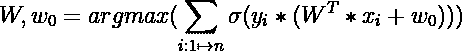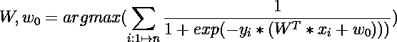

> **最小化方程式:**

如果 G(x)是单调递增函数，那么 G(F(x))也是单调递增函数。

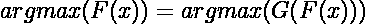

把 F(x)作为上面推导的方程，G(x)作为 log(x)作为 log(x)是一个单调递增的函数。

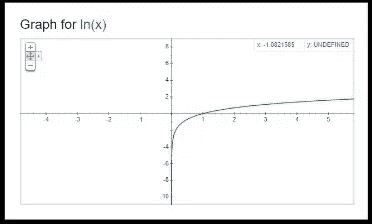

来源:Google Plots，图 7，log_e(x)的绘图

> **方程式归结为:**

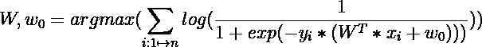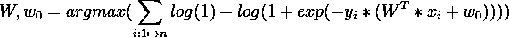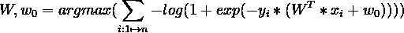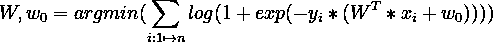

> **正规化:**

因为 log_e(z)的最小值是 0。因此，优化器将尝试将上述等式的值最小化为 0，这使得 log_e(z)的‘z’= 1。

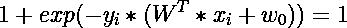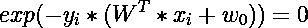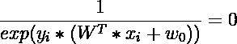

所以 W，w0 趋向于无穷大来满足方程，这就趋向于进行逻辑回归。

> **添加 L2 正则化:**

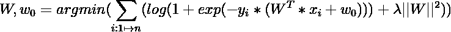

上面导出的等式是逻辑回归算法的成本函数。我们使用优化器来计算使上述成本函数最小化的最佳值 **W，w0**。*【lambda】*上式中的‘lambda’是超参数。

> **偏差方差权衡:**

如果λ= 0，则上述方程将不包含任何会使模型过拟合的正则化项。

如果 lambda -> infinite(大值)，则正则化项的权重非常高，并且它将遮蔽该项的其余部分，这导致欠拟合模型。

> **预测查询点的目标类别:**

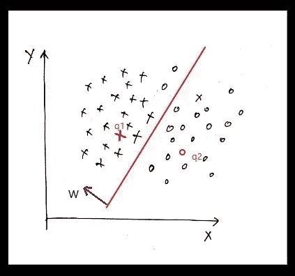

图 7:查询

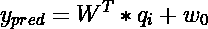

w，w0 通过最小化成本函数来计算

对于查询' q1 '，**y _ pred>0**(W 方向的 q1)

对于查询' q2 '， **y_pred < 0** (与 W 方向相反的 q2)

> 感谢您的阅读！