# 计算机视觉中的几何变换:Python 示例的直观解释

> 原文：<https://towardsdatascience.com/geometric-transformations-in-computer-vision-an-intuitive-explanation-with-python-examples-b0b6f06e1844?source=collection_archive---------21----------------------->

## 旋转，平移和缩放转换解码。

佩顿·塔特尔在 [Unsplash](https://unsplash.com?utm_source=medium&utm_medium=referral) 上拍摄的照片

几何变换是任何图像处理流水线中最常见的变换操作之一。在今天的帖子中，我们将看看其中的三种变换: [**旋转**](https://en.wikipedia.org/wiki/Rotation) **，** [**平移**](https://en.wikipedia.org/wiki/Translation_(geometry)) **和** [**缩放**](https://en.wikipedia.org/wiki/Image_scaling) ，然后仅使用 Numpy 从头开始构建它们。图 1 显示了我们想要实现的视觉效果。所以， [*洛戈特！*](https://translate.google.com/#view=home&op=translate&sl=de&tl=en&text=los%20geht's)

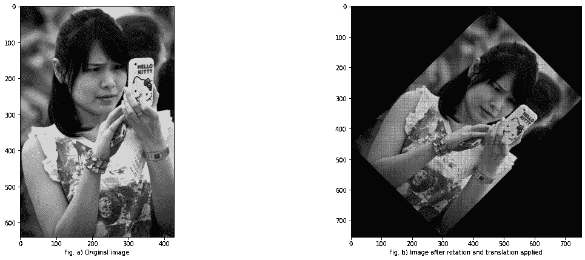

图 1 我们的目标是将图像 a 顺时针旋转 45 度，以创建图像 b .来自带有 CC 许可证的 [COCO 数据集](http://cocodataset.org/#home)的参考图像

# OpenCV 方式

如果你使用任何图像库，如 OpenCV 或 [PIL](https://pillow.readthedocs.io/en/stable/reference/Image.html#PIL.Image.Image.transform) 内置函数，实现上述功能是非常简单的。使用 OpenCV，我们可以用两行代码来完成，如下所示。

使用 OpenCV 旋转图像

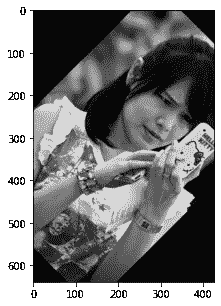

图 2 固定边界的旋转

我们得到的结果如图 2 所示。请注意，OpenCV 不会自动扩展图像的边界。为了确保我们看到整个旋转的图像，我们需要做另外两件事。首先，计算目标图像的大小，其次，由于新图像的中心不同于原始中心，我们需要考虑旋转矩阵中中心值的差异。有了这些补充，我们就是黄金！

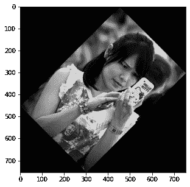

使用动态边界旋转

这一次旋转包括了我们预期的整个图像！让我们来分析一下这些函数调用背后到底发生了什么。

# 旋转矩阵

我们使用上面的[**getrotationmatrix 2d()**](https://docs.opencv.org/2.4/modules/imgproc/doc/geometric_transformations.html#getrotationmatrix2d)**方法(片段 1 第 5 行)来创建一个旋转矩阵，我们稍后使用它来扭曲原始图像(片段 1 第 6 行)。这个函数以图像中心、旋转角度和缩放因子作为参数，并给出一个旋转矩阵。**这个** [**旋转矩阵**](https://en.wikipedia.org/wiki/Rotation_matrix) **到底是什么？嗯，它源于线性代数。让我们考虑一个任意的 2D 点[x，y]，那么旋转运算可以用下面的矩阵运算来表示。****

**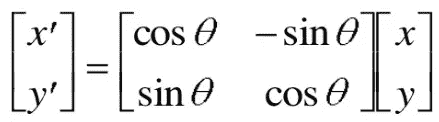**

**2D 旋转变换**

**其中，R 是旋转矩阵**

**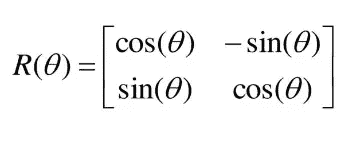**

**旋转矩阵 R**

**更简单地说，旋转矩阵给出了“函数 f”***x’，y’= f(x，y)*** 将输入点映射到其旋转的对应点。矩阵 R 由两个列向量组成，表示我们的初始基向量在转换后的最终位置(如果你像我一样是一个 3blue1brown 的粉丝，这将立即敲响警钟！).**

**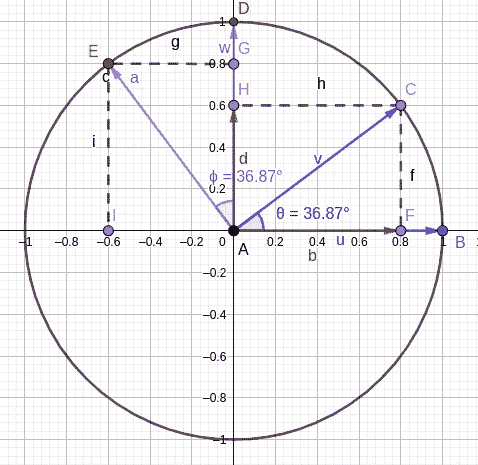**

**点旋转示例**

**让我们用单位圆把事情说得更清楚些。**

**在这个单位圆中，考虑头部在 B = [1，0]的两个向量 **u** 和头部在 D [0，1]的两个向量 **w** 。然后，这些向量围绕中心 A(=原点= [0，0])旋转某个角度θ*、*(*=φ*)，之后它们分别落在 C 点和 E 点。**

**经过变换后，向量 v 可以用其分别以 F 和 H 为头的正交投影向量来表示。使用基本的三角学并记住向量 v 和 a 具有单位长度，可以容易地看出，以 F 为头的向量的长度是 **b = *cos(theta)*** ，以 H 为尾的向量的长度是 **d= sin(theta)** 。**

**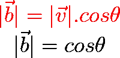**

**导出向量 v 的正交分量**

**向量 v 因此可以表示为列向量***【cos(theta)sin(theta)】****。*同样，我们可以证明，向量 a 可以表示为列向量***[-sin(theta)cos(theta)】***。**负号表示方向。****

**将这些列向量放在一起，我们得到了旋转矩阵 r。**为了简化矩阵乘法，通常在旋转矩阵中添加第三个轴。**直觉上，这将是旋转 3D 结构的旋转轴。该轴上的所有点在变换后将保持不变，因此该附加轴对剩余的变换没有净影响。**

**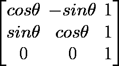**

**旋转变换**

**类似地，平移操作可以由下面所示的平移矩阵来表示，其中 ***tx*** 和 ***ty*** 是 X 和 Y 方向上的平移量。**

**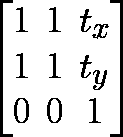**

**平移变换**

**还有我们的缩放矩阵，其中***Sx***ans***Sy***是我们在 x 和 y 方向的缩放因子**

**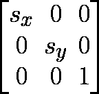**

**缩放变换**

> **注意:通常，旋转和平移被组合成如下所示的单个变换矩阵。这与绕原点旋转θ然后平移 ***tx*** 和 ***ty*** 的效果相同**

**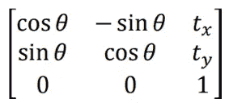**

**旋转和平移操作打包到一个矩阵中**

> **试试吧！取上面任意一个矩阵，给它们一些值乘以任意一个点*【x，y】*看看变换后的点值是不是你所期望的！**

**我们现在有了表达几何变换的所有必要成分。请记住几件重要的事情:**

1.  **矩阵乘法是不可交换的也就是说，如果你将两个矩阵 A 和 B 相乘，A.B！因此，我们变换的顺序很重要。旋转一个点然后平移和先平移那个点然后旋转相同的因子是不一样的！**
2.  ****变换表达式的矩阵乘法是从右向左进行的。****
3.  **注意你的坐标轴，因为方向很重要。像 OpenCV 这样的大部分图像框架都是考虑左上角的原点。这不是我们写方程的经典的“第一象限”，而是“第四象限”。实质上，y 轴的方向是反向的。我们可以将它直接放入旋转矩阵中，或者在计算过程中添加一个负号(我做第二个是为了保持转换操作与文献一致)。**
4.  ****旋转一般是围绕图像中心进行的。****

**很好，现在让我们回到我们的原始图像，看看我们需要做什么来得到想要的转换图像。操作的确切顺序如下:**

1.  **平移图像，使图像的中心为原点。这是因为我们希望通过图像的中心而不是左上角来旋转图像，左上角通常是图像中的原点像素/坐标。让我们把这些翻译因子设为**【tx1，tx2】。****
2.  **将图像旋转我们想要的角度**θ。****
3.  **将图像平移回其原始中心。让我们把这个概括为**【tx2，ty2】。****
4.  **计算新的中心，并利用这些新的和旧的中心之间的差异来平移图像。还要考虑新图像的大小。(我们已经为 OpenCV 计算完成了这一步)。设这些平移因子为**【CX _ shift，cy_shift】。****

**用矩阵的方式，我们可以将上述四个步骤表达如下。从右到左，我们将中心平移到原点(右数第一个矩阵)，绕中心旋转并平移回中心(中心矩阵)，最后调整新维度的中心(左数第一个矩阵)。**

**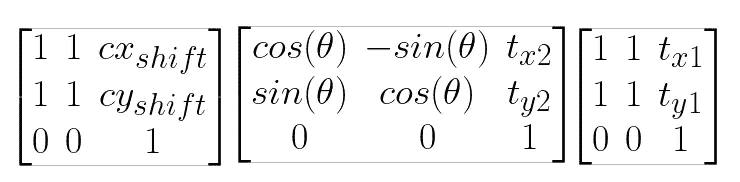**

**我们的转换矩阵**

**我们在这里没有使用缩放变换，但是如果你也想缩放你的图像，只需要把缩放变换加到上面的等式中(在正确的地方！).简化上述内容并替换**a = cos(θ)**，**b = sin(θ)****

**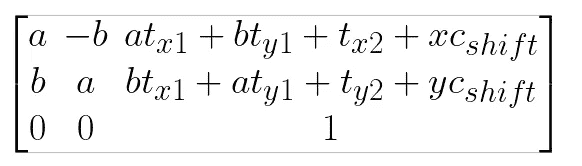**

**简化变换矩阵**

**这是我们最终的旋转矩阵，我们将在下一节中使用 Numpy 来旋转我们的图像。**

# **数字之路**

**调用 OpenCV 方法既快速又简单，但是一点也不好玩！因此，我们将把我们讨论的所有内容放入代码中，并使用 Numpy 旋转图像！**

**由于这个脚本有点太长，无法粘贴到这里，请点击下面的链接查看完整代码。**

** [## 博拉克/伊穆蒂尔斯

### 成像实用程序脚本。在 GitHub 上创建一个帐户，为 borarak/imutils 的发展做出贡献。

github.com](https://github.com/borarak/imutils/blob/master/geometric/rotate.py) 

在这之后，我们可以使用自己的函数旋转和平移图像！

今天就到这里，希望你喜欢。一如既往的感谢阅读！**