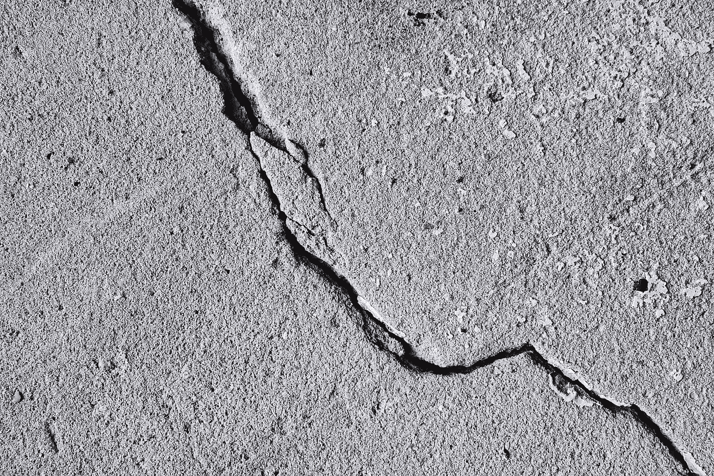
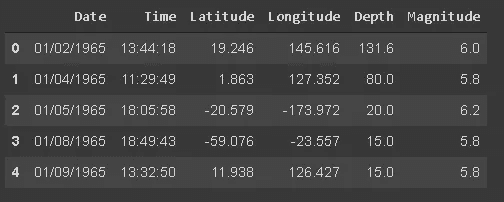
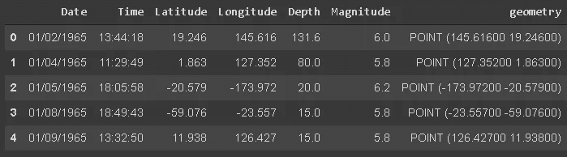
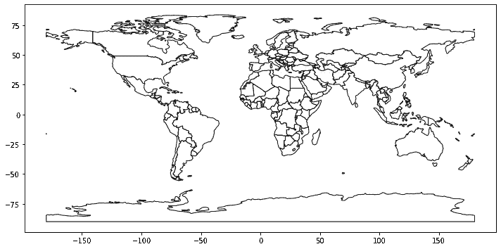
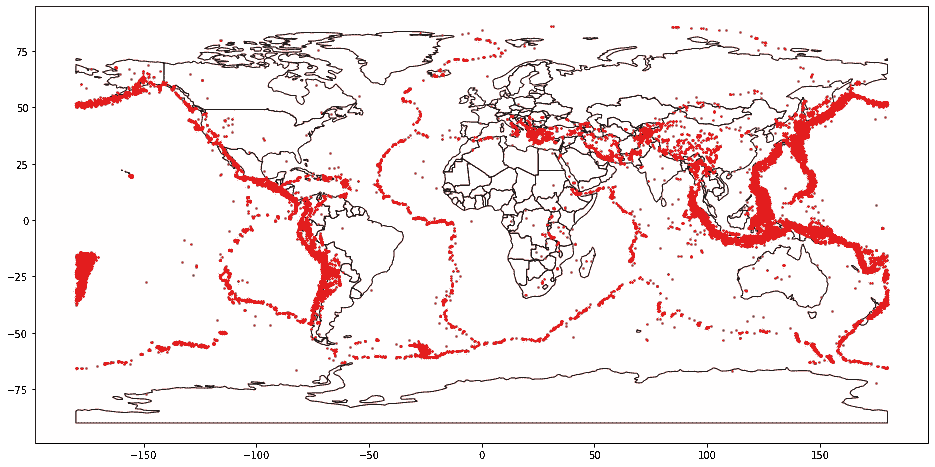
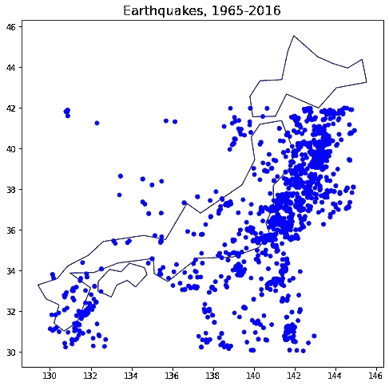

# GeoPandas:实用指南

> 原文：<https://towardsdatascience.com/geopandas-a-practical-guide-c1e15d4d58d5?source=collection_archive---------32----------------------->

## [入门](https://towardsdatascience.com/tagged/getting-started)

## 测绘 1965 年至 2016 年的地震



由 [Andrew Buchanan](https://unsplash.com/@photoart2018?utm_source=unsplash&utm_medium=referral&utm_content=creditCopyText) 在 [Unsplash](https://unsplash.com/s/photos/earthquake?utm_source=unsplash&utm_medium=referral&utm_content=creditCopyText) 上拍摄的照片

GeoPandas 是一个 Python 库，旨在处理地理空间数据。这使得基于地理位置创建可视化变得相当容易。

在本帖中，我们将可视化 1965 年至 2016 年间发生的重大地震。数据集[可在 Kaggle 上获得。](https://www.kaggle.com/usgs/earthquake-database)

GeoPandas 有两种主要的数据结构，即地理数据框架和地理系列。它们可以被认为是熊猫系列和数据框的子类。

让我们从安装和导入 GeoPandas 以及我们将使用的其他库开始。

```
pip install geopandas
import geopandasimport pandas as pd
import matplotlib.pyplot as plt
%matplotlib inline
```

可以通过修改熊猫数据框来创建地理数据框。因此，我们首先将数据集读入熊猫数据帧。

```
eq = pd.read_csv("/content/earthquakes.csv")eq.shape
(23412, 21)
```

该数据集包含超过 23412 个事件，其中大部分是地震。我们将过滤数据帧，使其仅包含地震数据。

```
eq = eq[eq['Type'] == 'Earthquake']
```

我们的分析中还有一些冗余的列，因此我也将过滤掉这些列。

```
eq = eq[['Date', 'Time', 'Latitude', 'Longitude', 'Depth', 'Magnitude']]eq.head()
```



(图片由作者提供)

我们有一个数据框架，包含了两万多次地震的数据、位置、深度和震级。为了使用 GeoPandas，我们需要将此 Pandas 数据框架转换为地理数据框架。

我们将按如下方式使用地理数据框架函数:

```
gdf = geopandas.GeoDataFrame(eq, geometry=geopandas.points_from_xy(eq.Longitude, eq.Latitude))gdf.head()
```



(图片由作者提供)

地理数据框架和 pandas 数据框架之间的区别是一个称为“几何”的地理系列。当空间方法应用于地理数据框架时，它将作用于几何列。

可以将“geometry”列看作是纬度和经度值的重新格式化版本。

我们现在将地震数据存储在地理数据框架中。下一步是绘制世界地图，使用“世界”地理数据框架可以轻松完成。

```
world = geopandas\
.read_file(geopandas.datasets.get_path('naturalearth_lowres'))world.columns
Index(['pop_est', 'continent', 'name', 'iso_a3', 'gdp_md_est', 'geometry'], dtype='object')
```

它包含关于国家及其位置的基本信息。我们现在画一张空的世界地图。

```
world.plot(color='white', edgecolor='black', figsize=(12,8))
```



(图片由作者提供)

为了绘制地震图，我们将创建一个世界地图的轴对象，然后根据“几何”列绘制地震。

```
ax = world.plot(color='white', edgecolor='black', figsize=(16,12))
gdf.plot(ax=ax, color='red', markersize=2)
plt.show()
```



(图片由作者提供)

这张地图包含了 1965 年至 2016 年间发生的所有重大地震。如果你在谷歌上快速搜索地震断层线，你会发现它们与上面的地图重叠。

markersize 参数调整定位地震的标记的大小。您还可以传递一个列名，标记的大小将根据该列中的值进行调整。我想过用大小来调整标记的大小，但是差别似乎并不明显。

我们还可以画出特定地点的地震地图。例如，日本发生过多次地震。我不确定，但它可能是世界上地震最多的国家。

关注特定国家的一种方法是根据纬度和经度值过滤地震。[日本](https://developers.google.com/public-data/docs/canonical/countries_csv)的纬度和经度值如下所示:

*   纬度= 36.204824
*   经度= 138.252924

我们可以围绕这些值创建一个范围，用作过滤范围。

```
japan_lat = 36.204824
japan_long = 138.252924japan_eq = eq[(eq.Latitude > 30) & (eq.Latitude < 42) & (eq.Longitude > 130) & (eq.Longitude < 145)]japan_eq = japan_eq.reset_index(drop=True)
```

我调整了范围，使位置占据了日本的面积。请注意，这些数值并不是日本的国界。

让我们创建一个仅包含日本境内或周边发生的地震的地理数据框架。

```
japan_gdf = geopandas.GeoDataFrame(japan_eq, geometry=geopandas.points_from_xy(japan_eq.Longitude, japan_eq.Latitude))
```

我们将绘制日本地图，并在日本 gdf 中标记地震。

```
ax = world[world.name == 'Japan'].plot(color='white', edgecolor='black', figsize=(12,8))japan_gdf.plot(ax=ax, color='blue', markersize=japan_gdf['Magnitude']*4)plt.title("Earthquakes, 1965-2016", fontsize=16)plt.show()
```

为了过滤地图，我们使用了世界地理数据框的“名称”列。

这是由此产生的日本地震地图。



(图片由作者提供)

日本发生过多次地震。标记的密度表明大部分都在东海岸。

# **结论**

GeoPandas 是一个函数库，可以加速地理空间可视化的创建过程。它提供了许多功能和方法来丰富地图。

如果你正在或者计划使用地理空间数据，我强烈推荐你查看 GeoPandas 的[文档](https://geopandas.org/index.html)。它们还提供了一些示例，有助于更容易地调整函数和方法。

感谢您的阅读。如果您有任何反馈，请告诉我。