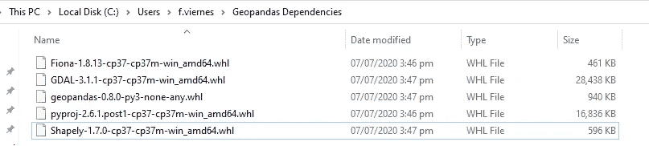
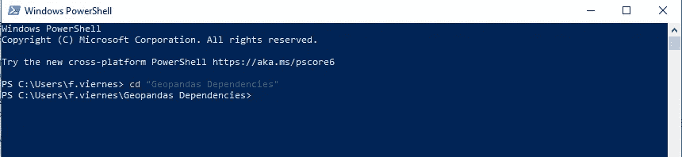

# Geopandas 安装 Windows 的简便方法！

> 原文：<https://towardsdatascience.com/geopandas-installation-the-easy-way-for-windows-31a666b3610f?source=collection_archive---------4----------------------->

由 [Unsplash](https://unsplash.com?utm_source=medium&utm_medium=referral) 上的[奥克萨娜 v](https://unsplash.com/@arttravelling?utm_source=medium&utm_medium=referral) 拍摄的照片

如果你想做一些房地产分析， **GeoPandas** 软件包提供了一种处理地理信息的惊人方法。它扩展了 pandas 使用的数据类型，允许对几何类型进行空间操作。

空间操作的例子有地图叠加(将两张地图结合在一起)、简单缓冲，但更普遍的是，GeoPandas 可用于地理可视化。

**安装**

虽然 GeoPandas 是一个强大的空间操作包，但安装对一些人来说有点困难。它需要难以协调的依赖性。

我发现了一种在我的笔记本电脑上有效安装它的方法，下面的步骤可能对你也有用。

这些步骤假设你已经安装了 wheel ( *pip install *)。cmd 上的 whl*)。

1.  转到[Python 扩展包的非官方 Windows 二进制文件](https://www.lfd.uci.edu/~gohlke/pythonlibs/)。
2.  在一个**特定的文件夹**中下载以下二进制文件:GDAL、Pyproj、Fiona、Shapely 和 Geopandas **匹配 Python** 的版本，以及**你的笔记本电脑上安装的是 32 位还是 64 位操作系统**。

(例如对于 Python 3.7x(64 位)，GDAL 包应该是*GDAL-3 . 1 . 2-cp37-cp37m-win _ amd64 . whl*。)

下载的依赖于一个文件夹

3.转到下载二进制文件的文件夹。

使用命令提示符并转到下载二进制文件的文件夹

4.**重要提示**:使用 pip 安装的以下安装顺序是必要的。注意文件名。如果文件名是正确的，它应该工作:(*提示:键入“pip install”后跟一个空格，并键入二进制文件的前两个字母，然后按 Tab 键。(例如 pip install gd(按 Tab))*

*   pip 安装。\ GDAL-3 . 1 . 1-cp37-cp37m-win _ amd64 . whl
*   pip 安装。\ pyproj-2 . 6 . 1 . post 1-cp37-cp37m-win _ amd64 . whl
*   pip 安装。\ Fiona-1 . 8 . 13-cp37-cp37m-win _ amd64 . whl
*   pip 安装。\ Shapely-1 . 7 . 0-cp37-cp37m-win _ amd64 . whl
*   pip 安装。\ geo pandas-0 . 8 . 0-py3-无-任何

5.就是这样！检查 GeoPandas 是否已正确安装，并通过导入它和查看模块上的帮助选项进行浏览。

注意:如果以下步骤不起作用，可能是因为系统上安装的其他不同的软件包与当前版本不兼容。我重新安装了 Anaconda，并确保首先安装 GeoPandas。