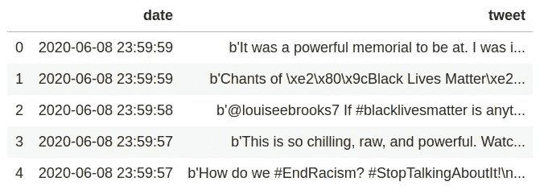
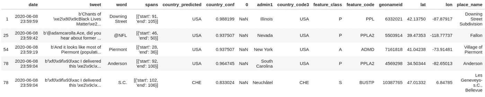
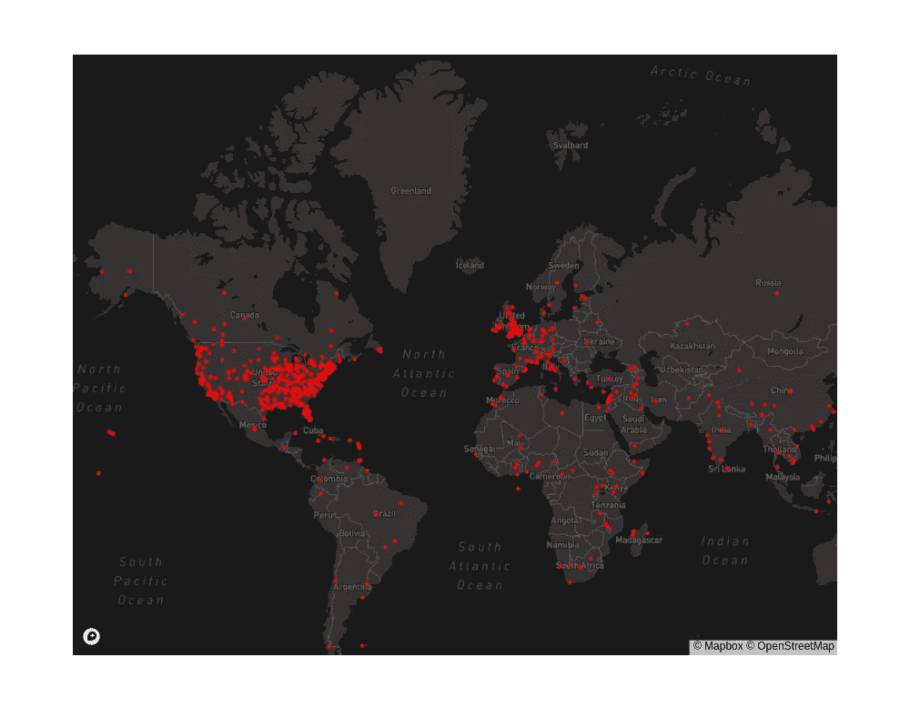

# 使用 Python 和自然语言处理进行地理解析

> 原文：<https://towardsdatascience.com/geoparsing-with-python-and-natural-language-processing-4762a7c92f08?source=collection_archive---------21----------------------->

## 提取地名和指定坐标-教程


纳蕾塔·马丁在 [Unsplash](https://unsplash.com?utm_source=medium&utm_medium=referral) 上的照片

大量的可用文本数据具有可以从自动信息提取中受益的位置特征。自然语言处理(NLP)在过去的五年中取得了显著的进步。然而，从文本中提取地理信息的研究仍处于起步阶段。在本教程中，我们使用 Python 和 NLP 来 Geoparse twitter 数据集。

## 地质公园

***Geoparsing*** 是一个地名解析过程，将对地点的自由文本描述(如“伦敦以东两公里”)转换为地理标识符(带经纬度的坐标)。

地理解析在许多应用中是必不可少的，包括地理信息检索(GIR)、地理信息提取(GIE)和地理信息分析(GIA)任务。

我们可以使用地理解析来确定文档的地理范围，解码灾难响应、商业新闻分析以及其他多个领域的位置信息。

为了说明什么是地质公园，让我们考虑这个讽刺[标题示例](https://medium.com/@allanishac/protesters-commandeer-nyc-sanitation-trucks-use-them-to-block-trump-tower-60c01275c1f6)。

> “抗议者偷走纽约市的环卫车，用它们来阻挡特朗普大厦”

通常，地理区划包含两个部分:地名识别和地名解析。首先，是地名提取或识别[纽约市，特朗普大厦]。下一步是将地名链接到地理坐标[(40.768121，-73.981895)，(40.762347，-73.973848)]。

在下一节中，我们将使用 Python 地理解析库 [Mordecai](https://github.com/openeventdata/mordecai) 对简单文本进行地理解析。

## Python 地理解析示例

对于本教程，我们将使用 [Mordecai](https://github.com/openeventdata/mordecai) 库进行地理解析。Mordecai 是全文地理解析 Python 库。使用这个库，您可以从一段文本中提取地名，将它们解析到正确的位置，并返回它们的坐标和结构化的地理信息。

让我们从一个简单的地质分析例子开始。Mordecai Python Geoparsing 库具有 Geoparse 函数，该函数接收文本并从文本中返回结构化的地理信息。

```
from mordecai import Geoparsergeo = Geoparser()
geo.geoparse(“Eiffel Tower is located in Paris”)
```

对于任何文本输入，末底改返回文本中存在的位置特征。在这个例子中，它正确地预测了埃菲尔铁塔和巴黎城。有趣的是，与这两个位置相关联的纬度和经度是不同的。预测的埃菲尔铁塔坐标比巴黎这座城市还要具体。

```
[{'word': 'Eiffel Tower',
  'spans': [{'start': 0, 'end': 12}],
  'country_predicted': 'FRA',
  'country_conf': 0.611725,
  'geo': {'admin1': 'Île-de-France',
   'lat': '48.85832',
   'lon': '2.29452',
   'country_code3': 'FRA',
   'geonameid': '6254976',
   'place_name': 'Tour Eiffel',
   'feature_class': 'S',
   'feature_code': 'MNMT'}},
 {'word': 'Paris',
  'spans': [{'start': 27, 'end': 32}],
  'country_predicted': 'FRA',
  'country_conf': 0.9881995,
  'geo': {'admin1': 'Île-de-France',
   'lat': '48.85339',
   'lon': '2.34864',
   'country_code3': 'FRA',
   'geonameid': '2988506',
   'place_name': 'Paris',
   'feature_class': 'A',
   'feature_code': 'ADM3'}}]
```

Mordecai Python 库采取了不同的步骤来实现这一结果。首先，它使用 [spaCy](https://github.com/explosion/spaCy/) 的命名实体识别从文本中提取地名。然后，它使用 Geonames gazetteer 查找地名的潜在坐标。最终过程使用神经网络从地名录条目中预测国家和地名。

## 地质公园推文

为了抓取 tweets，首先，我们设置了 [Tweepy](https://github.com/tweepy/tweepy) API 来抓取标签。下面这段代码使用 Tweepy 抓取一个标签(#BlackLivesMatter)，并将标签中的所有 tweets 保存到本地 CSV 文件中。

用 Tweepy 抓取推文

让我们读一下关于熊猫的 CSV 推文，看看前几个专栏。

```
df = pd.read_csv(“tweets.csv”, header=None, names=[“date”, “tweet”])
df.head()
```



推特数据帧

数据框现在保存了推文和文本的日期。让我们使用 Mordecai Geoparsing 功能来提取位置信息并分配坐标。我们设置了这个函数，它获取一个数据帧，并生成一个干净的数据帧，其中包含来自地理解析的附加位置信息。

我们的干净数据集现在已经提取了地名，并通过预测和预测的置信度为 tweet 文本中的每个地名分配了坐标。



清理 Geoparsed 数据帧

为了绘制使用 Mordecai Geoparsing Python 库提取的#BlackLivesMatter hashtag 的地理范围，我们现在可以使用任何您喜欢的地理空间数据可视化 Python 库。我用 Plotly Express 来绘制数据。

```
fig = px.scatter_mapbox(df_clean, lat=”lat”, lon=”lon”, size_max=15, zoom=1, width=1000, height=800, mapbox_style=”dark”)
fig.data[0].marker = dict(size = 5, color=”red”)
fig
```



#BlackLivesMatter 标签的地理范围-地理公园

## 结论

地理句法分析是从文本中自动提取位置特征的重要组成部分。在本教程中，我们了解了如何使用 Mordecai Geoparsing Python 库对文本进行 Geoparse 处理。

要使用 Mordecai 运行 Geoparsing，您需要安装它。您还需要有一个正在运行的 docker 容器。你可以在这里找到安装说明。

本教程的代码可以在这个 Jupyter 笔记本中找到。

[](https://github.com/shakasom/geoparsing/blob/master/Geoparsing%20with%20Python.ipynb) [## shaka som/地质公园

### permalink dissolve GitHub 是超过 5000 万开发人员的家园，他们一起工作来托管和审查代码，管理…

github.com](https://github.com/shakasom/geoparsing/blob/master/Geoparsing%20with%20Python.ipynb)