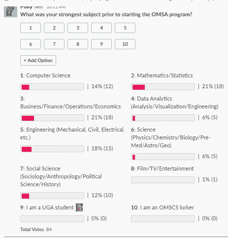

# 佐治亚理工的 MS Analytics 项目值得吗？

> 原文：<https://towardsdatascience.com/georgia-tech-ms-analytics-review-c0f1378da83?source=collection_archive---------3----------------------->

## 我在佐治亚理工学院 MS 分析项目的经历

[来源:Burst-Shopify](https://burst.shopify.com/photos/grad-students-throwing-hats-in-the-air?c=school)

2017 年末，我开始关注不同的在线硕士项目，重点关注数量。这包括统计学、数据科学、分析学、经济学和各种 MBA 课程。不幸的是，许多顶级项目，如卡内基梅隆大学的商业分析或伯克利的数据科学项目，都有 50，000 美元或更多的疯狂价格。虽然高薪不是我想要硕士学位的唯一原因，但高昂的学费大大降低了潜在的投资回报。在研究了几个星期的程序后，我终于找到了我要找的东西。这个分析程序的价格低于 15，000 美元，在不同的专业领域具有灵活性，并且来自一所著名的大学。这是佐治亚理工学院最近成立的在线分析科学硕士[项目](https://pe.gatech.edu/degrees/analytics) (OMSA)。

快进到今天，我现在正在参加他们的金融建模课程。完成后，这将是我完成这个项目所需的 36 学分中的第 21 学分。如果一切顺利，我将在明年年底前完成这个项目。因为我的全职工作，我采取了保守的方法，每学期只报一门课。如果你对注重数量的在线硕士项目感兴趣，请继续阅读我对这个项目的诚实评论。

# 承认

选择乔治亚理工学院项目的便利之一是最低入学要求。他们不需要 GRE 或 GMAT 成绩，这在申请过程中节省了大量时间。缺乏需求既可以被视为优势，也可以被视为劣势。我对这个项目最大的抱怨之一是入学要求和课堂期望之间的巨大脱节。[的要求](https://pe.gatech.edu/degrees/analytics)声明你*只有*需要至少一门大学水平的课程或者“Python 中的计算机编程，达到 Python 中的计算入门的水平”的同等知识。我的计算机编程背景包括几门本科课程、在大会上为期两周的训练营以及一些工作经验；然而，我在课程中的两门必修课上挣扎了很久。

# 上层社会

# 数据分析计算简介

压力。愤怒。挫败感。正如我当时的任何一个室友可以告诉你的那样，在这个项目的第一堂课上，我一直处于混乱状态。数据分析计算入门让我想起了我的大学经历。这类似于我们在马里兰大学描述 STEM 专业的微积分 I 和 II。清除课程。根据佐治亚理工学院的[分布报告](https://tableau.gatech.edu/t/EDM/views/LITEGradeDistributionReport/GradeDistribution?:embed=y&:showAppBanner=false&:display_count=no&:showVizHome=no&:render=false&:embed=y&:showVizHome=n&:tabs=n&:toolbar=n&:apiID=host0)，自 2018 年以来，约有 17%的学生最终退出了这门课程。

本课程的讲座只是浅尝辄止，所以大部分 python 编程都是我们自己学的。幸运的是，在[在线](https://thedatageneralist.com/resources/)可以找到大量的 python 教程和指南。虽然每周的家庭作业还不错，但考试却一点也不。我们进行了多次限时两天的考试。这听起来不错，只是一般人需要 10-12 个小时来完成每项考试。为什么需要 10 个小时才能充分检验一个人是否掌握 python？这在现实世界中是完全不现实的。我从这门课上学到了很多，但考试让我尝到了苦涩的滋味。

# 数据和可视化分析

在一个学期中，专注于软件工具的最佳数量是多少？如果你回答了 10 分或更高，那么这就是为你准备的课程！这个高级核心需求结合了不同的可视化和大数据工具的大杂烩，将它们投入到四个广泛的项目中，然后就到此为止。对于非分析人员或高管来说，这可能看起来合乎逻辑；但是技术岗位需要相当的深度才能成为专家。从概念的角度来看，这是真的，对于软件工具也是如此，因为概念可以很好地转换，BI 工具通常是相似的。如果你只花一周时间学习 Tableau，我保证几个月后你会忘记几乎所有的事情。然而，如果你花一整个学期的时间在一个老式的 MySQL 数据库上，这些概念和技能中的许多将无缝地转化为云中的现代数据库环境。我和我的一个同事一起亲眼目睹了这一点，他因为拥有 10 多年的 SQL 数据库经验，已经非常快地掌握了 Azure 中的数据工程。这个课程需要大量的努力，平均每周 14 个小时，根据 OMS 中央课程评估网站。这意味着大约 50%的学生每周需要超过 14 个小时。对于有家庭和/或全职工作的人来说，这是一项艰巨的工作。我会争辩说，这是一个*不公平的*的时间来期待 3 学分，但我跑题了。不幸的是，这门课的糟糕设计使得学生付出的努力与学到的知识不均衡。

# 模拟

模拟是我一生中上过的最好的课程之一。戈德曼教授对所有模拟事物的极大热情可以让任何讨厌数学的人变成书呆子。到目前为止，他是唯一一个在这个节目的预先录制的视频讲座中加入一些角色的教授。不断有老笑话，youtube 音乐视频的链接，闪烁的颜色或噪音。任何学生都知道，在学习方面，热情和创造力可以创造一个不同的世界。

虽然这门课程比大多数课程更重数学，但它的主题对许多类型的工作都非常有用。从交通模拟到医院的病人流动，每个行业都有模拟实验。这门课涵盖了概率分布、随机变量生成、泊松过程和在 ARENA 中设计模拟实验等主题。如果你对这些主题更详细的内容感兴趣，我把课堂讲稿[整合到这里](https://thedatageneralist.com/simulation/)。

# 社区

有句老话说，你知道什么并不重要，重要的是你知道谁是 T2。虽然面对面交流或通过在线项目建立长期关系很难，但我认为这种经历最有价值的部分是在线社区。OMSA 项目管理着一个松散的网络，包括每个班级的特定频道、学生发布的工作信息等等。每时每刻你都会收到来自世界各地成千上万聪明的学生和助教的有趣帖子。我在我们的 Slack 频道上发布了一个调查，看看在开始这个项目之前，每个人最感兴趣的话题是什么。有趣的是，这个游泳池非常多样化。大约 60%的学生在数学、工程、商业或经济方面有很强的背景。知识和经验的多样性促进了难以置信的对话，以及在数据分析中对思想、链接和笔记的奇妙的、经过过滤的选择。它比任何谷歌搜索都好！

OMSA 松弛频道民意调查

虽然社区是在线的，但还是有一些机会可以见到人。对于拥有大量学生追随者的城市，比如纽约，有专门的渠道，在那里人们会安排面对面的会面。我去年在纽约参加了一个，遇到了几个同学。

# 替代方案和成本

随着数据在过去几年中变得越来越受欢迎，在线硕士选项比我在 2017 年时要多得多。然而，一旦你把学费考虑进去，选择过程就变得容易多了。如果你需要一个 30，000 美元以下的知名项目，那么剩下的选择就不多了。这里有几个符合这个标准的项目，按照美国新闻研究生计算机科学或统计学[排名](https://www.usnews.com/best-graduate-schools/top-science-schools/computer-science-rankings)的顺序排列。

选项#1*
[MS Analytics，佐治亚理工](https://pe.gatech.edu/degrees/analytics)
学费:～1 万美元(未收费)
CS 排名:#8

选项#2*
[德克萨斯大学奥斯汀分校 MS 数据科学](https://ms-datascience.utexas.edu/)
学费:～10000 美元(未收费)
CS 排名:#10

选项#3
[宾夕法尼亚州立大学世界校区 MS 应用统计学](https://www.worldcampus.psu.edu/degrees-and-certificates/applied-statistics-masters/overview) 学费:～27000 美元(未收费)
统计排名:#20 (CS 排名:#30)

选项#4
[印第安纳大学 MS 数据科学](https://datascience.indiana.edu/programs/ms-data-science-online/index.html)
学费:~ $ 23400(未收费)
CS 排名:#55

选项#5
[MS Data Analytics，科罗拉多州立大学](https://csuglobal.edu/graduate/masters-degrees/data-analytics)
学费:~ 19000(未收费)
CS 排名:#75

*[GT MS Analytics 与德克萨斯大学 MS 数据科学项目的比较](/georgia-tech-omsa-vs-university-of-texas-ms-data-science-5f3ef996e222?source=post_stats_page-------------------------------------)

在线硕士课程的两种选择是新兵训练营和自学。我在大会上有过很好的经历，但是训练营的变化很大。证书主义的重要性正在改变，但如果你打算参加训练营，我会做你的尽职调查。至于自学，我在节目中学到的东西在网上都能很容易找到。你在 Coursera 和麻省理工学院有大量的在线公开课。我最喜欢的学习数据科学、分析和数学的资源可以在这里找到。自学需要大量的训练和时间来设计课程。就我个人而言，我知道我必须参加一个正式的项目来推动自己学习这些材料。

# 回首

当我回顾我参加 OMSA 项目的决定时，我不禁要分析我是否做出了正确的决定。在你做出选择之前，你只能在网上找到这么多信息。以我现在所知，我还会选择这个项目吗？老实说，我不知道，但是这山望着那山高。

如果你对我在佐治亚理工学院 OMSA 项目的经历有任何其他问题，请随时联系 [out](https://thedatageneralist.com/contact/) 。

~ [数据通才](https://thedatageneralist.com/)

更新:第二部分的评论在[这里](/georgia-techs-ms-analytics-program-my-review-part-ii-50095db818b9)发表。