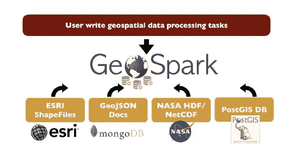
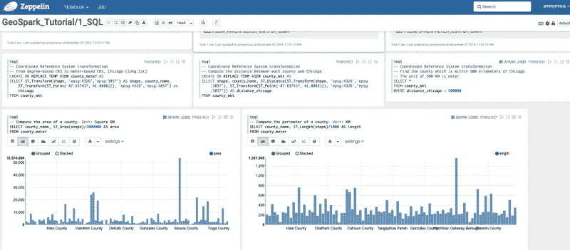
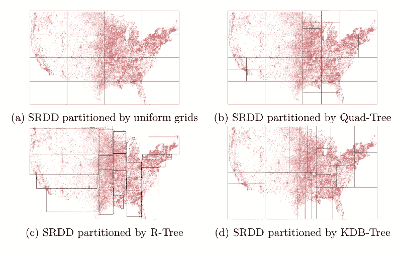

# Apache Sedona 在大规模处理地理空间数据方面表现突出

> 原文：<https://towardsdatascience.com/geospark-stands-out-for-processing-geospatial-data-at-scale-548077270ec0?source=collection_archive---------7----------------------->

## 空间数据洪流

在过去十年中，可用的地理空间数据量大幅增加。这些数据包括但不限于:天气地图、社会经济数据和地理标记的社交媒体。例如，美国国家航空航天局的宇宙飞船一直在监测地球的状况，包括陆地温度、大气湿度。截至今天，美国宇航局已经发布了超过 22PB 的卫星数据。今天，我们在全球拥有近 50 亿台移动设备。因此，移动应用程序产生了大量的网络视频数据。例如，Lyft、优步和摩拜单车每天从数百万骑行者那里收集万亿字节的 GPS 数据。事实上，我们在移动设备上所做的一切都会在地球表面留下数字痕迹。此外，配备 GPS 的移动设备和物联网(IoT)传感器的前所未有的普及，导致不断产生结合周围环境状态的大规模位置信息。例如，一些城市已经开始在十字路口安装传感器，以监测环境、交通和空气质量。

理解隐藏在数据中的丰富的地理空间属性可能会极大地改变我们的社会。这包括许多正在进行深入研究的课题，如气候变化分析、森林砍伐研究、人口迁移、疫情扩散分析、城市规划、交通、商业和广告。这些数据密集型地理空间分析应用高度依赖底层数据管理系统(DBMSs)来高效地检索、处理、争论和管理数据。

# 阿帕奇塞多纳(前 GeoSpark)概述

Apache Sedona(以前的 GeoSpark)(http://sedona.apache.org)是一个集群计算框架，可以大规模处理地理空间数据。GeoSpark 扩展了 Apache Spark 中的核心数据结构弹性分布式数据集(RDD ),以在集群中容纳大地理空间数据。SpatialRDD 由分布在 Spark 集群中的数据分区组成。空间 RDD 可以通过 RDD 变换创建，也可以从永久存储的文件中加载。该层提供了许多 API，允许用户从各种数据格式中读取异构空间对象。

GeoSpark 允许用户使用现成的空间 SQL API 和 RDD API 进行查询。RDD API 提供了一组用操作编程语言编写的接口，包括 Scala、Java、Python 和 r。空间 SQL 接口为用户提供了一个声明性语言接口，因此他们在创建自己的应用程序时可以享受更多的灵活性。这些 SQL API 实现了 SQL/MM Part 3 标准，该标准广泛用于许多现有的空间数据库，如 PostGIS(在 PostgreSQL 之上)。接下来，我们将展示如何使用 GeoSpark。



# Apache Sedona 中支持的空间数据源

过去，研究人员和从业人员开发了许多用于不同目的的地理空间数据格式。然而，异构数据源使得将地理空间数据集成在一起极其困难。例如，WKT 格式是一种广泛使用的空间数据格式，它将数据存储在人类可读的制表符分隔值文件中。Shapefile 是一个空间数据库文件，它包括多个子文件，如索引文件和非空间属性文件。此外，地理空间数据通常具有不同的形状，如点、多边形和轨迹。

目前，Sedona (GeoSpark)可以从本地磁盘、亚马逊 S3 和 Hadoop 分布式文件系统(HDFS)等不同的外部存储系统中读取 WKT、WKB、GeoJSON、Shapefile 和 NetCDF / HDF 格式的数据到空间 RDDs。空间 RDDs 现在可以容纳七种类型的空间数据，包括点、多点、面、多面、线串、多线串、几何集合和圆。此外，具有不同形状的空间对象可以共存于同一空间 RDD 中，因为 Sedona 采用了灵活的设计，该设计概括了不同空间对象的几何计算接口。

**空间 RDD 内置几何库:**空间数据科学家需要在 Apache Sedona 中挖掘空间对象的一些几何属性，比如周长、面积、交集，这是相当常见的。空间 RDD 配备了一个内置的几何库来执行大规模的几何运算，因此用户不会涉及复杂的计算几何问题。目前，系统在该库中提供了 20 多种不同的功能，并将它们分为两个不同的类别

常规几何函数应用于空间 RDD 中的每个空间对象。对于每个对象，它都会生成相应的结果，如周长或面积。输出必须是常规 RDD 或空间 RDD。

几何聚合函数应用于空间 RDD 以生成聚合值。它只为整个空间 RDD 生成单个值或空间对象。例如，系统可以计算整个空间 RDD 的边界框或多边形并集。

# 使用 RDD API 运行查询

这里，我们概述了使用 GeoSpark RDD API 创建空间 RDD 和运行空间查询的步骤。示例代码是用 Scala 编写的，但也适用于 Java。

**设置依赖关系:**在开始使用 Apache Sedona(即 GeoSpark)之前，用户必须将相应的包作为依赖关系添加到他们的项目中。为了便于管理依赖项，GeoSpark 的二进制包托管在 Maven 中央存储库中，该存储库包含了全世界所有基于 JVM 的包。只要项目由 Apache Maven 和 sbt 等流行的项目管理工具管理，用户就可以通过在 POM.xml 和 build.sbt 等项目规范文件中添加工件 id 来轻松添加 Apache Sedona。

**初始化 Spark Context:**Spark 或 Apache Sedona 中的任何 RDD 都必须由 Spark Context 创建。因此，GeoSpark 应用程序的第一项任务是启动 SparkContext。下面的代码片段给出了一个例子。为了使用自定义空间对象和索引序列化程序，用户必须在 SparkContext 中启用它们。

```
val conf = new SparkConf()conf.setAppName(“GeoSparkExample”)// Enable GeoSpark custom Kryo serializer
conf.set(“spark.serializer”, classOf[KryoSerializer].getName)conf.set(“spark.kryo.registrator”, classOf[GeoSparkKryoRegistrator].getName)val sc = new SparkContext(conf)
```

**创建一个空间 RDD:**Spatial rdd 中的空间对象并不局限于某种几何类型，而是对更多的场景开放。它允许包含混合类型几何图形的输入数据文件。例如，WKT 文件可能包括三种类型的空间对象，如线串、多边形和多重多边形。目前，该系统可以加载许多不同数据格式的数据。这是由一组文件阅读器完成的，如 WktReader 和 GeoJsonReader。例如，用户可以调用 ShapefileReader 来读取 ESRI 形状文件。

```
val spatialRDD = ShapefileReader.readToGeometryRDD(sc, filePath)
```

**变换坐标参考系统:** Apache Sedona 不控制空间 RDD 中对象的坐标单位(即基于度数或基于米)。计算两个坐标之间的距离时，GeoSpark 只需计算欧几里得距离。在实践中，如果用户想要获得精确的地理空间距离，他们需要将坐标从基于度数的坐标参考系统(CRS)，即 WGS84，转换到平面坐标参考系统(即 EPSG: 3857)。GeoSpark 为用户提供了这一功能，使他们可以对空间 RDD 中的每个对象执行这一转换，并使用集群扩展工作负载。

```
// epsg:4326: is WGS84, the most common degree-based CRSval sourceCrsCode = “epsg:4326" // epsg:3857: The most common meter-based CRSval targetCrsCode = “epsg:3857"objectRDD.CRSTransform(sourceCrsCode, targetCrsCode)
```

**构建空间索引:**用户可以调用 API 在空间 RDD 上构建分布式空间索引。目前，系统提供两种类型的空间索引，四叉树和 R 树，作为每个分区上的本地索引。这一步的代码如下:

```
spatialRDD.buildIndex(IndexType.QUADTREE, false) // Set to true only if the index will be used join query
```

**编写一个空间范围查询:**空间范围查询返回位于一个地理区域内的所有空间对象。例如，范围查询可能会找到菲尼克斯大都市地区的所有公园，或者返回用户当前位置一英里范围内的所有餐馆。就格式而言，空间范围查询以一组空间对象和一个多边形查询窗口作为输入，并返回位于查询区域内的所有空间对象。空间范围查询将范围查询窗口和空间 RDD 作为输入，并返回与查询窗口相交/被查询窗口完全覆盖的所有几何。假设用户拥有空间 RDD。他或她可以使用以下代码对该空间 RDD 发出空间范围查询。空间范围查询的输出格式是另一种空间 RDD。

```
val rangeQueryWindow = new Envelope(-90.01, -80.01, 30.01, 40.01) /*If true, return gemeotries intersect or are fully covered by the window; If false, only return the latter. */val considerIntersect = false// If true, it will leverage the distributed spatial index to speed up the query executionval usingIndex = falsevar queryResult = RangeQuery.SpatialRangeQuery(spatialRDD, rangeQueryWindow, considerIntersect, usingIndex)
```

**编写空间 K 最近邻查询:**将 K、查询点和空间 RDD 作为输入，并在 RDD 中找到与查询点最近的 K 个几何。如果用户拥有空间 RDD，他或她可以执行如下查询。空间 KNN 查询的输出格式是包含 K 个空间对象的列表。

```
val geometryFactory = new GeometryFactory()val pointObject = geometryFactory.createPoint(new Coordinate(-84.01, 34.01)) // query pointval K = 1000 // K Nearest Neighborsval usingIndex = falseval result = KNNQuery.SpatialKnnQuery(objectRDD, pointObject, K, usingIndex)
```

**编写一个空间连接查询:**空间连接查询是用一个空间谓词组合两个或更多数据集的查询，比如距离和包含关系。生活中也有一些真实的场景:告诉我所有有湖的公园，告诉我所有 500 英尺内有杂货店的加油站。空间连接查询需要两组空间对象作为输入。它从这两个数据集的叉积中找到一个子集，使得每个记录都满足给定的空间谓词。在 Sedona 中，空间连接查询将两个空间 RDDs A 和 B 作为输入。对于 A 中的每个对象，从 B 中查找被它覆盖/相交的对象。a 和 B 可以是任何几何类型，并且不必具有相同的几何类型。空间 RDD 空间分区可以显著提高连接查询的速度。有三种空间划分方法:KDB 树、四叉树和 R 树。两个空间 rdd 必须由同一个空间分区网格文件进行分区。换句话说，如果用户首先对空间 RDD A 进行分区，那么他或她必须使用 A 的数据分割器对 b 进行分区。示例代码如下:

```
// Perform the spatial partitioningobjectRDD.spatialPartitioning(joinQueryPartitioningType)queryWindowRDD.spatialPartitioning(objectRDD.getPartitioner)// Build the spatial indexval usingIndex = truequeryWindowRDD.buildIndex(IndexType.QUADTREE, true) // Set to true only if the index will be used join queryval result = JoinQuery.SpatialJoinQueryFlat(objectRDD, queryWindowRDD, usingIndex, considerBoundaryIntersection)
```

# 使用 SQL APIs 运行空间查询

这里，我们概述了使用 GeoSpark 的空间 SQL 接口管理空间数据的步骤。SQL 接口遵循 SQL/MM Part3 空间 SQL 标准。具体来说，GeoSpark 将可用的空间 SQL 函数分为三类:(1)构造函数:创建一个几何类型列(2)谓词:评估一个空间条件是真还是假。谓词通常用于 WHERE 子句、HAVING 子句等(3)几何函数:对给定的输入执行特定的几何运算。这些函数可以生成几何图形或数值，如面积或周长。

为了使用该系统，用户需要添加 GeoSpark 作为他们项目的依赖项，如前一节所述。

**启动 SparkSession:**Spark 或 Sedona 中的任何 SQL 查询都必须由 SparkSession 发出，Spark session 是集群的中央调度器。要启动 SparkSession，用户应使用如下代码:

```
var sparkSession = SparkSession.builder().appName(“GeoSparkExample”)// Enable GeoSpark custom Kryo serializer.config(“spark.serializer”, classOf[KryoSerializer].getName).config(“spark.kryo.registrator”, classOf[GeoSparkKryoRegistrator].getName).getOrCreate()
```

**注册 SQL 函数:** GeoSpark 在 Spark 的 catalyst 优化器中增加了新的 SQL API 函数和优化策略。为了启用这些功能，用户需要使用如下代码将 GeoSpark 显式注册到 Spark 会话。

```
GeoSparkSQLRegistrator.registerAll(sparkSession)
```

**创建一个几何类型列:** Apache Spark 提供了一些格式解析器，可以将数据从磁盘加载到 Spark DataFrame(一个结构化的 RDD)中。在获得数据帧之后，想要运行空间 SQL 查询的用户必须首先在该数据帧上创建几何类型列，因为在关系数据系统中每个属性都必须有一个类型。这可以通过一些构造函数来完成，例如 ST\_GeomFromWKT。在这一步之后，用户将获得一个空间数据框架。以下示例显示了该函数的用法。

```
SELECT ST_GeomFromWKT(wkt_text) AS geom_col, name, address
FROM input
```

**转换坐标参考系:**与 RDD API 类似，空间 SQL APIs 也提供了一个函数，即 ST_Transform，用于转换空间对象的坐标参考系。它的工作原理如下:

```
SELECT ST_Transform(geom_col, “epsg:4326", “epsg:3857") AS geom_col
FROM spatial_data_frame
```

**编写一个空间范围查询:** GeoSpark 空间 SQL APIs 有一组谓词，用于评估空间条件是真还是假。ST\_Contains 是一个经典函数，它将两个对象 A 作为输入，如果 A 包含 B，则返回 true。在给定的 SQL 查询中，如果 A 是单个空间对象，B 是列，则这将成为 GeoSpark 中的空间范围查询(请参见下面的代码)。

```
SELECT *
FROM spatial_data_frame
WHERE ST_Contains (ST_Envelope(1.0,10.0,100.0,110.0), geom_col)
```

**编写一个空间 KNN 查询:**要使用 SQL APIs 执行空间 KNN 查询，用户需要首先计算查询点和其他空间对象之间的距离，按升序排列距离，并取前 K 个对象。以下代码查找点(1，1)的 5 个最近邻点。

```
SELECT name, ST_Distance(ST_Point(1.0, 1.0), geom_col) AS distance
FROM spatial_data_frame
ORDER BY distance ASC
LIMIT 5
```

**编写一个空间连接查询:**空间 SQL 中的空间连接查询也使用前面提到的评估空间条件的空间谓词。但是，要触发连接查询，空间谓词的输入必须至少包含两个几何类型的列，这两个列可以来自两个不同的数据帧，也可以来自同一数据帧。以下查询涉及两个空间数据帧，一个面列和一个点列。它查找每一对可能的$ < $polygon，point$ > $以使多边形包含该点。

```
SELECT *
FROM spatial_data_frame1 df1, spatial_data_frame2 df2
WHERE ST_Contains(df1.polygon_col, df2.point_col)
```

**执行几何运算:** GeoSpark 提供超过 15 个 SQL 函数。用于几何计算。用户可以在其空间 SQL 查询中轻松调用这些函数，GeoSpark 将并行运行该查询。例如，获取每个空间对象的面积的一个非常简单的查询如下:

```
SELECT ST_Area(geom_col)
FROM spatial_data_frame
```

系统还提供空间对象的聚集功能。它们通常将数据帧中的所有空间对象作为输入，并产生单个值。例如，以下代码计算数据框中所有面的并集。

```
SELECT ST_Union_Aggr(geom_col)
FROM spatial_data_frame
```

# 通过 Zeppelin 笔记本与 GeoSpark 互动

尽管 Spark 在每个版本中都捆绑了交互式 Scala 和 SQL shells，但这些 shell 并不用户友好，并且无法进行复杂的分析和图表。数据科学家倾向于使用图形界面交互式地运行程序和绘制图表。从 1.2.0 开始，GeoSpark (Apache Sedona)提供了一个为 Apache Zeppelin 基于 web 的笔记本量身定制的氦插件。用户可以在 Zeppelin web 笔记本上执行空间分析，Zeppelin 会将任务发送到底层 Spark 集群。



用户可以在 Zeppelin 笔记本上创建一个新段落，并用 Scala、Python 或 SQL 编写代码，与 GeoSpark 进行交互。此外，用户可以点击界面上的不同选项，并要求 GeoSpark 在查询结果上呈现不同的图表，如条形图、折线图和饼图。例如，Zeppelin 可以将以下查询的结果可视化为条形图，并显示美国每个县的地标数量。

```
SELECT C.name, count(*)
FROM US_county C, US_landmark L
WHERE ST_Contains(C.geom_col, L.geom_col)
GROUPBY C.name
```

另一个例子是找到美国每个县的面积，并将其可视化在条形图上。相应的查询如下。这实际上利用了 GeoSpark 中提供的几何功能。

```
SELECT C.name, ST_Area(C.geom_col) AS area
FROM US_county C
```

# Apache Sedona 如何处理空间数据洪流

## 空间数据划分

此外，空间 rdd 配备了分布式空间索引和分布式空间分区来加速空间查询。所采用的数据分区方法适合集群中的空间数据处理。空间 rdd 中的数据根据空间数据分布进行分区，并且附近的空间对象很可能被放入同一个分区中。空间分区的效果是双重的:(1)当运行以特定空间区域为目标的空间查询时，GeoSpark 可以通过避免对空间上不接近的分区进行不必要的计算来加速查询。(2)它可以将空间 RDD 分割成多个数据分区，每个分区具有相似数量的记录。这样，系统可以确保负载平衡，并避免在集群中执行计算时掉队。



## 空间索引

Sedona 使用分布式空间索引来索引集群中的空间 rdd。这个分布式索引由两部分组成(1)全局索引:存储在主机上，在空间分区阶段生成。它索引空间 rdd 中分区的包围盒。拥有这样一个全局索引的目的是修剪那些保证没有合格的空间对象的分区。(2)局部索引:建立在空间 RDD 的每个分区上。因为每个本地索引只作用于它自己分区中的数据，所以它可以有一个很小的索引大小。给定一个空间查询，空间 RDD 中的本地索引可以加速并行查询。

## 空间 RDD 定制串行器

Sedona 为空间对象和空间索引提供了定制的序列化程序。所提出的序列化器可以将空间对象和索引序列化为压缩的字节数组。该序列化程序比广泛使用的 kryo 序列化程序更快，并且在运行复杂的空间操作(例如空间连接查询)时占用的内存更少。将空间对象转换为字节数组时，序列化程序遵循 Shapefile 的编码和解码规范。

序列化器还可以序列化和反序列化本地空间索引，如四叉树和 R 树。对于序列化，它使用深度优先搜索(DFS)按照预先排序策略遍历每个树节点(首先写入当前节点信息，然后写入其子节点)。对于反序列化，它将遵循序列化阶段使用的相同策略。反序列化也是一个递归过程。当序列化或反序列化每个树节点时，索引序列化程序将调用空间对象序列化程序来处理单个空间对象。

# 结论

总之，Apache Sedona 为数据科学家处理大规模地理空间数据提供了一个易于使用的界面。目前，该系统支持 SQL、Python、R 和 Scala 以及许多空间数据格式，例如 ShapeFiles、ESRI、GeoJSON 和 NASA 格式。以下是 GitHub 资源库的链接:

[](http://sedona.apache.org) [## 阿帕奇塞多纳(孵化中)

### Apache Sedona(孵化)是一个用于处理大规模空间数据的集群计算系统。塞多纳扩展阿帕奇…

sedona.apache.org](http://sedona.apache.org) 

GeoSpark 有一个活跃的小型社区，由来自工业界和学术界的开发人员组成。您还可以在此尝试更多编码示例:

[](https://github.com/apache/incubator-sedona/) [## 阿帕奇/孵化器-塞多纳

### Apache Sedona(孵化)是一个用于处理大规模空间数据的集群计算系统。塞多纳扩展阿帕奇…

github.com](https://github.com/apache/incubator-sedona/) 

如果您有更多问题，请随时在 [Twitter](https://twitter.com/mosarwat) 上给我发消息