# 地理空间冒险。第一步:匀称。

> 原文：<https://towardsdatascience.com/geospatial-adventures-step-1-shapely-e911e4f86361?source=collection_archive---------16----------------------->

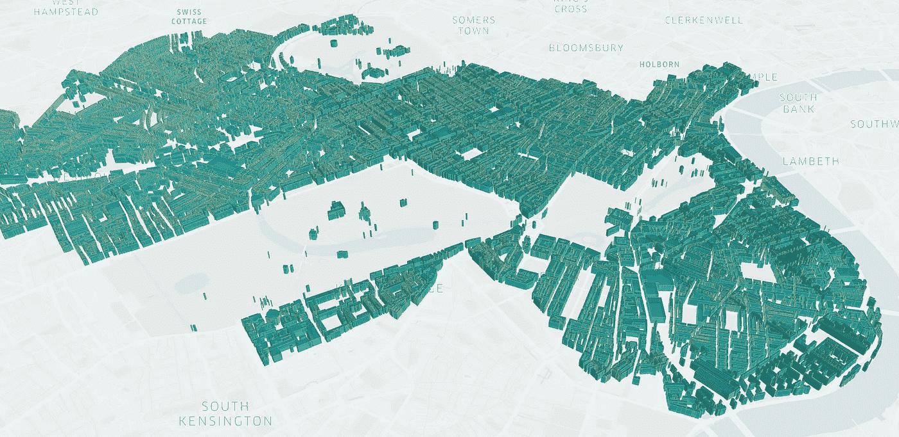

使用 KeplerGL 生成的图像

## 快速浏览使用 Shapely 库在 Python 中处理几何对象的基础知识。

这是一系列文章中的第一篇，总结了过去几年中使用 PropTech 处理地理空间数据的一些关键成果。这些将会有所有的东西——地理空间数据集、几何形状、栅格文件、地图、可视化。从最基础的开始，在后面的文章中，朝着更有趣和更有挑战性的方向努力...

让我们从介绍身材匀称的[开始吧。毫无疑问，这是我最喜欢的 Python 库之一——非常重要，对于你最终从事的任何几何/地理相关的工作都是绝对必要的。](https://shapely.readthedocs.io/en/latest/manual.html)

该库允许您使用三种主要类型的几何对象:点、线串和多边形+几何图形集合(如果您想要组合它们)。还有一堆其他的——线性环、多点、多多边形等。，但是现在这些就够了，这些方法是可以移植的。

## **安装**

非常标准的安装，使用 pip。如果你像我一样使用 jupyter，你可以直接运行

```
!pip install shapely
```

请注意，GeoPandas 正在使用 Shapely，因此如果您已经安装了 GeoPandas，您可能已经有了 Shapely 的最新版本。您可以在导入 Geopandas 后执行一些 Shapely 操作，而无需单独导入，但是，如果您想要直接处理点和面对象，您仍需要首先加载它们。关于 Geopandas 已经说得够多了，但是我们将在下一篇文章中更详细地讨论它。

安装完成后，将其导入笔记本并加载主要几何图形类型:

```
import shapely
from shapely.geometry import Point, Polygon, LineString, GeometryCollection
import numpy as np
```

我也在进口 numpy，因为我太喜欢了。不过说真的，我经常发现自己在 shapely 对象和等价的 numpy 坐标数组之间来回跳跃，因为 numpy 允许您以显式矢量化形式更快地进行一些操作，所以从一开始就了解这两者之间的联系是一个好主意。

## **点状物体**

顾名思义，这只是二维平面上的一个点，以一对坐标为特征。

Shapely 的一个超级方便的功能是——它允许您查看所有的几何对象，而不必求助于任何图形包。请注意，无论对象在坐标系中的位置如何，当您想要查看它时，它总是以对象为中心。

```
pt = Point(10, 10)
pt1 = Point(100, 101)
```

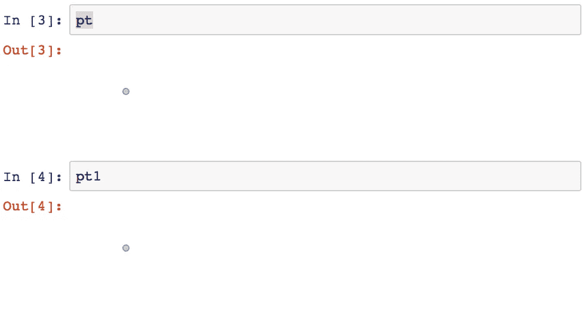

您还可以显示对象的字符串表示，只需将 str()括起来，或者将其转换为坐标的 numpy 数组。正如我提到的，我发现后者特别有用，因为我经常发现自己在处理大型几何对象阵列(例如来自 OSM 的超过 600 万个建筑多边形)，如果我想以矢量格式进行计算，numpy 是绝对不可替代的。

还有一个将这个字符串表示加载回几何格式的方法，当您必须加载以非几何格式存储的数据(例如从 csv 文件)时，这将非常方便。

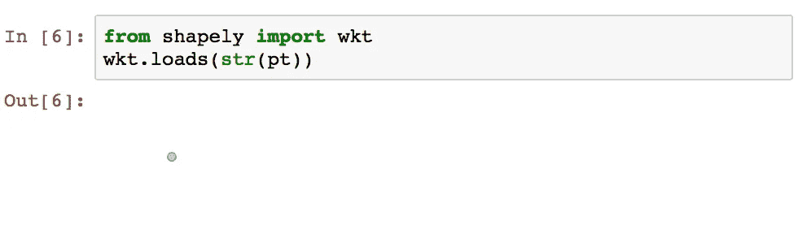

如果您想要快速查看几个对象，并查看它们如何相互缩放，您所要做的就是将它们转换为几何体集合:

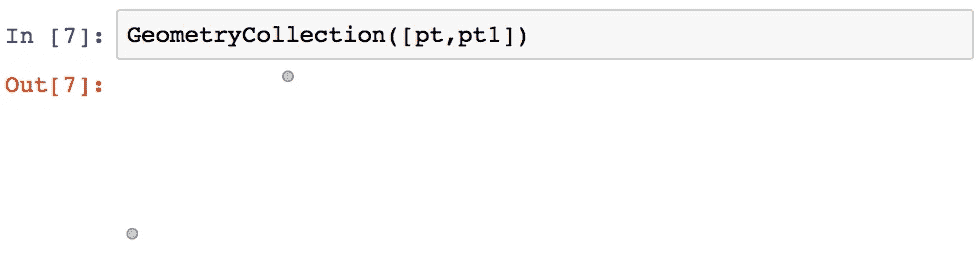

其他一些简便的方法——距离、坐标采集。

在[8]中:

```
pt.distance(pt1)
```

Out[8]:

```
127.98828071350908
```

在[9]中:

```
pt.x, pt.y, pt.xy
```

Out[9]:

```
(10.0, 10.0, (array('d', [10.0]), array('d', [10.0])))
```

在继续学习线条之前，还有最后一件事。所有 shapely 对象都有一个. name 属性。例如，当您要将 GeoPandas 或 Pandas 数据帧中存储的大型集合中的每个多边形转换为一组较小的多边形(如格网)时，并且希望有一种简单的方法将它们与原始多边形相关联时，这将非常有用。

在[10]中:

```
pt.name = 'My Point'
pt.name
```

Out[10]:

```
'My Point'
```

## **线串**

LineStrings 以非常相似的方式启动，只是这次我们有一个元组列表，而不是单个元组。它们可以交叉并多次通过相同的点，但是，不建议使用后者，因为它会对性能产生负面影响，您最好将它们拆分为单独的组件。请注意，点的顺序很重要，因为它决定了您通过它们的顺序(这同样适用于多边形，您将在下面看到)。

```
ln = LineString([(0, 1), (20, 100), (100, 3), (120, 102), (200, 5)])
```

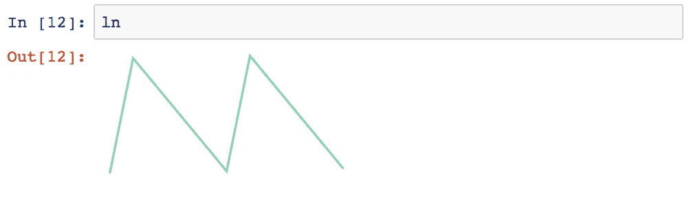

与点一样，可以将 LineString 对象转换为点坐标数组。这里保留了顺序，因此这可用于快速获得第一个和最后一个点的坐标——例如，这对于构建表示道路网络的树对象很方便。

在[13]中:

```
np.array(ln)
```

Out[13]:

```
array([[  0.,   1.],
       [ 20., 100.],
       [100.,   3.],
       [120., 102.],
       [200.,   5.]])
```

或者，如果您希望首先使用与创建 LineString 相同的元组列表表示:

在[14]中:

```
list(ln.coords)
```

Out[14]:

```
[(0.0, 1.0), (20.0, 100.0), (100.0, 3.0), (120.0, 102.0), (200.0, 5.0)]
```

您也可以只分离出 X 坐标或 Y 坐标(当然，您也可以使用 numpy 来完成):

在[15]中:

```
list(ln.xy[0]), list(ln.xy[-1])
```

Out[15]:

```
([0.0, 20.0, 100.0, 120.0, 200.0], [1.0, 100.0, 3.0, 102.0, 5.0])
```

快速浏览一下图形表示以及我们之前创建的点:

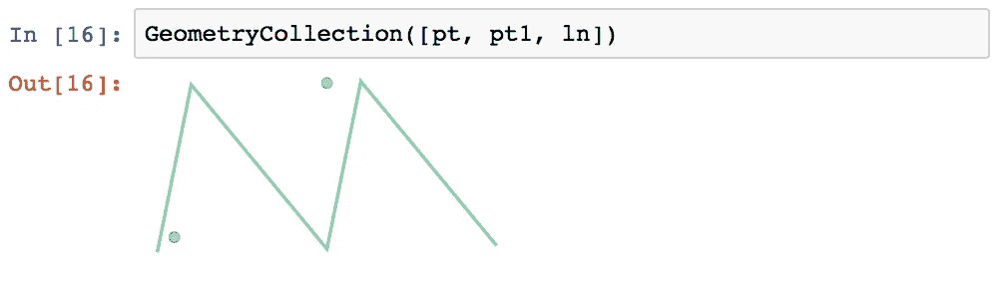

计算点到线的距离、线上的点投影(从起点沿着线的距离)和线的长度非常简单:

在[17]中:

```
pt.distance(ln)
```

Out[17]:

```
8.01980198019802
```

在[18]中:

```
ln.project(pt), ln.length
```

Out[18]:

```
(10.801980198019802, 453.46769176178475)
```

在[19]中:

```
list(ln.interpolate(ln.project(Point(1, 1))).coords)
```

Out[20]:

```
[(0.039211841976276834, 1.1940986177825703)]
```

请注意，如果点在线上的投影恰好位于定义的区域之外，则距离将计算到最近的线端。如果你在实际的投影之后，你将需要做一些额外的几何。最简单的方法是延伸直线的第一段和最后一段，并仍然使用相同的投影方法。

线交点也很简单，即使你有多个交点。

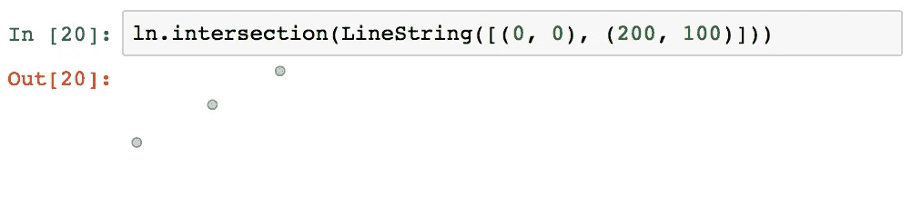

结果是一个多点对象，您可以对其进行迭代，就像这是一个常规列表一样，将点对象作为可迭代对象:

在[21]中:

```
str(ln.intersection(LineString([(0, 0), (200, 100)])))
```

Out[22]:

```
'MULTIPOINT (72.55474452554745 36.27737226277372, 110.561797752809 55.28089887640449, 144.5255474452555 72.26277372262774)'
```

在[22]中:

```
[np.array(a) for a in ln.intersection(
    LineString([
        (0, 0),
        (200, 100)
    ])
)]
```

Out[22]:

```
[array([72.55474453, 36.27737226]),
 array([110.56179775,  55.28089888]),
 array([144.52554745,  72.26277372])]
```

## **多边形**

毫不奇怪，创建一个与创建一个 LineString 非常相似，并且与 LineString 一样，列出点的顺序很重要。

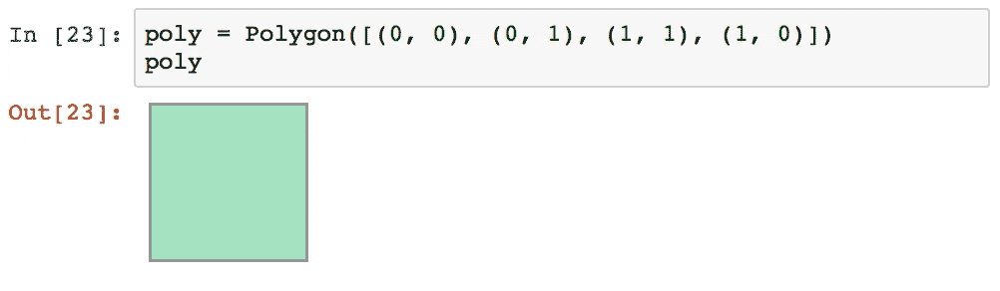

多边形内部可以有洞，这些洞的定义遵循一个简单的规则:多边形([多边形坐标列表]，[洞列表])，其中每个洞本身就是一个多边形。请注意，表示洞的多边形必须完全位于原始多边形内部，或者只能在一个地方接触到原始多边形。

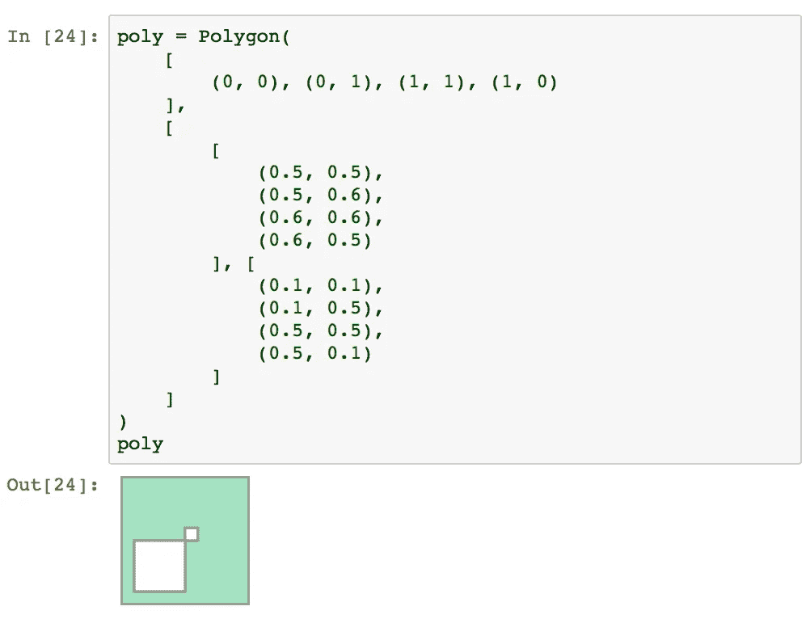

请注意，多边形不能像线串和点那样直接转换成点的集合。相反，我们必须处理它们的外部和内部轮廓(它们本身就是线条，也就是一个自身循环的线条)。对于内部边界，我们得到一个迭代器:

在[25]中:

```
np.array(poly.exterior)
```

Out[25]:

```
array([[0., 0.],
       [0., 1.],
       [1., 1.],
       [1., 0.],
       [0., 0.]])
```

在[26]中:

```
[np.array(a) for a in poly.interiors]
```

Out[26]:

```
[array([[0.5, 0.5],
        [0.5, 0.6],
        [0.6, 0.6],
        [0.6, 0.5],
        [0.5, 0.5]]), array([[0.1, 0.1],
        [0.1, 0.5],
        [0.5, 0.5],
        [0.5, 0.1],
        [0.1, 0.1]])]
```

几个额外的方法作为一个追赶者:

**多边形的质心**(或者，类似地，线对象)

在[27]中:

```
np.array(poly.centroid)
```

Out[27]:

```
array([0.53795181, 0.53795181])
```

**检查点是否在多边形内的两种不同方法**:

在[28]中:

```
Point(0.7, 0.7).within(poly), poly.contains(Point(0.7, 0.7))
```

Out[28]:

```
(True, True)
```

你可以很容易地**将线串和点对象转换成多边形**通过在它们周围添加一个缓冲区

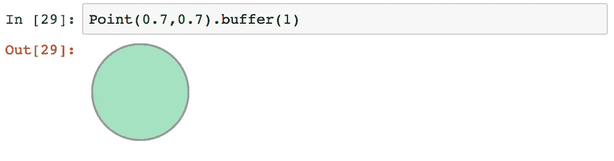

注意-这仍然是一个多边形(不是严格意义上的圆)，在这种情况下，由 66 个点组成。

在[30]中:

```
len(np.array(Point(0.7, 0.7).buffer(1).exterior))
```

Out[30]:

```
66
```

如果需要，您可以通过在缓冲区中传递分辨率参数来提高默认分辨率(16)的精度:

在[31]中:

```
len(np.array(Point(0.7, 0.7).buffer(1, resolution=32).exterior))
```

Out[31]:

```
130
```

缓冲区允许您轻松地关联多边形和其他几何体对象。例如，如果你想用一条特定宽度的线切割一个多边形

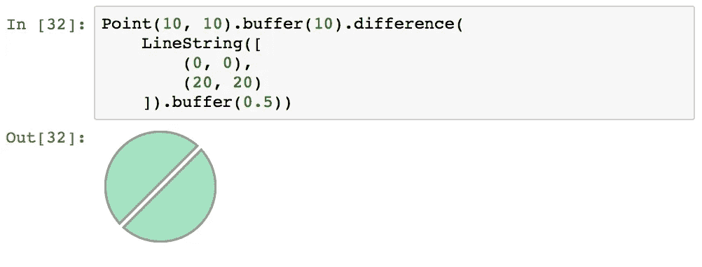

或者切割它而不损失任何表面积:

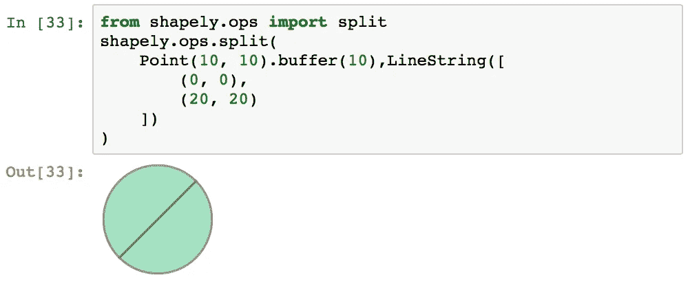

最后，超级有用的 **bounds** metod，可以应用于多边形、线串和多对象，返回最小边界矩形的左下角和右上角的坐标，与 XY 轴对齐。

在[34]中:

```
Point(10, 10).buffer(5).bounds
```

Out[34]:

```
(5.0, 5.0, 15.0, 15.0)
```

今天到此为止。下一站[熊猫大战地质熊猫](https://medium.com/@datingpolygons/geospatial-adventures-step-2-pandas-vs-geopandas-16e842d0e3a7)！

*本系列其他帖子:*

[*地理空间冒险。第二步:熊猫大战地球熊猫*](https://medium.com/@datingpolygons/geospatial-adventures-step-2-pandas-vs-geopandas-16e842d0e3a7)

[*地理空间历险记。第三步。多边形生长在 R 树上*](https://medium.com/analytics-vidhya/geospatial-adventures-step-3-polygons-grow-on-r-trees-2f15e2712537)

[*地理空间历险记。第四步。魔法的色彩或者如果我没有看到它——它就不存在*](https://medium.com/@datingpolygons/geospatial-adventures-step-4-the-colour-of-magic-or-if-i-dont-see-it-it-doesn-t-exist-56cf7fb33ba9)

[*地理空间历险记。第五步。离开平地或飞越多边形的海洋*](https://medium.com/@datingpolygons/geospatial-adventures-step-5-leaving-the-flatlands-or-flying-over-the-sea-of-polygons-846e45c7487e)