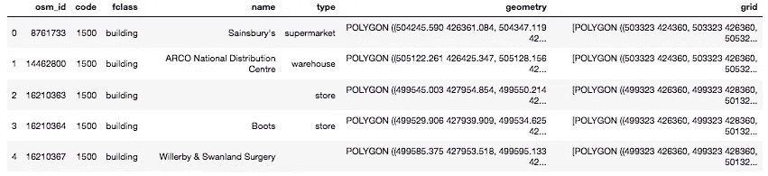
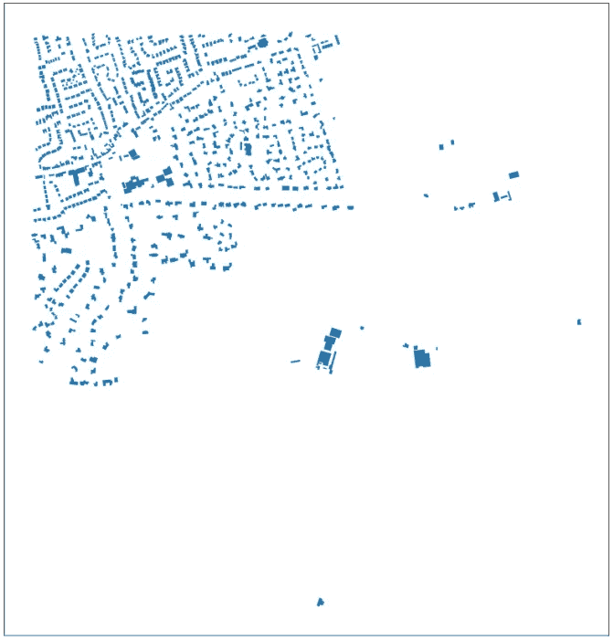
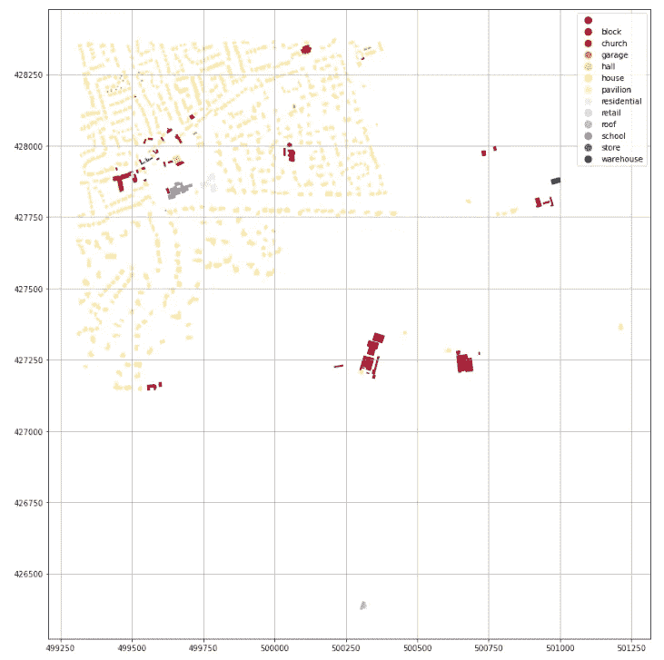
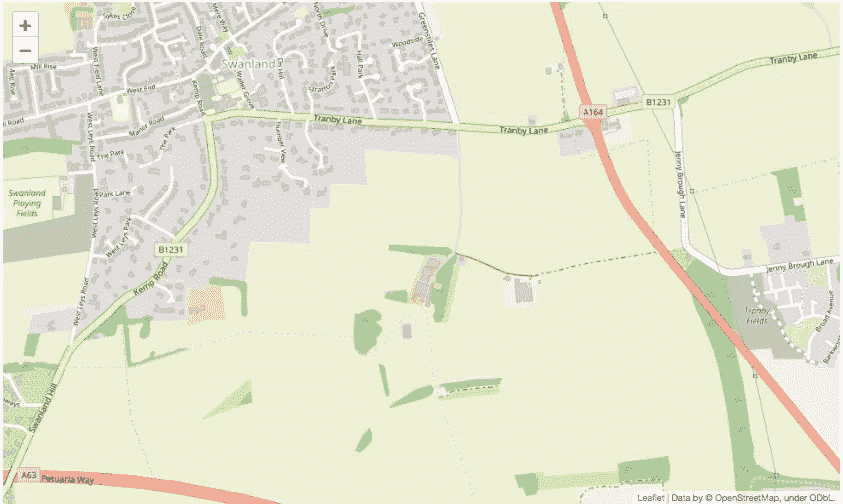
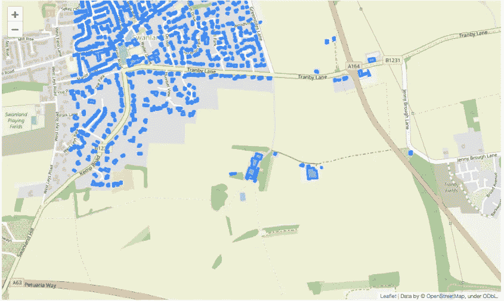
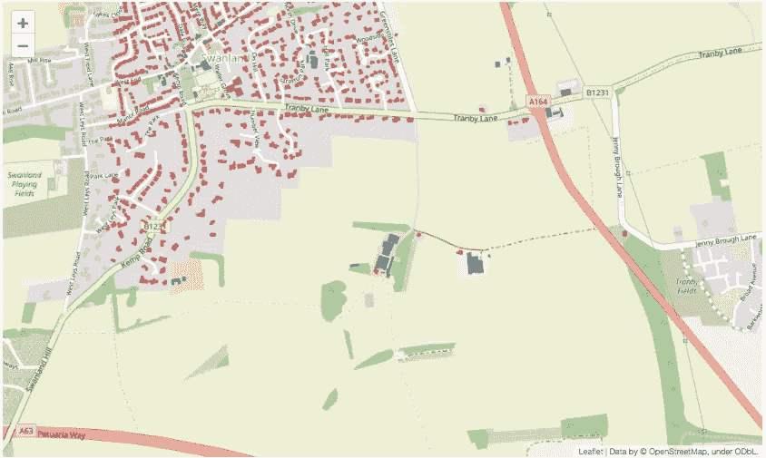
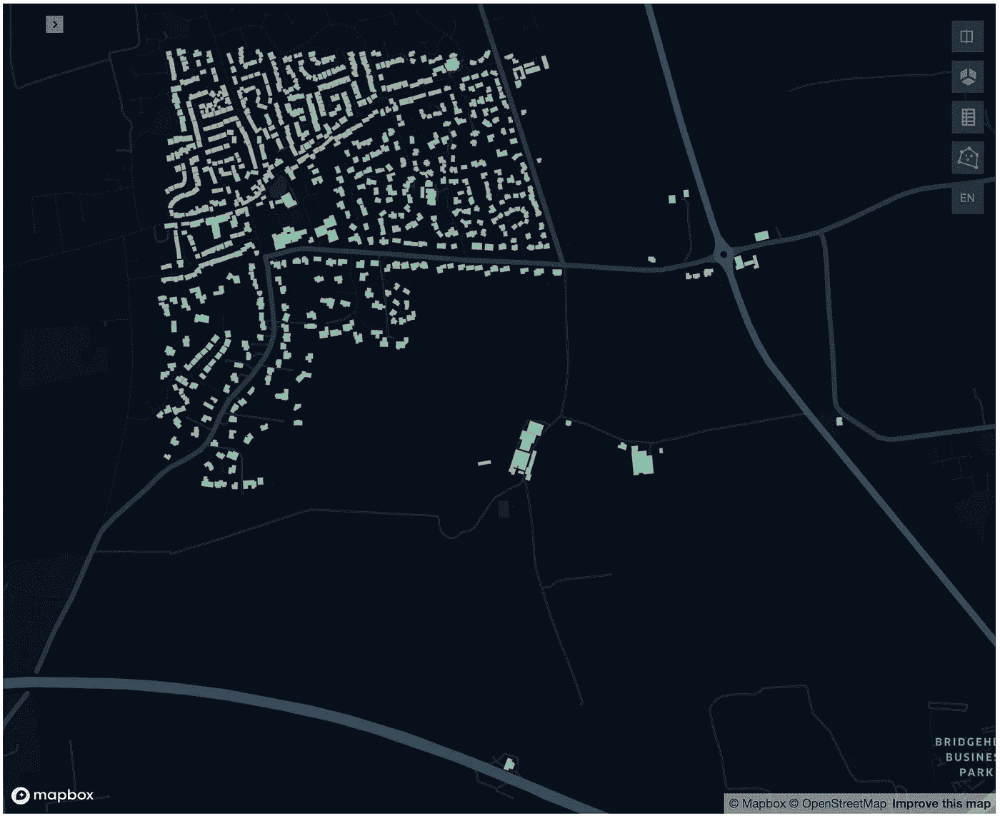
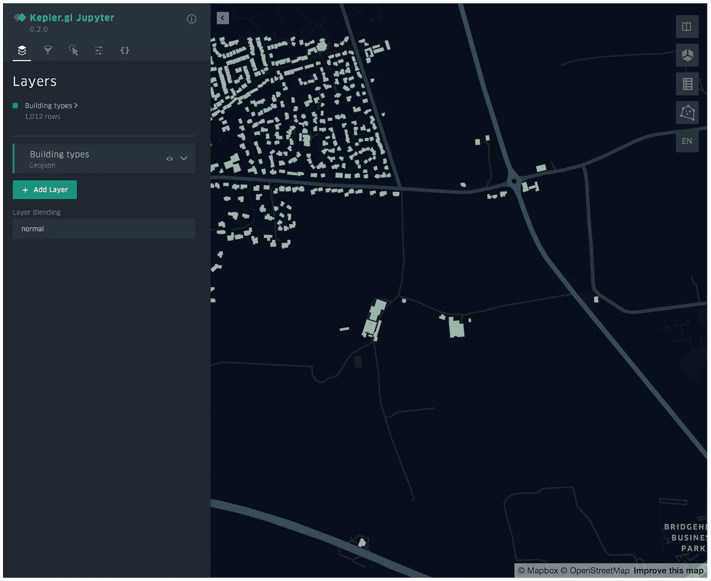
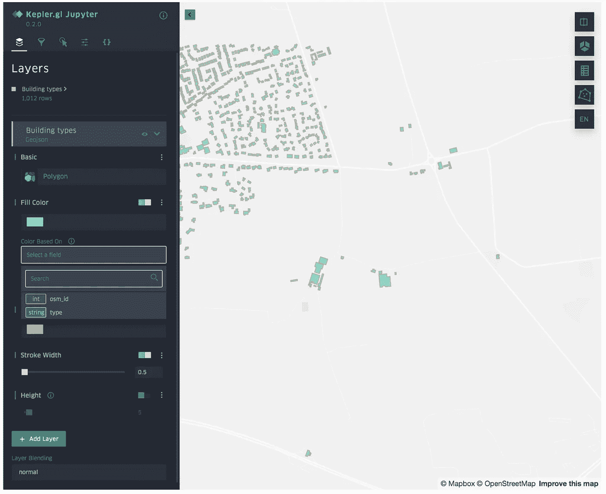
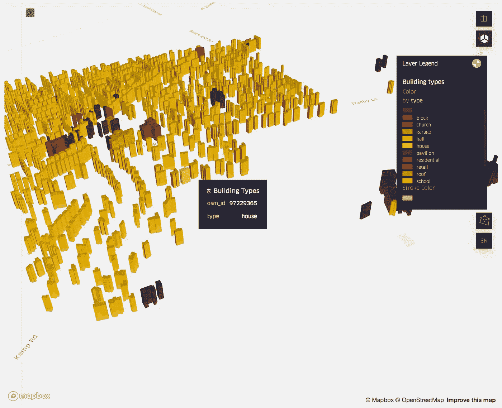

# 地理空间冒险。第四步。魔法的颜色，或者如果我看不到它，它就不存在。

> 原文：<https://towardsdatascience.com/geospatial-adventures-step-4-the-colour-of-magic-or-if-i-dont-see-it-it-doesn-t-exist-56cf7fb33ba9?source=collection_archive---------51----------------------->


使用 KeplerGL 生成

## 快速浏览几何/地理对象(建筑多边形、道路、水路等)的可视化工具。).

*从* [*继续第三步*](https://medium.com/@datingpolygons/geospatial-adventures-step-3-polygons-grow-on-r-trees-2f15e2712537) *。现在我们已经有了约克郡东骑马区的所有(OSM 已知的)建筑的数据集，让我们看看可视化数据的方法。*

简单回顾一下——在上一篇文章中，我们观察了英国的地方政府多边形，并把它们与 OSM 建筑多边形结合起来。然后，我们讨论了一种将所有建筑多边形归属于相应的地方当局多边形的方法，并集中讨论了约克郡的 East Riding，这是由它的形状之美和与赫尔的邻近性所激发的。然后，我们继续创造一个非常不恰当的结果视觉化，我们即将纠正它。这篇文章是关于在地图上查看几何/地理数据的不同方法。

在我们能正确开始之前，我们确实需要一些小步骤。

首先，让我们加载我们在上一篇文章中使用的所有库:

```
import geopandas as gpd
import swifter
import numpy as np
from shapely.geometry import Polygon, GeometryCollection
```

在此之上，我们仍然有我们的数据框架和属性化的建筑，我们称之为“bd_ery”。让我们快速浏览一下:

```
bd_ery.head()
```



## 用 GeoPandas 绘图

我们将逐步进行，首先，让我们看看地理数据框架本身可以做些什么，因为除了显示几何对象之外，它还具有一些额外的绘图功能。如果你是 GeoPandas 的新手——看看本系列的第二篇文章

我们仍然需要使用 MatPlotLib，所以让我们继续加载它。

```
import matplotlib.pyplot as plt
%matplotlib inline
```

还有一件事——策划整个地方当局将使我们所有美丽的建筑形状变得非常小，这将是不可原谅的。因此，相反，我们将首先利用我们创建的图块来对它们进行属性化([详见上一篇文章](https://medium.com/analytics-vidhya/geospatial-adventures-step-3-polygons-grow-on-r-trees-2f15e2712537))。我们不想处理它们的多边形，然而，我们需要的只是一种简单的方法来选择位于特定瓦片中的建筑物。为此，我们将把多边形转换成 id。最简单的方法是获取左下角的坐标(整数形式)并将它们合并成一个 12 位的 id(您也可以考虑散列多边形的字符串表示，但是我们不需要走那么远)。您可以将我们的 12 位 id 保存为字符串或整数(后者占用的内存更少)。我将把它们保存为字符串，因为无论如何它们都必须留在列表中，所以 DataFrame 最终会把它们视为对象。
转换只需一行代码，使用一些基本的列表理解即可完成:

```
bd_ery['ids']=bd_ery['grid'].swifter.apply(
    lambda x: [
        ''.join(np.array(a.exterior)[0].astype(int).astype(str)) for a in x
    ]
)
```

我将使用瓷砖' 499323426360 '没有任何具体原因，除了它有相当多的建筑，所以它非常适合我们的目的。

```
fig, ax = plt.subplots(1, figsize=(15, 15))
ax.axes.get_xaxis().set_visible(False)
ax.axes.get_yaxis().set_visible(False)
bd_ery[bd_ery['ids'].apply(lambda x: 1 if '499323426360' in x else 0) == 1].plot(ax=ax)
```



好吧，这还是有些乏味，不是吗？你肯定能看到一堆建筑形状，但也就这些了。当然，我们可以做得更多一点。

让我们这次使轴可见，让我们也根据建筑的类型给每个建筑分配颜色，让我们在看的时候放一张色图。
网格线，有人吗？哦，好吧，网格线也是…那图例呢？是的，是的，好的…

```
fig, ax = plt.subplots(1, figsize=(15, 15))
colormap="RdYlBu"
ax.grid()
bd_ery[bd_ery['ids'].apply(lambda x: 1 if '499323426360' in x else 0) == 1].plot(
    column='type',
    ax=ax, 
    cmap=colormap, 
    legend=True
)
```



那更好…这实际上在合适的人手里是有用的，尤其是考虑到制作一个这样的东西是多么容易。把它贴在你的网络应用或交互式仪表盘上，或者至少把截图粘贴到一个中型博客上，假装你知道你在说什么。

然而，我们还没有完全达到目标。我们可以做得更好。

输入…

## **叶子**

关于 folium 的伟大之处在于，虽然它仍然完全由您的应用程序控制，并且输出仍然可以用于 webapps 和仪表盘，但输出是一个 html 文件，这使用户能够对生成的地图进行大量控制。是的，这是一张地图，我们现在要在实际的地图上画出我们可爱的多边形！

在我们开始多边形之前，让我们看看是否可以自己创建地图。奔跑

```
!pip install folium
```

如果你还没有，让我们加载库和底图。

```
import folium
state_geo = '[http://geoportal1-ons.opendata.arcgis.com/datasets/01fd6b2d7600446d8af768005992f76a_4.geojson'](http://geoportal1-ons.opendata.arcgis.com/datasets/01fd6b2d7600446d8af768005992f76a_4.geojson')
```

我们还需要传递一个起点，这样 leav 就知道我们要找的是地图的哪个部分。这需要以纬度/经度格式完成，因此我将创建一个迷你地理数据框架，以我们的切片中心作为唯一的点，然后使用 crs 转换方法来获得纬度/经度。这是一种有点复杂的方式，但它确实有效。曾经有一篇 Hannah Fry(BBC4 科学播客 fame——很棒，看看吧)的优秀博客文章，其中有转换代码，你仍然可以在 GitHub 上找到用 Python 写的版本，但我相信博客本身已经不在了。我觉得这是值得一提的，因为我仍然偶尔使用这些代码，并且知道你仍然可以在那里找到它的版本。

```
from shapely.geometry import Point
tile = gpd.GeoDataFrame(
    {'geometry':[Point(499323+1000,426360+1000)]}
)
tile.crs = 'epsg:27700'
tile = tile.to_crs(epsg=4326)
```

这为我们处理了转换，现在我们要做的就是绘制:

```
m = folium.Map(location=[tile.geometry.iloc[0].y, tile.geometry.iloc[0].x], zoom_start=15)
m
```



看起来有些眼熟？

现在让我们画一些多边形。

首先，我们将把图块的内容转换成一个单独的数据帧，并将其转换成 epsg:4326，这样整个事情就更容易理解了:

```
bd_tile = bd_ery[
    bd_ery['ids'].apply(lambda x: 1 if '499323426360' in x else 0) == 1
].to_crs('epsg:4326').reset_index(drop=True)
```

现在我们可以开始了:

```
folium.GeoJson(bd_tile['geometry'].to_json()).add_to(m)
m
```



啊哈！我们快到了！请注意，我们只是在之前的地图上添加了一些东西，并没有重新绘制整个地图。

让我们给它添加一些样式。我要从 Seaborn 那里偷调色板，把它变成一个字典，然后把它传到 leav。

```
import seaborn as sns
types = list(bd_tile['type'].unique())
color_dict = dict(
    zip(
        types,
        sns.color_palette("Paired", len(types)).as_hex()
    )
)
m = folium.Map(
    location=[
        tile.geometry.iloc[0].y,
        tile.geometry.iloc[0].x
    ],
    zoom_start=15
)
folium.GeoJson(
    bd_tile[['osm_id', 'type', 'geometry']].to_json(),
    style_function = lambda feature: {
        'fillColor': color_dict[feature['properties']['type']],
        'color': 'black',
        'weight': 0.2,
        'fillOpacity': 0.7
    }
).add_to(m)
m
```



然后，您可以像下面这样简单地将其保存为 html:

```
m.save_to('map.html')
```

还不算太差，但还是有一些弊端。除非你准备创建一个自定义的 html 图例，就像这里的一样，否则你会陷入没有图例的困境。标准方法只允许添加自动生成的颜色图，这对于分类变量来说一点也不好玩。还有另一种方法使用 choropleth 方法创建相同的地图，你可以在这里选择，但是同样没有可定制的图例和工具提示/弹出窗口。后者你可以通过添加圆形物体到多边形质心并混合它们。这些家伙可以有弹出窗口和工具提示，所以它让你的生活变得更容易一点。不过，你可能明白我的意思——还有另一个选择，我认为这可能是最好的方法。

进入

## **开普勒格尔**

你可以在这里阅读[。它可以用在 jupyter 笔记本上，](https://kepler.gl/)[这里](/kepler-gl-jupyter-notebooks-geospatial-data-visualization-with-ubers-opensource-kepler-gl-b1c2423d066f)有一篇非常详细的文章(包括最后的安装说明)。它不是没有一些缺点，因为它不能通过笔记本本身的代码完全控制，地图需要一些手动定制。尽管如此，它仍然可以保存为 html 格式。

让我们看看开普勒的例子。

```
from keplergl import KeplerGl
map_1 = KeplerGl(height=500)
```

Height 参数是指 jupyter 中窗口的大小。

现在我们要做的就是将地理数据框添加到地图对象中。请确保不要传递任何带有几何对象的其他列，因为这会使其混淆。

```
map_1.add_data(
    data=bd_tile[['osm_id', 'type', 'geometry']], 
    name='Building types'
)
map_1
```



看起来很熟悉，第一眼看上去没什么印象。关键是——从现在开始，您可以非常轻松地进行定制，并将其放在需要的地方。

你所需要做的就是点击左上角带箭头的小方块，进入下面的菜单:



在第一个(层)菜单中，您可以调整对象的颜色和边界，颜色可以由您上传的数据帧的列决定:



交互菜单允许你控制工具提示的内容。右边的菜单允许你切换到 3D 模式，添加图例等等。同样，3D 表示的高度可以由数据框列决定，也可以设置为特定值。

你还可以放大和缩小，移动到其他位置，改变视角等。

这是一个 3D 效果的示例，根据类型进行颜色编码，并显示带有 osm_id 和类型的工具提示:



最后一步——将其保存为 html 格式并分享出去…

```
map_1.save_to_html(file_name='kepler_example.html')
```

还不错…唯一的主要缺点是必须手动将最终图像调整到正确的状态，所以这只对 webapp 中的一次性演示或静态数据表示有好处。尽管如此，注意这个领域——这些缺点可能会相对较快地得到纠正。

哦，对了……差点忘了——标题图片是威斯敏斯特所有的建筑，都是由同一个开普勒格尔建造的。这实际上指出了它的另一个优势——它可以处理相当多的数据，因此在地图上绘制超过 20000 个多边形对象根本不是问题。

今天到此为止。下次—我们来看看[光栅文件及其分析/解释](https://medium.com/@datingpolygons/geospatial-adventures-step-5-leaving-the-flatlands-or-flying-over-the-sea-of-polygons-846e45c7487e)。

## **还在这个系列:**

[*地理空间历险记。第一步:匀称。*](https://medium.com/@datingpolygons/geospatial-adventures-step-1-shapely-e911e4f86361)

[地理空间冒险。第二步:熊猫大战地球熊猫](/geospatial-adventures-step-2-pandas-vs-geopandas-16e842d0e3a7)

[*地理空间冒险。第三步。多边形长在 R 树上*](https://medium.com/analytics-vidhya/geospatial-adventures-step-3-polygons-grow-on-r-trees-2f15e2712537)

[*地理空间历险记。第五步。离开平地或飞越多边形的海洋*](https://medium.com/@datingpolygons/geospatial-adventures-step-5-leaving-the-flatlands-or-flying-over-the-sea-of-polygons-846e45c7487e)