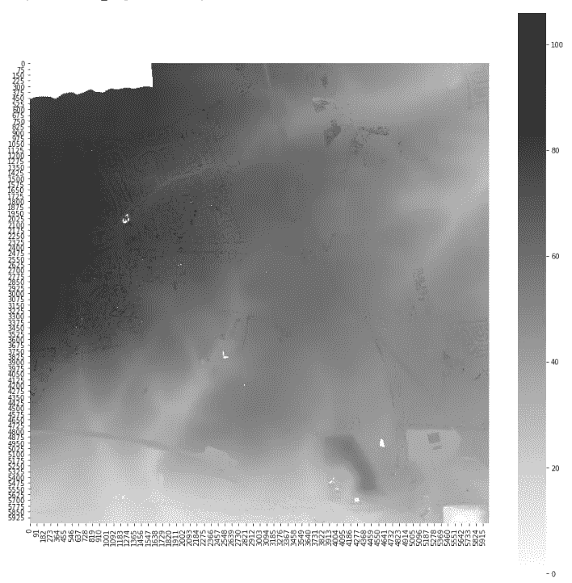
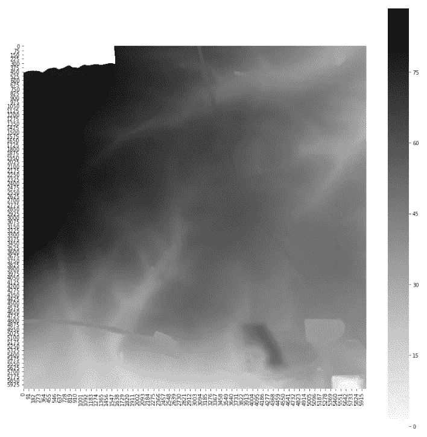
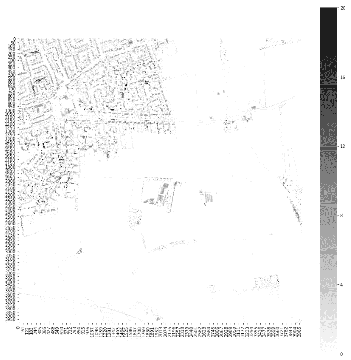
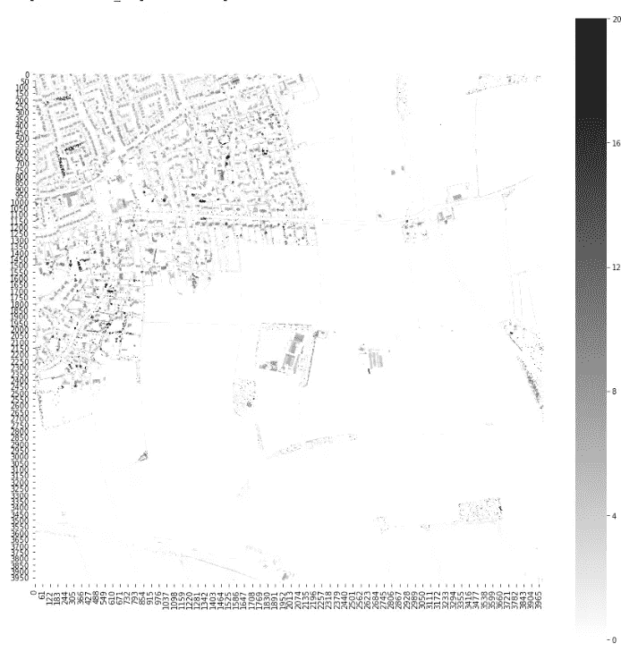
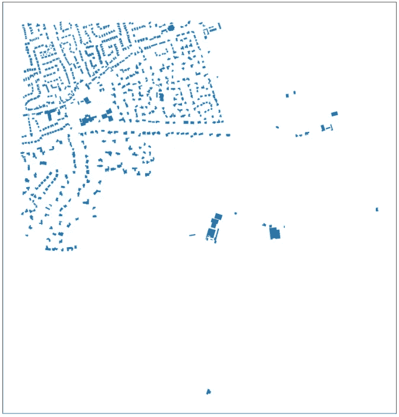
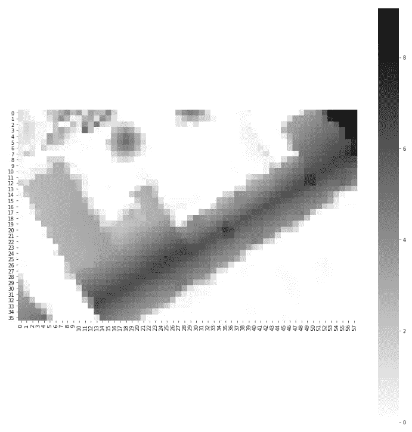

# 地理空间冒险。第五步。离开平地或飞越多边形的海洋。

> 原文：<https://towardsdatascience.com/geospatial-adventures-step-5-leaving-the-flatlands-or-flying-over-the-sea-of-polygons-846e45c7487e?source=collection_archive---------57----------------------->


使用 KeplerGL 生成

## 使用激光雷达数据(栅格文件)估计 OSM 多边形对象的高度。

顾名思义，是时候让我们做一些真正酷的事情，用“激光”去飞翔了。字面上。我们将了解如何解释激光雷达数据并将其连接到我们的多边形。

在[第 4 步](https://medium.com/@datingpolygons/geospatial-adventures-step-4-the-colour-of-magic-or-if-i-dont-see-it-it-doesn-t-exist-56cf7fb33ba9)中，我们集中精力以各种方式绘制约克郡 East Riding 的特定瓷砖。我们将继续使用同一个 bd_tile 数据集，它是约克郡某个特定位置的建筑物集合(具体来说，是一个 2 公里长的正方形，左上角位于 N:426360，E:499323)。如果您计划遵循本文的步骤，我建议您查看以前的帖子(参见本文末尾的完整链接列表)来重新创建相同的数据集。

我们在这里要尝试和解决的问题是:**在公开的街道地图上确定建筑物的高度**。

事实上，它不一定是建筑物——它可以是任何我们知道位置和形状的物体。

所以事不宜迟:

## **激光雷达**

首先，我们必须找到数据，因此我们将向环境署寻求帮助。他们进行定期调查，在夜间飞越英国的特定地区，并向地面发射激光。测量返回的光束，结合平面的位置，我们可以计算出光束反射的物体的高度。数据然后被分成数字表面模型 DSM(包括一切)和数字地形模型 DSM(去除地面物体)。这些以光栅文件的形式出现。asc ),分辨率为 0.25 米、0.5 米、1 米、2 米。

并不是所有的英国都在所有的分辨率下可用，存在差距，并且数据是在不同的时间点获取的，它不是每年都更新，所以当然存在(在某些情况下是显著的)缺点。尽管如此，这可能是我们目前能做的最好的事情了，此外，建筑物往往会在一段时间内保持不变，因此对于它们中的大多数来说，2-3 年的旧数据不是问题。
数据可以在这里找到[。我们现在正在寻找两块瓷砖:SE92NE 和 TA02NW。原来我们到目前为止处理的区域正好位于多个瓷砖之间，这虽然有点烦人，但为我们提供了一个方便的机会来完成将这些瓷砖拼接在一起的过程。](https://environment.data.gov.uk/DefraDataDownload/?Mode=survey)

我们的目标是合成 DTM 和合成 DSM 数据集，在这些数据集内，我们将达到 50 厘米的分辨率。每个 asc 文件的前六行包含有关其位置和分辨率的信息。随后是一个 2000 乘 2000 的数字方阵，每个数字代表一个 0.5 米乘 0.5 米的像素，并给出它的高度。对于相同的像素，DSM 和 DTM 数之间的差异给出了相应物体距地平面的高度，单位为米。

## 准备数据

该切换到 jupyter 了，让我们先加载库。除了 geopandas 和 numpy，我们还需要编解码器来读取我们的 asc 文件和 matplotlib/seaborn 以进行一些可视化。

```
import geopandas as gpd
import numpy as np
import codecsimport matplotlib.pyplot as plt
import seaborn as sns%matplotlib inline
```

接下来会有一大段代码，做好准备。加载相关的图块，进行一些滤光，然后将它们组合在一起

```
with codecs.open('LIDAR-DSM-50CM-SE92ne/se9926_DSM_50CM.asc', encoding='utf-8-sig') as f:
    X00 = np.loadtxt(f, skiprows=6)X00[X00 < 0] = 0with codecs.open('LIDAR-DSM-50CM-SE92ne/se9927_DSM_50CM.asc', encoding='utf-8-sig') as f:
    X01 = np.loadtxt(f, skiprows=6)X01[X01 < 0] = 0with codecs.open('LIDAR-DSM-50CM-SE92ne/se9928_DSM_50CM.asc', encoding='utf-8-sig') as f:
    X02 = np.loadtxt(f, skiprows=6)X02[X02 < 0] = 0X_ = np.vstack([X02, X01, X00])with codecs.open('LIDAR-DSM-50CM-TA02nw/ta0026_DSM_50CM.asc', encoding='utf-8-sig') as f:
    X10 = np.loadtxt(f, skiprows=6)X10[X10 < 0] = 0with codecs.open('LIDAR-DSM-50CM-TA02nw/ta0027_DSM_50CM.asc', encoding='utf-8-sig') as f:
    X11 = np.loadtxt(f, skiprows=6)X11[X11 < 0] = 0with codecs.open('LIDAR-DSM-50CM-TA02nw/ta0028_DSM_50CM.asc', encoding='utf-8-sig') as f:
    X12 = np.loadtxt(f, skiprows=6)X12[X12 < 0] = 0X_1 = np.vstack([X12, X11, X10])with codecs.open('LIDAR-DSM-50CM-TA02nw/ta0126_DSM_50CM.asc', encoding='utf-8-sig') as f:
    X20 = np.loadtxt(f, skiprows=6)X20[X20 < 0] =0with codecs.open('LIDAR-DSM-50CM-TA02nw/ta0127_DSM_50CM.asc',  encoding='utf-8-sig') as f:
    X21 = np.loadtxt(f, skiprows=6)X21[X21 < 0] = 0with codecs.open('LIDAR-DSM-50CM-TA02nw/ta0128_DSM_50CM.asc', encoding='utf-8-sig') as f:
    X22 = np.loadtxt(f, skiprows=6)X22[X22 < 0] = 0X_2 = np.vstack([X22, X21, X20])X = np.hstack([X_, X_1, X_2])
```

好了，这里实际发生了什么:我们正在读取每个文件，跳过前 6 行，因为它们包含描述性信息。您可以在文本编辑器中打开它们进行查看(或者使用 print 在笔记本中显示它们)。我们现在正在追求 2000 乘 2000 矩阵。我们用零代替所有的负值。这是因为数据中的缺口是用-9999 值填充的，我们肯定要忽略这些。然后，我们垂直堆叠得到的矩阵，得到 2 公里乘 6 公里的区域，最后水平堆叠这些矩阵，得到一个 6 公里乘 6 公里的区块。

让我们来看看:

```
dim = (15, 15)
fig, ax = plt.subplots(figsize=dim)
sns.heatmap(X, cmap="binary", square=True, ax=ax)
```



还不是很鼓舞人心。请注意左上角的大块缺失数据。恐怕对此无能为力。我们还需要加载 DTM 文件(可以在上面的代码块中用 DTM 替换 DSM)。我将结果保存为 X_t。

让我们直接看结果:



看起来更糟，不是吗？让我们来看一下不同之处，将地图的高度比例限制为 20 米，以使所有内容更加突出:

```
Xdiff = X-X_t
Xdiff[Xdiff < 0] = 0
dim = (15, 15)
fig, ax = plt.subplots(figsize=dim)
sns.heatmap(Xdiff, vmax=20, cmap="binary", square=True, ax=ax)
```



啊哈！我们有所进展，这实际上开始看起来像一张地图。现在，这个地图左下角的坐标由我们加载的第一个图块给出— N:426000，E:499000。我们需要在左下角的 N:426360，E:499323 处切出一个 2 公里乘 2 公里的正方形。请记住，我们矩阵的元素是从左上角开始索引的，而不是从底部，所以我们需要进一步调整，然后还要记住，我们矩阵中的每个点都是 0.5 米宽，所以我们需要将索引乘以 2，使它们等于北距/东距(因此，我们需要移动 720 和 646，而不是 360 和 323，2 公里的瓷砖边变成 4000 像素)

```
Xtile = Xdiff[6000-4720: 6000-720, 646: 4646]
```

画出它，我们会得到与原始瓷砖非常相似的东西:



和...相对

```
fig, ax = plt.subplots(1, figsize=(15, 15))
ax.axes.get_xaxis().set_visible(True)
ax.axes.get_yaxis().set_visible(True)
ax.grid()
bd_tile.plot(ax=ax)
```



## 匹配多边形

下一步是匹配两组值，点和面。我们将要采取的方式与[步骤 3](https://medium.com/@datingpolygons/geospatial-adventures-step-3-polygons-grow-on-r-trees-2f15e2712537) 中详细描述的非常相似。我们取每个多边形，用 0.5 米的步长创建一个包围盒的网格。然后，我们可以遍历网格单元，检查它们中的哪些与我们的多边形相交。它们的坐标将与我们的高度矩阵的元素直接关联，因此我们可以简单地选择相关的元素，并获得我们的建筑物的高度轮廓。听起来合理吗？让我们试一试。

加载 shapely Polygon 和 GeometryCollection，我将使用数据集中的第一个多边形:

```
from shapely.geometry import Polygon, GeometryCollection
bounds = bd_tile['geometry'].iloc[0].bounds
```

创建网格并将每个元素转换为多边形:

```
X, Y = np.mgrid[int(bounds[0]): int(bounds[2]) + 1: 0.5,
                int(bounds[1]): int(bounds[3]) + 1: 0.5]
grid = list(
            map(
                list,
                list(
                    zip(
                        list(
                            zip(X.flatten(), Y.flatten())
                        ),
                        list(
                            zip(X.flatten(), Y.flatten() + 0.5)
                        ),
                        list(
                            zip(X.flatten() + 0.5, Y.flatten() + 0.5)),
                        list(
                            zip(X.flatten() + 0.5, Y.flatten())
                        )
                    )
                )
            )
        )
grid_poly = [Polygon(a) for a in grid] 
```

这与我们在步骤 3 中使用的方法完全相同，只是现在我们使用 0.5 米的步长，而不是 2000 米。

让我们看看我们对多边形的近似程度:

```
poly = [
    a for a in grid_poly if a.intersects(
        bd_tile['geometry'].iloc[0]
    )
]
g = GeometryCollection(poly + [bd_tile['geometry'].iloc[0]])
g
```


这是非常整洁的。

现在我们需要从我们的矩阵中得到相应的点。

让我们抓住坐标并把它们转换成矩阵指数。

```
poly_coords = np.array([np.array(a.exterior)[0] for a in poly])
```

这给了我们每个左下角的坐标对。现在把它们分成 x 数组和 y 数组:

```
inds_array = np.moveaxis(poly_coords, -1, 0)
```

调整以使它们与我们的矩阵坐标一致:

```
inds_array[0]=(inds_array[0] - 499323) * 2
inds_array[1]=(2000 - inds_array[1] + 426360) * 2
```

最后，使用花式索引(老实说，这是一个技术术语):

```
heights = Xtile[
    inds_array[1].astype(int),
    inds_array[0].astype(int)
]
```

让我们检查一下我们所选择的实际上看起来像我们的原始多边形:

```
dim=(15,15)
fig, ax = plt.subplots(figsize=dim)
sns.heatmap(
    Xtile[
        np.min(inds_array[1].astype(int)): np.max(inds_array[1].astype(int)),
        np.min(inds_array[0].astype(int)): np.max(inds_array[0].astype(int))
    ], 
    cmap="binary",
    square=True,
    ax=ax
)
```



嘣！我会说——完全正确。

现在，理论上，我们得到了一个很好的唯一的数字来显示我们建筑的高度。当然，在现实中，这是极不可能发生的。你可以从上面的图片中看到，我们得到了相当多的分布——倾斜的屋顶，多个建筑块，烟囱，等等。等等。一个不错的猜测是，使用这样的中值，在这个特定的例子中，我们得到了不到 3.6 米。更好的是，我们可以丢弃选择中的零值，这将使我们的中值不到 4 米。对于某些应用程序，您可能想要最大高度，尽管在这种情况下，我们得到 9 米，这很可能是由附近的树驱动的。要做出更明智的选择，您可以查看总体分布并选择特定的百分位数，或者创建与不同身高值对应的总面积相关的条件。另一种选择是排除边界网格销售(通过迭代相关网格销售并检查哪些销售与边界相交来识别它们)。外景法)。

我们可以使高度更谨慎一点，例如将它们四舍五入到最接近的半米，并获得计数，以给我们一个稍微好一点的画面:

```
h, c = np.unique(np.round((heights * 2), 0)/2, return_counts=True)
dict(zip(h, c))
```

生产

```
{0.0: 184,
 0.5: 30,
 1.0: 19,
 1.5: 22,
 2.0: 16,
 2.5: 70,
 3.0: 118,
 3.5: 43,
 4.0: 56,
 4.5: 79,
 5.0: 98,
 5.5: 92,
 6.0: 89,
 6.5: 38,
 7.0: 7,
 7.5: 2,
 8.0: 2,
 8.5: 1,
 9.0: 1}
```

现在剩下的就是选择你的规则，把我们的步骤包装成一个函数，然后把它应用到数据集中的每个多边形。我要把它留给你去玩，否则我会得到所有的乐趣，那只是贪婪。

本系列到此结束，希望你喜欢它，或者至少发现它在某些方面是有用的。当然，这还不是全部。例如，我们可以看看当没有 OSM 作为后盾时，如何将栅格数据转换为实际的建筑物多边形(他们缺少许多建筑物，因此这不仅仅是一个理论练习)。这是一个很好解决的问题，我可能会回来。但是还有很多很多地理空间(不仅仅是地理空间)项目值得探索，所以请继续关注。

再见，

鐽

## 本系列的前几篇文章

[*地理空间历险记。第一步:匀称。*](https://medium.com/@datingpolygons/geospatial-adventures-step-1-shapely-e911e4f86361)

[*地理空间历险记。第二步:熊猫大战地球熊猫*](https://medium.com/@datingpolygons/geospatial-adventures-step-2-pandas-vs-geopandas-16e842d0e3a7)

[*地理空间历险记。第三步。多边形在 R 树上生长*](https://medium.com/analytics-vidhya/geospatial-adventures-step-3-polygons-grow-on-r-trees-2f15e2712537)

[*地理空间冒险。第四步。魔法的颜色或者如果我没有看到它——它就不存在*](https://medium.com/@datingpolygons/geospatial-adventures-step-4-the-colour-of-magic-or-if-i-dont-see-it-it-doesn-t-exist-56cf7fb33ba9)

[*地理空间冒险。第五步。离开平地或飞越多边形的海洋*](https://medium.com/@datingpolygons/geospatial-adventures-step-5-leaving-the-flatlands-or-flying-over-the-sea-of-polygons-846e45c7487e)