# Python 和 Jupyter 笔记本中的地理空间分析

> 原文：<https://towardsdatascience.com/geospatial-analysis-in-python-and-jupyter-notebooks-f90de25b0777?source=collection_archive---------9----------------------->

## 使用 geopandas 和 kepler.gl 对巴塞罗那自行车租赁服务(bicing)进行地理空间分析。

世界上大多数国家的首都都在使用公共城市自行车服务，这减少了燃料消耗、排放和市中心的[拥堵。自行车共享还鼓励体育活动，有助于城市居民的健康。](https://blog.mobility.here.com/congestion-charge-impact)


照片由 [Jasser Gómez](https://unsplash.com/@jass89?utm_source=medium&utm_medium=referral) 在 [Unsplash](https://unsplash.com?utm_source=medium&utm_medium=referral) 拍摄

# 数据摄取

幸运的是，它有一个开放的 [CityBikes API](http://api.citybik.es/v2/) ，可以用来实时检查自行车站点的状态(例如，我们可以检查任何站点的空闲位置的数量)。此外，还有一个用于查询 CityBikes API 的 python 包`[python-citybikes](https://github.com/eskerda/python-citybikes)`。

巴塞罗那是使用 CytyBikes API 公开数据的城市之一。使用上面提到的包，巴塞罗那的自行车服务(又名 [bicing](https://www.bicing.barcelona/) )可以使用以下代码进行查询:

```
client = citybikes.Client()
bicing = citybikes.Network(client, uid='bicing')
bicing.stations
```

前一个调用以 JSON 格式返回工作站的数据:

```
{
    "company": ["Barcelona de Serveis Municipals, S.A. (BSM)", "CESPA", "PBSC"],
    "href": "/v2/networks/bicing",
    "id": "bicing",
    "location": {
        "city": "Barcelona",
        "country": "ES",
        "latitude": 41.3850639,
        "longitude": 2.1734035
    },
    "name": "Bicing",
    "stations": [
        {
            "empty_slots": 17,
            "extra": {
                "ebikes": 0,
                "has_ebikes": true,
                "normal_bikes": 16,
                "online": true,
                "uid": 361
            },
            "free_bikes": 16,
            "id": "ed25291d0f5edd91615d154f243f82f9",
            "latitude": 41.376433,
            "longitude": 2.17871,
            "name": "PG. DE COLOM (LES RAMBLES)",
            "timestamp": "2020-10-16T18:19:06.097000Z"
        },
        ...
    ]
}
```

处理完数据后，我们将数据从 JSON 模式转换成表格模式:

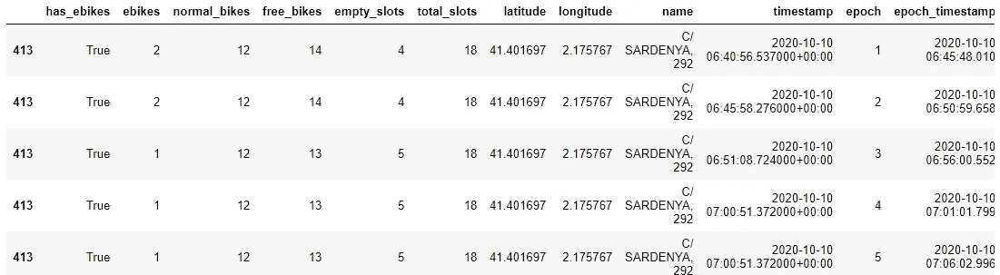

自行车站数据框

该 API 不提供历史服务，但是您可以开发自己的脚本来每 5 分钟下载一次数据(Bicing refresh rate)。配套的[笔记本](https://github.com/franperezlopez/spatial/blob/master/bicing%20medium.ipynb)显示如何下载和处理数据；在`data/bicing_saturday_morning.parquet`中，处理后的数据样本也作为拼花文件提供。

# 巴塞罗那——自行车站

第一个空间操作将是使用从 CityBikes API 下载数据时可用的经度和纬度信息在地图上绘制车站:

```
df_stations = df[["name","latitude","longitude"]].drop_duplicates()
```

第一张地图会将所有这些站放在地图上:

```
stations_map = KeplerGl(height=600, data={"stations": df_stations})
stations_map
```

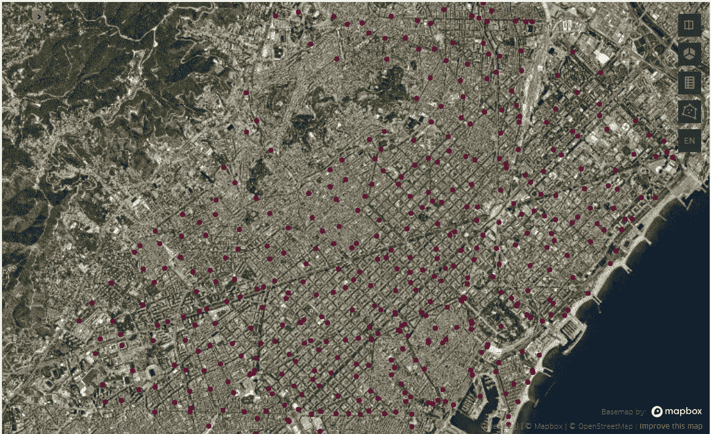

巴塞罗那自行车站

`kepler.gl`很聪明地推断出列`latitude`和`longitude`代表了车站的地理坐标。该地图可以显示在 Jupyter 笔记本中，并且可以使用 UI 配置该地图，以在不同的地图样式(平面或卫星)和图层(道路、建筑物等)之间切换。这些 UI *调整*可以*导出*为 python 字典，然后在下次加载地图时使用。查看 [kepler.gl 文档](https://docs.kepler.gl/docs/keplergl-jupyter)了解更多关于定制地图的信息。

# 细川玉子区—自行车站

CityBikes API 不提供按地区划分的车站信息(只有车站的名称，也就是车站的地址)。但是不用担心，我们仍然可以使用社区提供的公开数据。在这种情况下，我们将使用[巴塞罗那开放地理数据](https://github.com/martgnz/bcn-geodata)存储库，以及那里提供的地区地理位置。

Geopandas 可以阅读。geojson 文件使用:

```
df_districts = geopandas.read_file("data/districtes.geojson")
```

对象`df_districts`类似于一个常规的 Pandas dataframe，但是包含一个名为`geometry`的列。Geopandas 数据帧可以根据需要包含任意多的*地理*列，但是我强烈建议每个数据帧只使用一个，并将其命名为`geometry`。在这种情况下，文件包含 10 个地区(行)和 47 列(带有地区名称、网站、区域等信息)。

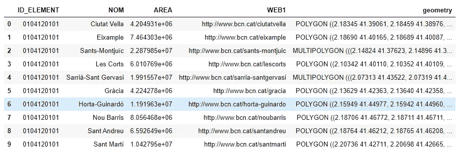

巴塞罗那地区数据框架

geopandas 数据帧可以按原样绘制:

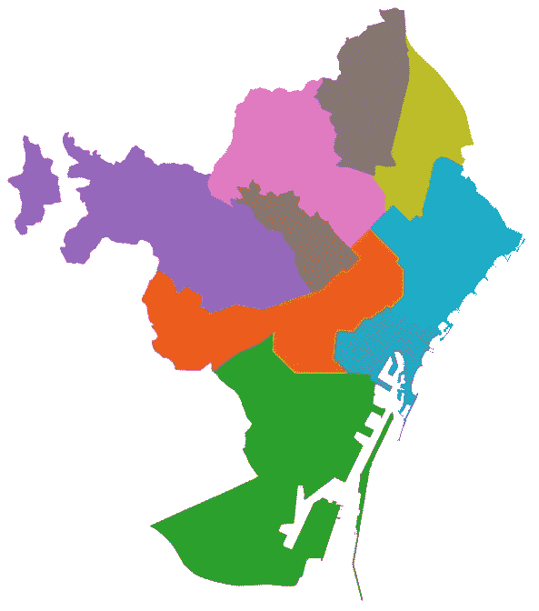

巴塞罗那区

或者，我们可以在另一个地图实例中沿着自行车站投影该地区的边界:

```
district_map = KeplerGl(height=600, data={"stations": df_stations,                                          "districts": df_districts})
```

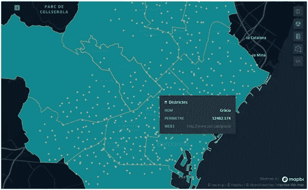

巴塞罗那自行车站和区

在上图中，我们可以直观地查看哪些车站位于细川玉子区，但是有没有办法以表格的方式提取这些信息呢？是的，您可以:欢迎使用空间连接。

首先，我们需要将包含站点位置的数据帧转换为 Geopandas 数据帧:

```
df_stations = geopandas.GeoDataFrame(df_stations.name, geometry=geopandas.points_from_xy(df_stations.longitude, df_stations.latitude, crs='epsg:4326'))
```

在上面的代码片段中，您可以观察到一个名为`crs`的参数。总结一下:经纬度数字是有规律的数字，但是当你对它们应用一个[坐标参考系](https://en.wikipedia.org/wiki/Spatial_reference_system) ( **CRS** )的时候，这些数字就可以投影到一张地图上。参考系比较多，课题比较复杂，我就把我的研究缩减到只有两个 *CRS* 的(请 *GIS 专家*原谅我的无礼):

*   通用 *WGS 86 (EPSG: 4326)* 以经度/纬度表示世界上的位置
*   墨卡托 *(EPSG: 3395)* 当与距离一起工作时

当我们使用两个*坐标系*来投影世界地图时，可以理解两个坐标系之间的差异:

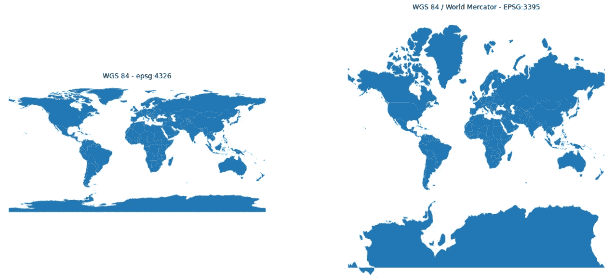

使用 WGS86 和墨卡托投影的世界地图

如果您需要有关投影和使用不同参考系统的更多信息，我建议查看[管理投影 GeoPandas 文档](https://geopandas.org/projections.html)。

[空间连接](https://geopandas.org/mergingdata.html#spatial-joins)将返回包含在每个区内的点(=自行车站):

```
df_stations_districte = geopandas.sjoin(df_stations,  df_districts[["NOM","geometry"]], how="inner", op='intersects')
```

从那里，过滤掉细川玉子区的电台就这么简单:

```
df_stations_district_gracia = df_stations_district[df_stations_district.NOM=='Gràcia']
```

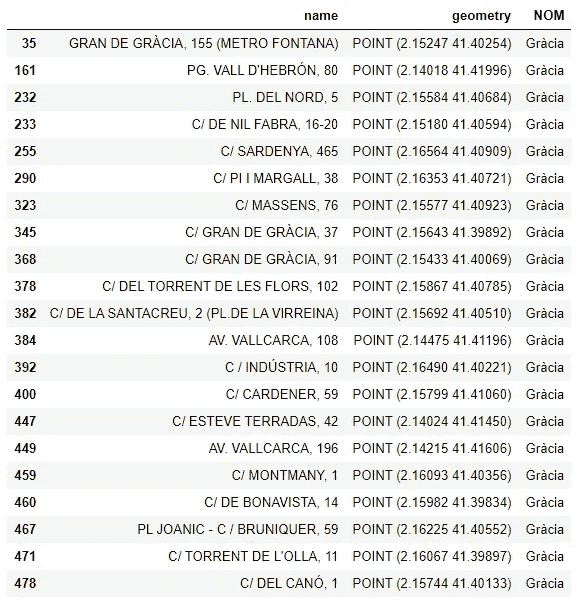

格拉西亚区的自行车站

# 细川玉子区——自行车站“影响区”

影响区域可以显示为以每个站为中心的圆。圆的半径可以是用户定义的参数(例如，300 米)。正如我们之前提到的，为了处理距离，我们需要*暂时*将参考系统切换到墨卡托:

```
def buffer_in_mercator(geometry, distance_x_meters):
    crs = geometry.crs
    return geometry.to_crs(epsg=3395).buffer(distance_x_meters).to_crs(crs)
```

将函数应用于站点的位置后，我们可以绘制每个自行车站点周围的影响区域:

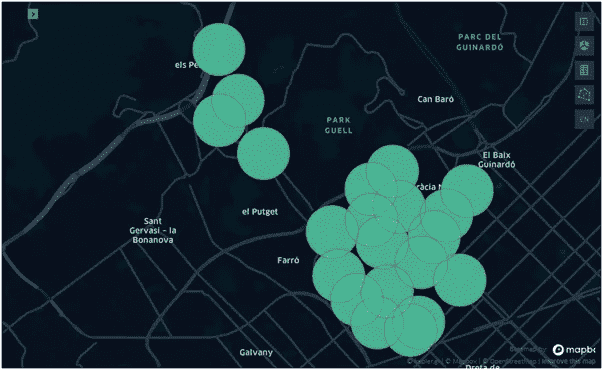

自行车站影响区域

# 细川玉子区——骑自行车的最佳区域

在这种情况下，所采用的方法是，地图中的每个区域都可能受到许多站点的影响，因此该区域中可用的自行车数量将是与该区域*接触的*影响区域中可用自行车数量的总和。

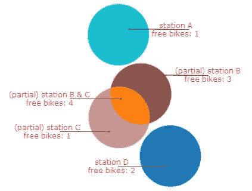

自行车站点区域和统计数据

我们需要计算所有影响区域之间所有交集的并集。这个操作可以使用库`shapely`来解决(感谢 [stackoverflow](https://gis.stackexchange.com/a/246184) ):

```
shapes = areas.to_list()
areas_overlay = list(polygonize(unary_union(list(x.exterior for x in shapes))))
```

该操作为每个叠加交点创建一个形状(区域)，因此总共生成 68 个形状。如前所述，我们可以绘制图形来更好地理解操作本身:


自行车站区

免费自行车的数量可通过在区域和车站影响区域之间执行空间连接，并将同一区域中的所有行相加来获得:

```
df_gracia_area_stats = gpd.sjoin(df_areas_overlay, 
                                 df_gracia_stats.reset_index(), 
                                 how="left", op='intersects')\
                                .reset_index()\
                                .rename(columns={'index':'index_left'})
df_gracia_area_stats['free_bikes_area'] = df_gracia_area_stats.groupby("index_left")['free_bikes'].transform(sum)
```

同样，实例`df_gracia_area_stats`是一个 geopandas 数据帧，可以投影到地图上，直观地检查 Gràcia 区的自行车可用性:

```
free_bikes_map = KeplerGl(height=600, data={"areas": df_gracia_free_bikes})
```

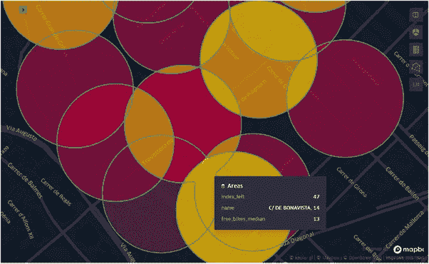

格拉西亚区

与之前相同，可以用表格的方式提取最佳区域:

```
df_gracia_free_bikes.loc[df_gracia_free_bikes.free_bikes_median.idxmax()]
```

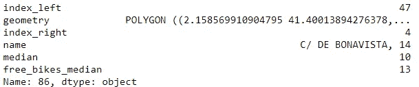

总之，`geopandas`和`kepler.gl`是您数据分析工具箱的强大补充。`geopandas`基于 Pandas dataframe API，而`kepler.gl`在其核心支持 Pandas dataframe，因此这两个库的学习曲线都很快，同时好处也很大。

这篇文章的完整代码可以在这里找到——[https://github.com/franperezlopez/blog_spatial](https://github.com/franperezlopez/blog_spatial)

## 安装`kepler.gl`

安装这个库有点棘手，这方面缺少文档，所以我会尽量简化这一步。首先，这个库似乎不能在 Windows 中工作，所以你需要使用 MacOS、Linux 或 WSL(2)。

其次，这个库需要安装一个 Jupyter 扩展。按照我自己关于如何[安装 Jupyter Notebook](/4-techniques-to-enhance-your-research-in-machine-learning-projects-c691892ab9dd) 的建议，您应该在您的 *base* 环境中安装这个扩展，执行以下命令:

```
conda activate base
pip install --user --use-feature=2020-resolver keplergljupyter nbextension install --system --py keplergl
jupyter nbextension enable --system --py keplergl
```

## 参考

[1] [智能城市自行车服务:经济、环境&社会影响](https://mobility.here.com/learn/smart-city-mobility/smart-city-bike-services-economic-environmental-and-societal-impacts)