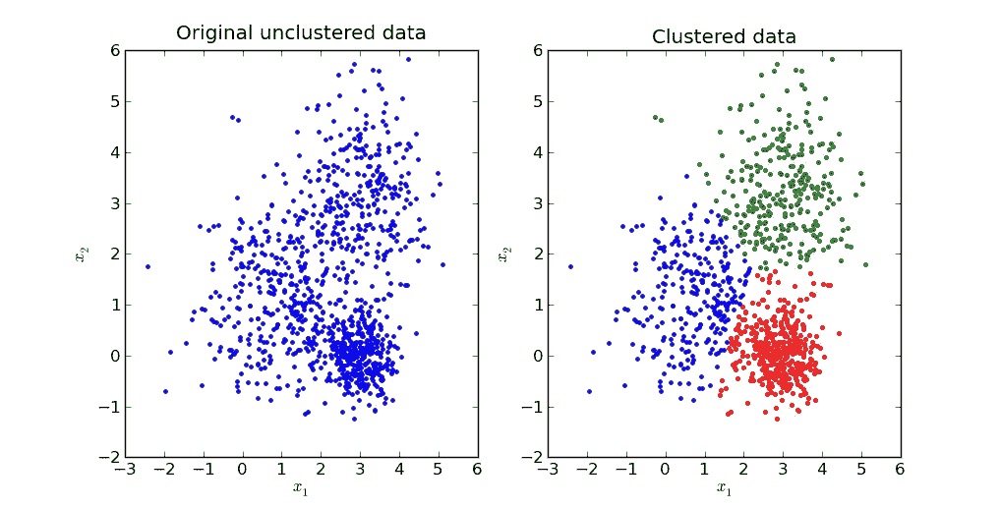
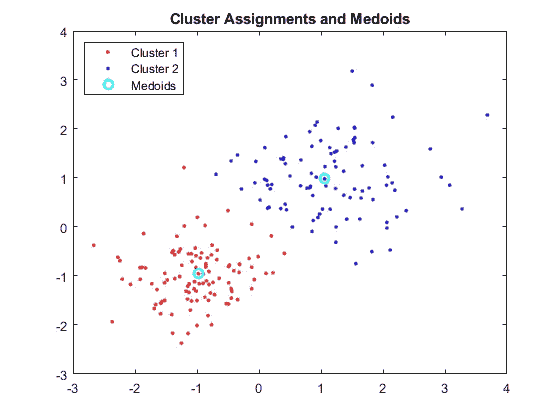
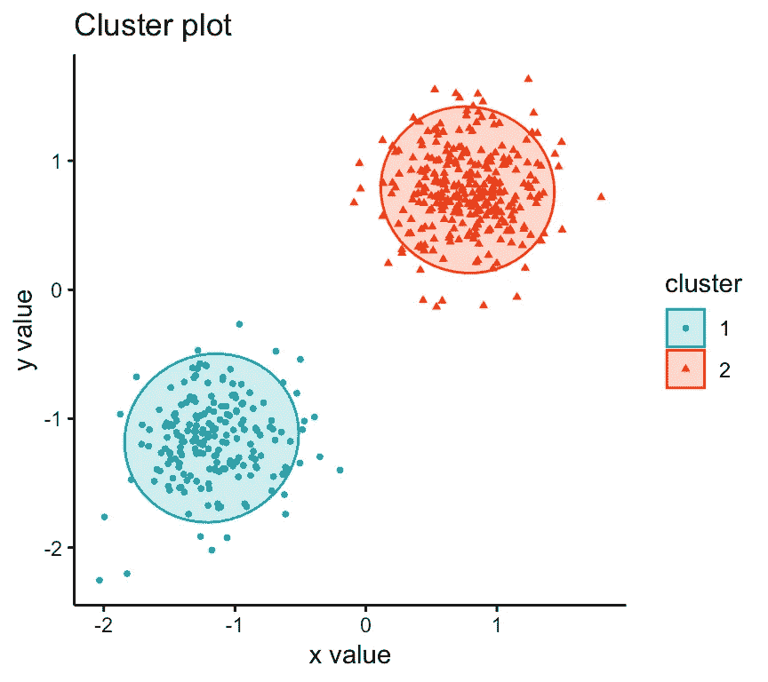
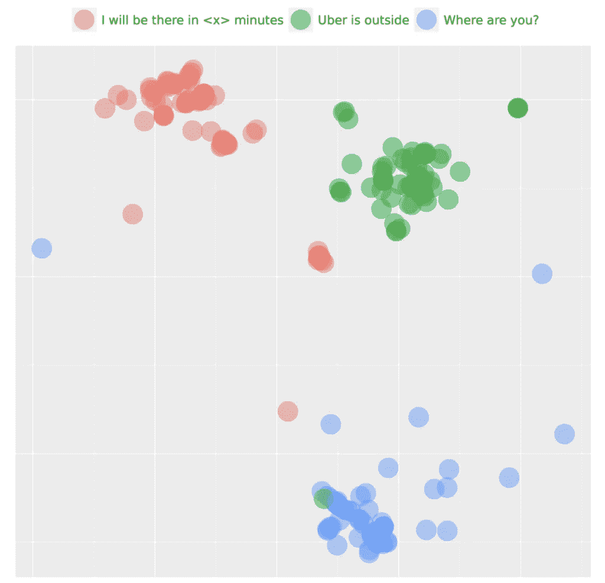
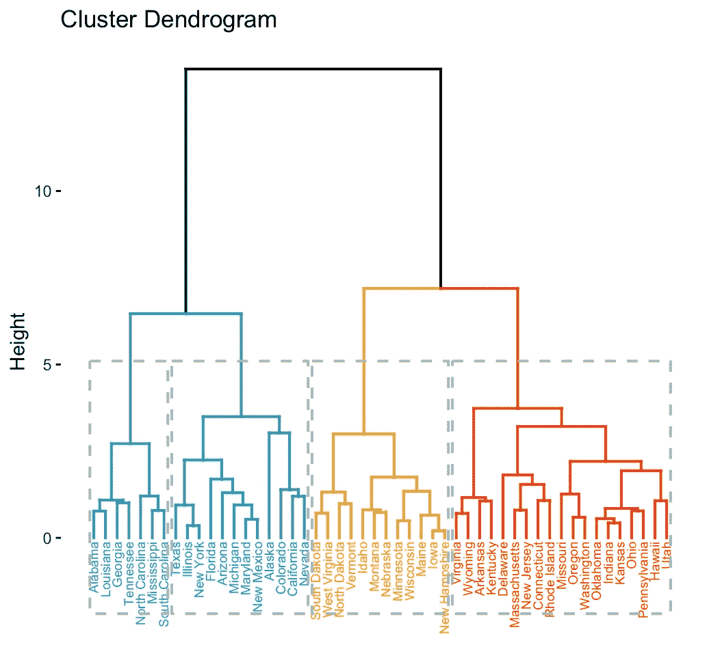
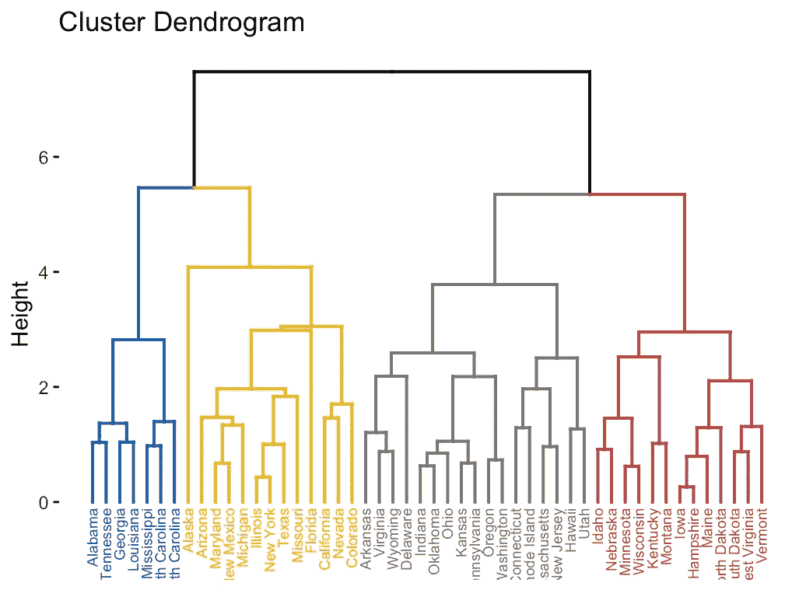
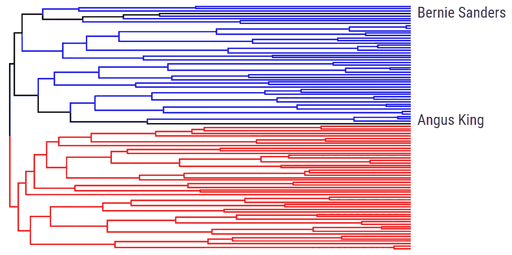
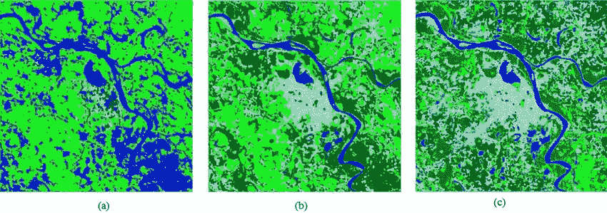
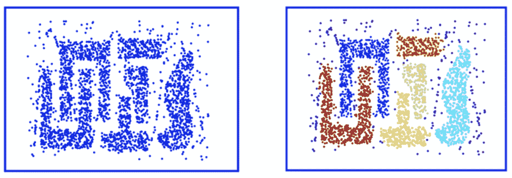

# 地理空间聚类:种类和用途

> 原文：<https://towardsdatascience.com/geospatial-clustering-kinds-and-uses-9aef7601f386?source=collection_archive---------8----------------------->

## 对所有不同种类的集群及其用例的详细回顾

丹尼斯·库默在 [Unsplash](https://unsplash.com/?utm_source=medium&utm_medium=referral) 上拍摄的照片

# 地理空间聚类

地理空间聚类是将一组空间对象分组为称为“簇”的组的方法。一个聚类中的对象表现出高度的相似性，而这些聚类尽可能地不相似。聚类的目标是进行概化并揭示空间和非空间属性之间的关系。

让我们用一个小例子来理解空间聚类。

*假设你是一家大都市食品配送连锁店的负责人，你想了解顾客的偏好，以便扩大业务规模。因为查看每个客户的详细信息是不可行的，所以你将他们分成不同的组，并为每个组/群制定商业计划。*

空间聚类可分为以下五大类型:

1.划分聚类

2.分层聚类

3.模糊聚类

4.基于密度的聚类

5.基于模型的聚类

通过 [Locale](https://www.locale.ai/) ，我们致力于让每个在地面上移动资产的企业都可以访问位置数据。让我们深入研究集群的类型，并详细了解每一种类型！

# 划分聚类

分区聚类是将数据点分离成不重叠的子集(聚类),使得每个数据点恰好在一个子集中。基本上，它通过满足这两个要求 ***:*** 将数据分类到 ***组***

1.每个数据点仅属于一个聚类。

2.每个聚类至少有一个数据点。

划分聚类有三种类型:K-means 聚类、K-medoids 聚类/PAM 和 CLARA(分类大型应用)

# 1.k 均值聚类

K-means 聚类是一种分区方法，这种方法根据属性将数据集分解成一组 K-分区。你可以在这里阅读更多关于 k 的意思[。](/understanding-k-means-clustering-in-machine-learning-6a6e67336aa1)

[来源](/k-means-data-clustering-bce3335d2203)

# 2.K-medoids 聚类/PAM

K-medoids 聚类是一种类似 K-means 聚类的划分方法*。*med oid 是聚类中与该聚类中所有其他点具有最小相异度的点。查看[这个](https://www.cs.umb.edu/cs738/pam1.pdf)来了解更多关于帕姆的信息。

[来源](https://www.mathworks.com/help/stats/kmedoids.html)

# 3.克拉拉

这是 PAM 方法对大型数据集的扩展。CLARA 不是为整个数据集寻找几何图形，而是考虑一个固定大小的小样本数据，并应用该算法为该样本生成一组最佳几何图形。

[来源](https://www.datanovia.com/en/lessons/clara-in-r-clustering-large-applications/)

# 使用案例:

通常，基于分区的聚类用于查找数据中没有明确标记的组。这有助于将任何新数据点分配到正确的聚类。企业使用基于分区的聚类来划分购买历史、按销售活动分组库存、在健康监控中识别组等。

优步使用聚类进行意图检测，他们将其用于一键式聊天/建议回复系统[【来源】](https://syncedreview.com/2019/07/08/how-uber-lyft-use-ai-to-improve-ride-experience/)

# 分层聚类

分层聚类是一种类似于基于分区的聚类的聚类方法，但它对数据点进行分类的方式不同。它首先将每个数据点视为一个单独的聚类。然后合并彼此最接近的相似聚类。它不断迭代，直到所有的集群被合并。

两种类型的层次聚类如下:聚集和分裂

# 凝聚层次聚类

这与计算点/簇的邻近矩阵的简单算法一起工作。在每次迭代中，它合并最近的点/簇，并更新邻近矩阵。这一直持续到形成一个簇或 k 个簇。这可以被认为是一种*“自下而上”*的方法。

[来源](https://www.datanovia.com/en/lessons/agglomerative-hierarchical-clustering/)

# 分裂层次聚类

这与聚集聚类正好相反。在该方法中，最初，所有数据点被认为属于单个聚类。在每次迭代中，将不相似的数据点从聚类中分离出来。每个分离的数据点被认为是一个单独的聚类。这个过程一直持续到我们有了 *K-clusters。*这可以被认为是一种*【自上而下】*的方法*。*

[来源](https://www.datanovia.com/en/lessons/divisive-hierarchical-clustering/)

# 使用案例:

虽然分层聚类在计算上可能是昂贵的，但是产生直观的结果。由于层次聚类不需要太多的假设，所以当手头的数据不太为人所知时，这是很有用的。分层聚类广泛应用的一个现实场景是在流行病传播期间绘制病毒图，以及在银行业或零售业中进行客户细分。

使用层次聚类将美国参议员分组到他们各自的党派中。红色代表共和党，蓝色代表民主党，黑色代表独立[【来源】](/hierarchical-clustering-and-its-applications-41c1ad4441a6)

# 模糊聚类

在模糊 c 均值聚类中，我们找出数据点的质心，然后计算每个数据点到给定质心的距离，直到形成的聚类变得恒定。它不同于基于分区的聚类，它允许将数据点部分分类到多个聚类中。

卫星图像的模糊聚类[ [来源](https://www.researchgate.net/figure/Results-of-multi-spectral-satellite-images-clustering-FCM-a-FCoC-b-IVFCoC-c_fig5_303600590)

理论上，每个数据点可以属于隶属函数范围在 0 和 1 之间的所有组。 ***0*** 是数据点距离聚类中心可能最远的点， ***1*** 是数据点距离聚类中心最近的点**。**

# 使用案例:

当您需要进行图像分割或者您的目标是分割卫星图像中的水域、植被和岩石区时，模糊聚类非常有用。这在不能先验地确定聚类数的情况下是有用的。在这种情况下，可以合并具有弱边界的聚类。与 K-means 相比，模糊聚类在计算上是昂贵的，因为对于每个点，is 计算它属于每个聚类的概率。

# 基于密度的聚类

基于密度的聚类通过将高密度的*区域分组并将它们与低密度*的*区域分开来工作。最著名的基于密度的聚类算法是 DBSCAN 算法(应用噪声的基于密度的空间聚类)。*

使用以下两个参数计算密度

1. **EPS:** 这定义了数据点周围的邻域，即如果两点之间的距离小于或等于 EPS，则称它们为邻居

2. **MinPts** :定义形成一个邻域的数据点的最小数量。数据集的大小和 MinPts 的值成正比。

DBSCAN 算法访问每个点，并且如果它包含 eps 内的 MinPts，则聚类形成开始。任何其他点都被定义为噪声。这一过程一直持续到形成一个密度连通的集群，然后从一个新的点重新开始。

左图:传统聚类；右图:DBSCAN 聚类(DBSCAN 允许点采用任何形状或维度来形成聚类)

# 使用案例:

DBSCAN 主要用于平面空间的聚类。如果将它用于绘制自然灾害的影响图或绘制城市中气象站的位置图，可以获得良好的结果。当数据由非离散点组成时，也可以使用这种方法，这有利于处理异常值。推荐引擎/系统利用 DBSCAN 向他们的客户推荐产品/节目。

# 基于模型的聚类:

这种分类方法使用特定的分类模型，并尝试优化数据和模型之间的匹配。在基于模型的聚类方法中，数据被视为来自概率分布的混合，每个概率分布代表一个不同的聚类。换句话说，在基于模型的聚类中，假设数据是由混合概率分布生成的，其中每个分量代表一个不同的聚类。每个分量(即，集群)由正态分布或高斯分布建模。

期望最大化是一种众所周知的基于模型的聚类算法。当数据符合模型时，特定的聚类算法被认为工作良好。

# 使用案例:

这在聚类具有弱边界并且数据点在聚类之间具有混合成员的情况下非常有用。它在聚类协方差方面也更加灵活。在这种情况下，集群分配更加灵活，集群可以根据分布采用任何形状。