# 用于分析新冠肺炎的地理空间数据和工具

> 原文：<https://towardsdatascience.com/geospatial-data-and-tools-for-analyzing-covid-19-9eaf298512?source=collection_archive---------29----------------------->

## 一个数据，可视化，工具和项目的集合，参与到周围的新冠肺炎

新冠肺炎对世界各地的生活产生了巨大的、改变生活的影响，这一点无需赘述。随着我们周围的世界每天都在变化，人们越来越关注地理。

连线文章*[*在疫情的热潮中，地理强势回归*](https://www.wired.com/story/amid-pandemic-geography-returns-with-a-vengeance/)*强调了我们重新关注我们与地理的关系。**

> **疫情正在重新定义我们与太空的关系。不是外太空，是物理空间。热点、距离、传播、规模、接近度。一句话:地理。突然，我们无法停止思考 ***在哪里*** 。**

**这不仅体现在我们如何思考我们与物理空间的日常关系，也体现在我们与数据和信息的关系。几乎在每一份新闻出版物中，你都可以找到与位置相关的地图和数据，信息每天都会被添加和更新很多次。**

**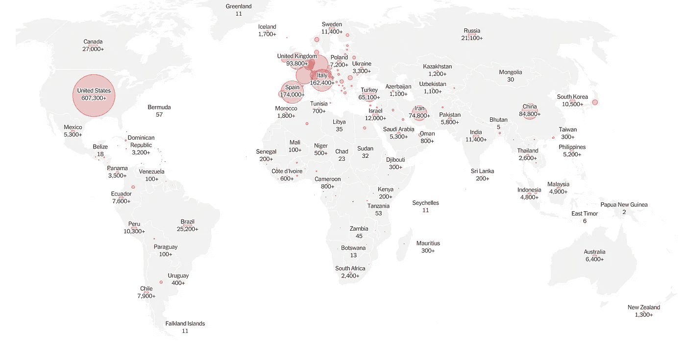**

**来自《纽约时报》的新冠肺炎病例总数(截至 2020 年 4 月 15 日)**

**虽然这种规模的危机在许多方面都是前所未有的，但对于那些处理地理空间数据的人来说，许多人都熟悉[危机测绘](https://en.wikipedia.org/wiki/Crisis_mapping)的概念，即使用地理空间工具、数据和数字的力量来收集数据和信息，供应对危机的人使用。**

**这方面的第一个例子是对 2010 年海地地震的反应。在海地，可靠的地理空间数据(如道路和设施)有限，无法用来告诉当地的人们往哪里走。在地震后的几天里，许多人向 OpenStreetMap 贡献了自己的力量，这是一个类似于维基百科的开放项目，用户可以在地图上添加地理空间数据。**

**反应非常热烈。这些来自[世界银行](https://blogs.worldbank.org/latinamerica/4-years-looking-back-openstreetmap-response-haiti-earthquake)和 OpenStreetMap [博客](https://blog.openstreetmap.org/2010/01/14/haiti-openstreetmap-response/)和[维基](https://wiki.openstreetmap.org/wiki/WikiProject_Haiti/Earthquake_map_resources)的帖子描述了人们的反应，但是这段视频展示了地震后增加的数据量。**

**2010 年 1 月添加到 OpenStreetMap 的数据**

**从那时起，已经发生了许多使用地理空间数据和工具的不同灾难。从洪水、飓风、地震、火灾、流行病、人道主义危机、龙卷风等等，都利用地理空间数据来应对这些灾害。**

**新冠肺炎是一场规模更大的危机，但地理空间社区对这场危机做出了压倒性的回应，提供了数据、工具和参与方式。这篇文章的其余部分将旨在分享其中的一些举措。**

**如果有你知道的不在列表中的资源，请随意添加到回复中！**

*****免责声明*** *:我的专长是地理空间数据和分析，而不是流行病学或空间流行病学。该指南只是地理空间社区提供的资源的集合。***

# **数据**

****约翰·霍普金斯大学系统科学与工程中心(JHU·CSSE)的新冠肺炎数据仓库****

**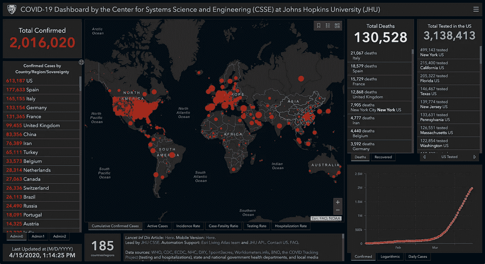**

**JHU·CSSE 仪表板**

**该数据集被全球许多不同的机构和新闻组织使用，是疫情期间最常引用的数据源之一。**

** [## CSSEGISandData/新冠肺炎

### 这是由约翰·霍普金斯大学运营的 2019 年新型冠状病毒视觉仪表板的数据存储库…

github.com](https://github.com/CSSEGISandData/COVID-19) 

*   [网站](https://systems.jhu.edu/research/public-health/ncov/)
*   [仪表板](https://www.arcgis.com/apps/opsdashboard/index.html#/bda7594740fd40299423467b48e9ecf6)

谷歌云也在谷歌云平台上提供了 JHU 的数据集，并且正在与一些组织合作。

**未发布**

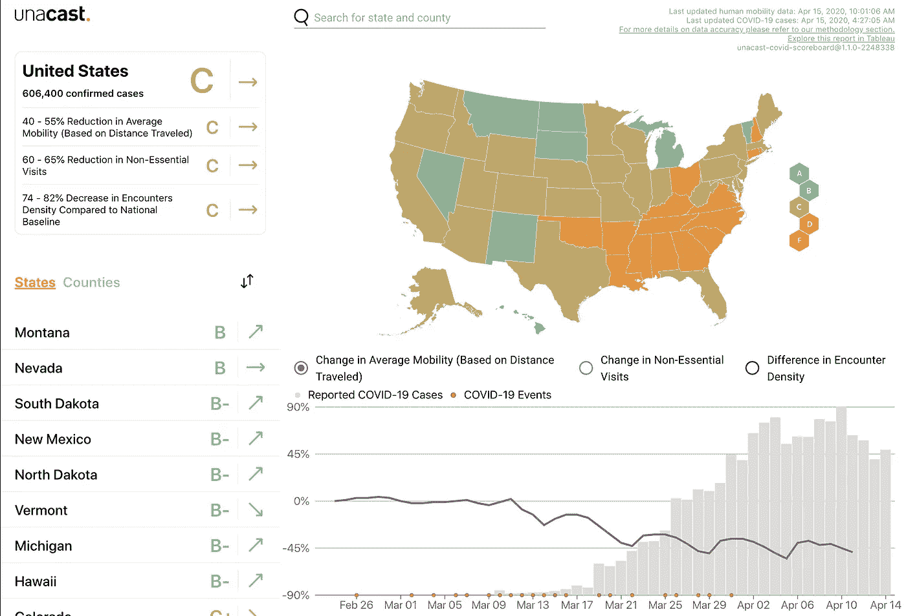

未预测的社交距离记分卡

Unacast 是一家人类移动数据和见解公司，它已经建立了一个[社会距离记分卡](https://www.unacast.com/covid19/social-distancing-scoreboard)，使用移动数据来分析移动模式的变化，直到县一级。他们的首席执行官托马斯·沃勒(Thomas Walle)在 LinkedIn 上发帖称:

> 如果您希望将位置数据用于研究和公共卫生目的，请联系我们，我们将免费向您提供我们的全球数据集。我们相信我们的数据具有强大的力量——强大的力量意味着巨大的责任。

 [## 托马斯·沃勒在 LinkedIn 上发帖

### 上周，一些研究机构、大学和健康组织联系了 Unacast

www.linkedin.com](https://www.linkedin.com/posts/thomaswalle_dataforgood-locationintelligence-geospatialdata-activity-6644427802152095744-IdHY) 

**疾病控制中心**

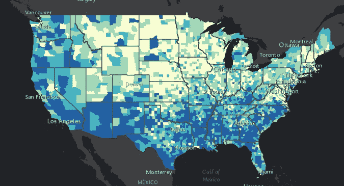

美国县级的 SVI 数据

社会脆弱性也会对个人和社区如何受到疾病的影响产生重大影响。疾病控制中心(CDC)发布了其社会脆弱性指数，定义为:

> 社会脆弱性是指社区在面临人类健康面临的外部压力，如自然或人为灾害或疾病爆发时的复原力。降低社会脆弱性可以减少人类痛苦和经济损失。疾病预防控制中心的社会脆弱性指数使用 15 个美国人口普查变量来帮助当地官员识别在预防灾害方面可能需要支持的社区；或者从灾难中恢复。

您可以在县或美国人口普查区级别下载 shapefiles 形式的数据。

 [## 社会脆弱性指数(SVI):数据和工具下载| CDC

### 完整的 SVI 文档可在每年的数据标题下下载。SVI 地理空间数据…

svi.cdc.gov](https://svi.cdc.gov/data-and-tools-download.html) 

*   [网站](https://svi.cdc.gov/)

**天气来源**

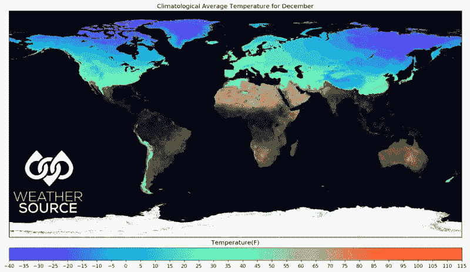

天气和气候学会对新冠肺炎的发展产生影响，但人类对社会距离命令的反应也会产生影响。WeatherSource 是一个数据提供商，拥有大量与天气相关的数据集，包括预报和气候学，并向研究新冠肺炎的人开放其 API。

 [## 天气资源-商业天气和气候技术。

### 仅在美国，天气造成的年收入损失就超过 6000 亿美元。每个人都谈论天气…

weathersource.com](https://weathersource.com/) 

*   [公告](https://ca.news.yahoo.com/weather-source-provides-powerful-data-190200970.html)

**脸书**

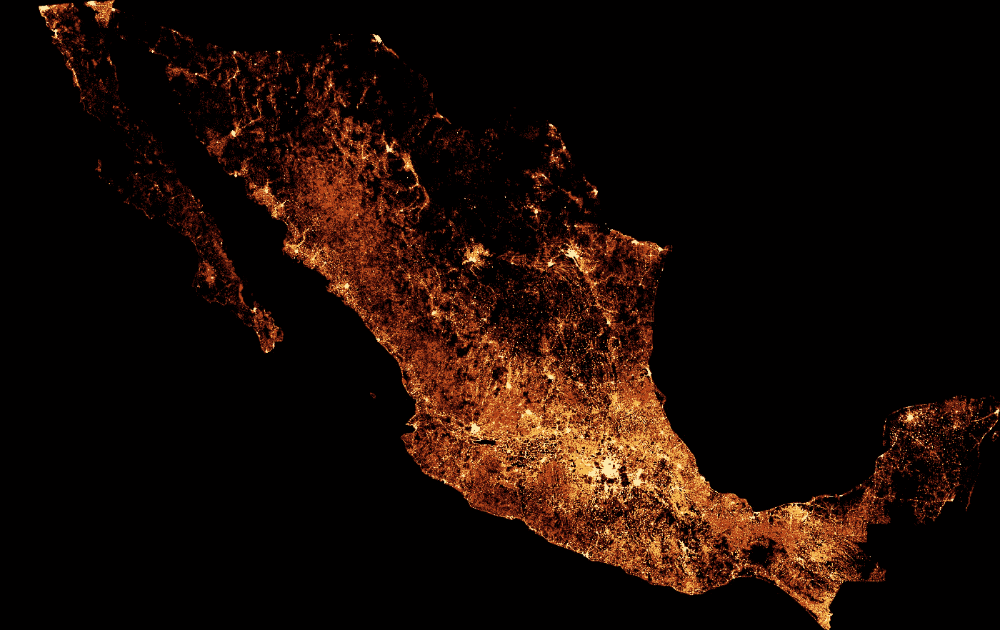

墨西哥 60 岁以上人口的分布。

通过他们的 Data for Good 计划，脸书正与不同的研究人员和网络合作，提供广泛的匿名数据，如高密度人口地图、社交连接、协同定位地图、移动数据等。一些资源是公开的，例如人口密度地图，而其他资源是为特定组织保留的。

 [## 脸书-人道主义数据交换

### 我们很想听听那些使用这些数据集来改进我们的产品并更好地了解……

data.humdata.org](https://data.humdata.org/organization/facebook) 

*   [Bloomberg.com 文章](https://www.bloomberg.com/news/articles/2020-04-06/facebook-expands-location-data-sharing-with-covid-19-researchers)
*   [脸书新闻编辑室公告](https://about.fb.com/news/2020/04/data-for-good/)
*   [脸书数据为好资源](https://dataforgood.fb.com/docs/covid19/)
*   [AWS 上的人口密度数据](https://registry.opendata.aws/dataforgood-fb-hrsl/)

**OpenStreetMap**

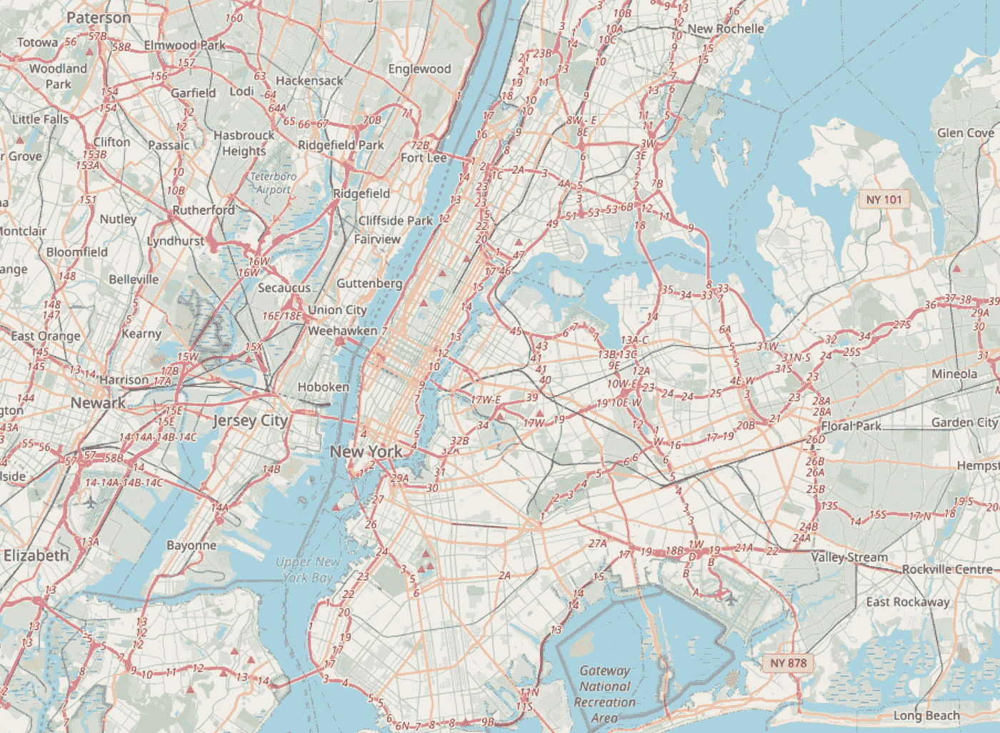

纽约市的开放街道地图

OpenStreetMap 通过一个名为 [Planet.osm](https://planet.openstreetmap.org/) 的项目，在一个可下载的文件中提供其全球数据集和不同地理上更小的摘录。这包含了你在地图上看到的所有数据:道路、建筑、交通、兴趣点、医院、土地、水等。您还可以使用用户界面[transition Turbo](https://overpass-turbo.eu/)来提取通过[transition API](https://wiki.openstreetmap.org/wiki/Overpass_API)从 OSM 查询的数据。请记住，OSM 数据是用户生成的，在某些领域可能不完整。

 [## 星球网

### 这里找到的文件是定期更新的，OpenStreetMap.org 数据库的完整副本，以及那些出版的…

planet.openstreetmap.org](https://planet.openstreetmap.org/) 

*   [立交桥涡轮](https://overpass-turbo.eu/)
*   [OSM 维基百科上的 Planet.osm 指南](https://wiki.openstreetmap.org/wiki/Planet.osm)
*   [谷歌大查询上的 OSM 数据](https://console.cloud.google.com/marketplace/details/openstreetmap/geo-openstreetmap)

纽约时报

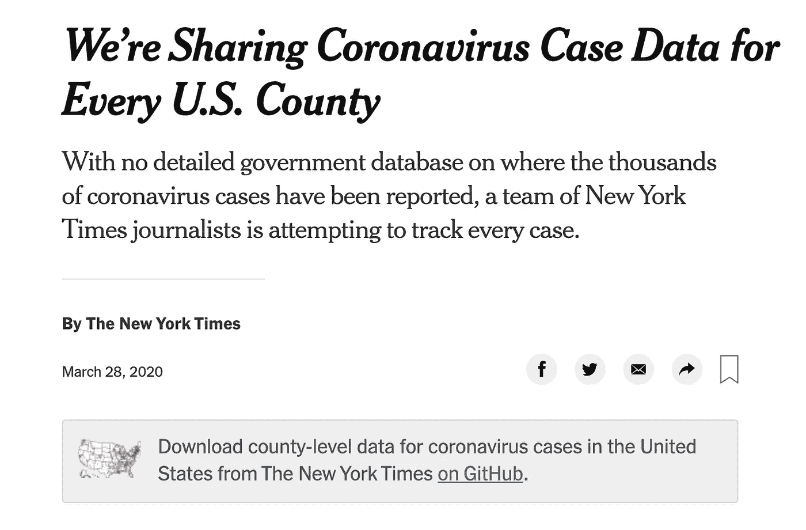

《纽约时报》正在 GitHub 上提供美国地图背后的国家、州和县级数据。

 [## 纽约时报/新冠肺炎数据

### 美国州级数据(原始 CSV) |美国县级数据(原始 CSV)】纽约时报发布了一系列数据…

github.com](https://github.com/nytimes/covid-19-data) 

*   [条](https://www.nytimes.com/article/coronavirus-county-data-us.html)

**新冠肺炎移动数据网**

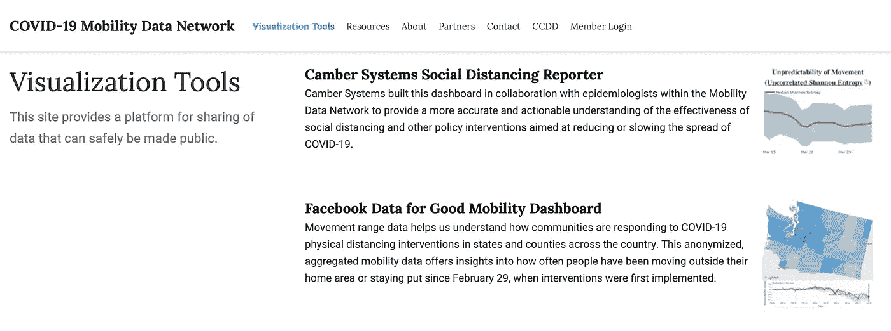

新冠肺炎移动网络被描述为:

> …一个由世界各地大学的传染病流行病学家组成的网络，与科技公司合作，使用聚合的移动数据来支持新冠肺炎应对措施。我们的目标是利用来自移动设备的匿名聚合数据集，以及对解释的分析支持，为州和地方层面的决策者提供关于社交距离干预效果的每日更新。

有一个电子邮件联系他们，但你可能需要成为一个学术机构的一部分，才能使用这些数据。

 [## 新冠肺炎移动数据网络

### COVID19 移动数据网络的参与者共同致力于隐私价值和数据保护，因为…

www.covid19mobility.org](https://www.covid19mobility.org/) 

**联合国人道主义事务协调厅(OCHA)人道主义数据交换**

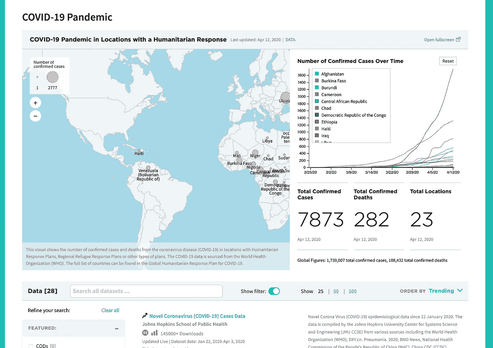

联合国 OCHA 新冠肺炎资料页

联合国 OCHA 人道主义数据交换有许多不同的数据集可用于新冠肺炎(以及其他国家),包括上述一些数据集以及意大利的移动模式数据、测试数据和其他国家的特定数据。

 [## 新冠肺炎·疫情

### 新冠肺炎旅行限制监测-使用二级数据源，如国际航空运输…

data.humdata.org](https://data.humdata.org/event/covid-19) 

*   [联合国 OCHA 人道主义数据交换网站](https://data.humdata.org/)

# 工具

**卡通**

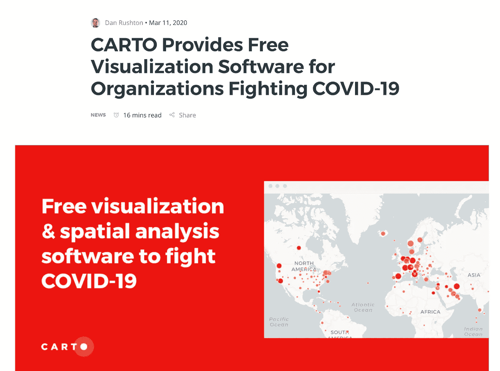

CARTO 是一个空间平台，提供了广泛的工具来存储、分析和可视化空间数据，他们正在将其平台提供给公共和私人组织:

> 出于这个原因，CARTO 将通过我们的[资助项目](https://carto.com/grants/)向抗击冠状病毒爆发的公共和私营部门组织开放其平台。无论您是为公众分享建议的媒体机构、优化资源配置的医疗保健组织还是希望评估封锁影响的政府实体，我们都希望帮助您处理您的使用案例，并确保我们在此次疫情期间共同做出数据驱动的决策。

该程序已经被许多组织使用，包括 [ForceManager](https://www.forcemanager.com/) 和 [mendesaltaren](https://mendesaltaren.com/) 之间的合作，以及来自 [Telefónica](https://www.telefonica.com/) 、 [Ferrovial](https://www.ferrovial.com/) 、 [Google](https://www.google.com/) 和 [Santander](https://www.santander.com/) 的额外支持，以开发 [AsistenciaCOVID-19](https://www.coronamadrid.com/) ，一个自我诊断和新冠肺炎信息应用程序。

 [## CARTO 为对抗新冠肺炎的组织提供免费的可视化软件

### 在抗击新冠肺炎的斗争中，地图已经成为了解疾病传播的一个有价值的工具。许多…

carto.com](https://carto.com/blog/carto-free-for-fight-against-coronavirus/) 

*   [卡通授权页面](https://carto.com/grants/)
*   AsistenciaCOVID-19 ( [岗位 1](https://carto.com/blog/carto-develops-app-against-coronavirus/) ) ( [岗位 2](https://carto.com/blog/asistencia-covid-19-available-in-new-regions/) )
*   CARTO 博客(关于新冠肺炎的资源和文章)

**ESRI**

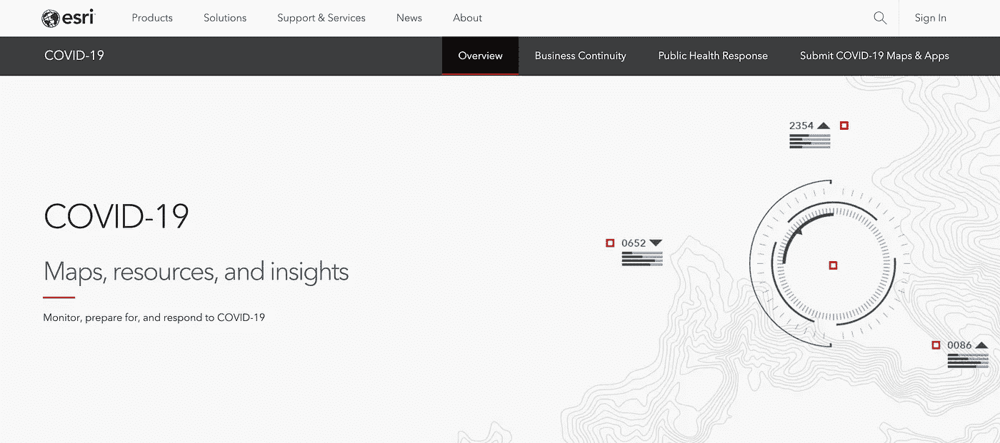

ESRI 是一家地理空间软件和平台提供商，为世界各地许多不同的私人和公共组织提供广泛的地理空间分析工具和产品。从他们的新冠肺炎资源页面:

> 随着围绕冠状病毒疾病 2019(新冠肺炎)的形势继续发展，Esri 正在为我们的用户和整个社区提供位置智能、地理信息系统(GIS)和制图软件、服务以及人们用来帮助监控、管理和交流疫情影响的材料。使用并分享这些资源来帮助你的社区或组织做出有效的反应。

在这里，您可以请求 GIS 帮助、访问 GIS 资源、查看地图和仪表盘，以及获得与新冠肺炎相关的信息。

 [## 冠状病毒疾病(新冠肺炎)地图、资源和见解

### 随着围绕冠状病毒疾病 2019(新冠肺炎)的形势继续发展，Esri 正在为我们的用户提供支持…

www.esri.com](https://www.esri.com/en-us/covid-19/overview) 

*   [ESRI 新冠肺炎地理信息系统中心](https://coronavirus-resources.esri.com/)
*   [ESRI 约翰·霍普斯金大学新冠肺炎仪表板](https://www.arcgis.com/apps/opsdashboard/index.html#/bda7594740fd40299423467b48e9ecf6)
*   [“负责任地绘制冠状病毒图谱”文章](https://www.esri.com/arcgis-blog/products/product/mapping/mapping-coronavirus-responsibly/)

**QGIS**

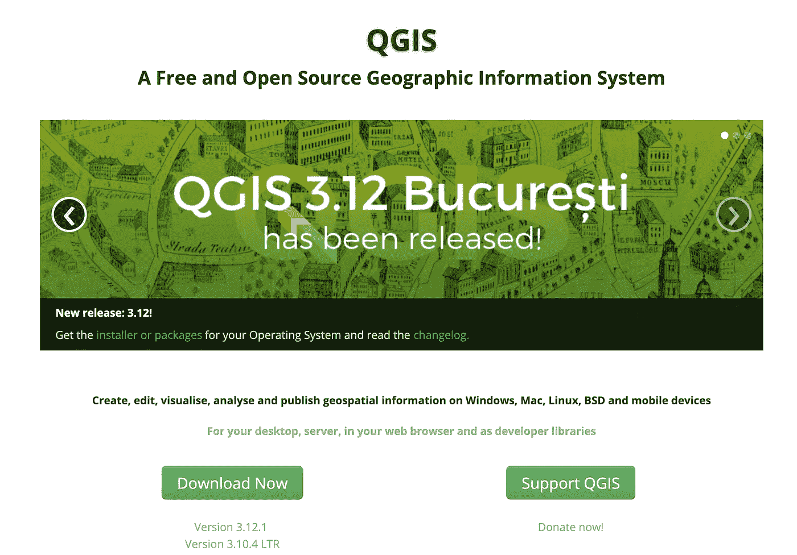

QGIS 是一个免费的开源桌面 GIS 工具，允许您使用地理空间数据、创建地图、执行地理空间操作、连接到外部工具以及与非常广泛的插件生态系统集成。

 [## QGIS

### 了解 QGIS 项目及其社区的进展情况。

www.qgis.org](https://www.qgis.org/en/site/) 

*   [QGIS 插件](https://plugins.qgis.org/)

# 仪表板

**谷歌移动报告**

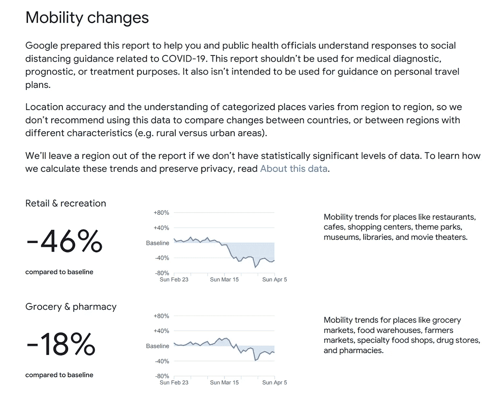

样本谷歌移动报告

谷歌正在使用其平台上收集的移动数据来创建和发布移动报告，这些报告捕捉了几个不同场所类别(如零售和娱乐、公园、杂货店和药店等)中移动模式的变化。

> 社区流动性报告旨在提供对旨在抗击新冠肺炎的政策发生了哪些变化的见解。这些报告按地理位置绘制了不同类别场所(如零售和娱乐场所、杂货店和药店、公园、中转站、工作场所和住宅)的移动趋势。

 [## 新冠肺炎社区流动性报告

### 随着全球社区对新冠肺炎做出反应，我们从公共卫生官员那里听说，同样类型的聚集…

www.google.com](https://www.google.com/covid19/mobility/) 

*   [彭博关于谷歌新冠肺炎移动报告的文章](https://www.bloomberg.com/news/articles/2020-04-03/google-shares-data-on-how-virus-has-changed-movement-in-cities)

**Domo**

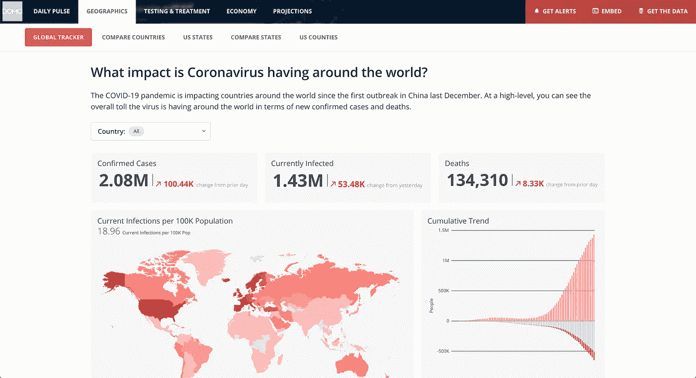

多莫新冠肺炎地理空间仪表板

BI 公司 Domo 使用约翰·霍普斯金新冠肺炎公司的数据创建了一整套地理空间和非地理空间仪表板，包括每日更新、地图、测试、经济、预测等主题。

 [## 冠状病毒(新冠肺炎)美国和全球地图| Domo

### 冠状病毒(新冠肺炎)使用 Domo 的商业云按国家、地区、州或县绘制的交互式地图。看…

www.domo.com](https://www.domo.com/covid19/geographics#global-tracker) 

**画面**

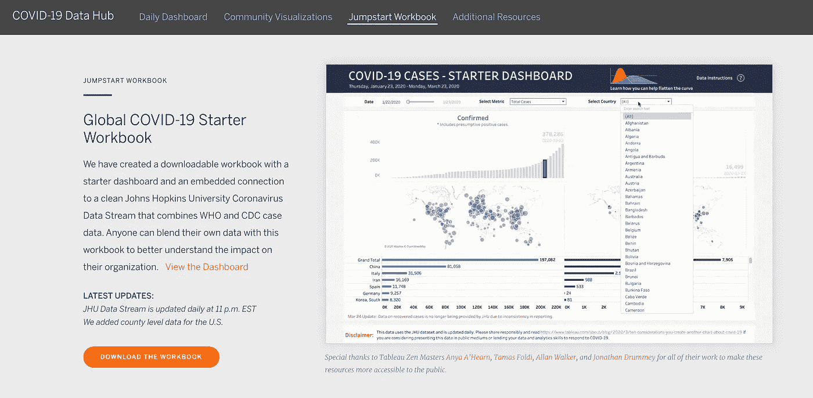

Tableau 共享了一个使用 Tableau 发布的不同仪表板的图库，以及一个使用约翰·霍普斯金新冠肺炎数据的入门工作簿。

 [## 新冠肺炎冠状病毒数据资源中心

### 太平洋标准时间每天晚上 10 点更新，这个全球指标仪表板可视化约翰霍普金斯大学数据的子集…

www.tableau.com](https://www.tableau.com/covid-19-coronavirus-data-resources) 

**Cuebiq**

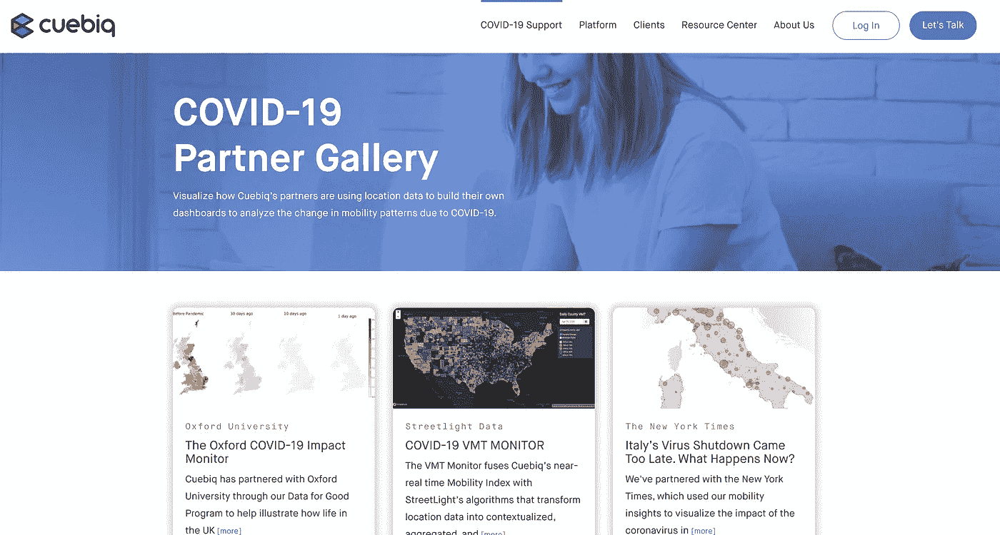

Cuebiq 是一家人类移动数据提供商，它发布了一系列交互式可视化和分析，使用的数据涉及广泛的主题，包括《纽约时报》的几篇文章，分析意大利的移动模式等。

 [## 新冠肺炎视觉画廊-奎比格

### 可视化公司如何使用 Cuebiq 的位置数据来构建自己的仪表板，以分析…

www.cuebiq.com](https://www.cuebiq.com/visitation-insights-covid19-dashboard-gallery/) 

**路灯数据**

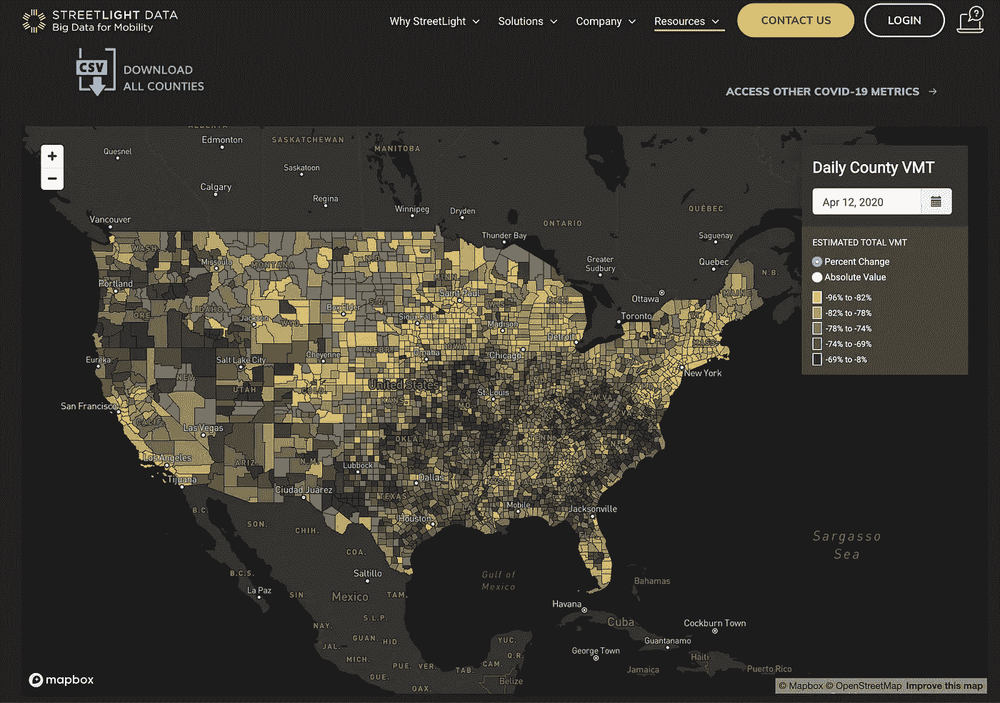

StreetLightData 使用移动数据来分析道路上的交通模式，以了解汽车流量计数、交通分析等。使用他们的数据结合 Cuebiq 数据来分析美国每天的车辆行驶里程(VMT)是如何变化的。您可以使用地图并下载数据。

 [## 3，000 多个美国县的近实时每日 VMT

### 在这个前所未有的旅游波动时期，汽车行驶里程(VMT)的下降如何影响您的…

www.streetlightdata.com](https://www.streetlightdata.com/VMT-monitor-by-county/) 

# 参与其中

**火辣的 OSM**

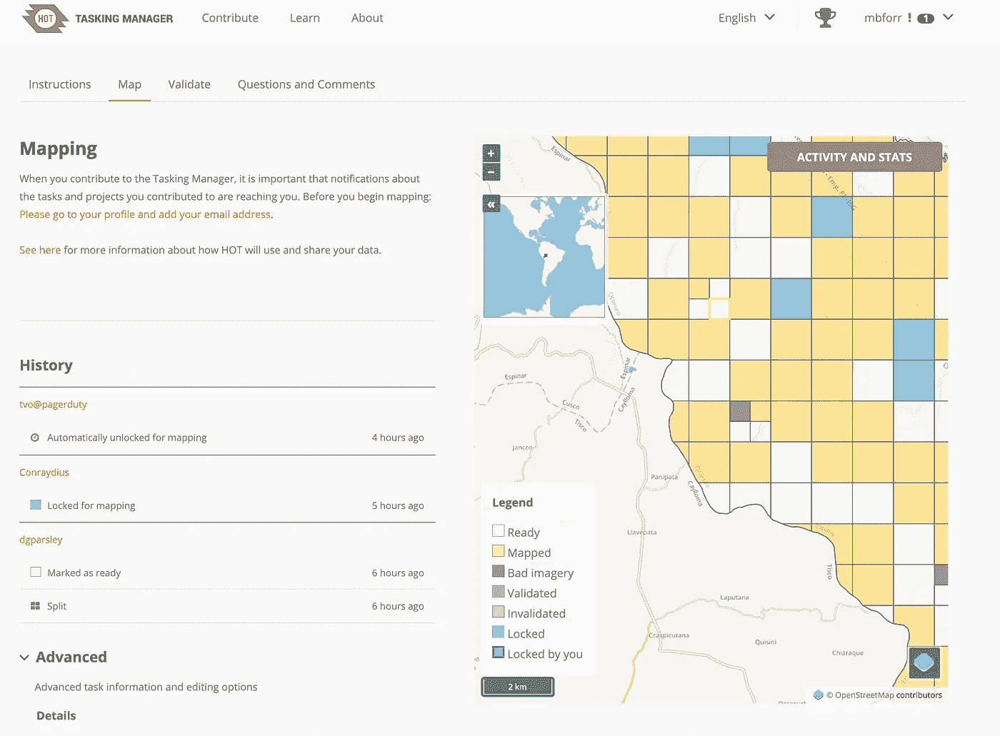

人道主义 OpenStreetMap 团队(HOT)是一个即使只有几分钟空闲时间也能参与进来的好地方。HOT OSM 是一个任务系统，不同的组织可以请求帮助收集受重大灾害影响的不同地区或社区的数据，类似于前面描述的 2010 年海地地震。

> 任务管理器是为人道主义 OpenStreetMap 团队在 OpenStreetMap 中的协作制图过程而设计和构建的制图工具。该工具的目的是将一个制图项目划分为较小的任务，这些任务可以由许多人在同一个整体区域内快速完成。它显示了哪些区域需要映射，哪些区域需要验证映射。
> 
> 这种方法允许在紧急情况或其他人道主义绘图情况下将任务分配给许多单独的绘图者。它还允许监控整个项目进度，并帮助提高映射的一致性(例如，要覆盖的元素、要使用的特定标签等)。).

在全球各地的社区中，有许多不同的与新冠肺炎相关的开放任务。你只需要在 OpenStreetMap 上创建一个账户，然后选择你想要参与的项目。从那里你将简单地跟踪一个卫星图像，找到该项目所要求的不同功能。

 [## 热门任务管理器

### 为了充分利用任务管理器中的许多功能，请使用台式机或笔记本电脑，而不是…

tasks.hotosm.org](https://tasks.hotosm.org/contribute?difficulty=ALL&text=covid) 

**其他资源**

**NAPSG 基金会**

公共安全 GIS 国家联盟(NAPSG)正在其网站上收集与新冠肺炎相关的各种资源，包括地图、仪表盘、数据、资源等。

 [## 新冠肺炎地理空间和态势感知资源

### 最后更新:上午 11:40 美国东部时间 04/13/2020 NAPSG 基金会正在编制公开可访问的新冠肺炎地理空间和…

www.napsgfoundation.org](https://www.napsgfoundation.org/resources/covid-19/) 

**OGC**

开放地理空间联盟(OGC)正在收集许多地理空间资源，包括底图、数据和数据管道、资源、仪表盘以及关于可视化数据和制图最佳实践的建议。

 [## 来自 OGC 的新冠肺炎资源

### 了解新冠肺炎疫情的范围及其与人口、基础设施和其他方面的关系

www.ogc.org](https://www.ogc.org/resources-for-COVID-19-from-ogc) 

***编者按:*** [*走向数据科学*](http://towardsdatascience.com/) *是一份以数据科学和机器学习研究为主的中型刊物。我们不是健康专家或流行病学家，本文的观点不应被解释为专业建议。想了解更多关于疫情冠状病毒的信息，可以点击* [*这里*](https://www.who.int/emergencies/diseases/novel-coronavirus-2019/situation-reports) *。***