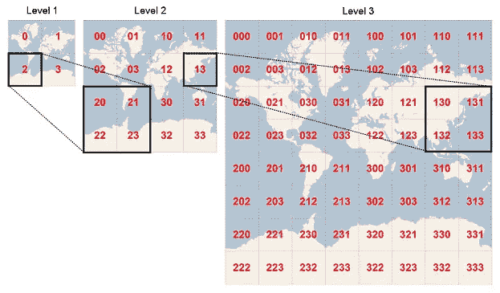
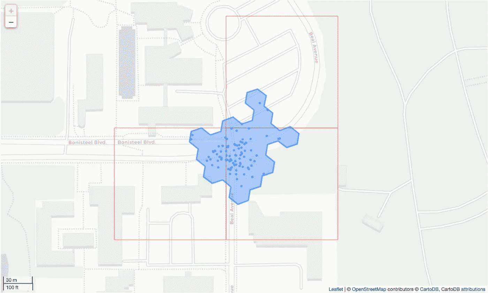

# 使用四键的地理空间索引

> 原文：<https://towardsdatascience.com/geospatial-indexing-with-quadkeys-d933dff01496?source=collection_archive---------16----------------------->

## 给地球正方


[斯蒂夫·约翰森](https://unsplash.com/@steve_j?utm_source=medium&utm_medium=referral)在 [Unsplash](https://unsplash.com?utm_source=medium&utm_medium=referral) 上拍照

当你在网上或手机上浏览交互式地图时，你看到的是一幅幅方形拼贴画的效果。每个图块包含一点地图信息，并与其周围的八个图块完美匹配。这种安排非常有效，以至于你几乎不可能察觉到你不是在浏览一个无限的位图，而是一个有限的小方块。

本文的目的不是深入研究所谓的“[滑动地图](https://wiki.openstreetmap.org/wiki/Slippy_Map)的复杂性，而是讨论一个有趣的数学副产品，它用于唯一地引用瓦片，但在地理空间索引应用程序中也非常有用。为了跟踪他们的交互式地图解决方案，微软开发了一个索引概念，这在其在线文档中有详细描述，即 [Bing 地图磁贴系统](https://docs.microsoft.com/en-us/bingmaps/articles/bing-maps-tile-system)。

这个索引系统还有其他不太明显的应用，比如地理空间区域的划分和它们在数据库中的有效索引。它的工作原理有点像优步的 H3，但是它没有使用“六边形”，而是使用了“正方形”的层次结构我在几何形状的名字周围加了引号，因为它们在球体上的投影自然会扭曲它们。

我们之前已经看到了使用 [H3 地理空间索引](/fast-geospatial-indexing-with-h3-90e862482585)系统的优势，不仅用于快速参考，还用于快速距离查询。由于它们的几何形状，正方形的工作效率不高。不过，它们也有显著的优势，不仅在为光滑地图生成定制切片时，而且在索引矩形数据时。这里我考虑的是对在线地图服务的查询。这些查询通常需要一个边界框规格，矩形(至少在投影坐标中)，而不是六边形。

# 缓存使用案例

为了激励使用 Bing 地图磁贴系统及其“四键”概念背后的数学，让我们回到我已经发布的关于探索[车辆能源数据集](https://arxiv.org/abs/1905.02081)的代码。在之前的一组[文章](/geographic-clustering-with-hdbscan-ef8cb0ed6051)中，我通过将数据转换成数据库，将出行数据聚类成其端点簇，使用 H3 计算地理围栏多边形，并最终命名它们来接近 VED。

这个命名过程包括通过他们的公共和免费的[天桥 API](http://overpass-api.de/) 从 [OpenStreetMap](https://www.openstreetmap.org/) 服务中检索数据。我还设计了一个非常简单的缓存机制，以避免在开发代码时重复调用 API。用户不应该滥用 API 并尽可能缓存检索到的数据。我缓存 API 结果的方法很幼稚，因为我使用集群标识符作为文件名的基础。这里没有地理参考，并且如果聚类算法参数化改变，这些文件名容易改变。

我在本文中探索的另一个解决方案涉及到使用以某种方式在地理上被引用并且与算法变化无关的文件名。输入四键代码。

# 四键

quadkey 这个名字是 quadtree key 的缩写。这些键中的每一个都编码了由细节级别组织的纬度和经度空间中的正方形区域。在第一层，整个可绘制的地球表面分成四个四键。可以把它想象成一个地图缩放级别，让你看到整个世界。每个四键都有一个一位数的代码，从 0 到 3。通过放大到下一个级别，四个原始四键中的每一个都分裂成四个，我们在代码中添加另一个数字。下面的图片来自微软官方文档，描述了这个过程。



上图说明了如何根据位置和细节层次导出四键代码。(图片来源:微软- [必应地图磁贴系统](https://docs.microsoft.com/en-us/bingmaps/articles/bing-maps-tile-system))

通过查看上面的图像，我们可以立即想象一个可能的“代数”来操作四键。计算特定四键的邻居、孩子或父母的操作会立即浮现在脑海中。也可以查询四键的地理属性，比如角、中心和边的长度。幸运的是，这种数学工具已经以" [pyquadkey2](https://docs.muetsch.io/pyquadkey2/) " Python 包的形式存在。

如果你用低级软件开发人员的眼光来看待四键编码，你会发现编码一个细节层次只需要两位。典型的 23 级最大值只需要 46 位来编码，这允许我们使用 64 位整数来存储这些代码。幸运的是，上面的包所遵循的[二进制四键](https://github.com/joekarl/binary-quadkey)的规范已经存在。

# 缓存示例

让我们看看如何在缓存用例中使用四键。这个想法是收集包含所有聚类点的最小四键集，然后只查询 OSM 的边界坐标。然后，代码将每个回复存储在一个相应的 JSON 编码的文本文件中，该文件根据使用的四键命名。通过这种方式，我们得到了一个仅依赖于地理位置的 OSM 数据缓存，而不是依赖于聚类方案。下图显示了编号为 52 的簇的 18 级四键。



上图显示了 52 号星团，叠加的四键用于缓存其 OSM 数据。作者创造的形象。

正如您所看到的，细节层次的选择是一个重要的决定，它允许您在四键的数量和为每个键收集的信息量之间进行权衡。[官方文档](https://docs.microsoft.com/en-us/bingmaps/articles/bing-maps-tile-system)包含一个指导您选择细节层次的表格。表格的第三列显示了在赤道以米/像素测量的地面分辨率。选择每像素米作为单位揭示了它的最终目的:使用 256 像素宽的方形图块的光滑地图。您需要将列值乘以 256，以获得赤道上四键边的米数。在第 18 层，我们得到 152.88 米。请记住，当你远离赤道，宽度缩小到零。

## 密码

要遵循代码描述，请克隆 [GitHub 库](https://github.com/joaofig/ved-explore)并运行名为:

```
07-cluster-names-quadkey.ipynb
```

这个文件是一个已有文件的修订版，具有相同的前缀号码和旧的缓存实现。请注意，在运行上面的笔记本之前，您可能必须执行以前的笔记本，以准备好要使用的数据库。

我们从管理缓存的函数开始。第一个是对 OSM API 的低级调用，在没有缓存信息时使用。

下一个函数使用四键作为输入来查询数据。它确定数据是否已经被缓存，在这种情况下，它只从相应的文件中读取数据，如果没有，则从 API 中查询数据并缓存它。

注意我们是如何查询 quadkey 在西南角和东北角的地理坐标的。现在我们有了四键数据，我们必须在查询它之前合并它。请记住，每个簇通常有多个四键。为了连接数据，我们必须首先查询它的元素类型，即“node”和“way”，为此我们使用了 next 函数。

执行实际合并的函数剥离所有元数据，只保留“元素”数组。

现在，当合并 OSM 数据包列表时，我们可以使用前面的函数作为构建块。

该代码使用下面的函数检索与单个集群相关联的四键。每个点被转换成一个四键代码，并添加到一个集合中，为了唯一性，转换回一个列表，并返回。

我们现在准备将所有代码放在一个函数中，该函数检索单个集群的合并 OSM 数据。

从这个函数开始，笔记本代码非常接近于它的原始版本。唯一有意义的增加是在地图上再现了四键“方块”,如上面星团 52 的图像所示。

# 结论

本文展示了如何使用四键数学来生成地理空间索引。这些操作非常类似于 H3，但是是正方形而不是六边形。我们已经看到六边形对于某些应用更好，例如 KNN 搜索。尽管如此，正方形对于模拟 sippy 地图瓦片和与地球的纬线和经线对齐的矩形区域是完美的。由于将四键代码打包成 64 位整数更加方便，并且支持非常高效的 Python 包，四键确实是地理空间工具包中的另一个好工具。

# 参考

[必应地图磁贴系统](https://docs.microsoft.com/en-us/bingmaps/articles/bing-maps-tile-system)

# 资源

[GitHub 资源库](https://github.com/joaofig/ved-explore)

[pyquadkey2 资源库](https://github.com/muety/pyquadkey2)

CartoDB [python-quadkey 存储库](https://github.com/CartoDB/python-quadkey)(这里使用的替代包)

YouTube: [地球平铺显示四键](https://www.youtube.com/watch?v=OXVByYRkUHs)

# 相关文章

[](/geographic-clustering-with-hdbscan-ef8cb0ed6051) [## 使用 HDBSCAN 进行地理聚类

### 如何使用 HDBSCAN、H3、图论和 OSM 探索地理数据。

towardsdatascience.com](/geographic-clustering-with-hdbscan-ef8cb0ed6051) [](/fast-geospatial-indexing-with-h3-90e862482585) [## H3 的快速地理空间索引

### H3 六角电力重装上阵！

towardsdatascience.com](/fast-geospatial-indexing-with-h3-90e862482585)