# 使用 R 的地质统计学实践

> 原文：<https://towardsdatascience.com/geostatistics-in-practice-using-r-4b7d32b7840d?source=collection_archive---------24----------------------->


照片由[捕捉人心。](https://unsplash.com/@dead____artist?utm_source=medium&utm_medium=referral) on [Unsplash](https://unsplash.com?utm_source=medium&utm_medium=referral)

## 如何使用带有 R 的地理定位数据进行估计

# 介绍

在本文中，您将了解什么是**地质统计学**，以及如何使用**克里金法**(一种插值方法)利用地理位置数据进行估算。在我们的示例中，我们将获取纽约的房地产销售价格，并创建一个模型，为我们提供城市中任何位置的价格估计。

开始之前，让我们先了解一下如何将**地统计数据**插入到**空间统计数据的字段中。**

# 空间统计

空间统计学是统计学中一个相对较新的领域，它基于数据之间的**空间相关性**的思想:两个观测值在空间上越接近，它们的相关性就越强。**时间相关性**已经研究了很长时间，但是不可能将时间序列模型直接应用于空间数据，因为时间相关性假设通常使用**序列相关性**结构，而空间相关性发生在**二维或三维**。然而，有**时空模型**同时结合了两者。

在空间统计中，有四类数据:**地统计**、**格网**、**点**和**流**。我们在这里只讨论地质统计学，但是知道其他的有助于我们理解什么是地质统计学。

在**地统计数据**中，随机变量可以在集合中的任意无限点(例如，一个城市或一个国家)进行测量，尽管实际上，它只在某些点进行测量。这就是我们将使用的例子的情况:你可以在纽约的任何一点(我们的集合)有房地产价格(我们的随机变量)，我们只在其中的一些点(销售实际发生的点)测量它。然后我们的兴趣将是为没有发生销售的点估计相同的变量。

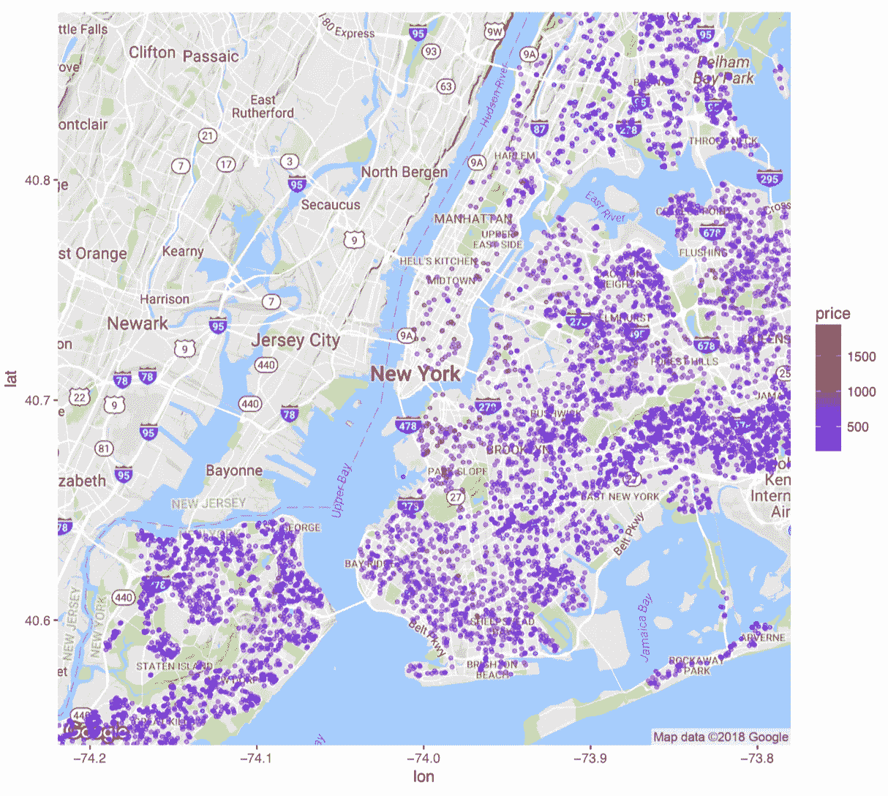

地统计数据示例-按作者分类的影像

在**点阵数据**中，一个随机变量在一个有限集中被度量，用一个矩阵表示，可以是正则的，也可以不是。一个例子是，当我们把一个国家分成几个州，然后测量每个州的平均收入。

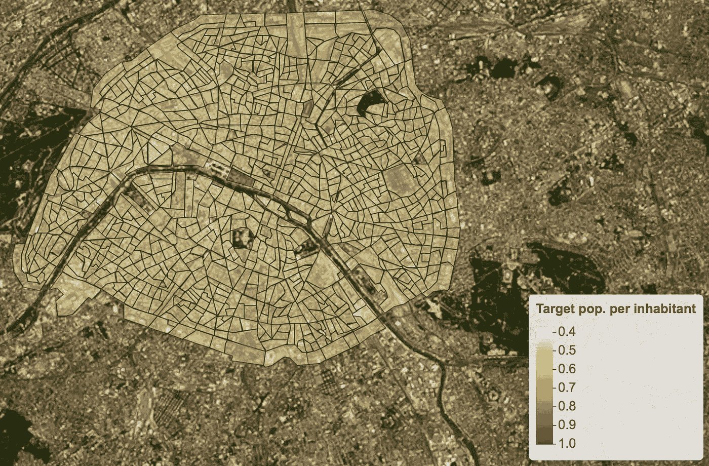

晶格数据的例子。如果你想探索这张地图，[这里是它的链接](https://arthurmello.github.io/geomarketing-tool/index.html)——作者图片

在**点数据**中，随机性不一定来自变量，而是来自它的位置。例如，如果我们想要了解或预测城市中的犯罪地点:我们会有一系列犯罪地点，并对寻找高密度的聚类(危险区域)感兴趣。

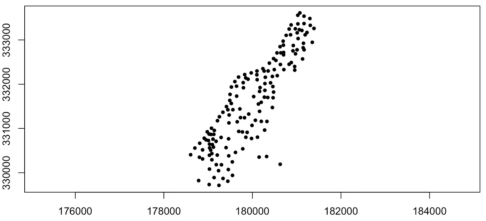

点数据示例-按作者分类的图像

在**流数据**中，我们有一个随机变量，它不仅与一个位置相关，而且与两个位置相关。迁移数据就是一个例子:对于任意两两组合的地点，我们知道从一个地点到另一个地点的人数。

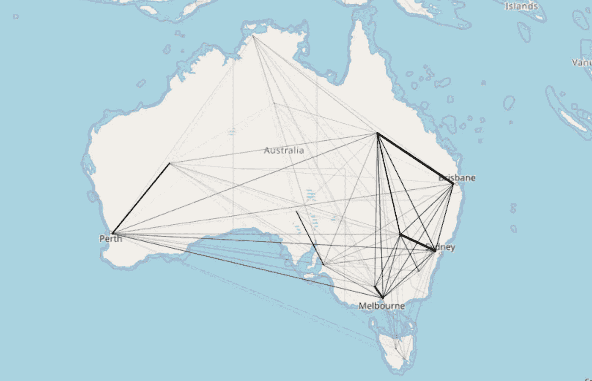

流量数据示例—按作者分类的图像

现在我们知道什么是地质统计学(什么不是)。在了解克里金法之前，我们还有最后一个话题要讲:变异函数。

## 变异函数

如果空间统计基于“两个观测值在空间上的距离越近，它们的相关性就越强”这一思想，则变异函数会根据这些观测值之间的距离显示相关性的表现。

变异函数被定义为“给定两次观测之间的距离，返回这两次观测之间差异的方差的函数”。

以下是纽约房地产价格的经验变异函数示例。

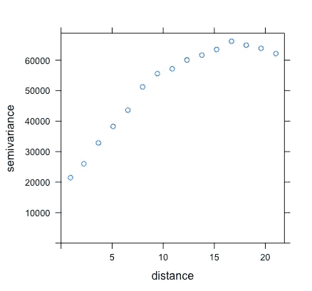

作者图片

正如我们所见，两栋建筑离得越远，它们的价格差异就越大，相关性就越低。

基于这些点，我们可以估计一个非常适合它们的函数，然后将它用于克里金法。

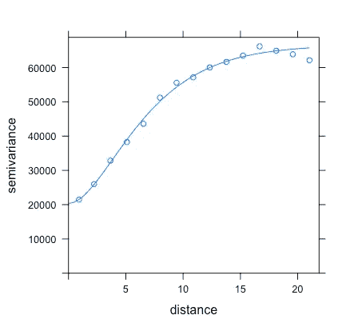

作者图片

# 克里金法

克里金法是一种插值方法:给定一些数据点，它试图找到一个穿过这些点的函数，这样就可以对中间值进行估计。

虽然[线性回归](/linear-regression-the-basics-4daad1aeb845)和反距离加权插值法基于假设的预定义模型，但克里金法基本上是根据经验构建的。它的优势之一是它不是一个确定性的模型，而是一个概率性的模型，这意味着它不仅给你一个估计，它还告诉你你对这些估计有多确定。

进行这些估计的公式如下:

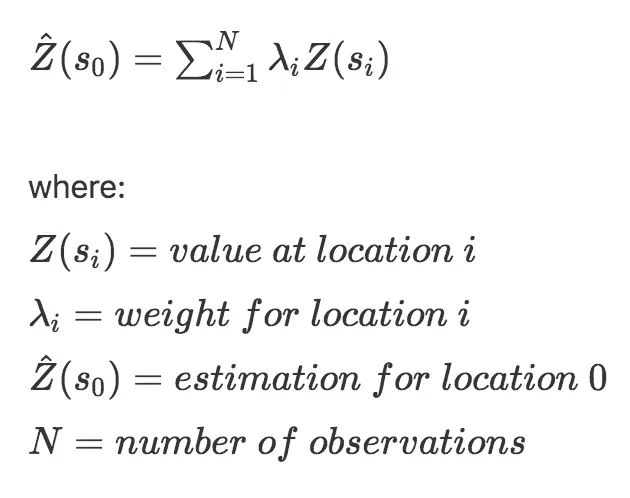

权重是根据变异函数估算的，并且完全取决于观测值之间的距离。

# 用 R 怎么做

## 数据

我们将使用在 [Kaggle](https://www.kaggle.com/new-york-city/nyc-property-sales) 上提供的数据集，其中包含 2016 年纽约市的房产销售数据:位置、价格、面积、税收等级等。鉴于我们在这里的目标，我们将忽略除了它的位置，价格和面积的财产的所有信息。我们使用面积的原因是我们想计算每平方英尺的价格，而不仅仅是销售价格。从现在起，我们将只谈每平方英尺的价格，并把它称为“价格”。

## 代码

完整的代码可以在[这里](https://github.com/arthurmello/kriging)找到。在本文中，我们将只浏览它的主要部分。

在进行了一些数据清理之后，我们首先来看看价格在地图上的表现:

```
**IN:**
# Plotting prices
mapnyc <- data.frame(latitude = db$lat,
                     longitude = db$lon,
                     price = db$PRICE.SQUARE.FEET)Token_map_box = #<mapbox API token>palette_rev <- rev(brewer.pal(10, "RdYlBu"))pal <- colorNumeric(palette = palette_rev, domain = c(max(mapnyc$price):min(mapnyc$price)))
leaflet() %>%  addTiles(urlTemplate = Token_map_box) %>%
  addCircleMarkers(data = mapnyc, color = ~pal(price), radius = 2)
```


是的，这和我们在开头看到的情节是一样的——作者的图片

正如我们所看到的，曼哈顿的销售少了很多，尤其是在较低的部分。此外，那里的价格似乎比皇后区(东部)要高很多。此外，我们可以看到，紧挨着水的房产也更贵，这是有道理的，因为他们可能有很好的风景。

现在，让我们看看价格是否遵循正态分布:

```
**IN:**
hist(db$PRICE.SQUARE.FEET)**OUT:**
```

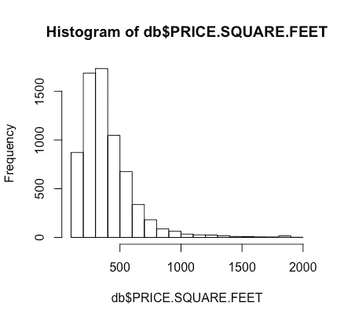

作者图片

正如我们所看到的，我们的数据不是正态分布的，所以让我们使用它的日志来代替。请注意，这一步并非绝对必要:遵循正态分布的数据不是克里金法的假设之一。然而，在这种情况下，预测能力有所提高。

```
**IN:**
db$PRICE.SQUARE.FEET.log = log(db$PRICE.SQUARE.FEET)
hist(db$PRICE.SQUARE.FEET.log)**OUT:**
```

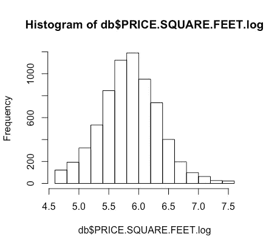

作者图片

目前，我们所做的只是使用一个常规的数据帧。然而，空间数据在 r 中的行为方式完全不同。我们可以将我们的数据框架转换为 SpatialPointsDataFrame，它将点数据存储为位置，以及关于它们的附加信息(如价格)。在此之前，我们还将把数据帧分成训练集和测试集，以便在最后计算一些误差指标。

```
**IN:**
# Train/test split
smp_size <- floor(0.75 * nrow(db))set.seed(123)
train_ind <- sample(seq_len(nrow(db)), size = smp_size)train <- db[train_ind, ]
test <- db[-train_ind, ]# Converting to spatialpointsdataframe
projection = "+proj=longlat +ellps=WGS84 +no_defs"train_spdf = SpatialPointsDataFrame(train[28:29], train[-c(28,29)], proj4string = CRS(projection))
test_spdf = SpatialPointsDataFrame(test[28:29], test[-c(28,29)], proj4string = CRS(projection))
db_spdf = SpatialPointsDataFrame(db[28:29], db[-c(28,29)], proj4string = CRS(projection))
```

请注意“sp”包中的函数 SpatialPointsDataFrame。它将位置列作为第一个参数，其余数据作为第二个参数，投影作为第三个参数。**投影**是将球面坐标转换成平面坐标的函数。有许多不同的方法可以做到这一点，我们使用了 **WGS84** 系统。

然后我们移除所有重复的位置，因为克里金法在每个位置只取一个值(价格)。

```
**IN:**
# Removing duplicate locations
train_spdf = train_spdf[-zerodist(train_spdf)[,1],]
test_spdf = test_spdf[-zerodist(test_spdf)[,1],]
db_spdf = db_spdf[-zerodist(db_spdf)[,1],]
```

现在，让我们通过查看一般经验变异函数来看看是否存在任何**空间相关性**。同时，我们还可以找到变差函数的最佳拟合，并将两者一起绘制。

```
**IN:**
# Choosing the best variogram
vario.fit = autofitVariogram(PRICE.SQUARE.FEET.log~1,
                             train_spdf,
                             model = c("Exp", "Sph"),
                             kappa = c(0, 0.01, 0.05, seq(0.2, 2, 0.1), 5, 10),
                             fix.values = c(NA),
                             start_vals = c(NA),
                             verbose = T)fit.v = vario.fit$var_modellzn.vgm <- variogram(PRICE.SQUARE.FEET.log~1, train_spdf) # calculates sample variogram values 
lzn.fit <- fit.variogram(lzn.vgm, model=fit.v, fit.kappa = TRUE) # fit modelplot(lzn.vgm, lzn.fit) # plot the sample values, along with the fit model**OUT:**
```

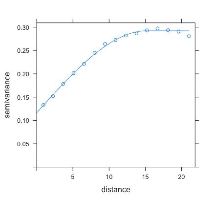

作者图片

这里的**经验变异函数**用圆圈表示，而我们的**拟合**用直线表示。“automap”软件包有一个名为“autofitVariogram”的功能，它从用户给定的参数组合(如函数的形状)中找出经验变异函数的最佳拟合。空间相关性似乎很明显，我们的线与数据相当吻合，所以我们继续。

现在我们已经从可用数据中获得了变差函数，我们希望绘制新数据的估计值，以便创建纽约的价格热图。要做到这一点，我们需要一个 NY 网格，它实际上是城市边界内的一组小方块。这也许是讨论 r 中不同类型的空间数据的好时机。空间坐标可以给你**点**、**线**或**多边形**。我们的价格数据是以点数给出的，纽约市的边界是以多边形给出的，可以在这里[下载](https://data.cityofnewyork.us/City-Government/Borough-Boundaries/tqmj-j8zm)作为 shapefile(。shp)。

```
**IN:**
# Getting NY polygon
ny_polygon = st_read('data/borough_boundaries/geo_export_a88ff5b0-7fb1-479d-a22b-224328f6d976.shp')
ny_polygon = st_transform(ny_polygon, projection)spd <- sf::as_Spatial(st_geometry(ny_polygon), IDs = as.character(1:nrow(ny_polygon)))
spd_data = ny_polygon
spd_data$geometry = NULL
spd_data <- as.data.frame(spd_data)
spd <- sp::SpatialPolygonsDataFrame(spd, data = spd_data)grid <- makegrid(spd, cellsize = 0.001)
grid <- SpatialPoints(grid, proj4string = CRS(projection))
grid <- grid[spd, ]
```

我们在这里做的是使用与原始数据相同的投影获得 NY 多边形，将其转换为 SpatialPolygonsDataFrame，然后使用它来制作网格，其中每个单元格的大小等于变量“cellsize”。该数值越小，地图就越详细(或像素化程度越低)，但构建地图的时间就越长。

然后，我们转到克里金法部分本身，将它应用到网格中:

```
**IN:**
# Kriging
heat = krige(PRICE.SQUARE.FEET.log ~ 1, locations = train_spdf, newdata = grid, model = fit.v)heat %>% as.data.frame %>%
  ggplot(aes(x=x1, y=x2)) + geom_tile(aes(fill=var1.pred)) + coord_equal() +
  scale_fill_gradient(low = "yellow", high="red") +
  scale_x_continuous(labels=comma) + scale_y_continuous(labels=comma) +
  theme_bw()**OUT:**
```

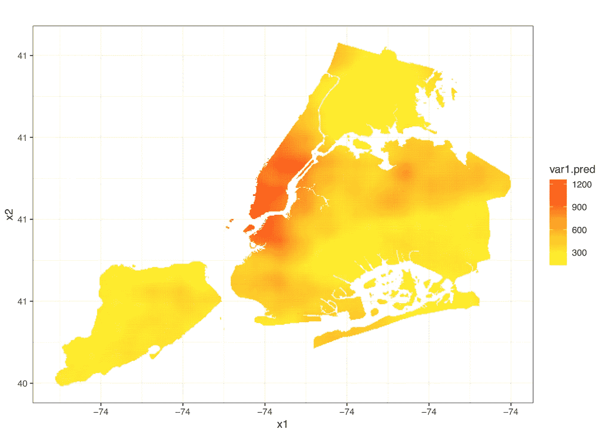

作者图片

这里，我们使用函数“克里格”，告诉它使用什么模型(“fit.v”是我们拟合变差函数的地方)，“newdata”是我们的网格。然后我们将其绘制成热图，我们可以清楚地看到曼哈顿下城周围的高价格区域为红色区域，尽管我们在那里没有太多的数据。

然后，让我们评估我们的模型在测试数据中的性能，将其与另一个更简单的方法进行比较:**K-最近邻** (KNN)。简而言之，KNN 要做的是，对于测试集上的每一栋建筑，取最近的 K 栋建筑的价格(在我们的例子中，K 的最佳值是 14)，并用它们的平均值来估算价格。我不会在这里讨论我们的 KNN 模型的细节，因为这不是本文的范围，但是您可以在 GitHub 上的[完整代码中找到它。](https://github.com/arthurmello/kriging)

```
**IN:**
kriging_error = rmse(test_spdf$PRICE.SQUARE.FEET, exp(kriging_test_prediction$var1.pred))knn_error = rmse(test$PRICE.SQUARE.FEET, exp(knn_model$pred))# final results
cat(paste('Kriging error:', kriging_error, '\nKNN error:', knn_error))**OUT:**
Kriging error: 159.360604969667 
KNN error: 162.557634288862
```

这里，我们使用了**均方根误差** (RMSE)来比较这两个模型，它取预测值和实际值之间的平均平方差的平方根。正如我们所见，克里金法误差略小，但幅度非常小。根据应用的不同，选择 KNN 可能会更好，因为它计算起来更快更容易。然而，这里的目标是展示克里金法的工作原理以及如何使用 r。

# 更进一步

如果您想使用这些数据尝试更高级的方法，那么查看**克里金回归**可能会很有意思，它使用其他解释变量(例如建筑物的建造年份)将克里金与回归结合起来。

此外，如果您喜欢这篇文章，您可能也会对另外两篇文章感兴趣:

[](/sampling-methods-for-data-science-ddfeb5b3c8ed) [## 数据科学的抽样方法

### 从人群中获取样本的最好方法是什么？

towardsdatascience.com](/sampling-methods-for-data-science-ddfeb5b3c8ed) [](/how-can-you-improve-your-machine-learning-model-quality-b22737d4fe5f) [## 如何提高你的机器学习模型质量？

### 数据科学家减少分类 ML 模型错误的逐步方法

towardsdatascience.com](/how-can-you-improve-your-machine-learning-model-quality-b22737d4fe5f) 

> 如果你想进一步讨论，请随时通过 [LinkedIn](https://www.linkedin.com/in/melloarthur/) 联系我，这将是我的荣幸(老实说)。