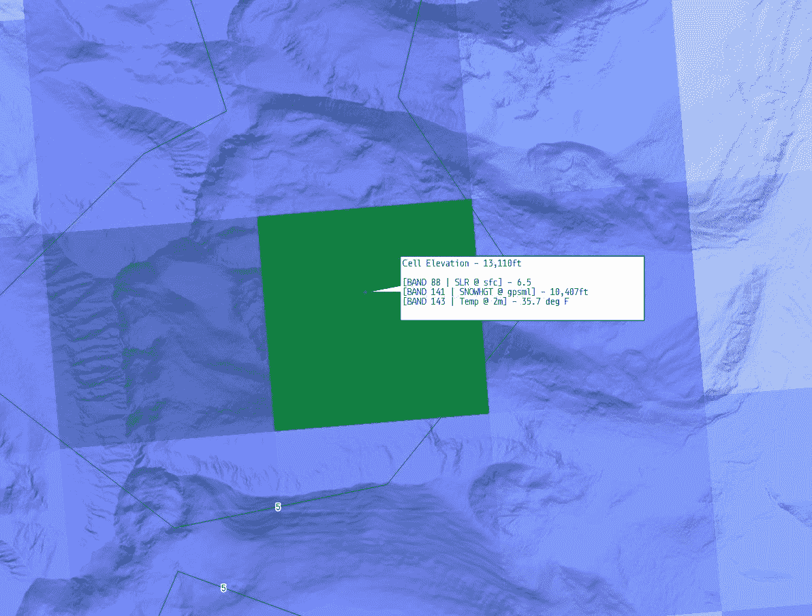
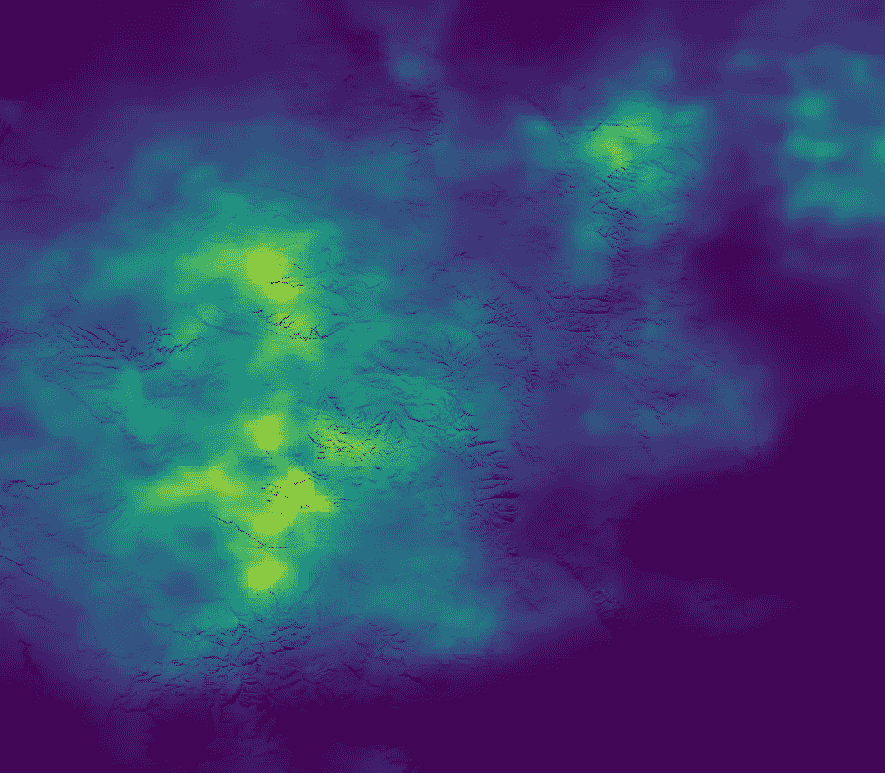

# 用 JavaScript 实现 GeoTIFF 坐标查询

> 原文：<https://towardsdatascience.com/geotiff-coordinate-querying-with-javascript-5e6caaaf88cf?source=collection_archive---------28----------------------->

## 如何在没有外部库的情况下从地理空间栅格像元中检索数据

如果您在 Node.js 或客户端 JavaScript 中构建地理空间应用程序，您最终可能需要从特定坐标的栅格中提取数据，或者提取大量数据。从历史上看，这在 JavaScript 中并不简单，因为地理空间栅格最常见的格式是 GeoTIFF 文件类型，不容易解析。



作者图片

有一些可用的解决方案，随着 JavaScript 语言和节点生态系统的最新进展，这不再是过去的技术障碍。

# GDAL？

在 JavaScript 真正有能力解析 GeoTIFF 文件之前——除非你用自己的包装器包装底层编程语言——最好的办法是通过`exec()`调用另一个应用程序，比如 python 脚本或命令行实用程序。第一个想到的是`gdallocationinfo`，它是 GDAL 套件的一部分，可用于使用纬度和经度查询栅格，如下所示:

```
gdallocationinfo -valonly -wgs84 <geotiff filename> <longitude> <latitude>
```

如果您只是查询栅格中的一个点，这种方法就足够了。然而，有一些问题:

*   如果在客户端这样做，用户必须安装 GDAL。
*   除了每次解析文件之外，通过`exec()`调用它还有一个开销。

作为一个现实世界的例子，使用这种方法查询 60 个 GeoTIFF 文件中的一个点，每个文件有数百个波段，在速度相当快的计算机上需要大约 10 秒钟的处理时间。多个点会很快累积成不合理的时间量。

如果调用 shell 脚本和加载文件是大部分开销，那么为什么不使用为库提供绑定的`gdal` npm 包呢？截至 2020 年 9 月，这也不是一个很好的选择，主要是因为它需要 GDAL 版本 2(当前版本是 3.1)，所以如果你在你的机器或服务器上安装了 GDAL，你将不得不做一些困难的版本杂耍来使它工作，如果你甚至可以让它从源代码开始构建。它也不提供异步绑定，这意味着如果您不希望您的线程被阻塞，您必须设置 web workers(如果运行 Node.js 服务器，这是有问题的，取决于您打算做多少处理)。



作者图片

# GeoTIFF.js

这个库已经存在了 4-5 年，几个月前才发布了 1.0.0 版本。GeoTIFF.js 不仅为同名文件类型提供了读写功能，还提供了内置的异步功能，甚至还有一个 web worker 池来处理更重要的任务。

该库本身没有提供一种简单的方法来查询栅格中的地理坐标，因此您需要自己编写该功能。然而，一旦您从 GeoTIFF 中提取地理元数据，这就非常容易了。

首先，加载 GeoTIFF 及其相关图像。为了获得最佳效果，请确保首先将其投影到 WGS84。如果您将文件保存在内存中，您将不会处理从磁盘中重复读取它的开销，尽管它可能很小:

```
const file = await geoTIFF.fromFile(<geotiff filename>);
const image = await file.getImage();
```

现在，获取地理信息并计算一些数字，您将使用这些数字来计算哪个像素对应于给定的纬度和经度:

```
const bbox = image.getBoundingBox();
const pixelWidth = image.getWidth();
const pixelHeight = image.getHeight();
const bboxWidth = bbox[ 2 ] - bbox[ 0 ];
const bboxHeight = bbox[ 3 ] - bbox[ 1 ];
```

边界框数据存储为`[xMin, yMin, xMax, yMax]`。我们现在可以获得坐标，并计算出它对应于哪个像素:

```
const widthPct = ( <longitude> - bbox[ 0 ] ) / bboxWidth;
const heightPct = ( <latitude> - bbox[ 1 ] ) / bboxHeight;
const xPx = *Math*.floor( pixelWidth * widthPct );
const yPx = *Math*.floor( pixelHeight * ( 1 - heightPct ) );
```

*注意，* `*heightPct*` *已经被倒置，因为这个天气模型的原点在左下角。一些天气模型在右上角有它。你可能需要写一些代码来决定是否基于这个事实反转* `*heightPct*` *。*

现在怎么办？当然，您可以从`image`中提取整个光栅。对于较小的图像，这很好，您可以将整个数据数组保存在内存中，这样查询起来非常便宜和快速。但是，如果您正在处理大型栅格和/或大量波段，这将需要很长时间和相当多的内存。

幸运的是，GeoTIFF.js 提供了一种使用边界框提取栅格的方法，因此我们将只使用一个逐个像素的边界框。事实证明，这非常快速，即使是在具有大量波段的非常大的栅格上也是如此(此外，GeoTIFF.js 支持切片栅格-切片大栅格应该可以进一步提高性能，但我尚未对其进行测试。):

```
const window = [ xPx, yPx, xPx + 1, yPx + 1 ];
const data = await image.readRasters( {window} );
```

现在你有了这个特定点上所有波段的数组。

```
[
  Float32Array [ 0.07990912348031998 ],
  Float32Array [ 0.16144123673439026 ],
  Float32Array [ 0.1751343011856079 ],
  Float32Array [ 0.2101452350616455 ],
  Float32Array [ 0.2505287826061249 ],
  Float32Array [ 0.3461601734161377 ]
  ...
]
```

请注意，您可以让`readRasters`使用一个 web worker 池，这增加了多线程的潜力，但是使用这样小的边界框，启动一个新的 web worker 的开销会大大降低性能，所以不建议使用这种方法。


作者图片

# 性能比较

GeoTIFF.js 查询逻辑如何应对对`gdallocationinfo`的调用？这可能取决于你打开了多少个文件(尤其是重复打开)，但是我的实验和实践结果是决定性的。在一个固态硬盘上，我使用相同的纬度和经度查询了相同的栅格(大约 500px 乘 200px，有 250 个波段),并记录了经过的毫秒数。

**exec(gdallocationinfo…)**

```
Run 1: 62ms
Run 2: 163ms
Run 3: 64ms
Run 4: 68ms
Run 5: 176ms
----
Average: 106.6ms
```

这种方法似乎每运行几次就会经历随机的停顿，这对它的总处理时间是有害的。除了我的服务器之外，我的开发计算机也注意到了这一点。

**GeoTIFF.js**

```
Run 1: 58ms
Run 2: 60ms
Run 3: 60ms
Run 4: 54ms
Run 5: 57ms
----
Average: 57.8ms
```

这个库不仅比调用`gdallocationinfo`稍快，而且性能非常稳定，几乎将平均处理时间减半。

使用这种技术，我能够将 JavaScript 天气预报算法的性能提高近三倍，因为它可以读取大约 60 个地理位置和数千个波段。使用`gdallocationinfo`，这通常需要大约十秒钟。在使用 GeoTIFF.js 切换到上述技术后，该算法运行时间不到三秒。如今，通过一些额外的缓存技术，我的生产服务器可以在不到一秒钟的时间内检索到从几千个栅格波段生成的预测-只有迁移到完整的二进制或其他一些更具编译性的解决方案，性能才有可能得到显著提高。

当然，还有其他读取 GeoTIFF 数据的外部库，但是用`exec()`调用它们似乎不太可能比 GeoTIFF.js 提供更多的优势，特别是因为您无法将 GeoTIFF 图像或数据本身(作为原始数值数组)缓存在您的 JavaScript 应用程序中。

是的，你总是可以用一种实际上适合处理这些数据的语言或框架来阅读 GeoTIFFs，但是这种范式正在开始改变。JavaScript 继续发展和成熟，Node.js 中构建的服务器变得越来越常见，实现类似基于浏览器的天气模型分析应用程序不再是白日梦。您可能需要使用这种技术。也许你会想出更快的东西，如果是这样，我很想听听！